

**Universidad Peruana de Ciencias Aplicadas**

**Facultad:** Ingeniería

**Carrera:** Ingeniería de software

**Periodo:** 202601

**CURSO:** Arquitecturas de Software Emergentes

**Código del Curso**: 1ASI0728

**NRC**: 11770

**Profesor:** Christian Luis De Los Rios Fernandez

**Informe del Trabajo Final**

**Nombre del startup:** Nodrify

**Nombre del producto:** Octane

**Integrantes**

| **Nombre**                                | **Código** |
|-------------------------------------------|------------|
| **Real Calderon Sebatian Omar**           | U20221D964 |
| **Alejo Cardenas Jose Antonio**           | U202122484 |
| **Pacheco Astiguetta Sebastian**          | U202110291 |
| **Russell Stephen Romero Qwistgaard**     | U202211043 |

**Mayo 2026**

**Registro de Versiones del Informe**

| Versión | Fecha      | Autor                         | Descripción de modificación             |
|---------|------------|-------------------------------|-----------------------------------------|
| 1.0     | 04/26/2026 | Real Calderón, Sebastián Omar | Primera Versión del Informe             |
| 2.0     | 05/14/2026 | Real Calderón, Sebastián Omar | Versión del informe para entrega del TP |

**Project Report Collaboration Insights**

URL del Repositorio de Github del Informe: https://github.com/Nodrify-Emergentes/Octane-Report

**TB1:**

Para la elaboración del informe del proyecto, el equipo adoptó un enfoque colaborativo utilizando un repositorio compartido en GitHub dentro de la organización del equipo. Durante esta primera entrega (TB1), se definió una estructura inicial del repositorio alineada con los capítulos del informe, permitiendo organizar el contenido de manera clara, modular y escalable.

Las actividades de desarrollo del informe se organizaron mediante la asignación de responsabilidades específicas a cada integrante, en función de sus áreas de trabajo dentro del proyecto. Esta distribución permitió asegurar una cobertura completa de los distintos aspectos del análisis, diseño y definición del sistema. Las responsabilidades fueron las siguientes:

- Sebastián Omar Real Calderón: encargado del desarrollo de las secciones relacionadas con el análisis del problema y los drivers arquitectónicos, incluyendo antecedentes y problemática, User Personas, User Task Matrix, Empathy Mapping, escenarios As-Is y To-Be, Design Purpose, Primary Functionality, Quality Attribute Scenarios, Constraints, Architectural Drivers Backlog, Architectural Design Decisions y Quality Attribute Scenario Refinements.

- José Antonio Alejo Cárdenas: responsable de la definición del producto y la arquitectura de software, desarrollando la descripción de la Startup, User Stories, Product Backlog y los distintos diagramas arquitectónicos, incluyendo System Landscape, Context Level, Container Level y Deployment Diagrams.

- Sebastián Pacheco Astiguetta: encargado del análisis de negocio y modelado de dominio, desarrollando los segmentos objetivo, análisis competitivo, estrategias frente a competidores, así como el Ubiquitous Language, Event Storming, Candidate Context Discovery y Domain Message Flows Modeling.

- Russell Stephen Romero Qwistgaard: responsable del enfoque Lean UX y la definición estratégica del producto, desarrollando los Lean UX Problem Statements, Assumptions, Hypothesis Statements, Lean UX Canvas, Impact Mapping, así como los modelos de dominio como Bounded Context Canvases y Context Mapping.

Para la gestión del trabajo colaborativo, se estableció el uso de ramas por cada sección o capítulo del informe, permitiendo que cada integrante trabajara de manera independiente sobre su contenido asignado. Posteriormente, los avances fueron integrados a la rama principal mediante pull requests, los cuales fueron revisados para garantizar la calidad, coherencia y consistencia del informe.

Este flujo de trabajo permitió mantener un historial detallado de cambios a través de commits, evidenciando la participación activa de todos los integrantes del equipo. Asimismo, promovió la colaboración continua, el intercambio de ideas y la validación conjunta del contenido desarrollado.

Como evidencia del proceso, se incluirán capturas de los analíticos de colaboración del repositorio, donde se visualiza la cantidad de commits realizados por cada miembro, así como el historial de pull requests gestionados durante esta entrega. Estas evidencias son coherentes con el Registro de Versiones del Informe, en el cual se documentan los avances y actualizaciones realizadas en cada sección.

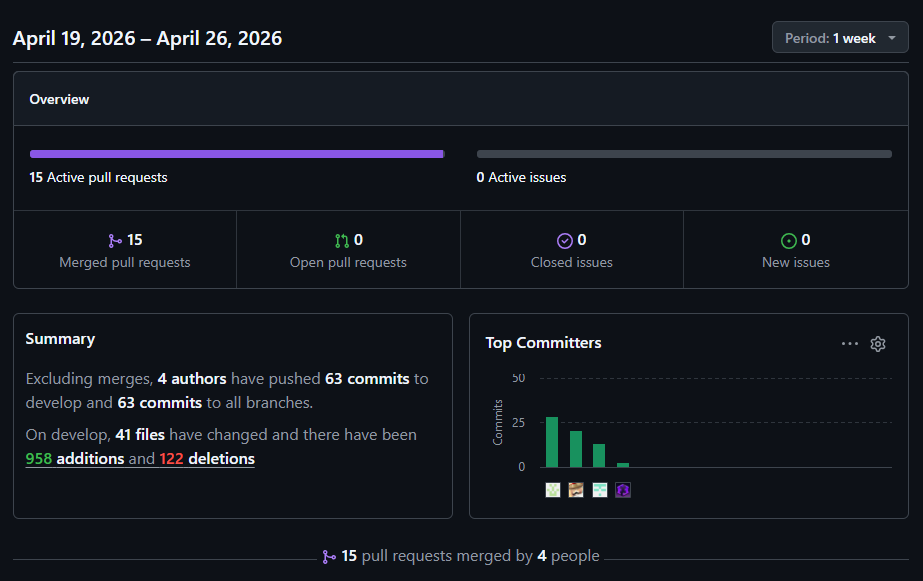

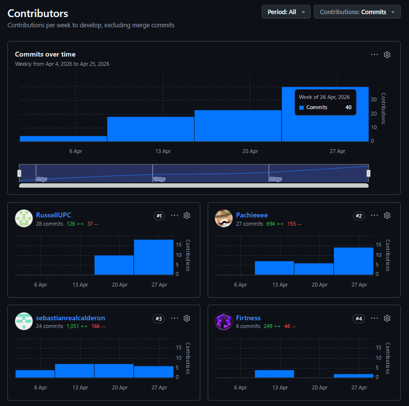

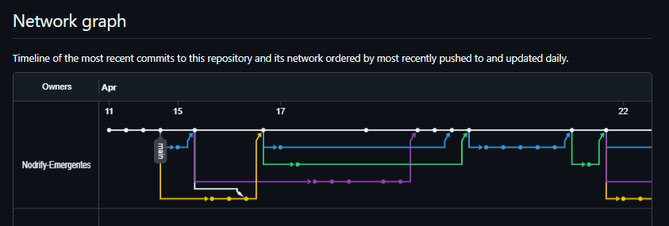

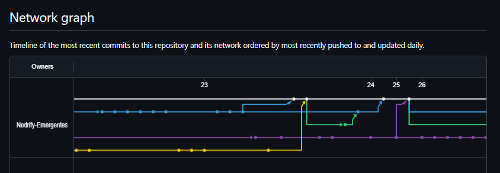

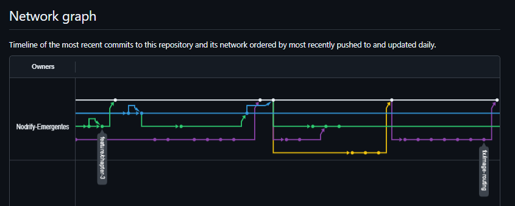

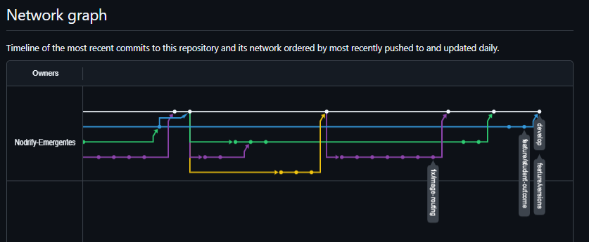

Distribución de Commits por Integrante:

| Integrante                        | Cantidad de Commits |
|-----------------------------------|---------------------|
| Sebastián Omar Real Calderón      | 24                  |
| José Antonio Alejo Cárdenas       | 6                   |
| Sebastián Pacheco Astiguetta      | 27                  |
| Russell Stephen Romero Qwistgaard | 28                  |

**TP:**

Para la elaboración de la entrega parcial del proyecto, el equipo continuó utilizando el repositorio compartido en GitHub como principal herramienta de colaboración y control de versiones. Durante esta etapa, se consolidó la estructura del informe y se añadieron nuevas secciones relacionadas con el diseño táctico de la solución, la definición de Bounded Contexts, la arquitectura de información y el diseño visual de las interfaces.

Las actividades del TP fueron distribuidas entre los integrantes del equipo de acuerdo con las responsabilidades asignadas en esta fase del proyecto. Esta organización permitió avanzar de manera ordenada en la documentación técnica y visual de Octane, asegurando que cada sección del informe mantuviera coherencia con la arquitectura general y los objetivos de la solución. Las responsabilidades fueron las siguientes:

- Sebastián Omar Real Calderón: encargado del desarrollo de los Bounded Context de Vehicle Management y Maintenance, definiendo sus responsabilidades, elementos principales y relación con el funcionamiento general de la plataforma. Asimismo, desarrolló el diseño de la Landing Page UI, orientado a presentar la propuesta de valor del producto de forma clara y atractiva para los usuarios.

- José Antonio Alejo Cárdenas: responsable del Bounded Context de Vehicle Wellness, enfocado en el monitoreo del estado de las motocicletas y la interpretación de métricas relacionadas con su bienestar. Además, elaboró las Style Guidelines del proyecto, estableciendo lineamientos visuales como colores, tipografías, componentes y criterios de diseño para mantener una identidad visual consistente.

- Sebastián Pacheco Astiguetta: encargado del desarrollo de los Bounded Context de IAM e IoT, abordando la gestión de identidad, autenticación, permisos y la integración de datos provenientes de sensores. También trabajó en la Information Architecture, organizando la estructura de navegación, etiquetado y acceso a la información dentro de la solución.

- Russell Stephen Romero Qwistgaard: responsable del desarrollo de los Bounded Context de Reports y Assignments, orientados a la generación de reportes y gestión de asignaciones dentro del sistema. Asimismo, participó en el diseño de las Applications UX/UI Design, definiendo aspectos de experiencia de usuario e interfaz para las aplicaciones del proyecto.

Para la gestión del trabajo colaborativo, se mantuvo el flujo basado en ramas de trabajo, commits y pull requests. Cada integrante realizó sus aportes en las secciones asignadas, permitiendo registrar el avance individual y facilitar la revisión del contenido antes de su integración a la rama principal. Este proceso ayudó a reducir inconsistencias, mejorar la trazabilidad de los cambios y mantener una documentación ordenada durante la evolución del informe.

Como evidencia del proceso, se incluirán capturas de los analíticos de colaboración del repositorio correspondientes al TP, donde se visualizará la actividad de commits, participación por integrante, historial de ramas y pull requests gestionados durante esta entrega. Estas evidencias respaldan el trabajo realizado y complementan el Registro de Versiones del Informe, mostrando la evolución del proyecto y el aporte individual de cada miembro del equipo.

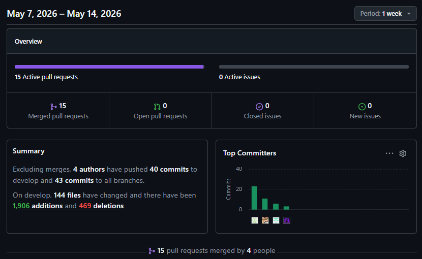

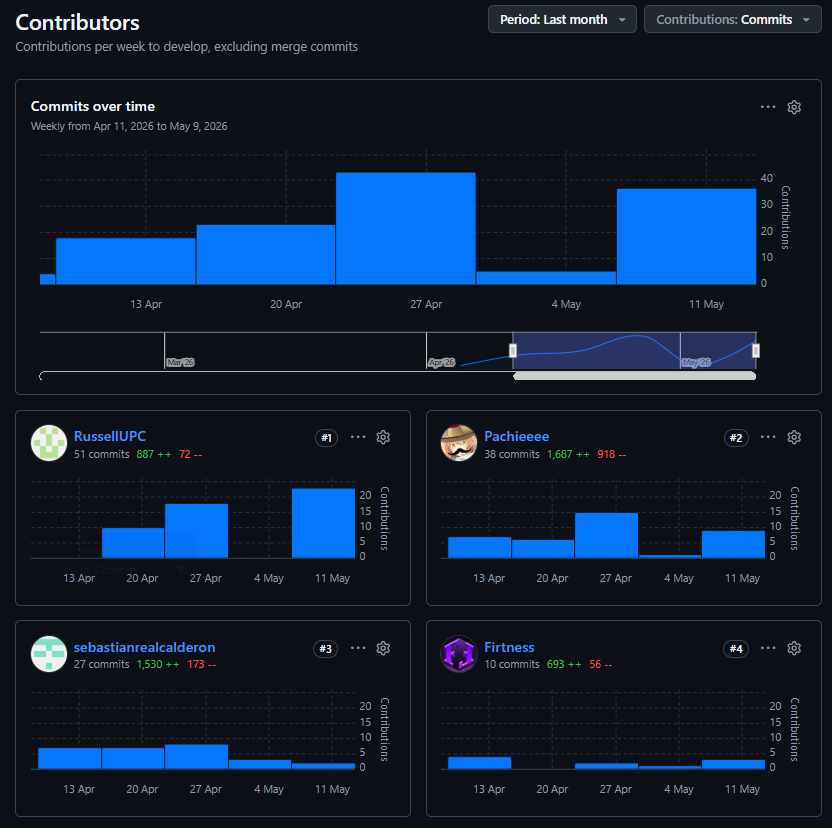

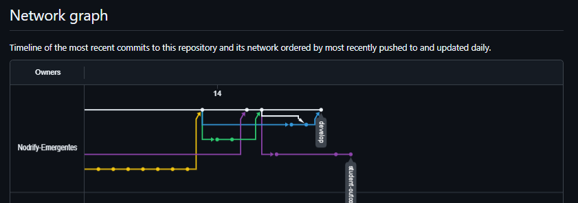

Distribución de Commits por Integrante:

| Integrante                        | Cantidad de Commits |
|-----------------------------------|---------------------|
| Sebastián Omar Real Calderón      | 27                  |
| José Antonio Alejo Cárdenas       | 10                  |
| Sebastián Pacheco Astiguetta      | 38                  |
| Russell Stephen Romero Qwistgaard | 51                  |

**Contenido**

* [Student Outcome](#student-outcome)
* [Capítulo I: Introducción](#capítulo-i-introducción)
  * [1.1. Startup Profile](#11-startup-profile)
    * [1.1.1. Descripción de la Startup](#111-descripción-de-la-startup)
    * [1.1.2. Perfiles de integrantes del equipo](#112-perfiles-de-integrantes-del-equipo)
  * [1.2. Solution Profile](#12-solution-profile)
    * [1.2.1. Antecedentes y problemática](#121-antecedentes-y-problemática)
    * [1.2.2. Lean UX Process](#122-lean-ux-process)
      * [1.2.2.1. Lean UX Problem Statements](#1221-lean-ux-problem-statements)
      * [1.2.2.2. Lean UX Assumptions](#1222-lean-ux-assumptions)
      * [1.2.2.3. Lean UX Hypothesis Statements](#1223-lean-ux-hypothesis-statements)
      * [1.2.2.4. Lean UX Canvas](#1224-lean-ux-canvas)
  * [1.3. Segmentos objetivo](#13-segmentos-objetivo)
* [Capítulo II: Requirements Elicitation & Analysis](#capítulo-ii-requirements-elicitation--analysis)
  * [2.1. Competidores](#21-competidores)
    * [2.1.1. Análisis competitivo](#211-análisis-competitivo)
    * [2.1.2. Estrategias y tácticas frente a competidores](#212-estrategias-y-tácticas-frente-a-competidores)
  * [2.2. Entrevistas](#22-entrevistas)
    * [2.2.1. Diseño de entrevistas](#221-diseño-de-entrevistas)
    * [2.2.2. Registro de entrevistas](#222-registro-de-entrevistas)
    * [2.2.3. Análisis de entrevistas](#223-análisis-de-entrevistas)
  * [2.3. Needfinding](#23-needfinding)
    * [2.3.1. User Personas](#231-user-personas)
    * [2.3.2. User Task Matrix](#232-user-task-matrix)
    * [2.3.3. Empathy Mapping](#233-empathy-mapping)
    * [2.3.4. As-is Scenario Mapping](#234-as-is-scenario-mapping)
  * [2.4. Ubiquitous Language](#24-ubiquitous-language)
* [Capítulo III: Requirements Specification](#capítulo-iii-requirements-specification)
  * [3.1. To-Be Scenario Mapping](#31-to-be-scenario-mapping)
  * [3.2. User Stories](#32-user-stories)
  * [3.3. Impact Mapping](#33-impact-mapping)
  * [3.4. Product Backlog](#34-product-backlog)
* [Capítulo IV: Strategic-Level Software Design](#capítulo-iv-strategic-level-software-design)
  * [4.1. Strategic-Level Attribute-Driven Design](#41-strategic-level-attribute-driven-design)
    * [4.1.1. Design Purpose](#411-design-purpose)
    * [4.1.2. Attribute-Driven Design Inputs](#412-attribute-driven-design-inputs)
      * [4.1.2.1. Primary Functionality (Primary User Stories)](#4121-primary-functionality-primary-user-stories)
      * [4.1.2.2. Quality Attribute Scenarios](#4122-quality-attribute-scenarios)
      * [4.1.2.3. Constraints](#4123-constraints)
    * [4.1.3. Architectural Drivers Backlog](#413-architectural-drivers-backlog)
    * [4.1.4. Architectural Design Decisions](#414-architectural-design-decisions)
    * [4.1.5. Quality Attribute Scenario Refinements](#415-quality-attribute-scenario-refinements)
  * [4.2. Strategic-Level Domain-Driven Design](#42-strategic-level-domain-driven-design)
    * [4.2.1. EventStorming](#421-eventstorming)
    * [4.2.2. Candidate Context Discovery](#422-candidate-context-discovery)
    * [4.2.3. Domain Message Flows Modeling](#423-domain-message-flows-modeling)
    * [4.2.4. Bounded Context Canvases](#424-bounded-context-canvases)
    * [4.2.5. Context Mapping](#425-context-mapping)
  * [4.3. Software Architecture](#43-software-architecture)
    * [4.3.1. Software Architecture System Landscape Diagram](#431-software-architecture-system-landscape-diagram)
    * [4.3.2. Software Architecture Context Level Diagrams](#432-software-architecture-context-level-diagrams)
    * [4.3.3. Software Architecture Container Level Diagrams](#433-software-architecture-container-level-diagrams)
    * [4.3.4. Software Architecture Deployment Diagrams](#434-software-architecture-deployment-diagrams)
* [Capítulo V: Tactical-Level Software Design](#capítulo-v-tactical-level-software-design)
  * [5.1. Bounded Context: Identity Access Management](#51-bounded-context-identity-access-management)
    * [5.1.1. Domain Layer](#511-domain-layer)
    * [5.1.2. Interface Layer](#512-interface-layer)
    * [5.1.3. Application Layer](#513-application-layer)
    * [5.1.4. Infrastructure Layer](#514-infrastructure-layer)
    * [5.1.5. Bounded Context Software Architecture Component Level Diagrams](#515-bounded-context-software-architecture-component-level-diagrams)
    * [5.1.6. Bounded Context Software Architecture Code Level Diagrams](#516-bounded-context-software-architecture-code-level-diagrams)
      * [5.1.6.1. Bounded Context Domain Layer Class Diagrams](#5161-bounded-context-domain-layer-class-diagrams)
      * [5.1.6.2. Bounded Context Database Design Diagram](#5162-bounded-context-database-design-diagram)
  * [5.2. Bounded Context: Reports](#52-bounded-context-reports)
    * [5.2.1. Domain Layer](#521-domain-layer)
    * [5.2.2. Interface Layer](#522-interface-layer)
    * [5.2.3. Application Layer](#523-application-layer)
    * [5.2.4. Infrastructure Layer](#524-infrastructure-layer)
    * [5.2.5. Bounded Context Software Architecture Component Level Diagrams](#525-bounded-context-software-architecture-component-level-diagrams)
    * [5.2.6. Bounded Context Software Architecture Code Level Diagrams](#526-bounded-context-software-architecture-code-level-diagrams)
      * [5.2.6.1. Bounded Context Domain Layer Class Diagrams](#5261-bounded-context-domain-layer-class-diagrams)
      * [5.2.6.2. Bounded Context Database Design Diagram](#5262-bounded-context-database-design-diagram)
  * [5.3. Bounded Context: Assignments](#53-bounded-context-assignments)
    * [5.3.1. Domain Layer](#531-domain-layer)
    * [5.3.2. Interface Layer](#532-interface-layer)
    * [5.3.3. Application Layer](#533-application-layer)
    * [5.3.4. Infrastructure Layer](#534-infrastructure-layer)
    * [5.3.5. Bounded Context Software Architecture Component Level Diagrams](#535-bounded-context-software-architecture-component-level-diagrams)
    * [5.3.6. Bounded Context Software Architecture Code Level Diagrams](#536-bounded-context-software-architecture-code-level-diagrams)
      * [5.3.6.1. Bounded Context Domain Layer Class Diagrams](#5361-bounded-context-domain-layer-class-diagrams)
      * [5.3.6.2. Bounded Context Database Design Diagram](#5362-bounded-context-database-design-diagram)
  * [5.4. Bounded Context: Maintenance](#54-bounded-context-maintenance)
    * [5.4.1. Domain Layer](#541-domain-layer)
    * [5.4.2. Interface Layer](#542-interface-layer)
    * [5.4.3. Application Layer](#543-application-layer)
    * [5.4.4. Infrastructure Layer](#544-infrastructure-layer)
    * [5.4.5. Bounded Context Software Architecture Component Level Diagrams](#545-bounded-context-software-architecture-component-level-diagrams)
    * [5.4.6. Bounded Context Software Architecture Code Level Diagrams](#546-bounded-context-software-architecture-code-level-diagrams)
      * [5.4.6.1. Bounded Context Domain Layer Class Diagrams](#5461-bounded-context-domain-layer-class-diagrams)
      * [5.4.6.2. Bounded Context Database Design Diagram](#5462-bounded-context-database-design-diagram)
  * [5.5. Bounded Context: Vehicle Wellness](#55-bounded-context-vehicle-wellness)
    * [5.5.1 Domain Layer](#551-domain-layer)
    * [5.5.2 Interface Layer](#552-interface-layer)
    * [5.5.3 Application Layer](#553-application-layer)
    * [5.5.4 Infrastructure Layer](#554-infrastructure-layer)
    * [5.5.5 Bounded Context Software Architecture Component level Diagrams](#555-bounded-context-software-architecture-component-level-diagrams)
    * [5.5.6 Bounded Context Software Architecture Code level Diagrams](#556-bounded-context-software-architecture-code-level-diagrams)
      * [5.5.6.1 Bounded Context Domain Layer Class Diagrams](#5561-bounded-context-domain-layer-class-diagrams)
      * [5.5.6.2 Bounded Context Database Design Diagram](#5562-bounded-context-database-design-diagram)
  * [5.6. Bounded Context: Vehicle Management](#56-bounded-context-vehicle-management)
    * [5.6.1. Domain Layer](#561-domain-layer)
    * [5.6.2. Interface Layer](#562-interface-layer)
    * [5.6.3. Application Layer](#563-application-layer)
    * [5.6.4. Infrastructure Layer](#564-infrastructure-layer)
    * [5.6.5. Bounded Context Software Architecture Component Level Diagrams](#565-bounded-context-software-architecture-component-level-diagrams)
    * [5.6.6. Bounded Context Software Architecture Code Level Diagrams](#566-bounded-context-software-architecture-code-level-diagrams)
      * [5.6.6.1. Bounded Context Domain Layer Class Diagrams](#5661-bounded-context-domain-layer-class-diagrams)
      * [5.6.6.2. Bounded Context Database Design Diagram](#5662-bounded-context-database-design-diagram)
  * [5.7. Bounded Context: Device Intelligence](#57-bounded-context-device-intelligence)
    * [5.7.1. Domain Layer](#571-domain-layer)
    * [5.7.2. Interface Layer](#572-interface-layer)
    * [5.7.3. Application Layer](#573-application-layer)
    * [5.7.4. Infrastructure Layer](#574-infrastructure-layer)
    * [5.7.5. Bounded Context Software Architecture Component Level Diagrams](#575-bounded-context-software-architecture-component-level-diagrams)
    * [5.7.6. Bounded Context Software Architecture Code Level Diagrams](#576-bounded-context-software-architecture-code-level-diagrams)
      * [5.7.6.1. Bounded Context Domain Layer Class Diagrams](#5761-bounded-context-domain-layer-class-diagrams)
      * [5.7.6.2. Bounded Context Database Design Diagram](#5762-bounded-context-database-design-diagram)
* [Capitulo VI: Solution UX Design](#capitulo-vi-solution-ux-design-)
  * [6.1. Style Guidelines](#61-style-guidelines)
    * [6.1.1 General Style Guidelines](#611-general-style-guidelines)
    * [6.1.2 Web, Mobile & Devices Style Guidelines](#612-web-mobile--devices-style-guidelines)
  * [6.2. Information Architecture](#62-information-architecture)
    * [6.2.1. Labeling Systems](#621-labeling-systems)
    * [6.2.2. Searching Systems](#622-searching-systems)
    * [6.2.3. SEO Tags and Meta Tags](#623-seo-tags-and-meta-tags)
    * [6.2.4. Navigation Systems](#624-navigation-systems)
  * [6.3. Landing Page UI Design](#63-landing-page-ui-design)
    * [6.3.1. Landing Page Wireframe](#631-landing-page-wireframe)
    * [6.3.2. Landing Page Mock-up](#632-landing-page-mock-up)
  * [6.4. Applications UX/UI Design](#64-applications-uxui-design)
    * [6.4.1. Applications Wireframes](#641-applications-wireframes)
    * [6.4.2. Applications Wireflow Diagrams](#642-applications-wireflow-diagrams)
* [Conclusiones](#conclusiones)
* [Bibliografía](#bibliografía)

# Student Outcome

El curso contribuye al cumplimiento del Student Outcome ABET:

**ABET – EAC - Student Outcome 3**

Criterio: *Capacidad de comunicarse efectivamente con un rango de audiencias.*

En el siguiente cuadro se describe las acciones realizadas y enunciados de conclusiones por parte del grupo, que permiten sustentar el haber alcanzado el logro del ABET – EAC - Student Outcome 3.

<table>
  <thead>
    <tr>
      <th>Criterio específico</th>
      <th>Acciones realizadas</th>
      <th>Conclusiones</th>
    </tr>
  </thead>
  <tbody>
    <tr>
      <td>
        Comunica oralmente sus ideas y/o resultados con objetividad a público de diferentes especialidades y niveles jerarquicos, en el marco del desarrollo de un proyecto en ingeniería.
      </td>
      <td>
        <!--Acciones Realizadas-->
        Sebastián Omar Real Calderón
         
        TB1: 
        Durante el desarrollo del proyecto, expuse al equipo los antecedentes y la problemática identificada, así como los resultados obtenidos en herramientas de análisis como User Personas, Empathy Mapping y los escenarios As-Is y To-Be. Presenté estos elementos de forma clara y estructurada, permitiendo que integrantes con distintos niveles técnicos comprendieran el contexto del problema y las decisiones de diseño. Asimismo, comuniqué los drivers arquitectónicos, decisiones de diseño y escenarios de atributos de calidad, facilitando la alineación del equipo en torno a la solución propuesta. 
        TP: 
        Durante el desarrollo del TP, comuniqué al equipo los avances relacionados con los Bounded Context de Vehicle Management y Maintenance, explicando su propósito, responsabilidades principales y relación con el funcionamiento general de la solución. Además, presenté las decisiones tomadas en el diseño de la Landing Page UI, justificando la organización visual, la navegación y la forma en que esta interfaz comunica el valor del producto a usuarios técnicos y no técnicos.
         
        Alejo Cardenas Jose Antonio
         
        TB1: 
        Durante el desarrollo del proyecto, expliqué a mi equipo la visión de nuestra Startup y las User Stories para asegurar que todos entendiéramos qué debíamos construir. En nuestras reuniones, presenté de forma objetiva los diagramas de Arquitectura (Contenedores y Despliegue), traduciendo los conceptos complejos a términos que mis compañeros, independientemente de su rol en el grupo, pudieran validar. Esto permitió que tomáramos decisiones técnicas consensuadas y que cada integrante comprendiera cómo su parte del código encajaba en el sistema general. 
        TP: 
        Durante el desarrollo del TP, expliqué al equipo el Bounded Context de Vehicle Wellness, presentando su función dentro del sistema y su relación con el monitoreo del estado de las motocicletas. Asimismo, comuniqué las decisiones definidas en las Style Guidelines, exponiendo criterios visuales como colores, tipografías, componentes y lineamientos de diseño, para asegurar que todos los integrantes comprendieran cómo mantener una identidad visual coherente en la solución.
         
        Pacheco Astiguetta Sebastian
         
        TB1: 
        Realicé un análisis significativo de los nuevos features que se pueden considerar en el proyecto, aplicando nuevas tecnologías emergentes como idea principal para la mejora del producto. Considerando esta nueva funcionalidad nos permite formular mejor los requositos necesarios para actualizar el producto. 
        TP: 
        Hice una revisión general del contenido, supervisando que los integrantes realicen sus modificaciones alineadas a cada subtítulo y que el contenido sea coherente con el enfoque de negocio y técnico del proyecto, para que así el equipo pueda entender claramente el desarrollo del proyecto y las decisiones tomadas durante el proceso. Además, analicé la la información de la arquitectura del proyecto, viendo qué posibles etiquetas se le pueden asociar e identificar más a la solución, impulsando su visibilidad.
         
        Russell Stephen Romero Qwistgaard
         
        TB1: 
        Durante las sesiones de trabajo, comuniqué al equipo los resultados del enfoque Lean UX, incluyendo los Problem Statements, Assumptions e Hypothesis Statements. Expliqué de manera clara el Lean UX Canvas y el Impact Mapping, permitiendo que todos los miembros comprendieran cómo estas herramientas guiaban la definición del producto. Además, presenté los Bounded Context y el Context Mapping, asegurando que el equipo entendiera la organización del sistema y la relación entre sus componentes desde una perspectiva de dominio. 
        TP: 
    Durante esta entrega estuve comunicandome con el eqipo acerca de cada cambio hecho a los bounded context y el UX/UI design del landing page y la aplicación, explicando el por qué de estos cambios y avisando cuando estaban listos para que el leader del grupo pudiera agregarlos a la rama principal del repositorio.
         
      </td>
      <td>
        <!--Conclusiones Grupales-->
        TB1: 
        Como equipo, logramos comunicar nuestras ideas y resultados de manera clara y objetiva durante las reuniones de trabajo, adaptando el nivel de detalle según el público y el rol de cada integrante. Esto permitió que todos comprendieran tanto el enfoque de negocio como las decisiones técnicas, facilitando la colaboración, la validación conjunta y la toma de decisiones informadas a lo largo del desarrollo del proyecto. 
        TP: 
        Como equipo, logramos comunicar de manera clara y objetiva los avances correspondientes al diseño táctico, los Bounded Context y las decisiones de UX/UI desarrolladas durante el TP. Cada integrante explicó sus aportes desde su área de responsabilidad, permitiendo que el equipo comprendiera la función de cada contexto dentro de la arquitectura, la relación entre los componentes del sistema y la importancia de mantener coherencia visual y funcional en la solución. Esta comunicación facilitó la coordinación del trabajo, la revisión de cambios y la integración ordenada de los avances al repositorio del proyecto.
         
      </td>
    </tr>
    <tr>
      <td>
        Comunica en forma escrita ideas y/o resultados con objetividad a público de diferentes especialidades y niveles jerarquicos, en el marco del desarrollo de un proyecto en ingeniería.
      </td>
      <td>
        <!--Acciones Realizadas-->
        Sebastián Omar Real Calderón
         
        TB1: 
        Elaboré la documentación relacionada con el análisis del problema y el diseño de la solución, incluyendo secciones como antecedentes, problemática, User Personas, User Task Matrix y escenarios As-Is y To-Be. Redacté de manera clara los drivers arquitectónicos, decisiones de diseño y escenarios de atributos de calidad, asegurando que la información fuera comprensible tanto para perfiles técnicos como no técnicos. Esta documentación permitió mantener coherencia en el desarrollo del proyecto y sirvió como base para la toma de decisiones del equipo. 
        TP: 
        Documenté los Bounded Context de Vehicle Management y Maintenance de forma clara y estructurada, describiendo sus responsabilidades, elementos principales y aporte dentro de la arquitectura del sistema. Asimismo, elaboré y registré el diseño de la Landing Page UI, detallando su composición visual, secciones principales y criterios de presentación, con el fin de facilitar la comprensión del producto y mantener coherencia entre la propuesta visual y los objetivos del proyecto.
         
        Alejo Cardenas Jose Antonio
         
        TB1: 
        Redacté la documentación en nuestro repositorio compartido, detallando el Product Backlog y la Arquitectura de Software de manera clara y sin ambigüedades. Utilicé los diagramas de Contexto y Landscape para que cualquier compañero que se uniera al desarrollo entendiera el flujo rápidamente, y complementé los Diagramas de Despliegue con notas técnicas precisas. Esta redacción objetiva sirvió como guía de referencia para el equipo, evitando errores de interpretación y asegurando que los resultados del diseño fueran consistentes durante toda la implementación. 
        TP: 
        Documenté el Bounded Context de Vehicle Wellness, describiendo sus responsabilidades principales y su aporte al monitoreo del estado del vehículo dentro de la arquitectura del sistema. Además, redacté las Style Guidelines del proyecto, estableciendo criterios visuales como paleta de colores, tipografía, componentes y lineamientos de interfaz, permitiendo que el equipo cuente con una referencia clara para mantener consistencia visual y comunicativa en el desarrollo de la solución.
         
        Pacheco Astiguetta Sebastian
         
        TB1: 
        Coordiné y lideré las reuniones para desarrollar el Event Storming, considerando eventos para las nuevas tecnologías y modificando posibles cambios necesarios para que esté estructurado correctamente. Sabiendo que el Event Storming y otros modelados que necesitan de ésta son esenciales para sel desarrollo de la solución, este procedimiento ayuda a que el equipo comprenda a qué dirección va el producto y qué funcionalidades debemos tener en cuenta durante la codificación. 
        TP: 
        Redacté la información acorde al SEO y etiquetas relacionadas con la arquitectura del proyecto y la solución IoT, documentando el proceso y las decisiones tomadas como equipo. Adicionalmente, realicé correcciones anteriores con respecto a los Bounded Context, separando la telemetría a su propio área, facilitando la identificación de funciones del event storming asociados a ésta.
         
        Russell Stephen Romero Qwistgaard
         
        TB1: 
        Desarrollé la documentación correspondiente al enfoque Lean UX, redactando los Problem Statements, Assumptions e Hypothesis Statements de forma estructurada y objetiva. Asimismo, documenté el Lean UX Canvas, Impact Mapping y los modelos de dominio como Bounded Context y Context Mapping, asegurando claridad en la definición del alcance del sistema. Esta documentación facilitó la comprensión del producto y ayudó a mantener alineados los objetivos del equipo durante el desarrollo. 
        TP: 
        Realizé la documentación de los Bounded Context Reports y Assignments, Detallando el funcionamiento de  la asignaciónes entre motociclistas y mécanicos como también lás métricas que se reciben de otros bc en base a las operaciones del vehículo. Además, Diseñé los wireframes y userframes que tendrá la aplicación y el landing page tanto en formato web como en móbiles, los cuáles fueron utilizados para crear el prototipo de estos.
         
      </td>
      <td>
        <!--Conclusiones Grupales-->
        TB1: 
        A nivel grupal, se logró una documentación clara, estructurada y accesible, que permitió transmitir los resultados del análisis y diseño del proyecto de manera efectiva. La redacción objetiva y el uso de herramientas visuales y conceptuales facilitaron la comprensión del sistema por parte de todos los integrantes, asegurando consistencia en la implementación y sirviendo como referencia sólida durante todo el desarrollo. 
        TP: 
        A nivel grupal, se logró documentar de forma estructurada y comprensible los Bounded Context, lineamientos visuales, arquitectura de información y diseños UX/UI desarrollados durante el TP. La redacción de estas secciones permitió describir con claridad las responsabilidades de cada componente, su aporte dentro de la solución y los criterios utilizados para mantener consistencia técnica y visual en el proyecto. Esta documentación sirvió como base para alinear el trabajo del equipo, facilitar la comprensión del sistema y respaldar las decisiones tomadas durante el desarrollo de Octane.
         
      </td>
    </tr>
  </tbody>
</table>

# Capítulo I: Introducción

## 1.1. Startup Profile

### 1.1.1. Descripción de la Startup

Nodrify es una startup tecnológica peruana, surgida en la Facultad de Ingeniería de la Universidad Peruana de Ciencias Aplicadas (UPC), enfocada en la innovación para el sector de movilidad inteligente. Nuestra misión es transformar la manera en que dueños de motocicletas, mecánicos y empresas gestionan el estado, uso y bienestar de las motocicletas, combinando arquitecturas de software emergentes, IoT y análisis de datos en una sola plataforma integral.

Nuestro producto estrella, Octane, conecta dispositivos de telemetría avanzada instalados en los vehículos con un ecosistema digital (web y móvil) diseñado para eliminar la ceguera operativa en el mantenimiento. Mediante el uso de sensores en tiempo real y procesamiento de datos, brindamos a los usuarios una visión completa de su vehículo: métricas críticas, historiales de mantenimiento digitales, alertas preventivas y reportes técnicos personalizados, optimizando la relación entre el dueños de motocicleta y su taller de confianza.

Misión: Transformar la gestión de motocicletas combinando tecnología IoT y análisis de datos para ofrecer seguridad, eficiencia y confianza a dueños de motocicletas y mecánicos, reduciendo la incidencia de accidentes por fallas mecánicas.

Visión: Ser la plataforma líder en movilidad inteligente en el mercado peruano que revolucione el mantenimiento preventivo y la conexión en el ecosistema de vehículos de dos ruedas.

### 1.1.2. Perfiles de integrantes del equipo

<table>
  <tr>
    <th colspan="2">Russell Stephen Romero Qwistgaard</th>
  </tr>
  <tr>
    <td> </td>
    <td>Estudio la carrera de ingeniería de software, actualmente en el 9 ciclo de esta. Me apasiona crear programas en entornos distintos para poder ampliar mi conocimiento en las muchas áreas que dependen de mi formación. He aprendido a programar en lenguajes como HTML, C++, Java, SQL y en frameworks como React, .Net, Angular CLI, Vue.js y Node.js</td>
  </tr>
  <tr>
    <th colspan="2">Jose Antonio Alejo Cardenas</th>
  </tr>
  <tr>
    <td>  </td>
    <td> Soy José Alejo Cárdenas, estudiante de la carrera de Ingeniería de Software del octavo ciclo, código u202122484. Desde pequeño he sentido fascinación por la tecnología en general sobretodo por el funcionamiento, desarrollo y proteccion del software en el ambito de ciberseguridad. He estudiado lenguajes de programacion (javascript, typescript, python, java y C#), bases de datos (Microsoft SQL Server y Mongo DB) y Sistemas Operativos (Linux y Windows). Asi mismo, tengo experiencia con hardware a nivel de esamblamiento de equipos y funcionamiento del mismo con sus especificaciones tecnicas. Además, mi constante comunicacion y organizacion durante cualquier trabajo grupal aportara mucho dinamismo al proyecto. Mis principales hobbies son entrenar en el gimnasio, jugar videojuegos con mis amigos y salir a conversar con estos ultimos durante algun almuerzo o cena. Para el proyecto aportare organizacion, comunicacion e inspiracion durante todo el transcurso del mismo. </td>
  </tr>
  <tr>
    <th colspan="2">Sebastian Pacheco Astiguetta</th>
  </tr>
  <tr>
    <td>  </td>
    <td> Soy Sebastian Pacheco, tengo 22 años y soy alumno de Ingeniería de Software en la UPC, código u202110291. Me considero una persona trabajadora y activa, priorizando las responsabilidades ante todo, pero también destaco en trabajo en equipo, permitiendo a todos que participen. Tengo conocimiento de C++ y Python, los cuales pongo en práctica mediante proyectos personales. </td>
  </tr>
  <tr>
    <th colspan="2">Sebatian Omar Real Calderon</th>
  </tr>
  <tr>
    <td>  </td>
    <td> Soy Sebastián Real Calderón, estudiante de Ingeniería de Software, código u20221D964. Tengo conocimiento de diferentes lenguajes de programación, como C#, C++ y Java. Mi mayor objetivo al desarrollar software es crear una experiencia de usuario con la que los consumidores puedan sentirse satisfechos al trabajar con nuestras aplicaciones. Asimismo, aspiro a ser un buen participante al mantener una comunicación constante con mis compañeros, resolviendo problemas y apoyando a quién lo necesite para crear un ambiente cómodo para todos.  </td>
  </tr>
</table>

## 1.2. Solution Profile

### 1.2.1. Antecedentes y problemática

**What**

- ¿Cuál es el problema?

El problema principal recae en la dificultad de realizar revisiones proactivas, ya que los dueños de motocicletas carecen por completo de visibilidad en tiempo real sobre la salud de sus vehículos. Esta ceguera operativa conduce inevitablemente a fallas inesperadas y costosas. Por su parte, los talleres mecánicos se ven forzados a operar de manera reactiva; aunque realizan una revisión general al recibir la moto, el proceso de diagnóstico es lento e ineficiente, ya que deben revisar manualmente múltiples partes del vehículo hasta atinar con la fuente del problema, en lugar de poder ofrecer un mantenimiento predictivo y proactivo basado en datos precisos.

- ¿Cuál es la relación con la persona en cuestión?

La relación con el mecánico se transforma gracias a nuestra plataforma. Ya no se limita a interacciones esporádicas y reactivas cuando algo se rompe, sino que se convierte en una relación constante y proactiva. El mecánico utiliza la herramienta para ofrecer un servicio de monitoreo continuo, lo que le permite actuar como un aliado tecnológico y generar un vínculo de confianza mediante un valor añadido constante. Para el usuario, esta relación se traduce en acceso a datos transparentes sobre su vehículo y la recepción de alertas y recomendaciones directas de su mecánico de confianza.

En esencia, la plataforma está enfocada en proporcionar a ambos actores una herramienta integral que satisface sus necesidades específicas: facilita un monitoreo y registro sencillo de las métricas del vehículo para el usuario y, al mismo tiempo, empodera al mecánico con datos precisos para realizar revisiones más efectivas, optimizando significativamente su trabajo y elevando la calidad del servicio.

**When**

- ¿Cuándo sucede el problema?

El problema ocurre durante el uso diario de la motocicleta, cuando el propietario carece de visibilidad sobre el estado interno de su vehículo. Las fallas y el desgaste suceden de manera imprevista, sin alertas tempranas, llevando a averías inesperadas que interrumpen la movilidad y generan costosas reparaciones de emergencia.

- ¿Cuándo utiliza el cliente el producto?

El cliente utiliza la aplicación de Octane de forma continua durante sus trayectos para monitorizar en tiempo real el estado de su moto y conocer en qué momento necesita llevar a cabo mantenimiento. Además, accede a ella de manera proactiva al recibir notificaciones del taller, lo que le permite gestionar alertas específicas y agendar citas de mantenimiento con facilidad. Este uso constante no solo le ofrece tranquilidad y control sobre su vehículo, sino que también favorece directamente al mecánico, quien recibe métricas precisas y premeditadas que agilizan y optimizan el proceso de diagnóstico y reparación.

**Where**

- ¿Dónde está el cliente cuando usa el producto?

El cliente utiliza la aplicación de Octane principalmente desde su smartphone, accediendo a ella en cualquier lugar y momento. Este acceso ubicuo le permite monitorizar el estado de su moto en tiempo real durante sus desplazamientos, así como revisar de forma remota el historial técnico y las notificaciones proactivas que recibe. Si bien la plataforma se utiliza en talleres durante las interacciones con el mecánico para facilitar el diagnóstico colaborativo, su verdadero poder radica en que todas las métricas y el historial detallado del vehículo pueden visualizarse y compartirse desde cualquier lugar con acceso a internet, garantizando una supervisión continua y una comunicación fluida entre el usuario y su taller de confianza.

- ¿Dónde surge el problema?

El problema surge en la propia motocicleta durante su operación diaria, donde ocurren los eventos críticos. Además, se manifiesta en el taller mecánico, donde la falta de datos en tiempo real impide al mecánico anticiparse a las fallas y ofrece un servicio reactivo.

**Who**

- ¿Quienes se ven involucrados en el problema?

El problema involucra directamente a dos actores clave: los dueños de motocicletas y los mecánicos. Por un lado, los usuarios enfrentan la dificultad constante de no tener conocimiento preciso del estado interno de sus vehículos, lo que los expone a sufrir fallas imprevistas y reparaciones costosas. Por otro lado, los mecánicos se ven igualmente afectados, ya que esta falta de información les impide evolucionar hacia un modelo de servicio preventivo y proactivo, lo que no solo genera ineficiencias en sus procesos de diagnóstico, sino que también representa una pérdida de oportunidades de negocio para fidelizar y agregar valor a su cartera de clientes existente.

**Why**

- ¿Por qué sucede el problema?

Las causas del problema se deben en mayor parte a la falta de datos actualizados sobre el estado del vehículo y/o poco conocimiento de algunos usuarios con respecto a identificar señales de una falla en el vehículo. Por otro lado, el diagnóstico se complica ya que carece de un historial del vehículo, dependiendo de lo que el cliente recuerde en base a reparaciones previas y/o incidentes recientes.

**How**

- ¿En qué condiciones los clientes usan nuestro producto?

Los clientes utilizan nuestro producto en condiciones de movilidad, accediendo a los datos de su moto en tiempo real durante sus trayectos o de manera remota para planificar mantenimientos. La plataforma es utilizada principalmente a través de dispositivos móviles con conectividad a internet, permitiendo interacciones tanto preventivas como reactivas ante alertas generadas por el sistema.

**How Much**

El impacto de la problemática es considerable y puede observarse en las estadísticas de seguridad vial actuales. Según un informe publicado por Freitas (2025) en Infobae, Lima registra 1.668 muertes por accidentes de tránsito en lo que va del año 2025, siendo los dueños de motocicletas quienes lideran la lista de víctimas, de acuerdo con datos del Ministerio de Transportes y Comunicaciones (MTC). Esta cifra evidencia la alta vulnerabilidad de los conductores de motocicletas y la falta de mecanismos preventivos eficaces que permitan detectar a tiempo posibles fallas mecánicas o comportamientos de riesgo durante la conducción.

Estos datos reflejan la magnitud del problema y justifican la necesidad de soluciones tecnológicas que promuevan un mantenimiento preventivo y un monitoreo constante del estado del vehículo, permitiendo anticipar fallos críticos que podrían desencadenar accidentes. De este modo, la propuesta de la plataforma Octane contribuye directamente a reducir la incidencia de accidentes asociados a fallas mecánicas y a fortalecer la cultura de prevención entre los dueños de motocicletas urbanos.

### 1.2.2. Lean UX Process
#### 1.2.2.1. Lean UX Problem Statements

El mantenimiento de motocicletas suele gestionarse bajo un enfoque reactivo, en el que los dueños de motocicletas no cuentan con información suficiente sobre el estado de su vehículo y los talleres dependen de diagnósticos manuales basados en datos incompletos.

Esta limitación dificulta la detección temprana de fallas, incrementa el riesgo de reparaciones imprevistas y reduce la capacidad de los talleres para ofrecer un servicio preventivo y personalizado.

Octane aborda esta oportunidad mediante una plataforma IoT que permite monitorear el estado de la motocicleta, centralizar el historial de mantenimiento y facilitar la comunicación entre dueños de motocicletas y mecánicos.

Nuestro público inicial está conformado por dueños de motocicletas urbanos y talleres mecánicos independientes.

Sabremos que la propuesta funciona si se incrementa la programación de mantenimientos preventivos, mejora la retención de usuarios y disminuyen las reparaciones de emergencia durante los primeros meses de uso.

#### 1.2.2.2. Lean UX Assumptions

En esta etapa se identificaron las principales suposiciones de Octane respecto al negocio, los usuarios, los resultados esperados y las características del producto.

Business Assumptions

1. Suponemos que los dueños de motocicletas necesitan una forma más confiable de prevenir fallas mecánicas y reducir gastos inesperados.
2. Suponemos que esta necesidad puede resolverse mediante una plataforma digital conectada a dispositivos IoT que recolecten datos del vehículo.
3. Suponemos que los primeros usuarios serán dueños de motocicletas urbanos y mecánicos que buscan digitalizar su servicio.
4. Suponemos que el valor principal para el usuario será la seguridad, la trazabilidad y el ahorro en mantenimiento.
5. Suponemos que el modelo de negocio puede sostenerse mediante suscripciones de talleres y servicios complementarios de monitoreo.

User Assumptions

1. Suponemos que el dueño de motocicletas utilizará Octane para revisar alertas, consultar historial y anticipar mantenimientos.
2. Suponemos que el mecánico empleará la plataforma para revisar métricas, mejorar diagnósticos y mantener contacto con sus clientes.
3. Suponemos que ambos perfiles valorarán una experiencia simple, clara y confiable.
4. Suponemos que la app móvil será el canal principal del dueño de motocicletas y el panel web será el canal principal del taller.

User Outcomes Assumptions

1. Suponemos que los usuarios se sentirán más seguros al recibir alertas tempranas.
2. Suponemos que disminuirán los gastos por reparaciones no planificadas.
3. Suponemos que los talleres mejorarán la precisión de sus diagnósticos.
4. Suponemos que aumentará la fidelización entre dueños de motocicletas y mecánicos.

Features Assumptions

1. Suponemos que las alertas preventivas serán una de las funciones más usadas.
2. Suponemos que el historial de mantenimiento será clave para la toma de decisiones.
3. Suponemos que el monitoreo IoT en tiempo real será el principal diferenciador.
4. Suponemos que la integración entre app móvil, panel web y servicios de notificación será esencial para el éxito del producto.

#### 1.2.2.3. Lean UX Hypothesis Statements

1. Alertas preventivas y monitoreo en tiempo real  
Creemos que reduciremos fallas inesperadas si Octane permite detectar anomalías y notificar al usuario antes de que ocurran problemas críticos.
2. Historial de mantenimiento centralizado  
Creemos que los usuarios planificarán mejor sus servicios si cuentan con un historial claro y accesible desde la plataforma.
3. Panel para mecánicos  
Creemos que los talleres mejorarán sus diagnósticos si pueden visualizar datos de telemetría y compararlos por vehículo.
4. Integración móvil-web-IoT  
Creemos que la comunicación entre dueños de motocicletas y taller será más fluida si la plataforma sincroniza información entre la app móvil, el panel web y los dispositivos IoT.
5. Experiencia simple y confiable  
Creemos que la adopción crecerá si la interfaz reduce fricción y presenta la información de forma clara.

#### 1.2.2.4. Lean UX Canvas

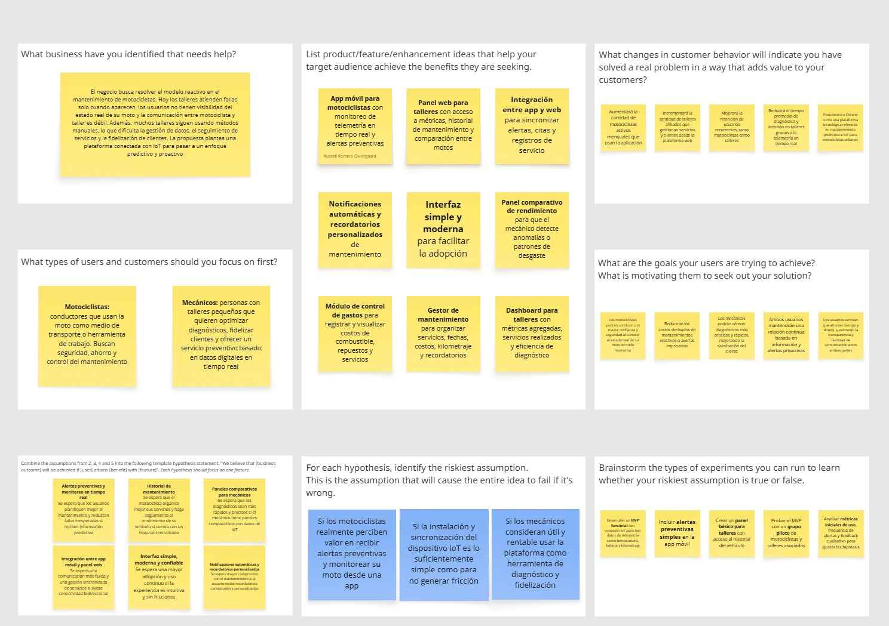

Link: https://miro.com/app/board/uXjVHdKIr_Q=/?share_link_id=592709495812

## 1.3. Segmentos objetivo

**Segmento Objetivo #1: Dueños de motocicletas**

Grupo conformado por personas que usan motos con su principal medio de transporte. Ellos necesitan del vehículo para movilizarse hacia sus trabajos, estudios, actividades sociales, delivery, entre otros.  Son usuarios interesados en mantener la eficiencia presente en su moto, reducir la recepción de costos imprevistos, y monitorear el estado del vehículo con la idea de mantener seguro al conductor.

- Características clave:
  - Edad: 18 a 45 años
  - Género: Ambos
  - Contexto: Movilización frecuente a diversos lugares (trabajo, estudio, servicios de entrega, actividades sociales).
  - Ocupación: Estudiantes universitarios, trabajadores formales/informales, repartidores, jóvenes profesionales.
  - Uso de tecnología: Usuarios activos de smartphones que utilizan aplicaciones móviles a diario.
- Necesidades:
  - Monitorear el consumo de gasolina.
  - Mantener la eficiencia del vehículo.
  - Prevenir fallas con alertas de mantenimiento.
  - Tener a mano un historial de mantenimiento

**Segmento Objetivo #2: Mecánicos**

Grupo conformado por profesionales independientes con pequeños talleres. Ellos ofrecen servicios de reparación y mantenimiento de motocicletas. Son usuarios que requieren de herramientas que les permitan ofrecer diagnósticos más precisos y gestionar mejor la relación con sus clientes, a fin de mejorar la confianza y fidelización.

- Características clave:
  - Edad: 25 a 60 años
  - Género: Ambos
  - Contexto: Laburo en talleres de servicio mecánico, tanto formales como independientes.
  - Ocupación: Mecánicos, técnicos de motos, dueños de talleres pequeños o medianos.
  - Uso de tecnología: Software de gestión básica, con apoyo en WhatsApp y/o afines para coordinar con clientes.
- Necesidades:
  - Acceder a métricas objetivas del estado de la moto.
  - Emitir reportes de salud y diagnósticos comparativos según la moto.
  - Consultar el historial de reparaciones previas de la moto.
  - Recordar y planificar mantenimientos preventivos.

# Capítulo II: Requirements Elicitation & Analysis

## 2.1. Competidores

Relacionado a nuestro start-up, hemos identificado a otros competidores en el mercado que ofrecen soluciones similares, aunque con enfoques y características distintas. A continuación, se presenta un análisis competitivo de los principales competidores en el ámbito de la movilidad inteligente y el mantenimiento preventivo de motocicletas:

- Wialon (Gurtam)

Wialon es la plataforma de software insignia de Gurtam, una empresa bielorrusa con más de 20 años en el mercado de telemática e IoT. Está considerada una de las soluciones más versátiles para la gestión de flotas y activos móviles, con más de 4 millones de unidades conectadas en más de 160 países. Wialon funciona bajo un modelo SaaS altamente escalable y soporta más de 3.000 modelos de dispositivos GPS e IoT, lo que permite adaptarse a diferentes necesidades: desde camiones y buses hasta maquinaria pesada o transporte ligero. Entre sus funcionalidades principales destacan el rastreo en tiempo real, generación de informes personalizados, alertas de eventos, gestión de combustible, mantenimiento predictivo y herramientas de integración por API. Su principal fortaleza radica en la gran flexibilidad y ecosistema de partners, lo que lo convierte en una solución preferida para empresas de logística, transporte y operadores de flotas internacionales.

- Fuelio

Fuelio es una aplicación móvil enfocada en la gestión del consumo de combustible y el mantenimiento vehicular. Permite a los usuarios registrar de manera sencilla el kilometraje, repostajes, costos asociados y servicios realizados al vehículo, generando estadísticas detalladas sobre rendimiento y gastos. La app ofrece funcionalidades adicionales como localización de estaciones de servicio cercanas, cálculo de consumo por trayecto, y respaldo automático en la nube para mantener los datos seguros y accesibles en múltiples dispositivos. Su propuesta de valor radica en brindar control y transparencia sobre los gastos de movilidad, ayudando tanto a conductores individuales como a pequeños administradores de vehículos a optimizar su presupuesto y hábitos de conducción.

- GeoTab

Geotab, fundada en 2000 en Canadá, es uno de los líderes globales en telemática comercial y gestión de flotas, con más de 3,7 millones de vehículos conectados en más de 150 países. Su propuesta combina el dispositivo IoT Geotab GO9 con la plataforma en la nube MyGeotab, lo que permite a empresas de cualquier tamaño acceder a datos avanzados de sus vehículos. Entre sus principales funcionalidades se incluyen análisis de comportamiento de conducción, diagnóstico de motor, consumo de combustible, planificación de rutas, alertas de mantenimiento, cumplimiento normativo (como ELD en EE.UU.) y reportes personalizados. Además, Geotab cuenta con el Geotab Marketplace, un ecosistema de más de 200 aplicaciones complementarias que amplían las capacidades de la plataforma. Su diferenciador está en la precisión de sus análisis, confiabilidad y enfoque en big data e inteligencia artificial, que permiten a empresas grandes y gobiernos tomar decisiones estratégicas basadas en datos de movilidad.

### 2.1.1. Análisis competitivo

El análisis competitivo es una herramienta fundamental para comprender el entorno en el que se desarrollará nuestro producto, identificar las fortalezas y debilidades de los competidores, y definir estrategias que nos permitan posicionarnos de manera efectiva en el mercado. A continuación, se presenta un análisis competitivo detallado de Octane frente a sus principales competidores descritos previamente.

<table> 
  <tr>
    <th colspan="6"> Competitive Analysis Landscape </th>
  </tr>
  <tr>
    <td colspan="2" rowspan="2">¿Por qué llevar acabo este análisis? </td>
    <td colspan="4"> Deberíamos llevar a cabo este análisis para conocer el entorno, la competencia, tomar decisiones de desarrollo y construir nuestra propuesta de valor. </td>
  </tr>
  <tr>
    </tr>
  <tr>
    <td colspan="2"> Productos </td>
    <td style="text-align: center;"> 
Octane
 </td>
    <td style="text-align: center;"> 
Wialon (Gurtam)
 </td>
    <td style="text-align: center;"> 
Fuelio
 </td>
    <td style="text-align: center;"> 
Geotab
 </td>
  </tr>
  <tr>
    <td rowspan="2">Perfil</td>
    <td>Overview</td>
    <td>Octane es una plataforma IoT para motocicletas que conecta mecánicos con clientes, con métricas en tiempo real y alertas preventivas.</td>
    <td>Wialon es un sistema SaaS de telemática IoT para gestión de vehículos y activos móviles, con GPS y reportes avanzados.</td>
    <td>Fuelio es una app para rastrear consumo de combustible, costos, kilometraje y servicios, con búsqueda de estaciones y respaldo en la nube.</td>
    <td>Geotab es un sistema considerado líder global en telemática, con dispositivos IoT y software para análisis de datos vehiculares.</td>
  </tr>
  <tr>
    <td>Ventaja competitiva ¿Qué valor ofrece a los clientes? </td>
    <td>Tiene un enfoque de nicho: motos + talleres mecánicos. Conexión directa cliente-mecánico mediante suscripción.</td>
    <td>Amplia cobertura global y flexibilidad de personalización para distintos tipos de flotas.</td>
    <td>Interfaz sencilla, soporte crowdsourced de precios, recordatorios, sincronización y reportes visuales potentes.</td>
    <td>Precisión en datos y analítica avanzada, gran reputación en confiabilidad.</td>
  </tr>
  <tr>
    <td rowspan="2">Perfil de Marketing</td>
    <td>Mercado Objetivo</td>
    <td>Motociclistas individuales y talleres mecánicos pequeños/medianos.</td>
    <td>Empresas de logística, transporte y flotas heterogéneas.</td>
    <td>Conductores particulares y usuarios multi-vehículo que buscan ahorrar en combustible y mantenimiento.</td>
    <td>Flotas comerciales, gobiernos, corporativos globales.</td>
  </tr>
  <tr>
    <td>Estrategias de Marketing</td>
    <td>Enfoque B2B2C: atraer talleres como socios y motociclistas vía suscripción.</td>
    <td>Estrategia B2B, alianzas con distribuidores y partners locales.</td>
    <td>Se promociona como simple y potente; cuenta con integración de precios crowdsourced, historias de usuarios satisfechos y respaldo de Sygic.</td>
    <td>Estrategia B2B global, certificaciones y partnerships institucionales.</td>
  </tr>
  <tr>
    <td rowspan="3">Perfil de Producto</td>
    <td>Productos & Servicios</td>
    <td>Sensores IoT para motos, app móvil/web para clientes, dashboard para mecánicos, alertas proactivas.</td>
    <td>Plataforma SaaS con GPS, sensores IoT, informes personalizados.</td>
    <td>Fill-ups, gastos, recordatorios, estación de gasolina cercana, gráficos, estadísticas, sincronización. Con membresía Pro: planificación de ruta, estimación de costo, filtro estaciones, reporte de ruta.</td>
    <td>Dispositivos IoT + plataforma de análisis con diagnósticos y mantenimiento predictivo.</td>
  </tr>
  <tr>
    <td>Precios & Costos</td>
    <td>Modelo de suscripción mensual accesible (B2C) + paquetes premium para talleres.</td>
    <td>Licencias SaaS escalables, costos variables por flota.</td>
    <td>Gratuito, Fuelio Pro en Android es suscripción (€7 - €9) sin afectar funciones gratuitas.</td>
    <td>Suscripción SaaS + costo de dispositivos IoT (moderado/alto).</td>
  </tr>
  <tr>
    <td>Canales de distribución</td>
    <td>App móvil (Android), web, talleres como canales de adquisición.</td>
    <td>Red de partners y distribuidores en más de 150 países.</td>
    <td>Android & iOS.</td>
    <td>Red global de resellers y partners certificados.</td>
  </tr>
  <tr>
    <td rowspan="5">Análisis SWOT</td>
  </tr>
  <tr>
    <td>Fortalezas</td>
    <td>Nicho diferenciado, cercanía con usuarios finales, foco en motos.</td>
    <td>Escalabilidad, robustez y experiencia global.</td>
    <td>Interfaz amigable, precios crowdsourced, reportes detallados, muchos features gratuitos.</td>
    <td>Precisión en analítica, confiabilidad, amplia red global.</td>
  </tr>
  <tr>
    <td>Debilidades</td>
    <td>Proyecto no conocido, sin marca consolidada, recursos limitados.</td>
    <td>No especializado en motos, alto costo para pequeños talleres.</td>
    <td>Entrada manual laboriosa, problemas ocasionales de sincronización.</td>
    <td>Altos costos, pensado para grandes flotas, no para usuarios individuales.</td>
  </tr>
  <tr>
    <td>Oportunidades</td>
    <td>Mercado creciente de motocicletas en LATAM/Asia, tendencia a IoT y mantenimiento predictivo.</td>
    <td>Expansión en verticales nuevos como motos y microflotas.</td>
    <td>Expandir trip logging, entradas automáticas, soporte ampliado en iOS.</td>
    <td>Penetración en mercados emergentes y nuevas integraciones IoT.</td>
  </tr>
  <tr>
    <td>Amenazas</td>
    <td>Ingreso de grandes players al nicho, barreras de hardware.</td>
    <td>Competencia creciente y commoditización de la telemática.</td>
    <td>Cambios en licenciamiento por Sygic; apps emergentes con mejor UX o IA predictiva.</td>
    <td>Alta competencia y presión por diferenciación.</td>
  </tr>
</table>

### 2.1.2. Estrategias y tácticas frente a competidores

Para poder destacar un producto en un mercado competitivo, es fundamental implementar estrategias que resalten las fortalezas y aborden las debilidades de los competidores. De esta manera, proponemos estrategias y tácticas específicas para posicionar a Octane como la solución preferida para dueños de motocicletas y mecánicos.

**Estrategia #1: Diferenciación Tecnológica (IoT + Diagnósticos Predictivos)**

*Objetivo:* Posicionar a Octane como la primera solución que integra hardware IoT y software para ofrecer métricas automáticas en tiempo real y diagnósticos predictivos, superando la limitación de registros manuales en Drivvo, aCar y Fuelio.

*Tácticas:*

- Desarrollar un dispositivo IoT plug & play que se instale fácilmente en motos urbanas.
- Integrar algoritmos de mantenimiento predictivo basados en telemetría.
- Generar reportes personalizados descargables para usuarios y mecánicos.
- Comunicar en marketing el diferencial clave: “No registres datos, deja que tu moto hable por ti”.

**Estrategia #2: Enfoque en Nichos Desatendidos (Motos Urbanas + Mecánicos)**

*Objetivo:* Atacar un mercado poco atendido: dueños de motocicletas urbanos y talleres mecánicos, en contraste con las apps competidoras que se enfocan en autos y flotas.

*Tácticas:*

- Ofrecer funcionalidades específicas para motos (ej. control de gasolina por cilindrada, alertas de aceite, historial de mantenimientos por kilometraje).
- Crear una app web exclusiva para mecánicos, con comparativos por modelo y gestión de clientes.
- Establecer alianzas con talleres locales y concesionarios de motos para distribución del IoT.
- Campañas de marketing dirigidas a delivery riders, mototaxistas y jóvenes dueños de motocicletas urbanos.

**Estrategia #3: Marca Cercana y Comunitaria**

*Objetivo:* Construir confianza mostrando a Octane como una solución hecha por y para dueños de motocicletas y mecánicos, en lugar de una app genérica de gastos.

*Tácticas:*

- Crear una comunidad digital de dueños de motocicletas, con foros y tips de mecánica preventiva.
- Usar un lenguaje simple y cercano, evitando tecnicismos innecesarios.
- Brindar soporte personalizado (ej. chat directo, FAQs en video, tutoriales cortos en redes).
- Generar contenido educativo sobre seguridad, ahorro de combustible y mantenimiento inteligente.

**Estrategia #4: Precio Accesible y Transparente**

*Objetivo:* Superar la percepción negativa de Drivvo (suscripción costosa) y Fuelio Pro (costo adicional), ofreciendo planes claros y económicos.

*Tácticas:*

- Modelo freemium real: funcionalidades básicas siempre gratuitas (seguimiento de consumo y alertas).
- Plan Premium accesible (<$2/mes) con reportes predictivos, diagnósticos avanzados y sincronización completa.
- Precio del dispositivo IoT asequible (ej. $30–40) con facilidades de pago en talleres.
- Descuentos especiales para mecánicos que adquieran múltiples dispositivos para sus clientes.

**Estrategia #5: Diferenciación por Especialización en Motocicletas**

*Objetivo:* Posicionar la solución como un producto diseñado específicamente para motocicletas y talleres mecánicos, en contraste con los competidores que se orientan a flotas grandes y heterogéneas (Wialon, Geotab).

*Tácticas:*

- Desarrollar una interfaz amigable y personalizada para mecánicos y dueños de motocicletas.
- Ofrecer funcionalidades exclusivas para motos (ej. alertas de mantenimiento de cadena, aceite, frenos).
- Construir una narrativa de marca clara: “la telemática de las motos”.
- Enfocar el marketing en la relación directa entre mecánico y cliente.

**Estrategia #6: Accesibilidad y Flexibilidad en el Modelo de Negocio**

*Objetivo:* Competir contra grandes competidores (Wialon, Samsara, Geotab) ofreciendo un producto más accesible, económico y fácil de implementar, enfocado en usuarios individuales y talleres pequeños.

*Tácticas:*

- Diseñar planes de suscripción escalonados (desde básicos hasta avanzados) que permitan crecer al ritmo del usuario.
- Incluir un modelo freemium o demo para captar usuarios rápidamente sin barreras de entrada.
- Resaltar la facilidad de instalación de sensores IoT en motos, evitando hardware costoso o complejo.

**Estrategia #7: Cercanía y Comunidad con el Usuario Final**

*Objetivo:* Diferenciarse por la relación directa y de confianza entre dueños de motocicletas y mecánicos, creando una comunidad alrededor del producto que los competidores globales no priorizan.

*Tácticas:*

- Lanzar campañas de marketing en comunidades locales (Facebook, Instagram, clubes de dueños de motocicletas, foros especializados).
- Promover talleres mecánicos como socios estratégicos para captar clientes y distribuir el IoT.
- Desarrollar integraciones futuras con aseguradoras o talleres certificados, ofreciendo beneficios adicionales (ej. descuentos en seguros, paquetes de mantenimiento).

## 2.2. Entrevistas

Para identificar las necesidades, comportamientos y puntos de dolor de nuestros usuarios potenciales, se llevaron a cabo entrevistas con dueños de motocicletas urbanos y mecánicos. A continuación, se detalla el proceso seguido para la realización de estas entrevistas.

### 2.2.1. Diseño de entrevistas

Se diseñaron entrevistas semiestructuradas con el objetivo de obtener información cualitativa sobre las experiencias, necesidades y expectativas de los usuarios en relación al mantenimiento de sus motocicletas, y de qué expectativas tienen los mecánicos para ofrecer un mejor servicio a los usuarios.

**Diseño de entrevistas para dueños de motocicletas:**

Preguntas principales:

1. ¿Podrías contarme un poco sobre ti? (edad, ocupación, lugar de residencia, estado civil)
2. ¿Cómo sueles llevar el control del gasto de combustible y mantenimiento de tu moto?
3. ¿Con qué frecuencia realizas mantenimientos preventivos a tu moto?
4. ¿Has tenido problemas con fallas inesperadas o gastos imprevistos relacionados con tu moto?
5. ¿Cómo te comunicas actualmente con tu mecánico cuando necesitas una revisión o reparación?

Preguntas complementarias:

1. ¿Utilizas actualmente alguna aplicación o herramienta digital para registrar tus gastos o consumo de gasolina?
2. ¿Qué tan cómodo te sentirías si tu moto enviara automáticamente datos de su estado a una aplicación?
3. ¿Qué indicadores del estado de tu moto te gustaría conocer en tiempo real? (ejemplo: presión de neumáticos, combustible, temperatura del motor)
4. ¿Qué tan útil te parecería recibir alertas en tu celular sobre posibles fallas antes de que ocurran?
5. ¿Qué tipo de alertas te serían más útiles? (ejemplo: cambio de aceite, nivel de gasolina, revisión de frenos)
6. ¿Qué dispositivos usas más frecuentemente para organizarte o monitorear cosas? (móvil, laptop, tablet)
7. ¿Qué valoras más en una app para motos? (ejemplo: simplicidad, visualización clara de métricas, recordatorios)
8. ¿Cuánto estarías dispuesto a pagar por un servicio que prevenga fallos y prolongue la vida útil de tu moto?

**Diseño de entrevistas para mecánicos:**

Preguntas principales:

1. ¿Podrías contarme un poco sobre ti? (edad, ocupación, experiencia laboral, ubicación del taller)
2. ¿Qué tipo de servicios brindas con mayor frecuencia en tu taller?
3. ¿Cómo registras actualmente el historial de mantenimiento de tus clientes?
4. ¿Cómo realizas actualmente el diagnóstico del estado de una moto cuando llega a tu taller?
5. ¿Te resultaría útil poder monitorear de forma remota el estado de las motos de tus clientes? ¿Por qué?

Preguntas complementarias:

1. ¿Qué tan común es que tus clientes lleguen con problemas que pudieron haberse evitado con un mantenimiento preventivo?
2. ¿Sueles recomendar a tus clientes llevar un control de gastos y mantenimientos? ¿Cómo lo haces?
3. ¿Usas alguna herramienta digital para organizar los diagnósticos o el historial de las motos?
4. ¿Qué tan útil te parecería contar con datos de telemetría en tiempo real (ejemplo: kilometraje, consumo, estado de batería) antes de recibir una moto en tu taller?
5. ¿Qué métricas (ej. presión de neumáticos, consumo, temperatura) serían más valiosas para tu trabajo?
6. ¿Qué tipo de reportes serían más valiosos para ti y para tus clientes?
7. ¿Estarías dispuesto a ofrecer este servicio como un valor agregado a tus clientes? ¿Cómo lo integrarías a tu negocio?
8. ¿Qué tan dispuesto estarías a recomendar a tus clientes una app vinculada con tu servicio?
9. ¿Qué modelo de ingresos preferirías: una comisión por cada suscripción de tus clientes, o un plan que te permita supervisar toda tu cartera de clientes a un costo fijo?
10. ¿Qué valoras más en una herramienta digital para tu trabajo? (ejemplo: precisión, facilidad de uso, integración con otros sistemas)

### 2.2.2. Registro de entrevistas

En esta sección se registran los puntos más relevantes de las entrevistas realizadas a los mecánicos y dueños de motos. Las entrevistas, en formato de video, se encuentran en el siguiente enlace: https://tinyurl.com/26tdu3s4

A continuación, se presentan detalles de las entrevistas realizadas a los mecánicos:

| Entrevista 1              |  |
|---------------------------|---------------------------------------------------------------------|
| Nombre del entrevistado   | Flavio Gallardo                                                     |
| Edad                      | 21                                                                  |
| Distrito                  | San Miguel                                                          |
| Ocupación                 | Ayudante de mecánico                                                |
| Duración de la Entrevista | 4:20                                                                |
| Minuto de Inicio          | 0:00                                                                |

Flavio, un joven mecánico de 21 años que trabaja en un taller de motos en San Miguel, destaca por su enfoque práctico y empírico en el mantenimiento y diagnóstico vehicular. El entrevistado tiene preferencia por el sistema Android en móvil y laptop para web. Realiza principalmente servicios preventivos y correctivos de motos de delivery, registrando la información de sus clientes de forma manual, lo que genera dificultades en el seguimiento de mantenimientos. Su personalidad es proactiva y orientada a la mejora del servicio, mostrando interés en herramientas tecnológicas que optimicen su trabajo. Usa canales digitales básicos como WhatsApp para comunicarse, pero carece de sistemas especializados. Considera que el acceso a datos de telemetría como kilometraje, consumo o estado de batería le permitiría anticiparse a fallas y mejorar su precisión en los diagnósticos. Además, se muestra dispuesto a implementar soluciones digitales, incluso bajo un modelo de suscripción fija, siempre que sean fáciles de usar, precisas y se integren con plataformas cotidianas.

| Entrevista 2              |  |
|---------------------------|-----------------------------------------------------------------|
| Nombre del entrevistado   | Juan Cuellar                                                    |
| Edad                      | 25                                                              |
| Distrito                  | Pueblo Libre                                                    |
| Ocupación                 | Mecánico                                                        |
| Duración de la Entrevista | 4:15                                                            |
| Minuto de Inicio          | 4:20                                                            |

Juan, un mecánico de 25 años con tres años de experiencia en el mantenimiento de motos de uso diario, delivery y mototaxis, trabaja en un entorno práctico y orientado a la rapidez del servicio. El entrevistado tiene preferencia por el sistema Android en móvil y laptop para web. Ofrece mantenimientos básicos y reparaciones eléctricas sencillas, priorizando la atención ágil a repartidores que dependen de sus vehículos para trabajar. Lleva el registro de mantenimientos en una hoja de Excel y se comunica con sus clientes principalmente mediante WhatsApp, aunque admite que no actualiza sus registros con frecuencia por falta de tiempo. Su diagnóstico se basa en observación, experiencia y prueba directa, sin herramientas avanzadas. Considera que la posibilidad de monitorear remotamente las motos mediante telemetría sería muy beneficiosa, ya que le permitiría anticipar problemas y brindar un servicio más eficiente. Valora métricas como kilometraje, batería, consumo y presión de llantas, y reconoce la utilidad de reportes simples y periódicos para mejorar la confianza del cliente. Con una actitud abierta hacia la tecnología, estaría dispuesto a recomendar y ofrecer una app de monitoreo como servicio agregado bajo un modelo de costo fijo, siempre que sea fácil de usar y práctica, alineada con su ritmo de trabajo y el de sus clientes repartidores.

| Entrevista 3              |  |
|---------------------------|-----------------------------------------------------------------|
| Nombre del entrevistado   | Aldo Vasquez                                                    |
| Edad                      | 23                                                              |
| Distrito                  | Breña                                                           |
| Ocupación                 | Ayudante de mecánico                                            |
| Duración de la Entrevista | 3:58                                                            |
| Minuto de Inicio          | 8:18                                                            |

Aldo, un joven mecánico de 23 años con un año de experiencia en un taller de Breña, se caracteriza por su enfoque empírico y su interés en mejorar la eficiencia de su trabajo. El entrevistado tiene preferencia por el sistema Android en móvil y laptop para web. Brinda principalmente servicios de mantenimiento preventivo y correctivo, incluyendo cambios de aceite, frenos, cadenas y reparaciones eléctricas, adaptándose al aumento de motos modernas. Registra los mantenimientos de forma manual y memorística, utilizando cuadernos o recordatorios verbales, y se comunica con sus clientes principalmente por WhatsApp. Carece de herramientas digitales para diagnósticos, confiando en su experiencia e intuición, aunque reconoce el valor de la tecnología: considera que la telemetría en tiempo real (presión, temperatura, voltaje) le permitiría anticipar fallas y optimizar el servicio. Valora la precisión y simplicidad en las herramientas digitales, estaría dispuesto a recomendar y ofrecer una app de monitoreo como servicio adicional bajo un modelo de costo fijo, y demuestra una actitud abierta hacia la innovación tecnológica aplicada a su labor diaria.

A continuación, se presentan detalles de las entrevistas realizadas a los dueños de motos:

| Entrevista 4              |  |
|---------------------------|------------------------------------------------------------------|
| Nombre del entrevistado   | Josue Paiva                                                      |
| Edad                      | 22                                                               |
| Distrito                  | San Miguel                                                       |
| Ocupación                 | Estudiante                                                       |
| Duración de la Entrevista | 5:40                                                             |
| Minuto de Inicio          | 12:10                                                            |

Josue, un estudiante de 22 años de San Miguel, utiliza su motocicleta principalmente para trasladarse a la universidad y realizar encargos ocasionales. Muestra una actitud práctica y orientada a la optimización de recursos, ya que debe gestionar un presupuesto ajustado. Actualmente, realiza un seguimiento básico de sus gastos de combustible y mantenimiento de forma mental o en notas simples, lo que a veces le hace perder el control de sus fechas de servicio. Valora mucho la confiabilidad de su moto, ya que una falla repentina afectaría directamente sus estudios y movilidad. Se comunica con su mecánico por WhatsApp y llamadas, pero encuentra este proceso desorganizado. El entrevistado tiene preferencia por el sistema Android en móvil y laptop para web. Le interesaría una aplicación que le ayude a recordar fechas de mantenimiento, le permita visualizar un historial claro de gastos y, sobre todo, que sea muy sencilla y rápida de usar. Estaría dispuesto a usar una versión gratuita con funciones básicas, mostrando mayor interés en funciones de alerta y recordatorio que en métricas en tiempo muy avanzadas.

| Entrevista 5              |  |
|---------------------------|----------------------------------------------------------------------|
| Nombre del entrevistado   | Mathias Diaz                                                         |
| Edad                      | 23                                                                   |
| Distrito                  | Pueblo Libre                                                         |
| Ocupación                 | Profesor                                                             |
| Duración de la Entrevista | 7:34                                                                 |
| Minuto de Inicio          | 17:49                                                                |

Mathias, un profesor de 23 años de Pueblo Libre, usa su motocicleta para desplazarse diariamente a su trabajo en un colegio y para sus actividades personales. Tiene un perfil organizado y metódico, valorando la planificación y la prevención. Lleva un registro manual (en una libreta) del kilometraje y los servicios realizados a su moto, pero reconoce que este método es susceptible a olvidos y no le proporciona alertas proactivas. Su principal motivación es la seguridad y la economía a largo plazo, buscando evitar reparaciones costosas. El entrevistado tiene preferencia por el sistema iOS en móvil y laptop para web. Considera que una aplicación podría ser una herramienta ideal para centralizar la información de su vehículo. Le atraen especialmente las funcionalidades que le permitirían recibir notificaciones basadas en el kilometraje para los próximos servicios, acceder a un historial digital ordenado y poder compartir fácilmente este historial con un mecánico de confianza. Está abierto a considerar una suscripción de bajo costo si la aplicación demuestra ser confiable y le ayuda a mantener su moto en óptimas condiciones de manera consistente.

| Entrevista 6              |  |
|---------------------------|------------------------------------------------------------------------|
| Nombre del entrevistado   | Jair Huamani                                                           |
| Edad                      | 32                                                                     |
| Distrito                  | Huancavelica                                                           |
| Ocupación                 | Abogado                                                                |
| Duración de la Entrevista | 8:28                                                                   |
| Minuto de Inicio          | 25:18                                                                  |

Jair, un abogado de 32 años que utiliza su motocicleta como principal medio de transporte en Lima, se caracteriza por su enfoque organizado y su interés en mantener la eficiencia y seguridad de su vehículo. El entrevistado tiene preferencia por el sistema iOS en móvil y laptop para web. Actualmente, lleva el control del gasto de combustible y mantenimiento de su moto de manera manual, lo que a veces le genera dificultades para recordar fechas importantes. Ha experimentado fallas inesperadas que le han ocasionado gastos imprevistos, lo que le ha llevado a valorar la importancia del mantenimiento preventivo. Se comunica con su mecánico principalmente a través de llamadas y mensajes de texto, pero no utiliza herramientas digitales específicas para gestionar el estado de su moto. Jair se muestra abierto a la idea de una aplicación que le permita monitorear automáticamente el estado de su moto, recibir alertas sobre posibles fallas y conocer métricas en tiempo real como presión de neumáticos, nivel de combustible y temperatura del motor. Valora la simplicidad y claridad en las aplicaciones móviles, y estaría dispuesto a pagar una suscripción mensual si el servicio le ofrece beneficios tangibles en términos de seguridad y ahorro en mantenimiento.

### 2.2.3. Análisis de entrevistas

Al tener todas las entrevistas necesitadas de ambos segmentos objetivo, se procedió a realizar un análisis cualitativo para identificar patrones, necesidades comunes y oportunidades de mejora en el proceso de mantenimiento de motocicletas tanto para mecánicos como para dueños. A continuación, se presenta un resumen categórico del análisis realizado:

**Segmento Objetivo: Mecánicos y talleres de servicio**

*Demografía:*

La edad de los mecánicos entrevistados varía entre 21 y 25 años, con una experiencia laboral de 1 a 3 años. Todos trabajan en talleres urbanos de Lima y atienden principalmente motos de uso diario y delivery, lo que refleja un perfil joven, técnico y cercano a un público que depende de sus vehículos para generar ingresos. El 100 % tiene menos de 3 años de experiencia y el 67 % atiende mayoritariamente a repartidores y transporte urbano.

*Servicios frecuentes:*

Los servicios más comunes son cambios de aceite, ajustes de frenos, mantenimiento eléctrico básico, reparación de cadenas y revisión de neumáticos. Esto evidencia un enfoque en mantenimientos preventivos y correctivos rápidos, adaptados a clientes que necesitan volver a la pista en poco tiempo. El 100 % realiza cambios de aceite y revisión de frenos; el 67 % ofrece trabajos eléctricos y de neumáticos.

*Gestión y diagnóstico:*

El historial de clientes se maneja con libretas, memoria personal o Excel poco usado. El diagnóstico es manual y basado en experiencia, usando herramientas básicas como multímetro y revisión visual. Esto revela una falta de digitalización en procesos clave del taller. El 67 % gestiona historial en cuadernos/memoria y solo el 33 % usa Excel de manera básica.

*Necesidades y oportunidades:*

Los mecánicos ven valor en contar con telemetría remota (kilometraje, batería, combustible, temperatura, neumáticos) y reportes simples como historial, alertas de servicio y resúmenes mensuales. Prefieren un plan fijo para el taller en lugar de comisiones individuales, y valoran herramientas precisas, fáciles de usar y compatibles con WhatsApp, lo que abre una oportunidad para soluciones digitales simples, accesibles y prácticas. El 100% considera útil la telemetría, el 100% prefiere un plan fijo y el 100% valora la facilidad de uso por encima de funciones complejas.

**Segmento Objetivo: Dueños de motocicletas**

*Demografía:*

Los dueños de motocicletas entrevistados tienen entre 22 y 32 años, con ocupaciones variadas (estudiante, profesor, abogado) y residen en distritos urbanos de Lima. Todos utilizan su moto para desplazamientos diarios, lo que indica un perfil diverso pero con una necesidad común de movilidad confiable. El 100% tiene entre 22 y 32 años, con ocupaciones variadas.

*Gestión y comunicación:*

El control de gastos y mantenimiento es manual, con métodos como notas, libretas o memoria, lo que genera dificultades para recordar fechas y detalles importantes. La comunicación con mecánicos se realiza principalmente a través de WhatsApp o llamadas, sin herramientas digitales específicas, lo que refleja una falta de organización y seguimiento efectivo. El 100% gestiona gastos de forma manual y el 100% se comunica con mecánicos por WhatsApp o llamadas.

*Necesidades y oportunidades:*

Los dueños de motocicletas valoran la confiabilidad de su moto y buscan evitar fallas inesperadas. Están interesados en aplicaciones que ofrezcan recordatorios de mantenimiento, historial digital de gastos y servicios, y alertas proactivas basadas en métricas como kilometraje, presión de neumáticos, nivel de combustible y temperatura del motor. Están dispuestos a pagar por una suscripción si la aplicación demuestra ser confiable y les ayuda a mantener su moto en óptimas condiciones. El 100% valora la confiabilidad, el 100% busca recordatorios y alertas, y el 100% estaría dispuesto a pagar por una suscripción si el servicio es confiable y útil.

## 2.3. Needfinding

### 2.3.1. User Personas

**Segmento Objetivo 1: Mecánicos**

**Segmento Objetivo 2: Dueños de motocicletas**

### 2.3.2. User Task Matrix

En esta sección se presenta la User Task Matrix, herramienta que permite identificar y analizar las tareas que cada User Persona, representando a los distintos segmentos de usuarios, realiza para alcanzar sus objetivos. Se detallan las tareas en función de su frecuencia e importancia, proporcionando una visión clara de las actividades más relevantes para cada segmento.

**1. Segmento 1: Mecánico de Motocicletas**

| Tarea                                           | Frecuencia | Severidad |
|-------------------------------------------------|------------|-----------|
| Realizar diagnósticos precisos de fallas        | Alta       | Alta      |
| Optimizar tiempos de servicio                   | Alta       | Alta      |
| Visualizar mantenimientos de clientes           | Media      | Alta      |
| Programar citas con clientes                    | Media      | Media     |
| Usar herramientas de diagnóstico manual         | Alta       | Media     |
| Implementar nuevas herramientas tecnológicas    | Baja       | Alta      |
| Anticipar fallas comunes de motos               | Media      | Alta      |
| Verificar estado básico de la moto al recibirla | Media      | Media     |

**2. Segmento 2: Dueños de motocicletas**

| Tarea                                                 | Frecuencia | Severidad |
|-------------------------------------------------------|------------|-----------|
| Realizar mantenimientos preventivos                   | Baja       | Alta      |
| Recordar fechas de último mantenimiento               | Media      | Alta      |
| Detectar fallas solo cuando se presentan              | Alta       | Alta      |
| Buscar información en internet sobre problemas        | Media      | Media     |
| Verificar el estado básico de la moto antes de usarla | Alta       | Media     |

### 2.3.3. Empathy Mapping

En esta sección se presentan los Empathy Mapping por cada segmento objetivo definido.

**1. Segmento 1: Mecánico de Motocicletas**

**2. Segmento 2: Dueño de Motocicletas**

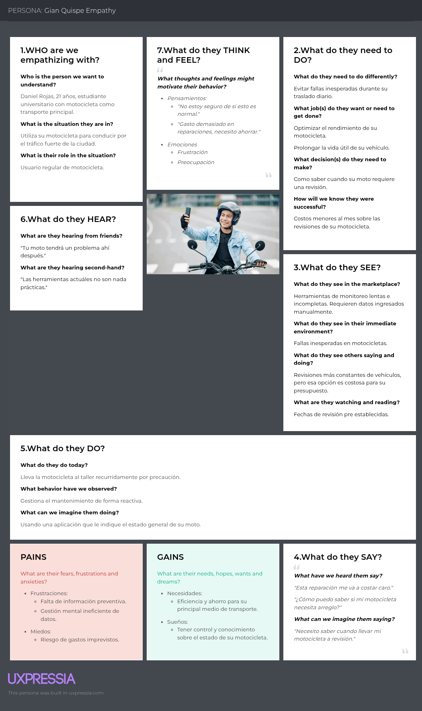

### 2.3.4. As-is Scenario Mapping

En esta sección se presentan los As-Is Scenario Mapping por cada segmento objetivo definido.

**1. Segmento 1: Mecánico de Motocicletas**

**Escenario actual (As-Is): Diagnóstico reactivo en taller**

| Etapa                       | Acción del usuario (Mecánico)                           | Pensamientos                            | Puntos de dolor                                 |
|-----------------------------|---------------------------------------------------------|-----------------------------------------|-------------------------------------------------|
| Recepción del cliente       | Recibe al cliente con la motocicleta averiada           | “Necesito entender qué le pasó”         | Información incompleta o poco clara del cliente |
| Recopilación de información | Pregunta al cliente sobre síntomas y antecedentes       | “Dependo de lo que recuerde el cliente” | Falta de historial técnico confiable            |
| Inspección manual           | Revisa visual y físicamente distintas partes de la moto | “Podría ser varias cosas”               | Diagnóstico lento y poco preciso                |
| Pruebas y descarte          | Realiza pruebas para identificar la falla               | “Espero no equivocarme”                 | Tiempo elevado y posibilidad de error           |
| Identificación del problema | Determina la posible causa de la falla                  | “Finalmente encontré el problema”       | Proceso ineficiente y no escalable              |
| Reparación                  | Procede con la reparación                               | “Esto pudo evitarse antes”              | Trabajo reactivo en lugar de preventivo         |
| Entrega del vehículo        | Explica al cliente lo ocurrido                          | “Ojalá regrese para mantenimiento”      | Baja fidelización del cliente                   |

**2. Segmento 2: Dueño de Motocicletas**

Escenario actual (As-Is): Uso cotidiano sin monitoreo del vehículo

| Etapa                 | Acción del usuario (Propietario)        | Pensamientos                 | Puntos de dolor                                   |
|-----------------------|-----------------------------------------|------------------------------|---------------------------------------------------|
| Uso diario            | Utiliza la motocicleta para movilizarse | “Todo parece estar bien”     | Falta de visibilidad del estado real del vehículo |
| Aparición de señales  | Nota ruidos o comportamientos extraños  | “¿Será grave?”               | Incertidumbre y falta de conocimiento técnico     |
| Ignorar o postergar   | Decide seguir usando la moto            | “Lo revisaré después”        | Riesgo de empeorar la falla                       |
| Falla inesperada      | La moto presenta una avería             | “Esto no lo esperaba”        | Interrupción de actividades                       |
| Búsqueda de solución  | Busca un mecánico o taller              | “Espero no me cobren de más” | Estrés y desconfianza                             |
| Diagnóstico en taller | Explica el problema al mecánico         | “No sé bien qué pasó”        | Comunicación imprecisa                            |
| Pago y reparación     | Paga por la reparación                  | “Fue caro”                   | Costos imprevistos                                |
| Retoma uso            | Vuelve a usar la moto                   | “Espero no vuelva a pasar”   | No hay prevención futura                          |

## 2.4. Ubiquitous Language

| Término (Inglés)     | Término (Español)    | Definición                                                                                   |
|----------------------|----------------------|----------------------------------------------------------------------------------------------|
| Metric               | Métrica              | Dato cuantitativo sobre el estado de ciertas características o desempeño de la moto.         |
| Report               | Reporte              | Conjunto estructurado de métricas procesadas y visualizadas.                                 |
| Comparison           | Comparación          | Análisis de diferencias entre métricas en distintos vehículos.                               |
| Alert                | Alerta               | Notificación preventiva generada a partir de una métrica crítica o fuera de rango.           |
| Historial            | Historial            | Registro acumulativo de eventos pasados relacionados con vehículos, servicios y clientes.    |
| Service              | Servicio             | Intervención realizada por un mecánico.                                                      |
| Repair               | Reparación           | Acción específica para corregir un problema en la moto.                                      |
| Expense              | Gasto                | Desembolso económico relacionado con el vehículo.                                            |
| Client               | Cliente              | Dueño asociado al vehículo.                                                                  |
| Subscription         | Suscripción          | Vínculo activo entre mecánico y dueño de moto.                                               |
| Membership           | Membresía            | Conjunto de beneficios y limitaciones (ejemplo: básico, premium).                            |
| State                | Estado               | Condición de la suscripción (activa, suspendida, cancelada).                                 |
| Renewal              | Renovación           | Acción de extender la membresía al vencer.                                                   |
| Preventive alert     | Alerta preventiva    | Notificación emitida al dueño al detectar un valor fuera de rango normal.                    |
| Vehicle status       | Estado del vehículo  | Resumen general del bienestar de una característica del vehículo (óptimo, regular, crítico). |
| Diagnosis            | Diagnóstico          | Interpretación de métricas para indicar posibles fallas o recomendaciones.                   |
| Vehicle              | Vehículo             | Moto registrada en la plataforma.                                                            |
| Owner                | Dueño                | Usuario principal que gestiona el vehículo.                                                  |
| Authorized Mechanic  | Mecánico autorizado  | Usuario con acceso limitado al vehículo para servicios o diagnósticos.                       |
| Vehicle registration | Registro de vehículo | Proceso de alta inicial en el sistema.                                                       |

# Capítulo III: Requirements Specification

## 3.1. To-Be Scenario Mapping

En esta sección se presentan los To-Be Scenario Mapping por cada segmento objetivo definido, mostrando cómo se transforman los escenarios actuales (As-Is) en escenarios futuros (To-Be) gracias a la implementación de la plataforma Octane.

**1. Segmento 1: Mecánico de Motocicletas**

**Escenario futuro (To-Be): Diagnóstico proactivo basado en datos con Octane**

| Etapa                    | Acción del usuario (Mecánico)                         | Pensamientos                                    | Beneficios                                     |
|--------------------------|-------------------------------------------------------|-------------------------------------------------|------------------------------------------------|
| Acceso a plataforma      | Ingresa al sistema Octane desde web o móvil           | “Tengo toda la información centralizada”        | Acceso inmediato a datos de múltiples clientes |
| Monitoreo continuo       | Visualiza métricas en tiempo real de las motocicletas | “Puedo detectar problemas antes de que ocurran” | Mantenimiento predictivo                       |
| Recepción de alertas     | Recibe notificaciones automáticas de posibles fallas  | “Debo contactar al cliente”                     | Reducción de diagnósticos reactivos            |
| Análisis de datos        | Revisa historial técnico y patrones del vehículo      | “Esto ya ha pasado antes”                       | Diagnóstico más preciso y rápido               |
| Comunicación con cliente | Notifica al cliente sobre mantenimiento preventivo    | “Le ofrezco un mejor servicio”                  | Mejora en la relación y confianza              |
| Programación de servicio | Agenda mantenimiento antes de la falla                | “Optimizo mi tiempo y recursos”                 | Mayor eficiencia operativa                     |
| Intervención técnica     | Realiza mantenimiento basado en datos concretos       | “Trabajo con certeza”                           | Reducción de errores                           |
| Seguimiento              | Registra intervención en el historial digital         | “Todo queda documentado”                        | Trazabilidad completa                          |
| Fidelización             | Mantiene contacto continuo con el cliente             | “Tengo clientes recurrentes”                    | Incremento en retención                        |

**2. Segmento 2: Dueños de motocicletas**

**Escenario futuro (To-Be): Uso inteligente y monitoreo continuo con Octane**

| Etapa                    | Acción del usuario (Dueño de motocicletas)           | Pensamientos                             | Beneficios                            |
|--------------------------|------------------------------------------------------|------------------------------------------|---------------------------------------|
| Uso diario               | Conduce su motocicleta con el dispositivo IoT activo | “Sé que mi moto está siendo monitoreada” | Tranquilidad y control                |
| Visualización en app     | Consulta métricas en tiempo real desde su smartphone | “Todo está en orden”                     | Transparencia del estado del vehículo |
| Recepción de alertas     | Recibe notificaciones ante anomalías                 | “Debo revisarlo antes que empeore”       | Prevención de fallas                  |
| Consulta de historial    | Accede al historial técnico digital                  | “Entiendo mejor mi moto”                 | Mayor conocimiento del vehículo       |
| Contacto con mecánico    | Recibe recomendaciones del taller                    | “Confío en este servicio”                | Comunicación directa y efectiva       |
| Agendamiento             | Programa mantenimiento desde la app                  | “Es rápido y sencillo”                   | Comodidad                             |
| Mantenimiento preventivo | Lleva la moto antes de que falle                     | “Evité un problema mayor”                | Reducción de costos                   |
| Seguimiento              | Recibe reportes post-servicio                        | “Sé exactamente qué se hizo”             | Transparencia total                   |
| Uso continuo             | Continúa utilizando la moto con monitoreo activo     | “Tengo control constante”                | Seguridad y confianza                 |

## 3.2. User Stories

**Epicas:**

| Código | Título                                                          | Descripción                                                                                                                                                                                                                                                                                                                                                                                                          |
|--------|-----------------------------------------------------------------|----------------------------------------------------------------------------------------------------------------------------------------------------------------------------------------------------------------------------------------------------------------------------------------------------------------------------------------------------------------------------------------------------------------------|
| EP-001 | Monitoreo inteligente del estado de la moto                     | Desarrollar una aplicación que permita a los dueños de motocicletas visualizar en tiempo real métricas clave de su motocicleta (batería, kilometraje, consumo de combustible, temperatura, presión de neumáticos y vibraciones), facilitando decisiones informadas y la prevención de fallas.                                                                                                                        |
| EP-002 | Sistema de alertas preventivas y recordatorios                  | Implementar un sistema que notifique a dueños de motocicletas y talleres sobre mantenimientos, condiciones críticas o fallas recurrentes mediante alertas en la app, para anticipar problemas, reducir riesgos y mantener una agenda organizada.                                                                                                                                                                     |
| EP-003 | Gestión del historial de mantenimiento y gastos                 | Desarrollar funcionalidades que permitan a los dueños de motocicletas y talleres registrar el historial de mantenimientos y los costos de reparaciones, repuestos y servicios. La información debe visualizarse en reportes claros (mensuales o por evento) y estar disponible para ambos, fomentando transparencia, planificación y fidelización, reemplazando métodos manuales por una solución digital confiable. |
| EP-004 | Desarrollo e integración del dispositivo embebido de telemetría | Diseñar e integrar un dispositivo IoT que recolecte en tiempo real datos críticos de la moto y los transmita de forma segura a la plataforma. Incluye desarrollo de firmware, pruebas de sensores, compatibilidad con distintos modelos y validación de la conexión con la app mediante protocolos eficientes.                                                                                                       |
| EP-005 | Gestión de relación entre dueños de motocicletas y mecánicos    | Funcionalidades para crear y administrar la relación entre un dueño de motocicleta y su mecánico de confianza, permitiendo compartir métricas de la moto en tiempo real y recibir notificaciones. Estas relaciones podrán modificarse o terminarse según las necesidades de ambas partes.                                                                                                                            |
| EP-006 | Diseño de la landing page                                       | Como equipo de desarrollo, queremos diseñar y construir una landing page atractiva, informativa y fácil de navegar, que comunique claramente el valor de la plataforma tanto para dueños de motocicletas como para mecánicos, con el objetivo de captar nuevos usuarios, generar confianza y facilitar el registro en el sistema.                                                                                    |
| EP-007 | Gestión de Motos                                                | Administra toda la información relacionada con el ciclo de vida de las motocicletas dentro del sistema. Define los procesos de registro, consulta, actualización y baja de las motos, garantizando la integridad y consistencia de los datos.                                                                                                                                                                        |
| EP-008 | Arquitectura y Escalabilidad IoT                                | Definir y estructurar la lógica base del firmware utilizando patrones de diseño y frameworks de abstracción (ModestIoT) para garantizar un sistema desacoplado, basado en eventos y fácil de extender con nuevos sensores sin comprometer la estabilidad del núcleo.                                                                                                                                                 |
| EP-009 | Análisis Predictivo y Comparativa con IA                        | Implementar un motor de inteligencia artificial que utilice modelos Open Source para procesar especificaciones técnicas de motocicletas, permitiendo realizar comparaciones avanzadas, evaluaciones por escenarios de uso y recomendaciones personalizadas basadas en el rendimiento histórico y técnico de los vehículos.                                                                                           |

**User Stories:**

| User Story ID | Título                                                    | Descripción                                                                                                                                                                                                                                                                                                                                        | Criterios de Aceptación                                                                                                                                                                                                                                                                                                                                                                                                                                                                                                                                                                                                                                                                                                                                                                                                                                                                                                                                                                                                                                                                                                                                                                                                             | Epic ID |
|---------------|-----------------------------------------------------------|----------------------------------------------------------------------------------------------------------------------------------------------------------------------------------------------------------------------------------------------------------------------------------------------------------------------------------------------------|-------------------------------------------------------------------------------------------------------------------------------------------------------------------------------------------------------------------------------------------------------------------------------------------------------------------------------------------------------------------------------------------------------------------------------------------------------------------------------------------------------------------------------------------------------------------------------------------------------------------------------------------------------------------------------------------------------------------------------------------------------------------------------------------------------------------------------------------------------------------------------------------------------------------------------------------------------------------------------------------------------------------------------------------------------------------------------------------------------------------------------------------------------------------------------------------------------------------------------------|---------|
| US-001        | Manejo de asignaciones                                    | Como mecanico quiero manejar mis propias asignaciones para poder contraer un vinculo con los dueños de motocicletas                                                                                                                                                                                                                                | Escenario 1: Creación de asignación Dado que el mecánico se encuentra dentro de la aplicación, cuando genera una asignación, entonces el sistema crea una asignación y brinda el código de esta misma.  Escenario 2: Eliminación de asignación Dado que el mecánico encuentra dentro de la aplicación, cuando visualiza las asignaciones pendientes, entonces puede eliminar cualquiera de las asignaciones pendientes.  Escenario 3: Detalles de la asignación Dado que el mecánico encuentra dentro de la aplicación, cuando interactúa con una asignación activa, entonces puede visualizar los detalles del dueño y la asignación hecha.                                                                                                                                                                                                                                                                                                                                                                                                                                                                                                                                                                   | EP-005  |
| US-002        | Vinculación de asignación                                 | Como dueño de motocicletas quiero poder vincularme con un mecánico para así permitirle acceder a los datos de mis vehiculos y tener una experiencia más completa                                                                                                                                                                                   | Escenario 1: Vinculación Dado que el dueño se encuentra en la aplicación cuando desea registrarse, entonces el sistema le solicita un código de asignación para poder vincularlo con un mecánico.  Escenario 2: Visualización Dado que el dueño se encuentra dentro de la aplicación cuando se encuentra visualizando los datos generales entonces el sistema le muestra la información correspondiente a su asignación.                                                                                                                                                                                                                                                                                                                                                                                                                                                                                                                                                                                                                                                                                                                                                                                             | EP-005  |
| US-003        | Creación de perfil para dueños de motocicletas            | Como visitante, quiero crear una cuenta como dueño de motocicleta para acceder a los servicios relacionados al rol.                                                                                                                                                                                                                                | Escenario 1: Dado que el dueño de motocicleta se encuentre en el registro de cuentas, cuando el dueño ingrese un código de invitación perteneciente a un mecánico, y el código pertenezca a un mecánico, y registre un perfil con los datos del usuario, entonces el sistema deberá crear la cuenta y vincular el dueño al mecánico.  Escenario 2: Dado que el dueño de motocicleta se encuentre en el registro de cuentas, cuando el dueño ingrese un código de invitación perteneciente a un mecánico, y el código no es válido o no pertenece a ningún mecánico, entonces el sistema deberá notificar que no se encontró a ningún mecánico relacionado a ese código.                                                                                                                                                                                                                                                                                                                                                                                                                                                                                                                                              | EP-005  |
| US-004        | Creación de perfil para mecánicos                         | Como visitante, quiero crear una cuenta como mecánico para utilizar los servicios relacionados a mi rol.                                                                                                                                                                                                                                           | Escenario 1: Dado que el usuario se encuentra en la pantalla de registro, cuando el usuario seleccione el botón de ver suscripciones y seleccione una suscripción de la lista de suscripciones disponibles y registre un perfil con los datos del usuario, entonces el sistema debe registrar la cuenta como mecánico.  Escenario 2: Dado que el usuario se encuentre en la pantalla de registro, cuando el usuario seleccione el botón de ver suscripciones, y los datos del usuario son ya existentes, entonces el sistema debe notificar al usuario que el perfil ya existe.                                                                                                                                                                                                                                                                                                                                                                                                                                                                                                                                                                                                                                      | EP-005  |
| US-005        | Autenticación en la aplicación web                        | Como visitante, quiero poder autenticarme en la aplicación web, para poder interactuar con mis datos de usuario.                                                                                                                                                                                                                                   | Escenario 1: Dado que el usuario se encuentra iniciando sesión, cuando ingresa las credenciales correctas, entonces el sistema carga su perfil en la aplicación  Escenario 2: Dado que el usuario se encuentra iniciando sesión, cuando ingresa credenciales incorrectas, entonces el sistema no le permite ingresar a la aplicación                                                                                                                                                                                                                                                                                                                                                                                                                                                                                                                                                                                                                                                                                                                                                                                                                                                                                 | EP-005  |
| US-006        | Sistema de notificaciones interno                         | Como dueño de motocicletas, quiero recibir notificaciones de mis vehículos para conocer su estado                                                                                                                                                                                                                                                  | Escenario 1: Dado que veo mis vehículos registrados, cuando consulto el estado de un vehículo, entonces el sistema muestra las notificaciones de estado  Escenario 2: Dado que veo mis vehículos registrados, cuando consulto el estado de un vehículo sin alertas, entonces el sistema muestra "No hay notificaciones para este vehículo"                                                                                                                                                                                                                                                                                                                                                                                                                                                                                                                                                                                                                                                                                                                                                                                                                                                                           | EP-002  |
| US-007        | Alerta de Temperatura Alta                                | Como dueño de motocicletas, quiero alertas de temperatura alta para saber si se supera el umbral permitido                                                                                                                                                                                                                                         | Escenario 1: Dado que veo mis vehículos, cuando verifico temperatura y se supera el umbral, entonces el sistema envía notificación de temperatura alta  Escenario 2: Dado que veo mis vehículos, cuando verifico temperatura y no se supera el umbral, entonces el sistema no envía notificación                                                                                                                                                                                                                                                                                                                                                                                                                                                                                                                                                                                                                                                                                                                                                                                                                                                                                                                     | EP-002  |
| US-008        | Alerta de Temperatura Baja                                | Como dueño de motocicletas, quiero alertas de temperatura baja para saber si está bajo el umbral mínimo                                                                                                                                                                                                                                            | Escenario 1: Dado que veo mis vehículos, cuando verifico temperatura y está bajo el mínimo, entonces el sistema envía notificación de temperatura baja  Escenario 2: Dado que veo mis vehículos, cuando verifico temperatura y no está bajo el mínimo, entonces el sistema no envía notificación                                                                                                                                                                                                                                                                                                                                                                                                                                                                                                                                                                                                                                                                                                                                                                                                                                                                                                                     | EP-002  |
| US-009        | Alerta de Humedad Alta                                    | Como dueño de motocicletas, quiero alertas de humedad alta para saber si supera el umbral permitido                                                                                                                                                                                                                                                | Escenario 1: Dado que veo mis vehículos, cuando verifico humedad y se supera el umbral, entonces el sistema envía notificación de humedad alta  Escenario 2: Dado que veo mis vehículos, cuando verifico humedad y no se supera el umbral, entonces el sistema no envía notificación                                                                                                                                                                                                                                                                                                                                                                                                                                                                                                                                                                                                                                                                                                                                                                                                                                                                                                                                 | EP-002  |
| US-010        | Alerta de CO2 Alto                                        | Como dueño de motocicletas, quiero alertas de CO2 alto para saber si supera el umbral permitido                                                                                                                                                                                                                                                    | Escenario 1: Dado que veo mis vehículos, cuando verifico CO2 y se supera el umbral, entonces el sistema envía notificación de CO2 alto  Escenario 2: Dado que veo mis vehículos, cuando verifico CO2 y no se supera el umbral, entonces el sistema no envía notificación                                                                                                                                                                                                                                                                                                                                                                                                                                                                                                                                                                                                                                                                                                                                                                                                                                                                                                                                             | EP-002  |
| US-011        | Alerta de NH3 Alto                                        | Como dueño de motocicletas, quiero alertas de NH3 alto para saber si supera el umbral permitido                                                                                                                                                                                                                                                    | Escenario 1: Dado que veo mis vehículos, cuando verifico NH3 y se supera el umbral, entonces el sistema envía notificación de NH3 alto  Escenario 2: Dado que veo mis vehículos, cuando verifico NH3 y no se supera el umbral, entonces el sistema no envía notificación                                                                                                                                                                                                                                                                                                                                                                                                                                                                                                                                                                                                                                                                                                                                                                                                                                                                                                                                             | EP-002  |
| US-012        | Alerta de Benceno Alto                                    | Como dueño de motocicletas, quiero alertas de benceno alto para saber si supera el umbral permitido                                                                                                                                                                                                                                                | Escenario 1: Dado que veo mis vehículos, cuando verifico benceno y se supera el umbral, entonces el sistema envía notificación de benceno alto  Escenario 2: Dado que veo mis vehículos, cuando verifico benceno y no se supera el umbral, entonces el sistema no envía notificación                                                                                                                                                                                                                                                                                                                                                                                                                                                                                                                                                                                                                                                                                                                                                                                                                                                                                                                                 | EP-002  |
| US-013        | Alerta de Presión Baja                                    | Como dueño de motocicletas, quiero alertas de presión baja para saber si está bajo el umbral mínimo                                                                                                                                                                                                                                                | Escenario 1: Dado que veo mis vehículos, cuando verifico presión y está bajo el mínimo, entonces el sistema envía notificación de presión baja  Escenario 2: Dado que veo mis vehículos, cuando verifico presión y no está bajo el mínimo, entonces el sistema no envía notificación                                                                                                                                                                                                                                                                                                                                                                                                                                                                                                                                                                                                                                                                                                                                                                                                                                                                                                                                 | EP-002  |
| US-014        | Alerta de Presión Alta                                    | Como dueño de motocicletas, quiero alertas de presión alta para saber si supera el umbral máximo                                                                                                                                                                                                                                                   | Escenario 1: Dado que veo mis vehículos, cuando verifico presión y se supera el máximo, entonces el sistema envía notificación de presión alta  Escenario 2: Dado que veo mis vehículos, cuando verifico presión y no se supera el máximo, entonces el sistema no envía notificación                                                                                                                                                                                                                                                                                                                                                                                                                                                                                                                                                                                                                                                                                                                                                                                                                                                                                                                                 | EP-002  |
| US-015        | Alerta de Impacto Detectado                               | Como dueño de motocicletas, quiero alertas de impacto detectado para saber si mi moto sufrió colisión                                                                                                                                                                                                                                              | Escenario 1: ado que veo mis vehículos, cuando verifico impactos y se detecta uno, entonces el sistema envía notificación de impacto detectado  Escenario 2: ado que veo mis vehículos, cuando verifico impactos y no se detecta ninguno, entonces el sistema no envía notificación                                                                                                                                                                                                                                                                                                                                                                                                                                                                                                                                                                                                                                                                                                                                                                                                                                                                                                                                  | EP-002  |
| US-016        | Gestion de Gastos                                         | Como dueño de motocicletas, quiero agregar, ver y eliminar gastos relacionados con mi moto para llevar un control financiero de mis costos operativos                                                                                                                                                                                              | Escenario 1: Visualización de gastos Dado que el dueño de moto se encuentra en la aplicación, cuando accede a la sección de gastos, entonces el sistema le muestra un listado de todos sus gastos recientes organizados por fecha.  Escenario 2: Registro de nuevo gasto Dado que el dueño de moto desea agregar un gasto, cuando selecciona la opción "Agregar gasto", entonces el sistema muestra un formulario con campos para tipo de gasto, monto, descripción y fecha.  Escenario 3: Eliminación de gasto Dado que el dueño de moto visualiza un gasto registrado, cuando selecciona la opción "Eliminar" y confirma la acción, entonces el sistema remueve el gasto de su historial.                                                                                                                                                                                                                                                                                                                                                                                                                                                                                                                 | EP-003  |
| US-017        | Gestión de mantenimientos del dueño                       | Como mecánico, quiero crear y visualizar mantenimientos para el vehículo de un dueño específico para registrar los servicios requeridos                                                                                                                                                                                                            | Escenario 1: Visualización de mantenimientos por vehículo Dado que el dueño de moto accede a la sección de mantenimientos, cuando selecciona un vehículo específico, entonces el sistema muestra todos los mantenimientos asociados a ese vehículo con detalles, fecha y estado.  Escenario 2: Detalle de mantenimiento completado Dado que el dueño de moto visualiza un mantenimiento marcado como completado, cuando selecciona ver detalles, entonces el sistema muestra información completa incluyendo el gasto de mantenimiento asociado con todos sus items.                                                                                                                                                                                                                                                                                                                                                                                                                                                                                                                                                                                                                                                 | EP-003  |
| US-018        | Gestión del progreso del mantenimiento                    | Como mecánico, quiero actualizar el estado del mantenimiento (pendiente, en progreso, cancelado o completado) para gestionar el flujo de trabajo del servicio                                                                                                                                                                                      | Escenario 1: Actualización de estado de mantenimiento Dado que el mecánico ha finalizado un mantenimiento, cuando actualiza el MaintenanceState a "Completado" mediante UpdateStateOfMaintenance, entonces el sistema cambia el estado del mantenimiento.  Escenario 2: Asociación de gasto a mantenimiento Dado que un mantenimiento ha sido completado, cuando el mecánico utiliza AssignExpenseToMaintenance para asociar un gasto existente, entonces el sistema vincula el Expense al Maintenance mediante maintenanceExpense.  Escenario 3: Creación y asociación automática Dado que el mecánico completa un mantenimiento, cuando crea un nuevo Expense y lo asocia al mantenimiento, entonces el sistema registra el gasto y lo vincula automáticamente al mantenimiento completado.                                                                                                                                                                                                                                                                                                                                                                                                               | EP-003  |
| US-019        | Comparación de vehículos por dueño de motocicleta         | Como dueño de motocicletas quiero comparar las especificaciones técnicas de mi motocicleta con otros modelos disponibles para evaluar el rendimiento y características de mi vehículo frente a alternativas del mercado                                                                                                                            | Escenario 1: Selección de vehículos para comparar Dado que el dueño de motocicletas tiene vehículos registrados en el sistema, cuando accede a la funcionalidad de comparación, entonces el sistema muestra sus vehículos registrados y le permite seleccionar uno como base de comparación junto con un modelo de la base de datos para contrastar.  Escenario 2: Visualización de comparación técnica Dado que el dueño de motocicletas ha seleccionado dos vehículos para comparar, cuando el sistema procesa la comparación, entonces muestra lado a lado las especificaciones técnicas (cilindrada, potencia, torque, peso, transmisión, frenos, tanque, altura del asiento, consumo y precio) destacando cuál vehículo tiene mejores valores en cada categoría.  Escenario 3: Persistencia de comparación Dado que el dueño de motocicletas ha realizado una comparación de vehículos, cuando sale y vuelve a ingresar a la funcionalidad, entonces el sistema restaura la última comparación realizada desde el almacenamiento local.                                                                                                                                                                | EP-009  |
| US-020        | Comparación de modelos por mecánico                       | Como mecánico quiero comparar especificaciones técnicas entre diferentes modelos de motocicletas para analizar y recomendar las mejores opciones a mis clientes según sus necesidades                                                                                                                                                              | Escenario 1: Acceso a comparación de modelos Dado que el mecánico no tiene vehículos registrados bajo su nombre, cuando intenta acceder a la funcionalidad de comparación desde la vista de dueño de motocicleta, entonces el sistema lo redirige automáticamente a la vista de comparación de modelos para mecánicos.  Escenario 2: Dado que el mecánico accede a la comparación de modelos, cuando visualiza la interfaz, entonces puede seleccionar libremente cualquier par de modelos disponibles en la base de datos sin restricciones de propiedad.  Escenario 3: Análisis de múltiples comparaciones Dado que el mecánico realiza varias comparaciones de modelos, cuando cambia la selección de cualquiera de los dos vehículos, entonces el sistema actualiza inmediatamente la comparación y guarda el estado actual para futuras consultas.                                                                                                                                                                                                                                                                                                                                                     | EP-009  |
| US-021        | Evaluación por escenarios de uso                          | Como dueño de motocicletas quiero visualizar el rendimiento de los vehículos en diferentes escenarios de uso para determinar cuál opción se adapta mejor a condiciones específicas de conducción                                                                                                                                                   | Escenario 1: Visualización de escenarios Dado que se está comparando dos vehículos, cuando el dueño de motocicletas visualiza la sección de escenarios de uso, entonces el sistema muestra las puntuaciones (del 1 al 10 representadas en estrellas) para tráfico urbano, viajes largos, costo de mantenimiento y valor de reventa.  Escenario 2: Identificación de mejor opción por escenario Dado que dos vehículos tienen diferentes puntuaciones en un escenario específico, cuando el sistema muestra la comparación, entonces destaca visualmente cuál vehículo es mejor para ese escenario particular y muestra el nombre del ganador.  Escenario 3: Comparación equilibrada Dado que dos vehículos tienen la misma puntuación en un escenario, cuando el sistema muestra la comparación, entonces no destaca ningún vehículo como ganador en ese escenario específico.                                                                                                                                                                                                                                                                                                                              | EP-009  |
| US-022        | Visualización de especificaciones detalladas              | Como dueño de motocicletas quiero ver una comparación detallada de todas las especificaciones técnicas para tomar decisiones informadas basadas en datos técnicos precisos                                                                                                                                                                         | Escenario 1: Listado completo de especificaciones Dado que se están comparando dos vehículos, cuando el mecánico visualiza la tarjeta de especificaciones, entonces el sistema muestra 10 categorías técnicas principales organizadas en filas con los valores de ambos vehículos lado a lado.  Escenario 2: Destacado de valores superiores Dado que dos vehículos tienen valores numéricos diferentes en una especificación, cuando el sistema compara los valores, entonces resalta visualmente el valor superior con un indicador de ganador y un fondo distintivo.  Escenario 3: Manejo de datos faltantes Dado que un vehículo no tiene información para una especificación específica, cuando el sistema muestra la comparación, entonces presenta un guion "-" en lugar de dejar el campo vacío o mostrar valores erróneos.                                                                                                                                                                                                                                                                                                                                                                         | EP-009  |
| US-023        | Resumen comparativo generado por IA                       | Como dueño de motocicletas, quiero recibir un resumen narrativo de la comparación para entender rápidamente las diferencias clave sin analizar toda la tabla técnica.                                                                                                                                                                              | Escenario 1: Generación de resumen Dado que se han seleccionado dos vehículos, cuando el sistema procesa la comparación, entonces un modelo de lenguaje (LLM) genera un párrafo explicativo destacando los puntos fuertes de cada uno basándose en la data técnica.  Escenario 2: Lenguaje natural Dado que el modelo genera el texto, cuando el usuario lo lee, entonces debe ser en un lenguaje sencillo y no puramente numérico.                                                                                                                                                                                                                                                                                                                                                                                                                                                                                                                                                                                                                                                                                                                                                                                     | EP-009  |
| US-024        | Visualización de vehículos                                | Como dueño de motocicletas, quiero ver todas mis motos registradas en una lista para tener conocimiento de su registro.                                                                                                                                                                                                                            | Escenario 1: Dado que el dueño tiene vehículos registrados, cuando se dirija a la pantalla de Vehículos, entonces la aplicación mostrará una lista de sus vehículos registrados con datos básicos.  Escenario 2: Dado que el dueño no tiene ningún vehículo registrado, cuando se diriga a la pantalla de Vehículos, entonces la aplicación mostrará un mensaje de “No tiene vehículos registrados“                                                                                                                                                                                                                                                                                                                                                                                                                                                                                                                                                                                                                                                                                                                                                                                                                  | EP-007  |
| US-025        | Visualización de detalles de un vehículo                  | Como dueño de motocicletas, quiero ver los detalles específicos de mi vehículo, para tener conocimiento sobre sus especificaciones a la hora de buscar reparaciones.                                                                                                                                                                               | Escenario 1: Dado que el dueño se encuentra en la vista de Vehículos, cuando presione el botón de Ver Detalles de uno de los vehículos, se redirigirá a una pantalla con más datos.  Escenario 2: Dado que el dueño ha ingresado a la vista de Detalles del Vehículo, cuando revise la información presentada, entonces debe poder visualizar todas las especificaciones registradas del modelo dl vehículo, con cualquier dato relevante para futuras reparaciones.                                                                                                                                                                                                                                                                                                                                                                                                                                                                                                                                                                                                                                                                                                                                                 | EP-007  |
| US-026        | Registro de Vehículo                                      | Como dueño de motocicletas, quiero registrar un vehículo de mi pertenencia en la plataforma, para que mi mecánico asignado pueda monitorearlo.                                                                                                                                                                                                     | Escenario 1: Dado que el dueño se encuentra en la pantalla de vehículos, puede presionar el botón de Registrar Vehículo, entonces el sistema debe mostrar un formulario para colocar los datos del vehículo.  Escenario 2: Dado que el dueño se encuentra en el formulario y ha colocado los datos de su vehículo, puede presionar el botón de Registrar, entonces el sistema deberá validar los datos y registrar el vehículo si son correctos.                                                                                                                                                                                                                                                                                                                                                                                                                                                                                                                                                                                                                                                                                                                                                                     | EP-007  |
| US-027        | Exportación de reporte técnico del vehículo               | Como mecánico, quiero exportar un reporte técnico completo del vehículo en formato CSV para tener un registro físico de las características y estado del vehículo que pueda compartir o archivar                                                                                                                                                   | Escenario 1: Generación exitosa del reporte Dado que el usuario se encuentra visualizando los detalles de un vehículo específico, cuando el usuario presiona el botón "Exportar", entonces el sistema genera y descarga automáticamente un archivo CSV con todas las especificaciones técnicas del vehículo incluyendo año del modelo, marca, tipo, desplazamiento, tipo de motor, capacidad del tanque, potencia máxima, torque máximo, conectividad, peso, capacidad de aceite y consumo de gasolina.  Escenario 2: Nomenclatura del archivo exportado Dado que el sistema ha generado exitosamente el archivo CSV, cuando se descarga el archivo, entonces el nombre del archivo sigue el formato vehicle-report-{vehicleId}.csv donde vehicleId es el identificador único del vehículo.  Escenario 3: Manejo de error en la exportación Dado que el usuario solicita exportar el reporte del vehículo, cuando ocurre un error durante la generación o descarga del archivo, entonces el sistema muestra un mensaje de alerta indicando "Error al exportar el reporte" sin descargar ningún archivo corrupto o incompleto.                                                                               | EP-007  |
| US-028        | Monitorear la temperatura de la moto                      | Como dueño de motocicletas, quiero que el sistema mida la temperatura de la moto, para detectar sobrecalentamientos y prevenir fallas mecánicas                                                                                                                                                                                                    | Escenario 1: Dado que la moto se encuentra encendida, cuando el sensor de temperatura realiza una nueva lectura, entonces el valor se muestra en grados Celsius en el sistema.  Escenario 2: Dado que la temperatura de la moto es monitoreada, cuando se excede los limites de temperatura, entonces el sistema genera un evento de notificación.                                                                                                                                                                                                                                                                                                                                                                                                                                                                                                                                                                                                                                                                                                                                                                                                                                                                   | EP-001  |
| US-029        | Monitorear la contaminación emitida por el tubo de escape | Como dueño de motocicletas, quiero que el sistema mida los gases emitidos por el tubo de escape, para conocer el nivel de contaminación generada por la moto.                                                                                                                                                                                      | Escenario 1: Dado que la moto está encendida, cuando el sensor detecta concentraciones de CO₂, NH₃ y Benceno, entonces los valores se muestran en ppm.  Escenario 2: Dado que se estan monitoreando los gases, cuando cualquiera de los gases excede el limite, entonces el sistema emite un evento de notificación.                                                                                                                                                                                                                                                                                                                                                                                                                                                                                                                                                                                                                                                                                                                                                                                                                                                                                                 | EP-001  |
| US-030        | Detectar impactos cuando la moto está estacionada         | Como dueño de motocicletas, quiero que el sistema detecte impactos cuando la moto esté apagada, para identificar intentos de robo, caídas o golpes.                                                                                                                                                                                                | Escenario 1: Dado que la moto se encuentra apagada, cuando el sensor de impacto detecta un golpe, entonces el sistema genera un evento de impacto.  Escenario 2: Dado que ocurre un solo golpe, cuando se supera el umbral de sensibilidad, entonces se emite un único evento.  Escenario 3: Dado que no existe impacto, cuando el sistema está en monitoreo, entonces no se generan eventos de impacto.                                                                                                                                                                                                                                                                                                                                                                                                                                                                                                                                                                                                                                                                                                                                                                                                    | EP-001  |
| US-031        | Monitorear la presión de las llantas                      | Como dueño de motocicletas, quiero que el sistema mida la presión de las llantas, para garantizar una conducción segura.                                                                                                                                                                                                                           | Escenario 1: Dado que el sensor de presión se encuentra activo, cuando detecta la presión de la llanta, entonces el sistema muestra el valor en hPa.  Escenario 2: Dado que la presión se sale de los limites de nivel seguro, cuando se detecta la variación, entonces el sistema emite un evento de alerta.  Escenario 3: Dado que la presión se mantiene estable, cuando se realizan múltiples lecturas, entonces no se generan eventos adicionales.                                                                                                                                                                                                                                                                                                                                                                                                                                                                                                                                                                                                                                                                                                                                                     | EP-001  |
| US-032        | Visualizar el estado general de la moto                   | Como dueño de motocicletas, quiero visualizar todos los datos del sistema en conjunto, para conocer el estado general del vehículo en tiempo real.                                                                                                                                                                                                 | Escenario 1: Dado que todos los sensores están activos, cuando el sistema actualiza las lecturas, entonces se muestran simultáneamente temperatura, gases, presión e impactos.  Escenario 2: Dado que uno de los sensores falla, cuando ocurre la lectura, entonces el sistema continúa mostrando los demás valores disponibles.                                                                                                                                                                                                                                                                                                                                                                                                                                                                                                                                                                                                                                                                                                                                                                                                                                                                                     | EP-001  |
| US-033        | Sección de métricas por cada vehículo                     | Como mecánico, quiero poder acceder a la sección de métricas registradas para cada vehículo para poder analizar las métricas de cada moto de manera individual.                                                                                                                                                                                    | Escenario 1: Dado que veo los vehículos de un cliente, cuando solicito métricas de un vehículo específico, entonces el sistema muestra sus métricas de telemetría  Escenario 2: Dado que veo los vehículos de un cliente, cuando solicito métricas de un vehículo sin registros, entonces el sistema muestra "No se encontró ninguna métrica relacionada a este vehículo"                                                                                                                                                                                                                                                                                                                                                                                                                                                                                                                                                                                                                                                                                                                                                                                                                                            | EP-001  |
| US-034        | Visualización de sección Hero y Call to Action            | Como visitante, quiero visualizar una introducción clara y botones de acción rápida para navegar a las plataformas de la aplicación.                                                                                                                                                                                                               | Escenario 1: Visualización del Hero Dado que el visitante carga la landing page, cuando visualiza la pantalla principal, entonces el sistema muestra el eslogan "Tu motocicleta, más inteligente" y el mensaje de conexión digital.  Escenario 2: Interacción con botones CTA Dado que el visitante se encuentra en el Hero, cuando hace clic en "Ir a Web" o "Ir a la App Móvil", entonces el sistema lo redirige a la plataforma correspondiente.                                                                                                                                                                                                                                                                                                                                                                                                                                                                                                                                                                                                                                                                                                                                                                     | EP-006  |
| US-035        | Sección de Características del Servicio                   | Como visitante, quiero conocer las funcionalidades principales de Octane para entender los beneficios del producto.                                                                                                                                                                                                                                | Escenario 1: Listado de características Dado que el visitante hace scroll hacia abajo, cuando llega a la sección "Características", entonces el sistema muestra 6 tarjetas informativas: Monitoreo, Alertas, Historial, Conexión con el mecánico, Reportes de salud y Seguridad mejorada.  Escenario 2: Adaptabilidad visual Dado que el visitante visualiza las características, cuando utiliza diferentes dispositivos, entonces el diseño de las tarjetas se ajusta para mantener la legibilidad.                                                                                                                                                                                                                                                                                                                                                                                                                                                                                                                                                                                                                                                                                                                    | EP-006  |
| US-036        | Visualización de Planes de Suscripción                    | Como visitante, quiero ver los diferentes niveles de precios para elegir el plan que mejor se adapte a mi negocio.                                                                                                                                                                                                                                 | Escenario 1: Comparativa de planes Dado que el visitante navega a la sección de "Planes", cuando revisa las opciones, entonces el sistema muestra los planes Bronce, Plata y Black con sus respectivos precios en Soles y límites de clientes.  Escenario 2: Detalles técnicos de planes Dado que el visitante analiza un plan específico, cuando lee la descripción, entonces puede visualizar la capacidad de almacenamiento (1TB, 8TB o 20TB) asignada a cada uno.                                                                                                                                                                                                                                                                                                                                                                                                                                                                                                                                                                                                                                                                                                                                                   | EP-006  |
| US-037        | Información de Misión, Visión y Proyecto                  | Como visitante, quiero conocer el propósito de la empresa y ver demostraciones del proyecto para generar confianza en la marca.                                                                                                                                                                                                                    | Escenario 1: Lectura de Misión y Visión Dado que el visitante se desplaza por la página, cuando llega a "Nuestra Misión y Visión", entonces puede visualizar los textos que describen la transformación de la gestión de motos mediante IoT.  Escenario 2: Visualización de videos del proyecto Dado que el visitante se encuentra en "Nuestro Proyecto", cuando interactúa con los reproductores, entonces el sistema permite visualizar los videos demostrativos integrados de YouTube.                                                                                                                                                                                                                                                                                                                                                                                                                                                                                                                                                                                                                                                                                                                               | EP-006  |
| US-038        | Presentación del Equipo de Desarrollo                     | Como visitante, quiero conocer a los integrantes del equipo y sus roles para validar la capacidad técnica detrás del proyecto.                                                                                                                                                                                                                     | Escenario 1: Galería de integrantes Dado que el visitante llega a la sección "Conoce al Equipo", cuando visualiza las tarjetas de perfil, entonces el sistema muestra la fotografía, nombre y rol específico de cada miembro (Arquitecto, Backend, Frontend, IoT, etc.).                                                                                                                                                                                                                                                                                                                                                                                                                                                                                                                                                                                                                                                                                                                                                                                                                                                                                                                                                         | EP-006  |
| US-039        | Navegación Global y Footer                                | Como visitante, quiero navegar fácilmente entre secciones y acceder a los términos legales del sitio.                                                                                                                                                                                                                                              | Escenario 1: Navegación por menú Dado que el visitante utiliza el Header, cuando selecciona una opción (Características, Planes, Equipo), entonces el sistema realiza un desplazamiento automático hacia dicha sección.  Escenario 2: Enlaces de pie de página Dado que el visitante llega al final de la landing page, cuando revisa el footer, entonces visualiza el copyright de Nodrify y los accesos a los Términos del Servicio.                                                                                                                                                                                                                                                                                                                                                                                                                                                                                                                                                                                                                                                                                                                                                                                  | EP-006  |
| TS-001        | Uso de polling para detección.                            | Como desarrollador, quiero implementar un mecanismo de sondeo periódico (polling) para leer los valores de los sensores de la motocicleta (ej. presión de llantas, temperatura del motor, consumo de combustible), para garantizar que la aplicación obtenga datos actualizados constantemente, y estos se vean registrados a lo largo del tiempo. | Escenario 1:  Dado que la aplicación está conectada a los sensores de la motocicleta y el sistema de polling está configurado con un intervalo específico, cuando se ejecuta el ciclo periódico de lectura de sensores, entonces el sistema obtiene los valores actualizados de presión de llantas, temperatura del motor y consumo de combustible, y los almacena con timestamp en la base de datos local para su posterior análisis.    Escenario 2:  Dado que el último ciclo de polling detectó un valor de sensor que supera los umbrales predefinidos de seguridad, cuando el sistema procesa y valida esta lectura anómala, entonces genera inmediatamente un evento de alerta prioritario que activa las notificaciones al usuario y registra el incidente en el historial de anomalías del vehículo.    Escenario 3:  Dado que todos los valores de sensores leídos durante el ciclo de polling se encuentran dentro de los rangos normales establecidos, cuando el sistema completa la lectura y verificación de datos, entonces actualiza los registros históricos con los nuevos valores sin generar alertas ni notificaciones al usuario, manteniendo el funcionamiento silencioso del monitoreo. | EP-004  |
| TS-002        | Lectura de sensor de presión de llantas                   | Como desarrollador, quiero implementar la lectura periódica de los sensores de presión de llantas, para disponer de datos confiables en el sistema.                                                                                                                                                                                                | Escenario 1:  Dado que los sensores de presión de llantas están correctamente conectados y calibrados, cuando el sistema ejecuta la rutina periódica de lectura de sensores, entonces obtiene y registra el valor actual en PSI de cada llanta (delantera y trasera) con una precisión de ±1 PSI and timestamp of the measurement.    Escenario 2:  Dado que se ha realizado una lectura de presión de llantas con valores fuera del rango seguro establecido (menor a 28 PSI o mayor a 40 PSI para motocicletas estándar), cuando el sistema procesa estos datos, entonces marca automáticamente la lectura como anómala en la base de datos y activa el protocolo de notificación de alerta temprana.                                                                                                                                                                                                                                                                                                                                                                                                                                                                                                                 | EP-004  |
| TS-003        | Lectura de sensor de temperatura del motor                | Como desarrollador, quiero integrar la lectura del sensor de temperatura del motor, para detectar condiciones de sobrecalentamiento.                                                                                                                                                                                                               | Escenario 1:  Dado que el sensor de temperatura del motor está instalado y funcionando correctamente, cuando el sistema ejecuta la rutina de monitoreo periódico, entonces el valor actual de temperatura en grados Celsius se registra en la memoria del dispositivo con una precisión de más o menos 2°C y se almacena con su timestamp correspondiente.    Escenario 2:  Dado que la lectura de temperatura del motor supera los 95°C (umbral de sobrecalentamiento para la mayoría de motocicletas), cuando el sistema procesa este dato, entonces marca la lectura como alerta crítica interna, activa el flag de sobrecalentamiento en el sistema y prepara el protocolo de notificación de emergencia.    Escenario 3:  Dado que la temperatura del motor se mantiene entre 70°C y 80°C (rango operativo normal), cuando el sistema registra la lectura en el log de datos, entonces almacena el valor sin activar alertas ni banderas de advertencia, manteniendo el estado operativo normal del sistema de monitoreo.                                                                                                                                                                                 | EP-004  |
| TS-004        | Lectura de sensor de consumo de combustible               | Como desarrollador, quiero implementar la medición de flujo de combustible en tiempo real, para calcular consumo instantáneo y promedio.                                                                                                                                                                                                           | Escenario 1:  Dado que el motor de la motocicleta está en marcha y el sensor de flujo de combustible detecta circulación de combustible, cuando el sistema realiza la lectura periódica del sensor, entonces calcula el consumo instantáneo en L/100km basado en el flujo actual y la velocidad de la motocicleta, actualizando el valor cada 5 segundos.    Escenario 2:  Dado que el dueño de motocicletas ha finalizado un trayecto y el motor se apaga, cuando el sistema procesa todos los datos acumulados del viaje, entonces calcula el consumo promedio de combustible dividiendo el total de combustible consumido entre la distancia recorrida, mostrando el resultado en km/L con dos decimales de precisión.    Escenario 3:  Dado que el motor de la motocicleta está apagado y no hay circulación de combustible, cuando el sistema ejecuta la rutina de lectura del sensor de flujo, entonces reporta un valor de 0.0 L/h para el consumo instantáneo y mantiene inactivo el cálculo de consumo hasta que se detecte nuevo flujo.                                                                                                                                                              | EP-004  |
| TS-005        | Registro de métricas en memoria local                     | Como desarrollador, quiero que todas las métricas capturadas se almacenen en memoria local del dispositivo, para permitir la persistencia de datos incluso sin conexión a la app.                                                                                                                                                                  | Escenario 1:  Dado que se completa exitosamente una lectura de cualquier sensor del sistema (presión, temperatura, combustible), cuando se obtiene el valor medido, entonces los datos se almacenan inmediatamente en la memoria local con un timestamp preciso y se etiquetan con el tipo de sensor correspondiente para su posterior recuperación.    Escenario 2:  Dado que la memoria local alcanza su capacidad máxima de almacenamiento (ej. 10,000 registros), cuando se intenta guardar un nuevo dato y el espacio está lleno, entonces el sistema elimina automáticamente el 10% de los registros más antiguos para liberar espacio y continúa almacenando los nuevos datos sin interrupción.    Escenario 3:  Dado que la aplicación recupera la conexión a internet después de un período sin conexión, cuando se ejecuta el proceso de sincronización con el servidor, entonces la memoria local envía todos los registros almacenados durante el período offline y los marca como sincronizados una vez confirmada su recepción exitosa.                                                                                                                                                          | EP-004  |
| TS-006        | Sincronización de datos con la aplicación móvil           | Como desarrollador, quiero sincronizar los datos de métricas almacenados en el dispositivo con la aplicacion, para asegurar que el usuario siempre tenga la información más reciente.                                                                                                                                                              | Escenario 1:  Dado que el dispositivo tiene registros locales de métricas sin sincronizar almacenados en su memoria, cuando la aplicación móvil establece conexión estable con el dispositivo, entonces se inicia la transferencia de todos los datos pendientes en lotes organizados por timestamp y tipo de métrica.    Escenario 2:  Dado que la transmisión de datos desde el dispositivo hacia la aplicación móvil se ha completado exitosamente, cuando la aplicación confirma la recepción íntegra de todos los registros, entonces el dispositivo marca los datos como sincronizados en su base de datos local y los mantiene como respaldo histórico por un período determinado.    Escenario 3:  Dado que ocurre una falla durante el proceso de sincronización de datos, cuando el sistema reintenta la conexión y transferencia, entonces identifica los registros pendientes de sincronización mediante timestamps y envía solamente el diferencial de datos que no había sido transferido previamente.                                                                                                                                                                                           | EP-004  |
| TS-007        | Integración con framework de comunicación IoT             | Como desarrollador, quiero integrar el framework IoT del proyecto para enviar los datos recopilados a la nube, para habilitar reportes remotos y análisis avanzados.                                                                                                                                                                               | Escenario 1:  Dado que el dispositivo tiene conexión a internet activa y estable, cuando se completa un ciclo de lectura de sensores y procesamiento de datos, entonces el sistema envía automáticamente el paquete de métricas a la nube utilizando el framework IoT configurado, aplicando el protocolo de seguridad correspondiente.    Escenario 2:  Dado que la conexión a internet no está disponible o la transmisión a la nube falla, cuando el sistema intenta enviar los datos, entonces almacena la información en una cola local persistente con timestamp y reintenta el envío cada 5 minutos hasta que se restablezca la conectividad.    Escenario 3:  Dado que el envío de datos a la nube se completa exitosamente, cuando el servidor cloud confirma la recepción mediante acknowledge, entonces el sistema registra la confirmación en el log serial con el mensaje "[OK] Datos sincronizados - [TIMESTAMP]" y elimina los datos correspondientes de la cola local.                                                                                                                                                                                                                         | EP-004  |
| TS-008        | Integrar sensores con ModestIoT                           | Como desarrollador del dispositivo, quiero integrar todos los sensores usando ModestIoT, para evitar programación directa del hardware.                                                                                                                                                                                                            | Escenario 1: Dado que el desarrollador incluye `<ModestIoT.h>`, cuando instancia `OctaneDevice`, entonces todos los sensores quedan registrados automáticamente.  Escenario 2: Dado que el sistema está en ejecución, cuando ocurre un evento de sensor, entonces este es procesado por `OctaneDevice::on(Event)`.                                                                                                                                                                                                                                                                                                                                                                                                                                                                                                                                                                                                                                                                                                                                                                                                                                                                                                   | EP-004  |
| TS-009        | Arquitectura basada en eventos                            | Como desarrollador del dispositivo, quiero que el sistema funcione solo con eventos, para desacoplar la lógica del hardware.                                                                                                                                                                                                                       | Escenario 1: Emisión de eventos Dado que un sensor detecta un cambio, cuando se supera el umbral definido, entonces se emite un único evento.  Escenario 2: Eventos controlados Dado que no ocurre ningún cambio, cuando el sistema actualiza las lecturas, entonces no se emiten eventos.                                                                                                                                                                                                                                                                                                                                                                                                                                                                                                                                                                                                                                                                                                                                                                                                                                                                                                                           | EP-004  |
| TS-010        | Escalabilidad del sistema                                 | Como desarrollador del dispositivo, quiero poder añadir nuevos sensores sin modificar la arquitectura base, para escalar el sistema en futuras versiones.                                                                                                                                                                                          | Escenario 1: Creación de sensor Dado que se crea una nueva clase de sensor, cuando se integra al dispositivo, entonces no se debe modificar la clase base Device.  Escenario 2: Agregar nuevo sensor Dado que el sistema está en producción, cuando se agrega un nuevo sensor, entonces los sensores existentes continúan funcionando correctamente.                                                                                                                                                                                                                                                                                                                                                                                                                                                                                                                                                                                                                                                                                                                                                                                                                                                                 | EP-004  |

## 3.3. Impact Mapping

## 3.4. Product Backlog

| Prioridad | Story ID | Título                                           | Descripción                                                 | Story Points |
|-----------|----------|--------------------------------------------------|-------------------------------------------------------------|--------------|
| 1         | US-005   | Autenticación en la aplicación web               | Autenticarse para interactuar con datos de usuario.         | 3            |
| 2         | US-004   | Creación de perfil para mecánicos                | Registro de mecánicos con selección de suscripción.         | 5            |
| 3         | US-003   | Creación de perfil para dueños de motocicletas   | Registro de dueños de motocicletas vinculado a un mecánico. | 5            |
| 4         | TS-008   | Integrar sensores con ModestIoT                  | Integración de hardware usando la librería OctaneDevice.    | 8            |
| 5         | TS-009   | Arquitectura basada en eventos                   | Lógica de hardware desacoplada mediante eventos.            | 5            |
| 6         | TS-001   | Uso de polling para detección                    | Mecanismo de lectura periódica de sensores.                 | 5            |
| 7         | US-028   | Monitorear la temperatura de la moto             | Medición y detección de sobrecalentamiento.                 | 3            |
| 8         | US-031   | Monitorear la presión de las llantas             | Medición de presión en hPa y alertas de niveles.            | 3            |
| 9         | US-015   | Alerta de Impacto Detectado                      | Notificación de colisión o golpe en la moto.                | 3            |
| 10        | US-032   | Visualizar el estado general de la moto          | Dashboard en tiempo real con todos los sensores.            | 5            |
| 11        | US-001   | Manejo de asignaciones                           | Mecánico genera y gestiona códigos de vinculación.          | 5            |
| 12        | US-002   | Vinculación de asignación                        | Dueño se vincula al mecánico mediante código.               | 3            |
| 13        | US-018   | Gestión del progreso del mantenimiento           | Mecánico actualiza estados y asocia gastos.                 | 5            |
| 14        | US-017   | Gestión de mantenimientos del dueño              | Visualización detallada de servicios por vehículo.          | 5            |
| 15        | TS-005   | Registro de métricas en memoria local            | Persistencia de datos en el dispositivo sin conexión.       | 5            |
| 16        | TS-006   | Sincronización de datos                          | Transferencia de datos local-app al conectar.               | 8            |
| 17        | TS-007   | Integración con framework IoT                    | Envío de datos a la nube para reportes remotos.             | 8            |
| 18        | US-006   | Sistema de notificaciones interno                | Consulta de estado y alertas de vehículos.                  | 3            |
| 19        | US-026   | Registro de Vehículo                             | Formulario de registro de motos por el dueño.               | 3            |
| 20        | US-029   | Monitorear contaminación (CO2, etc)              | Medición de gases en tubo de escape y alertas.              | 3            |
| 21        | US-030   | Detectar impactos estacionado                    | Monitoreo de seguridad con moto apagada.                    | 3            |
| 22        | US-033   | Sección de métricas por vehículo                 | Historial de telemetría individual para el mecánico.        | 5            |
| 23        | US-016   | Gestión de Gastos                                | Registro, vista y eliminación de costos operativos.         | 5            |
| 24        | US-007   | Alerta de Temperatura Alta                       | Notificación por superar umbral máximo.                     | 1            |
| 25        | US-008   | Alerta de Temperatura Baja                       | Notificación por estar bajo el umbral mínimo.               | 1            |
| 26        | US-009   | Alerta de Humedad Alta                           | Notificación por humedad excesiva.                          | 1            |
| 27        | US-010   | Alerta de CO2 Alto                               | Notificación por niveles peligrosos de CO2.                 | 1            |
| 28        | US-011   | Alerta de NH3 Alto                               | Notificación por niveles peligrosos de NH3.                 | 1            |
| 29        | US-012   | Alerta de Benceno Alto                           | Notificación por niveles peligrosos de Benceno.             | 1            |
| 30        | US-013   | Alerta de Presión Baja                           | Notificación preventiva de presión de aire.                 | 1            |
| 31        | US-014   | Alerta de Presión Alta                           | Notificación preventiva de presión de aire.                 | 1            |
| 32        | US-019   | Comparación de vehículos (Dueño de motocicletas) | Comparar moto propia vs modelos de BD.                      | 8            |
| 33        | US-020   | Comparación de modelos (Mecánico)                | Herramienta de análisis para recomendar clientes.           | 5            |
| 34        | US-021   | Evaluación por escenarios de uso                 | Puntuaciones por estrellas (tráfico, viajes, etc).          | 3            |
| 35        | US-022   | Visualización de especificaciones                | Tabla técnica comparativa detallada.                        | 3            |
| 36        | US-023   | Resumen comparativo con IA                       | Generación de narrativa mediante LLM.                       | 8            |
| 37        | US-027   | Exportación de reporte técnico                   | Descarga de especificaciones en formato CSV.                | 3            |
| 38        | US-024   | Visualización de vehículos                       | Lista de motos registradas del dueño.                       | 2            |
| 39        | US-025   | Visualización de detalles de vehículo            | Ficha técnica completa de la moto.                          | 2            |
| 40        | TS-010   | Escalabilidad del sistema                        | Capacidad de añadir sensores sin cambiar base.              | 5            |
| 41        | TS-002   | Lectura sensor presión (Técnica)                 | Refinamiento de precisión PSI y timestamps.                 | 2            |
| 42        | TS-003   | Lectura sensor temperatura (Técnica)             | Refinamiento de precisión grados Celsius.                   | 2            |
| 43        | TS-004   | Lectura sensor combustible (Técnica)             | Cálculo de L/100km y promedios.                             | 5            |
| 44        | US-034   | Sección Hero y Call to Action                    | Landing Page: Introducción y botones de acceso.             | 2            |
| 45        | US-035   | Sección de Características                       | Landing Page: Tarjetas de beneficios del servicio.          | 2            |
| 46        | US-036   | Visualización de Planes                          | Landing Page: Tabla de precios y límites.                   | 3            |
| 47        | US-037   | Información de Misión y Visión                   | Landing Page: Propósito y videos de YouTube.                | 2            |
| 48        | US-038   | Presentación del Equipo                          | Landing Page: Perfiles de los desarrolladores.              | 2            |
| 49        | US-039   | Navegación Global y Footer                       | Landing Page: Menú funcional y términos legales.            | 2            |

# Capítulo IV: Strategic-Level Software Design

## 4.1. Strategic-Level Attribute-Driven Design

### 4.1.1. Design Purpose
En esta sección se redacta la explicación del propósito del proceso de diseño de la solución, evidenciando la relación con la problemática identificada y su orientación a satisfacer las necesidades de los segmentos objetivo y el negocio.

El propósito del diseño de Octane es el de abordar la problemática de la falta de visibilidad y enfoque reactivo en el diagnóstico mecánico de las motocicletas. Tenemos un enfoque centrado en el usuario y orientado al negocio que busca generar valor tanto para los dueños de motocicletas como para los mecánicos. Bajo ese contexto, el diseño se enfoca en los siguientes puntos:

- **Facilitar una Experiencia de Monitoreo Intuitiva y en Tiempo Real**

Se busca ofrecer una experiencia de usuario clara e intuitiva, que permita tanto a los dueños de motocicletas como a los mecánicos acceder a información en tiempo real sobre el estado de los vehículos, con alertas proactivas y un historial detallado de métricas. La interfaz está pensada para mostrar datos de forma simplificada y amigable mediante dashboards, alertas visuales y notificaciones.

- **Habilitar un Mantenimiento Predictivo y Proactivo**

Se busca cambiar el paradigma de mantenimiento de las motocicletas, pasando de un enfoque reactivo a uno predictivo. El diseño se orienta a proporcionar herramientas que permitan anticipar fallas y programar mantenimientos preventivos, basados en datos históricos y análisis de tendencias, para reducir costos y evitar averías inesperadas.

- **Contribuir a la Seguridad y Reducción de Riesgos en la Conducción**

El diseño de la solución también tiene un impacto relevante en la seguridad vial, al proporcionar alertas tempranas sobre condiciones críticas del vehículo (como sobrecalentamiento o presión de llantas) y detectar impactos, lo que puede ayudar a prevenir accidentes y mejorar la seguridad de los dueños de motocicletas. Así mismo, el monitoreo continuo del estado del vehículo contribuye a mantenerlo en condiciones óptimas, reduciendo el riesgo de fallas mecánicas durante la conducción.

### 4.1.2. Attribute-Driven Design Inputs

#### 4.1.2.1. Primary Functionality (Primary User Stories)
En esta sección se especifica las User stories que tienen mayor relevancia en términos de
requisitos funcionales y que tienen impacto sobre la arquitectura de la solución.

| Epic / User Story ID | Título                                  | Descripción                                                                                                                                                     | Criterios de Aceptación                                                                                                                                                                                                                                                                                                                                                                   | Relacionado con (Epic ID) |
|----------------------|-----------------------------------------|-----------------------------------------------------------------------------------------------------------------------------------------------------------------|-------------------------------------------------------------------------------------------------------------------------------------------------------------------------------------------------------------------------------------------------------------------------------------------------------------------------------------------------------------------------------------------|---------------------------|
| US-006               | Sistema de notificaciones interno       | Como dueño de motocicletas, quiero recibir notificaciones de mis vehículos para conocer su estado                                                               | Escenario 1: Dado que veo mis vehículos registrados, cuando consulto el estado de un vehículo, entonces el sistema muestra las notificaciones de estado  Escenario 2: Dado que veo mis vehículos registrados, cuando consulto el estado de un vehículo sin alertas, entonces el sistema muestra "No hay notificaciones para este vehículo"                                 | EP-002                    |
| US-032               | Visualizar el estado general de la moto | Como usuario del dispositivo, quiero visualizar todos los datos del sistema en conjunto, para conocer el estado general del vehículo en tiempo real.            | Escenario 1:  Dado que todos los sensores están activos, cuando el sistema actualiza las lecturas, entonces se muestran simultáneamente temperatura, gases, presión e impactos. Escenario 2: Dado que uno de los sensores falla, cuando ocurre la lectura, entonces el sistema continúa mostrando los demás valores disponibles.                                                       | EP-01                     |
| US-033               | Sección de métricas por cada vehículo   | Como mecánico, quiero poder acceder a la sección de métricas registradas para cada vehículo para poder analizar las métricas de cada moto de manera individual. | Escenario 1: Dado que veo los vehículos de un cliente, cuando solicito métricas de un vehículo específico, entonces el sistema muestra sus métricas de telemetría  Escenario 2: Dado que veo los vehículos de un cliente, cuando solicito métricas de un vehículo sin registros, entonces el sistema muestra "No se encontró ninguna métrica relacionada a este vehículo"  | EP-001                    |
| TS-008               | Integrar sensores con ModestIoT         | Como desarrollador del dispositivo, quiero integrar todos los sensores usando ModestIoT, para evitar programación directa del hardware.                         | Escenario 1: Dado que el desarrollador incluye `<ModestIoT.h>`, cuando instancia `OctaneDevice`, entonces todos los sensores quedan registrados automáticamente.  Escenario 2: Dado que el sistema está en ejecución, cuando ocurre un evento de sensor, entonces este es procesado por `OctaneDevice::on(Event)`.                                                         | EP-008                    |

#### 4.1.2.2. Quality Attribute Scenarios
En esta sección se incluye la especificación de la primera versión de los escenarios de atributos de calidad que tienen mayor impacto en la arquitectura de la solución, los cuales sirven de input para el proceso de diseño.

Los atributos de calidad seleccionados para el diseño de Octane son Performance (Rendimiento), Availability (Disponibilidad), Scalability (Escalabilidad), Security (Seguridad) y Usability (Usabilidad). A continuación se detallan los escenarios para cada uno de estos atributos:

| Atributo                      | Fuente                    | Estímulo                                     | Artefacto                 | Entorno                                                  | Respuesta                                                                       | Medida                                                         |
|-------------------------------|---------------------------|----------------------------------------------|---------------------------|----------------------------------------------------------|---------------------------------------------------------------------------------|----------------------------------------------------------------|
| **Performance (Rendimiento)** | Dispositivo IoT / Usuario | Envío continuo de métricas de la motocicleta | Backend + API + App móvil | Operación normal (uso en tiempo real durante conducción) | El sistema procesa, almacena y muestra las métricas en el dashboard del usuario | Latencia ≤ 2 segundos en visualización de datos en tiempo real |

**Scenario:** Cuando el dispositivo IoT transmite datos de la motocicleta durante su uso, el sistema debe procesarlos y reflejarlos en la aplicación móvil casi en tiempo real, asegurando una experiencia fluida y confiable para el usuario.

| Atributo                          | Fuente             | Estímulo                                   | Artefacto                           | Entorno                   | Respuesta                                                   | Medida                       |
|-----------------------------------|--------------------|--------------------------------------------|-------------------------------------|---------------------------|-------------------------------------------------------------|------------------------------|
| **Availability (Disponibilidad)** | Usuario / Mecánico | Solicitud de acceso a métricas o historial | Plataforma (Backend + Web + Mobile) | Operación continua (24/7) | El sistema se mantiene disponible y responde a la solicitud | Disponibilidad ≥ 99% mensual |

**Scenario:** Cuando un dueño de motocicletas o mecánico intenta acceder a las métricas o historial de mantenimiento a través de la plataforma, el sistema debe estar disponible y responder a la solicitud sin interrupciones, garantizando que los usuarios puedan acceder a la información crítica en cualquier momento.

| Atributo                        | Fuente                            | Estímulo                                             | Artefacto               | Entorno                                               | Respuesta                                                                              | Medida                                                            |
|---------------------------------|-----------------------------------|------------------------------------------------------|-------------------------|-------------------------------------------------------|----------------------------------------------------------------------------------------|-------------------------------------------------------------------|
| **Scalability (Escalabilidad)** | Sistema / Crecimiento de usuarios | Incremento simultáneo de dispositivos IoT conectados | Backend + Base de datos | Alta demanda (crecimiento de usuarios y dispositivos) | El sistema escala horizontalmente para soportar la carga sin degradación significativa | Soportar ≥ 10,000 dispositivos concurrentes con degradación < 10% |

**Scenario:** Cuando el número de dispositivos IoT conectados y usuarios simultáneos aumenta significativamente, el sistema debe escalar horizontalmente para manejar la carga adicional sin que la experiencia del usuario se degrade, manteniendo tiempos de respuesta aceptables y evitando caídas del servicio.

| Atributo                 | Fuente            | Estímulo                                             | Artefacto                     | Entorno                              | Respuesta                                                                  | Medida                                                                             |
|--------------------------|-------------------|------------------------------------------------------|-------------------------------|--------------------------------------|----------------------------------------------------------------------------|------------------------------------------------------------------------------------|
| **Security (Seguridad)** | Usuario / Sistema | Intento de acceso no autorizado a datos del vehículo | Backend + API + Base de datos | Operación normal o intento malicioso | El sistema valida credenciales, bloquea el acceso y protege la información | 100% de accesos requieren autenticación válida; detección y bloqueo en ≤ 1 segundo |

**Scenario:** Cuando un usuario o entidad intenta acceder a los datos del vehículo sin autorización, el sistema debe validar las credenciales de acceso, bloquear cualquier intento no autorizado y proteger la información sensible, garantizando que solo los usuarios legítimos puedan acceder a los datos críticos del vehículo.

| Atributo                   | Fuente                           | Estímulo                                                        | Artefacto       | Entorno       | Respuesta                                                               | Medida                                                                                    |
|----------------------------|----------------------------------|-----------------------------------------------------------------|-----------------|---------------|-------------------------------------------------------------------------|-------------------------------------------------------------------------------------------|
| **Usability (Usabilidad)** | Usuario (propietario o mecánico) | Interacción con la aplicación para consultar métricas o alertas | App móvil / Web | Uso cotidiano | El usuario comprende la información y completa la acción sin dificultad | ≥ 90% de usuarios completan tareas clave en ≤ 3 pasos; tiempo de aprendizaje ≤ 10 minutos |

**Scenario:** Cuando un usuario interactúa con la aplicación móvil o web para consultar métricas, alertas o historial de mantenimiento, el sistema debe presentar la información de manera clara y permitir que el usuario complete sus tareas clave (como revisar el estado del vehículo o programar un mantenimiento) de forma intuitiva y eficiente, sin requerir una curva de aprendizaje prolongada.

#### 4.1.2.3. Constraints
En esta sección se incluye la especificación de restricciones, es decir características que no pueden ser negociadas y son impuestas por el cliente o el propio negocio como guía para la elaboración de la solución.

Dado que Octane busca ser una solución accesible tanto para dueños de motocicletas como para mecánicos de talleres pequeños, se han identificado restricciones clave que impactan directamente en la arquitectura de la solución. Estas restricciones incluyen la necesidad de integración con dispositivos IoT para la captura de métricas en tiempo real, soporte multiplataforma para acceso desde móviles y web, tolerancia a conectividad intermitente, despliegue en infraestructura cloud para escalabilidad, seguridad de datos mediante autenticación y autorización, bajo costo de implementación para facilitar adopción, procesamiento en tiempo real para monitoreo continuo y persistencia de historial completo de métricas y mantenimientos. Estas restricciones guían el diseño arquitectónico para asegurar que la solución cumpla con los requisitos funcionales y no funcionales necesarios para satisfacer las necesidades del mercado objetivo.

Para el diseño de Octane, se han identificado las siguientes restricciones que impactan directamente en la arquitectura de la solución:

| Constraint ID | Título                           | Descripción                                                                                                                         | Criterios de Aceptación                                                                                                                                                                                                                                                                                                                                                     | Relacionado con (Epic ID) |
|---------------|----------------------------------|-------------------------------------------------------------------------------------------------------------------------------------|-----------------------------------------------------------------------------------------------------------------------------------------------------------------------------------------------------------------------------------------------------------------------------------------------------------------------------------------------------------------------------|---------------------------|
| CON-01        | Integración con dispositivos IoT | El sistema debe ser capaz de integrarse con dispositivos IoT instalados en motocicletas para la captura de métricas en tiempo real. | **Escenario 1:** Dado que el dispositivo IoT está enviando datos, cuando estos son recibidos por el sistema, entonces deben ser procesados y almacenados correctamente.  **Escenario 2:** Dado que los datos han sido procesados, cuando el usuario accede a la aplicación, entonces debe visualizar las métricas en tiempo real.                                     | EP-002                    |
| CON-02        | Soporte multiplataforma          | La solución debe ser accesible desde dispositivos móviles (Android) y navegadores web para mecánicos.                               | **Escenario 1:** Dado que el usuario accede desde un dispositivo Android, cuando inicia la aplicación, entonces debe poder utilizar todas las funcionalidades principales.  **Escenario 2:** Dado que el mecánico accede desde un navegador web, cuando ingresa a la plataforma, entonces debe visualizar correctamente la información y funcionalidades disponibles. | EP-002                    |
| CON-03        | Conectividad intermitente        | El sistema debe tolerar condiciones de conectividad limitada o intermitente propias del uso en movilidad.                           | **Escenario 1:** Dado que no hay conexión a internet, cuando el dispositivo genera datos, entonces estos deben almacenarse localmente.  **Escenario 2:** Dado que la conexión se restablece, cuando el sistema detecta conectividad, entonces debe sincronizar automáticamente los datos pendientes.                                                                  | EP-004                    |
| CON-04        | Despliegue en la nube            | La solución debe estar desplegada en infraestructura cloud para garantizar escalabilidad y disponibilidad.                          | **Escenario 1:** Dado que el sistema está en operación, cuando múltiples usuarios acceden simultáneamente, entonces debe mantener tiempos de respuesta adecuados.  **Escenario 2:** Dado que aumenta la carga del sistema, cuando se alcanza un umbral de uso, entonces la infraestructura debe escalar automáticamente.                                              | EP-006                    |
| CON-05        | Seguridad de datos               | El sistema debe garantizar la protección de datos de usuarios y vehículos mediante mecanismos de autenticación y autorización.      | **Escenario 1:** Dado que un usuario intenta acceder al sistema, cuando ingresa sus credenciales, entonces debe ser autenticado correctamente antes de acceder.  **Escenario 2:** Dado que un usuario autenticado intenta acceder a recursos restringidos, cuando no tiene permisos, entonces el sistema debe denegar el acceso.                                      | EP-003                    |
| CON-06        | Bajo costo de implementación     | La solución debe minimizar costos para facilitar la adopción por usuarios y talleres pequeños.                                      | **Escenario 1:** Dado que se implementa la solución, cuando se seleccionan tecnologías, entonces deben ser de bajo costo o open-source.  **Escenario 2:** Dado que se despliega la infraestructura, cuando se configura el entorno, entonces debe optimizarse el consumo de recursos para reducir costos.                                                             | EP-001                    |
| CON-07        | Procesamiento en tiempo real     | El sistema debe procesar y visualizar datos en tiempo casi real para el monitoreo continuo.                                         | **Escenario 1:** Dado que el sistema recibe datos del dispositivo IoT, cuando los procesa, entonces la latencia no debe superar los 2 segundos.  **Escenario 2:** Dado que el usuario está visualizando el dashboard, cuando llegan nuevos datos, entonces la información debe actualizarse automáticamente.                                                          | EP-002                    |
| CON-08        | Persistencia de historial        | El sistema debe almacenar el historial completo de métricas y mantenimientos de cada vehículo.                                      | **Escenario 1:** Dado que se generan nuevas métricas o registros, cuando son procesados, entonces deben almacenarse correctamente en el historial del vehículo.  **Escenario 2:** Dado que el usuario consulta el historial, cuando accede a la información, entonces debe visualizar datos completos, consistentes y ordenados.                                      | EP-003                    |

### 4.1.3. Architectural Drivers Backlog
En esta sección se establece el conjunto de Architectural Drivers que acordados por el equipo, resultado del proceso iterativo en su proceso de Quality Attribute Workshop. El Architectural Drivers Backlog incluye los Functional Drivers seleccionados, los Quality Attribute Drivers seleccionados y todos los Constraints. A continuación se presenta el Architecture Drivers Backlog.

| Driver ID | Título del Driver          | Descripción                                                                                  | Importancia para Stakeholders | Impacto en Architecture Technical Complexity |
|-----------|----------------------------|----------------------------------------------------------------------------------------------|-------------------------------|----------------------------------------------|
| AD-01     | Rendimiento                | Capacidad del sistema para procesar y mostrar métricas en tiempo real con baja latencia.     | Alta                          | Alta                                         |
| AD-02     | Integración IoT            | Capacidad de comunicarse eficientemente con dispositivos IoT para la captura de datos.       | Alta                          | Alta                                         |
| AD-03     | Escalabilidad              | Capacidad de soportar el crecimiento de usuarios y dispositivos sin degradación del sistema. | Alta                          | Alta                                         |
| AD-04     | Disponibilidad             | Garantizar acceso continuo al sistema en todo momento.                                       | Alta                          | Alta                                         |
| AD-05     | Seguridad                  | Protección de datos mediante autenticación, autorización y control de acceso.                | Alta                          | Alta                                         |
| AD-06     | Tolerancia a fallos de red | Capacidad de operar bajo condiciones de conectividad intermitente.                           | Alta                          | Alta                                         |
| AD-07     | Persistencia de datos      | Almacenamiento confiable y consistente del historial de métricas y mantenimientos.           | Alta                          | Media                                        |
| AD-08     | Multiplataforma            | Acceso desde dispositivos móviles y web con experiencia consistente.                         | Alta                          | Media                                        |
| AD-09     | Usabilidad                 | Facilidad de uso e ինտuición para usuarios no técnicos.                                      | Alta                          | Media                                        |
| AD-10     | Infraestructura en la nube | Uso de servicios cloud para despliegue, escalabilidad y disponibilidad.                      | Media                         | Alta                                         |
| AD-11     | Optimización de costos     | Minimizar costos de desarrollo, infraestructura y operación.                                 | Alta                          | Media                                        |
| AD-12     | Alertas proactivas         | Capacidad de generar notificaciones basadas en análisis de datos.                            | Alta                          | Media                                        |
| AD-13     | Gestión de acceso          | Control de usuarios y roles dentro del sistema.                                              | Media                         | Media                                        |
| AD-14     | Visualización de datos     | Presentación clara y comprensible de métricas en dashboards.                                 | Alta                          | Baja                                         |

### 4.1.4. Architectural Design Decisions
En esta sección el equipo redacta la explicación del proceso siguiendo los Stages del Quality Attribute Workshop, resumiendo para cada iteración, cuáles fueron los Drivers considerados, las tácticas y patrones que se evaluaron y los criterios para llegar sus decisiones de diseño.

El equipo llevó a cabo un proceso iterativo basado en los stages del Quality Attribute Workshop (QAW), con el objetivo de identificar y evaluar decisiones arquitectónicas alineadas a los drivers priorizados.

En una primera iteración, se seleccionaron los drivers de mayor impacto técnico y relevancia para stakeholders, tales como Rendimiento, Integración IoT, Escalabilidad y Disponibilidad. Para estos, se evaluaron patrones orientados a procesamiento en tiempo real, comunicación eficiente y escalabilidad del sistema.

En la segunda iteración, se abordaron drivers relacionados con la resiliencia del sistema, como Tolerancia a fallos de red y Persistencia de datos, analizando patrones que permitan operación offline y sincronización confiable.

Finalmente, en una tercera iteración, se consideraron drivers asociados a la experiencia de usuario y el negocio, como Usabilidad, Multiplataforma y Optimización de costos, evaluando patrones que permitan accesibilidad, mantenibilidad y eficiencia en el desarrollo.

<table>
  <thead>
    <tr>
      <th>Driver ID</th>
      <th>Título de Driver</th>
      <th>Pattern</th>
      <th>Pro</th>
      <th>Con</th>
    </tr>
  </thead>
  <tbody>
    <!-- AD-01 -->
    <tr>
      <td rowspan="3">AD-01</td>
      <td rowspan="3">Rendimiento</td>
      <td>Event-Driven Architecture</td>
      <td>Baja latencia y procesamiento asíncrono</td>
      <td>Mayor complejidad de implementación</td>
    </tr>
    <tr>
      <td>Request-Response (REST)</td>
      <td>Simple y ampliamente soportado</td>
      <td>No óptimo para tiempo real</td>
    </tr>
    <tr>
      <td>WebSockets (Streaming)</td>
      <td>Comunicación en tiempo real</td>
      <td>Gestión compleja de conexiones</td>
    </tr>
    <!-- AD-02 -->
    <tr>
      <td rowspan="3">AD-02</td>
      <td rowspan="3">Integración IoT</td>
      <td>MQTT</td>
      <td>Ligero, ideal para dispositivos IoT</td>
      <td>Requiere broker adicional</td>
    </tr>
    <tr>
      <td>HTTP Polling</td>
      <td>Fácil de implementar</td>
      <td>Ineficiente y mayor consumo de red</td>
    </tr>
    <tr>
      <td>AMQP</td>
      <td>Alta confiabilidad y mensajería robusta</td>
      <td>Mayor complejidad operativa</td>
    </tr>
    <!-- AD-03 -->
    <tr>
      <td rowspan="3">AD-03</td>
      <td rowspan="3">Escalabilidad</td>
      <td>Microservices</td>
      <td>Escalabilidad independiente por servicio</td>
      <td>Complejidad en despliegue y monitoreo</td>
    </tr>
    <tr>
      <td>Monolito</td>
      <td>Simplicidad inicial</td>
      <td>Difícil escalar a largo plazo</td>
    </tr>
    <tr>
      <td>Serverless</td>
      <td>Escalado automático</td>
      <td>Dependencia del proveedor (vendor lock-in)</td>
    </tr>
    <!-- AD-06 -->
    <tr>
      <td rowspan="3">AD-06</td>
      <td rowspan="3">Tolerancia a fallos de red</td>
      <td>Offline-First + Sync</td>
      <td>Funciona sin conexión</td>
      <td>Complejidad en sincronización</td>
    </tr>
    <tr>
      <td>Cache Local</td>
      <td>Mejora disponibilidad</td>
      <td>Riesgo de inconsistencias</td>
    </tr>
    <tr>
      <td>Retry Pattern</td>
      <td>Manejo automático de fallos</td>
      <td>No cubre escenarios offline completos</td>
    </tr>
    <!-- AD-05 -->
    <tr>
      <td rowspan="3">AD-05</td>
      <td rowspan="3">Seguridad</td>
      <td>JWT</td>
      <td>Escalable y stateless</td>
      <td>Gestión de expiración y revocación</td>
    </tr>
    <tr>
      <td>Session-Based</td>
      <td>Control centralizado</td>
      <td>Menor escalabilidad</td>
    </tr>
    <tr>
      <td>OAuth 2.0</td>
      <td>Estándar robusto</td>
      <td>Mayor complejidad de implementación</td>
    </tr>
    <!-- AD-07 -->
    <tr>
      <td rowspan="3">AD-07</td>
      <td rowspan="3">Persistencia de datos</td>
      <td>Database per Service</td>
      <td>Desacoplamiento y escalabilidad</td>
      <td>Consultas complejas entre servicios</td>
    </tr>
    <tr>
      <td>Base de datos monolítica</td>
      <td>Simplicidad</td>
      <td>Alto acoplamiento</td>
    </tr>
    <tr>
      <td>CQRS</td>
      <td>Optimiza lectura y escritura</td>
      <td>Mayor complejidad arquitectónica</td>
    </tr>
  </tbody>
</table>

### 4.1.5. Quality Attribute Scenario Refinements
En esta sección, el equipo especifica la relación de escenarios priorizados para atributos de calidad.

Al finalizar el proceso de Quality Attribute Workshop, el equipo refinó los escenarios de calidad priorizados, detallando sus componentes clave (estímulo, fuente del estímulo, entorno, artefacto, respuesta y medida), así como las preguntas e issues identificados durante el análisis. A continuación se presentan los escenarios refinados para cada uno de los atributos de calidad seleccionados:

<table>
  <tr>
    <th colspan="2">Scenario Refinement for Scenario 1</th>
  </tr>
  <tr>
    <td><strong>Scenario(s)</strong></td>
    <td>Procesamiento y visualización de métricas en tiempo real desde dispositivos IoT</td>
  </tr>
  <tr>
    <td><strong>Business Goal</strong></td>
    <td>Brindar monitoreo en tiempo real para mejorar la toma de decisiones y prevenir fallas</td>
  </tr>
  <tr>
    <td><strong>Relevant Quality Attributes</strong></td>
    <td>Rendimiento</td>
  </tr>
  <tr>
    <td><strong>Scenario Components</strong></td>
    <td>
      <strong>Stimulus:</strong> Envío continuo de métricas 
      <strong>Stimulus Source:</strong> Dispositivo IoT 
      <strong>Environment:</strong> Uso en tiempo real durante conducción 
      <strong>Artifact:</strong> Backend + API + App móvil 
      <strong>Response:</strong> Procesamiento y visualización en dashboard 
      <strong>Response Measure:</strong> Latencia ≤ 2 segundos
    </td>
  </tr>
  <tr>
    <td><strong>Questions</strong></td>
    <td>¿Qué tecnología garantiza menor latencia? ¿Cómo manejar picos de datos?</td>
  </tr>
  <tr>
    <td><strong>Issues</strong></td>
    <td>Complejidad en procesamiento en tiempo real y sincronización de datos</td>
  </tr>
</table>

<table>
  <tr>
    <th colspan="2">Scenario Refinement for Scenario 2</th>
  </tr>
  <tr>
    <td><strong>Scenario(s)</strong></td>
    <td>Acceso continuo a métricas e historial del vehículo</td>
  </tr>
  <tr>
    <td><strong>Business Goal</strong></td>
    <td>Garantizar acceso confiable a información crítica en todo momento</td>
  </tr>
  <tr>
    <td><strong>Relevant Quality Attributes</strong></td>
    <td>Disponibilidad</td>
  </tr>
  <tr>
    <td><strong>Scenario Components</strong></td>
    <td>
      <strong>Stimulus:</strong> Solicitud de acceso a datos 
      <strong>Stimulus Source:</strong> Usuario / Mecánico 
      <strong>Environment:</strong> Operación 24/7 
      <strong>Artifact:</strong> Plataforma completa 
      <strong>Response:</strong> Respuesta sin interrupciones 
      <strong>Response Measure:</strong> Disponibilidad ≥ 99%
    </td>
  </tr>
  <tr>
    <td><strong>Questions</strong></td>
    <td>¿Cómo asegurar alta disponibilidad? ¿Se requieren réplicas o balanceadores?</td>
  </tr>
  <tr>
    <td><strong>Issues</strong></td>
    <td>Dependencia de infraestructura cloud y manejo de fallos</td>
  </tr>
</table>

<table>
  <tr>
    <th colspan="2">Scenario Refinement for Scenario 3</th>
  </tr>
  <tr>
    <td><strong>Scenario(s)</strong></td>
    <td>Crecimiento de dispositivos IoT y usuarios concurrentes</td>
  </tr>
  <tr>
    <td><strong>Business Goal</strong></td>
    <td>Permitir crecimiento del negocio sin degradación del servicio</td>
  </tr>
  <tr>
    <td><strong>Relevant Quality Attributes</strong></td>
    <td>Escalabilidad</td>
  </tr>
  <tr>
    <td><strong>Scenario Components</strong></td>
    <td>
      <strong>Stimulus:</strong> Incremento de carga 
      <strong>Stimulus Source:</strong> Sistema 
      <strong>Environment:</strong> Alta demanda 
      <strong>Artifact:</strong> Backend + DB 
      <strong>Response:</strong> Escalado horizontal 
      <strong>Response Measure:</strong> ≥ 10,000 dispositivos concurrentes
    </td>
  </tr>
  <tr>
    <td><strong>Questions</strong></td>
    <td>¿Microservicios o serverless? ¿Cómo distribuir la carga?</td>
  </tr>
  <tr>
    <td><strong>Issues</strong></td>
    <td>Complejidad en escalado y costos asociados</td>
  </tr>
</table>

<table>
  <tr>
    <th colspan="2">Scenario Refinement for Scenario 4</th>
  </tr>
  <tr>
    <td><strong>Scenario(s)</strong></td>
    <td>Protección ante accesos no autorizados</td>
  </tr>
  <tr>
    <td><strong>Business Goal</strong></td>
    <td>Proteger datos sensibles y generar confianza en el usuario</td>
  </tr>
  <tr>
    <td><strong>Relevant Quality Attributes</strong></td>
    <td>Seguridad</td>
  </tr>
  <tr>
    <td><strong>Scenario Components</strong></td>
    <td>
      <strong>Stimulus:</strong> Intento de acceso no autorizado 
      <strong>Stimulus Source:</strong> Usuario / atacante 
      <strong>Environment:</strong> Uso normal o malicioso 
      <strong>Artifact:</strong> Backend + API 
      <strong>Response:</strong> Bloqueo y validación 
      <strong>Response Measure:</strong> ≤ 1 segundo
    </td>
  </tr>
  <tr>
    <td><strong>Questions</strong></td>
    <td>¿Qué mecanismo de autenticación usar? ¿Cómo gestionar tokens?</td>
  </tr>
  <tr>
    <td><strong>Issues</strong></td>
    <td>Balance entre seguridad y usabilidad</td>
  </tr>
</table>

<table>
  <tr>
    <th colspan="2">Scenario Refinement for Scenario 5</th>
  </tr>
  <tr>
    <td><strong>Scenario(s)</strong></td>
    <td>Interacción del usuario con métricas y alertas</td>
  </tr>
  <tr>
    <td><strong>Business Goal</strong></td>
    <td>Facilitar adopción y uso eficiente de la plataforma</td>
  </tr>
  <tr>
    <td><strong>Relevant Quality Attributes</strong></td>
    <td>Usabilidad</td>
  </tr>
  <tr>
    <td><strong>Scenario Components</strong></td>
    <td>
      <strong>Stimulus:</strong> Interacción con la app 
      <strong>Stimulus Source:</strong> Usuario 
      <strong>Environment:</strong> Uso cotidiano 
      <strong>Artifact:</strong> App móvil / web 
      <strong>Response:</strong> Navegación intuitiva 
      <strong>Response Measure:</strong> ≥ 90% tareas en ≤ 3 pasos
    </td>
  </tr>
  <tr>
    <td><strong>Questions</strong></td>
    <td>¿Cómo simplificar dashboards? ¿Qué tan técnica debe ser la info?</td>
  </tr>
  <tr>
    <td><strong>Issues</strong></td>
    <td>Equilibrio entre simplicidad y detalle técnico</td>
  </tr>
</table>

## 4.2. Strategic-Level Domain-Driven Design

### 4.2.1. EventStorming

En esta sección se expone y fundamenta el proceso de EventStorming llevado a cabo por el equipo, con el propósito de construir una primera aproximación al modelado general del dominio del problema. Esta técnica, centrada en la identificación de eventos relevantes dentro del sistema, permite capturar el conocimiento colectivo de los participantes y detonar conversaciones clave sobre el comportamiento esperado del sistema en distintos escenarios.

La sesión fue organizada estratégicamente con una duración de dos horas. Durante esta actividad, se emplearon post-its digitales para representar eventos y comandos lo que facilitó una exploración visual e iterativa del flujo de trabajo.

Enlace al Miro: [https://miro.com/app/board/uXjVHfnGurU=/?share_link_id=913265196477](https://miro.com/app/board/uXjVHfnGurU=/?share_link_id=913265196477)

**Step 1: Unstructured Exploration**

Se inicia con una lluvia de ideas sin restricciones, donde los participantes colocan post-its con eventos, comandos y cualquier elemento relevante que consideren parte del dominio. En esta fase se busca fomentar la creatividad y la libre expresión de conceptos sin preocuparse por la organización o la precisión.

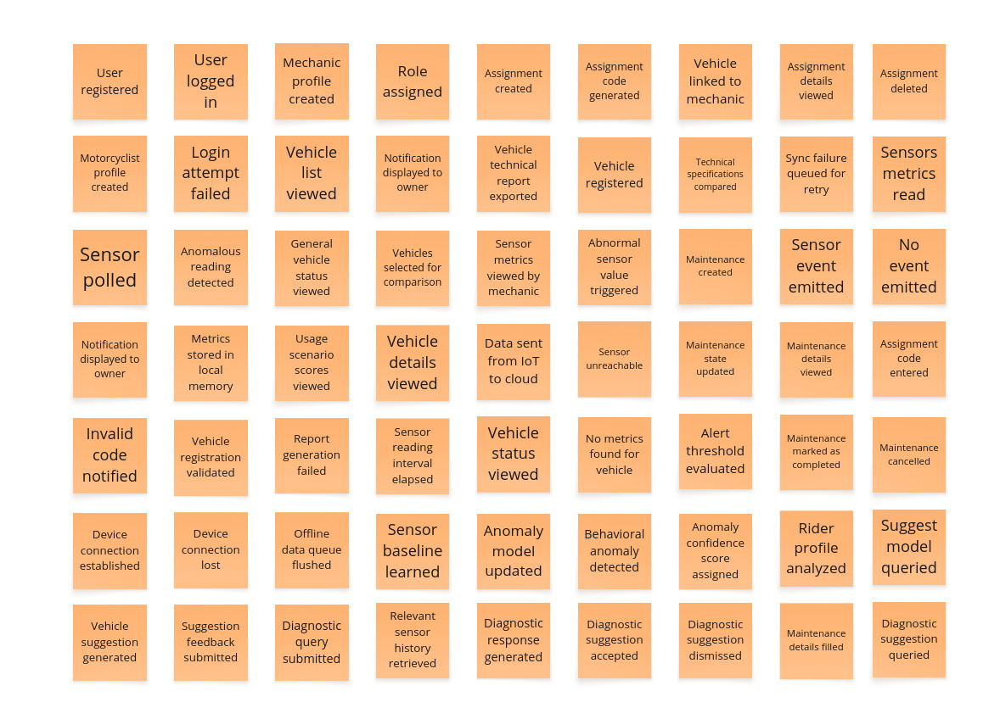

**Step 2: Timelines**

Una vez que se han identificado varios eventos, se procede a organizarlos en una línea de tiempo. Esto ayuda a visualizar la secuencia de eventos y cómo interactúan entre sí a lo largo del tiempo, permitiendo detectar dependencias y relaciones causales.

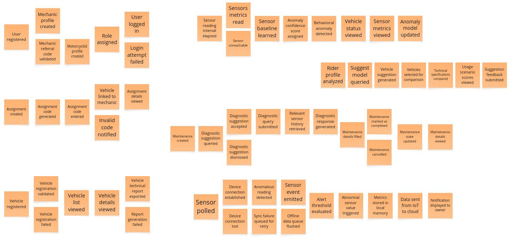

**Step 3: Pain Points**

En esta etapa, se identifican los puntos de dolor o áreas problemáticas dentro del flujo de eventos. Esto puede incluir eventos que generan confusión, áreas donde se anticipan dificultades técnicas o procesos que podrían beneficiarse de una mayor claridad o simplificación.

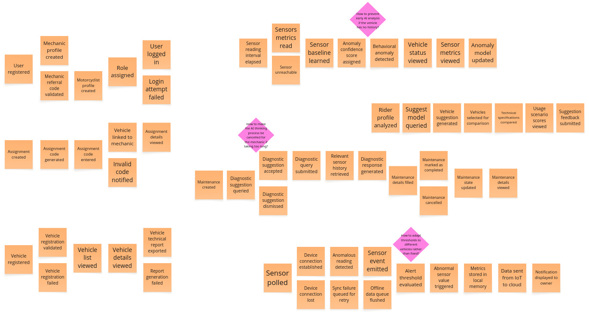

**Step 4: Pivotal Points**

Aquí se destacan los eventos clave o puntos de inflexión dentro del sistema. Estos son eventos que tienen un impacto significativo en el flujo general y pueden ser críticos para el éxito del sistema.

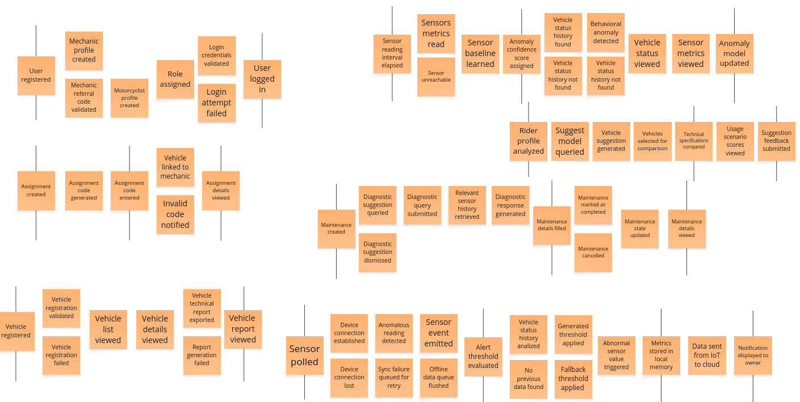

**Step 5: Commands**

Se identifican los comandos que desencadenan eventos específicos. Esto ayuda a entender qué acciones o decisiones por parte de los usuarios o del sistema provocan ciertos eventos, lo que es crucial para el diseño de la lógica de negocio.

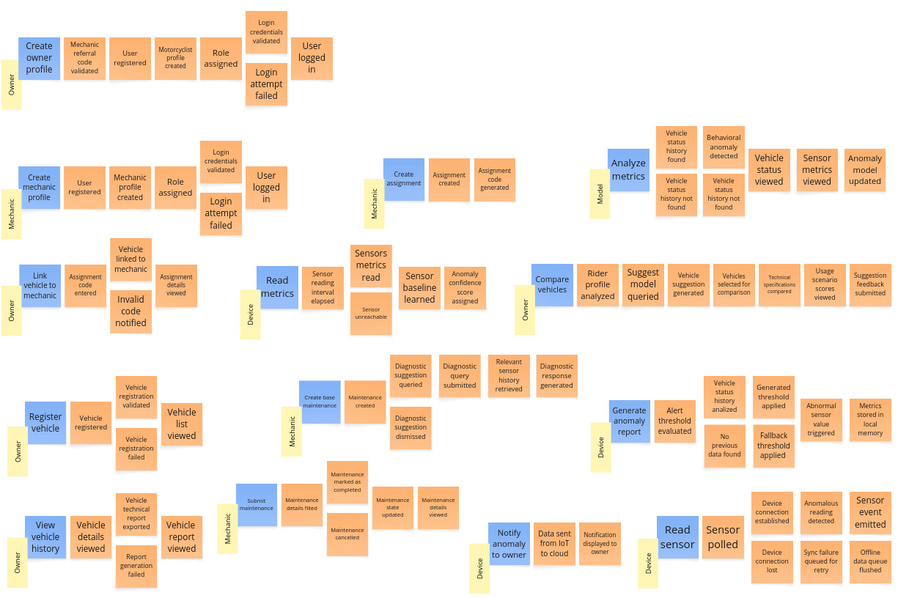

**Step 6: Policies**

Se definen políticas o reglas de negocio que permiten una automatización de ciertos procesos. Estas políticas pueden ser condiciones que deben cumplirse para que ciertos eventos ocurran o reglas que guían el comportamiento del sistema en respuesta a eventos específicos.

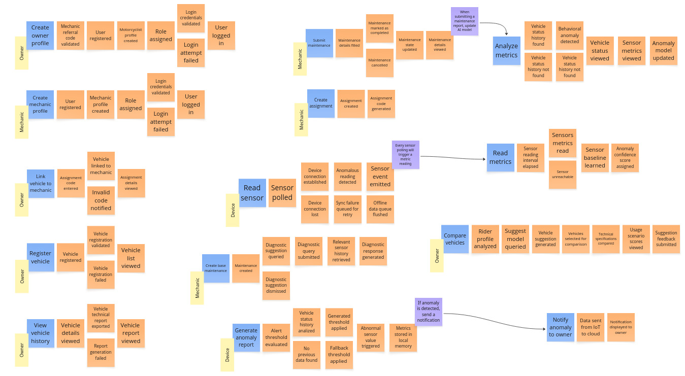

**Step 7: Read Models**

Para reconocer qué información se necesita en cada etapa del proceso, se identifican los read models o modelos de lectura. Estos modelos representan las vistas o representaciones de datos que el sistema necesita, proporcionando la información necesaria a un comando.

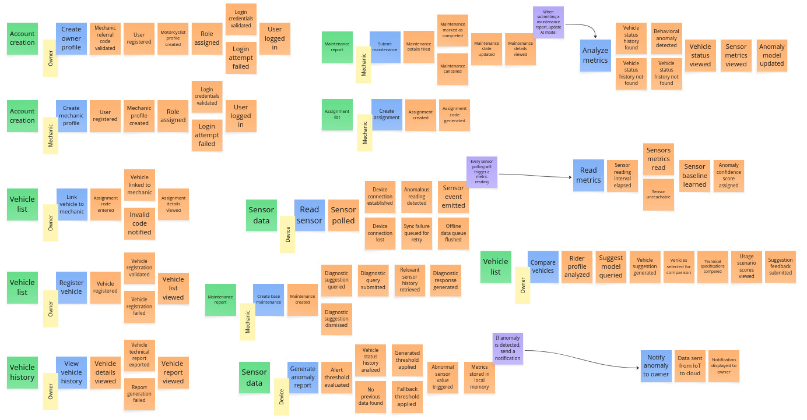

**Step 8: External Systems**

Se identifican los sistemas externos que interactúan con el sistema en cuestión. Esto es crucial para entender las dependencias externas y cómo el sistema se integra con otros sistemas o servicios.

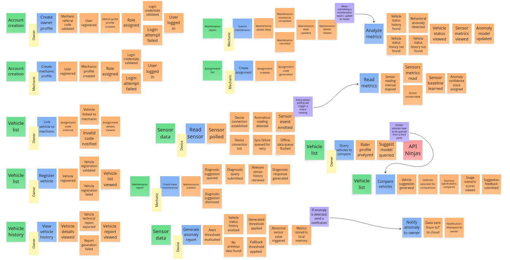

**Step 9: Aggregates**

Teniendo todos los eventos y comandos representados, se identifican los aggregates o agregados. Estos son grupos de eventos y comandos que están relacionados y pueden ser tratados como una unidad coherente dentro del dominio.

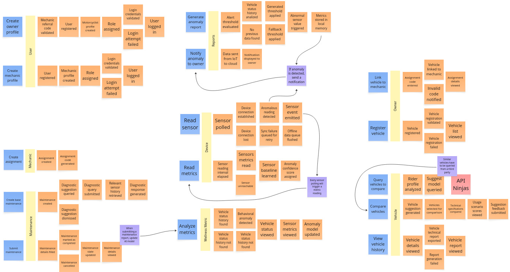

**Step 10: Bounded Contexts**

Finalmente, se identifican los bounded contexts o contextos delimitados. Estos son conjuntos de agregados que representan una funcionalidad estrechamente relacionada, lo que ayuda a definir los límites del sistema y a organizar la lógica de negocio de manera coherente.

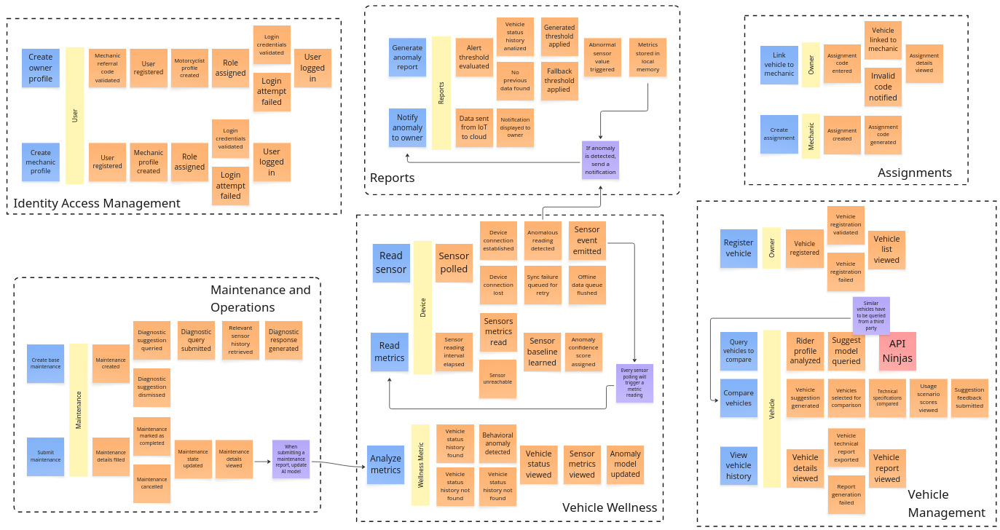

### 4.2.2. Candidate Context Discovery

En base al resultado del Event Storming, se identifican los contextos delimitados (Bounded Contexts) que representan áreas funcionales específicas dentro del dominio. Estos contextos ayudan a organizar la lógica de negocio y a definir los límites del sistema, facilitando la gestión de la complejidad.

La sesión fue organizada estratégicamente con una duración de una hora. Durante esta actividad, se listaron los posibles contextos delimitados basados en los eventos y comandos identificados en el Event Storming, y se discutieron las responsabilidades y límites de cada contexto.

Como resultado, se han aplicado las siguientes técnicas:

**Técnica 1: Start-with-value**

Esta técnica permite identificar las partes del dominio que representan el mayor valor para el negocio, diferenciando el core domain de los dominios de soporte y genéricos. Realizar una categorización requiere de diferenciar qué tan complejo es su modelo y qué tanto se diferencia del core business, siguiendo un espectro como el siguiente:

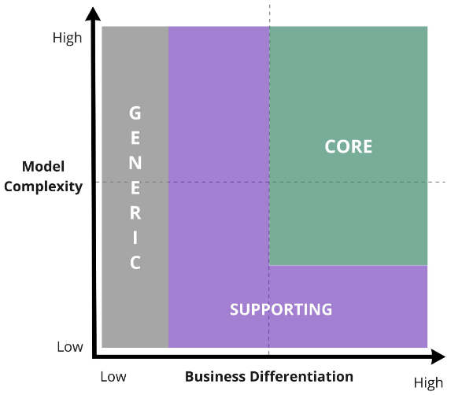

Como equipo, nosotros definimos que las áreas con mayor valor para el negocio son aquellas relacionadas con:

- Procesamiento de métricas de una motocicleta.
- Detección de anomalías en el comportamiento de la motocicleta.
- Actualización continua del modelo de análisis de vehículos.

Según nuestro análisis, los contextos fueron clasificados de la siguiente manera:

- Core Domain: Vehicle Wellness, Maintenance and Operations
- Supporting Domain: Reports, Vehicle Management, Assignments
- Generic Domain: Identity Access Management

**Técnica 2: Start-with-simple**

Esta técnica propone descomponer el Event Storming en pasos secuenciales con propósito claro, creando una línea de tiempo que permita identificar agrupaciones naturales de comportamiento. En lugar de buscar límites desde el inicio, se simplifica el flujo principal del negocio y se observan las transiciones entre etapas.

Como equipo, nosotros trazamos el flujo principal de la siguiente manera:

| Paso | Bounded Context            | Descripción del step                                                                                                                                                                                         |
|------|----------------------------|--------------------------------------------------------------------------------------------------------------------------------------------------------------------------------------------------------------|
| 1    | Identity Access Management | El usuario se registra en el sistema, crea su perfil y se asigna un rol dependiendo del proceso, y accede con sus credenciales.                                                                              |
| 2    | Vehicle Management         | El conductor registra su vehículo, consulta su historial y puede compararlo con motocicletas similares usando una API externa.                                                                               |
| 3    | Assignments                | El conductor vincula su motocicleta a un mecánico específico, quien quedará a cargo del seguimiento de ese vehículo.                                                                                         |
| 4    | Vehicle Wellness           | El dispositivo IoT instalado en la motocicleta lee los sensores continuamente, detecta anomalías y emite eventos.                                                                                            |
| 5    | Reports                    | Cuando el dispositivo desde Vehicle Wellness detecta una anomalía, el contexto presente genera un reporte, notifica al conductor con la información procesada y actualiza el modelo de análisis de métricas. |
| 6    | Maintenance and Operations | El sistema recomienda llevar el vehículo al mecánico. El mecánico realiza el mantenimiento y genera un reporte de reparación que retroalimenta el modelo de análisis de métricas.                            |

A la vez, consideramos que Maintenance and Operations no forma parte del flujo lineal principal; sin embargo representa un ciclo de retroalimentación para Vehicle Wellness: su output (reporte de reparación) es consumido por el modelo de análisis de métricas para mejorar continuamente la precisión de ésta.

**Técnica 3: Look-for-pivotal-events**

Esta técnica busca identificar los eventos del Event Storming que marcan transiciones de estado significativas en el flujo del negocio. Estos eventos pivote suelen indicar el límite natural entre dos Bounded Contexts, ya que representan momentos donde la responsabilidad del proceso cambia de una parte del dominio a otra.

Como equipo, nosotros identificamos los eventos pivote y sus contextos desde origen hasta destino de la siguiente manera:

- Registro de motocicleta: Desde Vehicle Management, pasa a Vehicle Wellness.
- Vinculación de motocicleta con un mecánico: Desde Assignments, pasa a Maintenance and Operations.
- Completado del mantenimiento: Desde Maintenance and Operations, pasa a Vehicle Wellness.

### 4.2.3. Domain Message Flows Modeling

En esta sección se modelan los flujos de mensajes entre los diferentes contextos delimitados identificados en la sección anterior. Esto permite visualizar cómo se comunican los distintos componentes del sistema, siendo los bounded contexts y los sistemas, y cómo se intercambian datos e información entre ellos.

**Enfoque de Modelado:**

Se utiliza un enfoque basado en diagramas de secuencia para representar los flujos de mensajes entre los contextos. Cada diagrama muestra las interacciones entre los contextos a través de eventos, comandos y consultas, destacando las dependencias y la dirección del flujo de información:

- Partimos del Event Storming para identificar los eventos clave que desencadenan la comunicación entre contextos.
- Seleccionamos escenarios que representan casos relevantes de interacción entre contextos
- Describimos pasos detallados de cada escenario, incluyendo los mensajes intercambiados, los actores involucrados y los comandos/eventos/peticiones que desencadenan cada mensaje.

**Primer escenario: Registro y vinculación de la motocicleta**

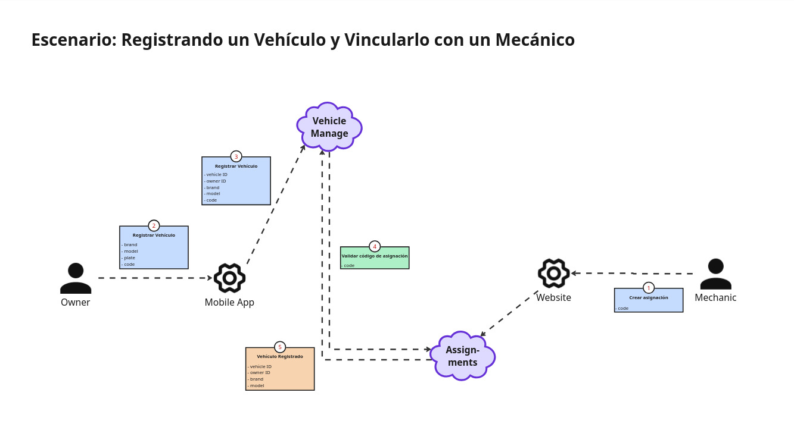

**Segundo escenario: Generación de Reporte de Mantenimiento y Retroalimentación**

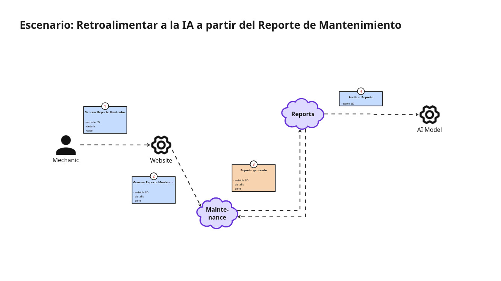

**Tercer escenario: Detección de Anomalía y Procedimiento**

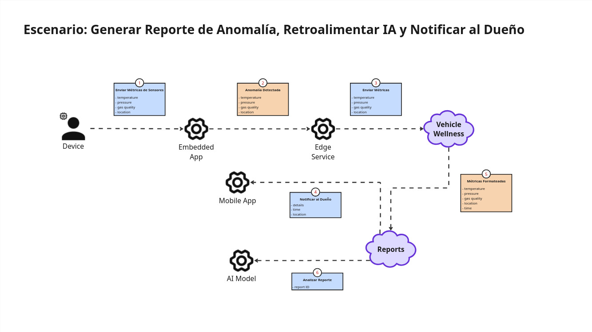

### 4.2.4. Bounded Context Canvases

**Bounded Context Canvas — Vehicle Wellness**

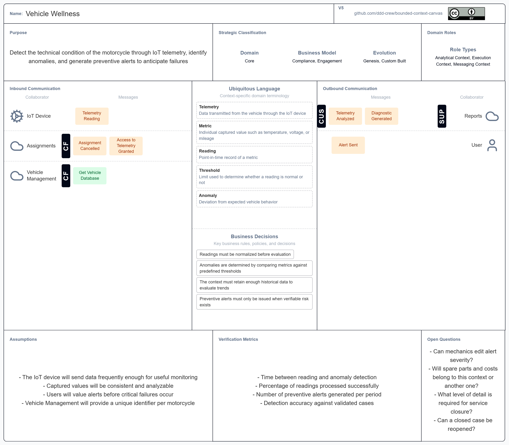

**Bounded Context Canvas — Vehicle Managment**

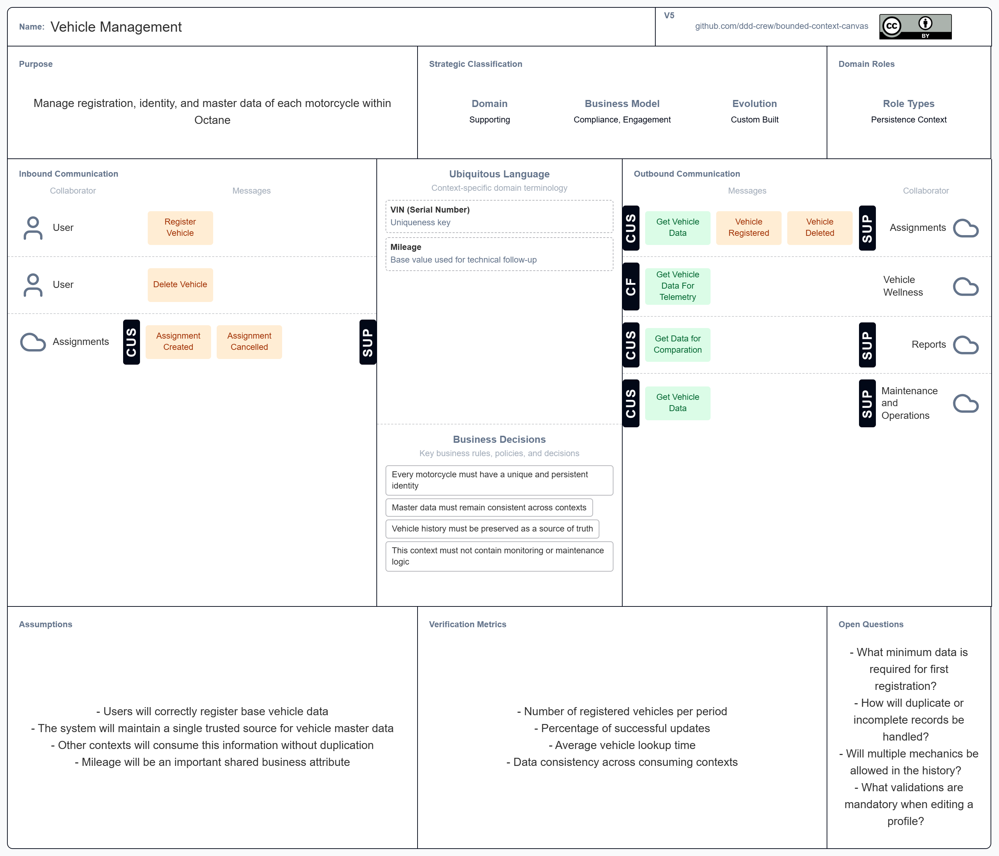

**Bounded Context Canvas — Maintenance and Operations**

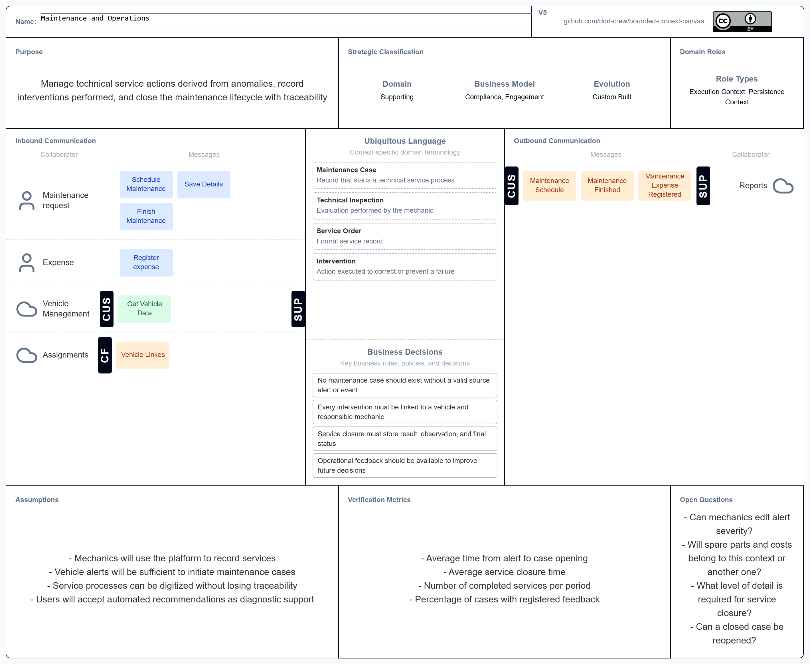

**Bounded Context Canvas — Reports**

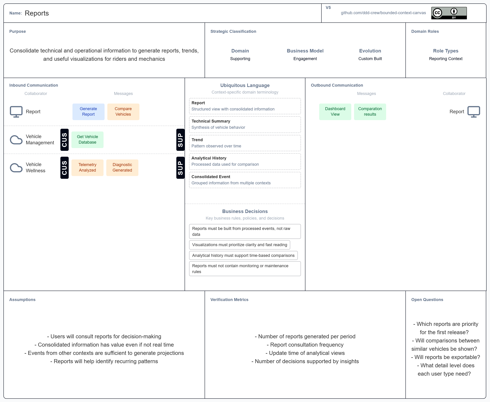

**Bounded Context Canvas — Assignments**

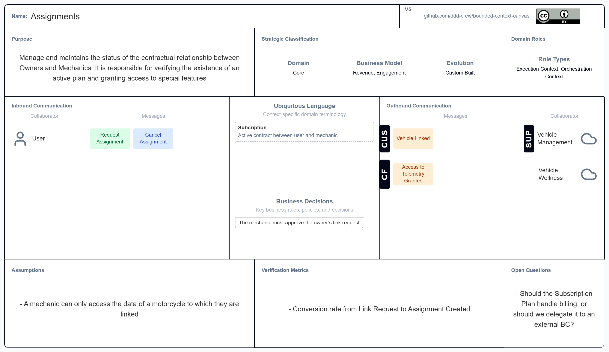

**Bounded Context Canvas — IAM**

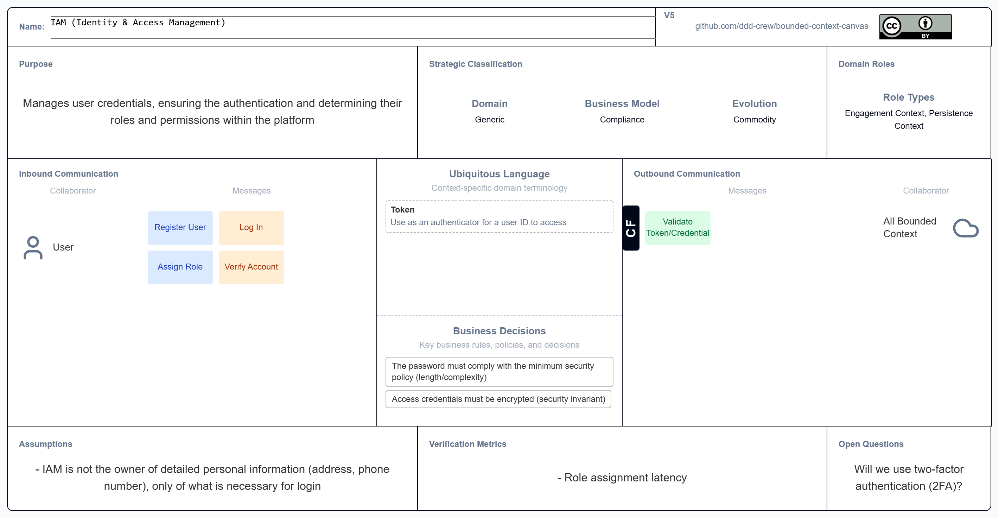

### 4.2.5. Context Mapping
En la presente sección se describen las relaciones estructurales identificadas entre los bounded contexts que conforman la solución **Octane**. Para la elaboración del context mapping se han considerado únicamente los contextos vinculados al dominio principal del negocio: **Vehicle Management**, **Assignments**, **Vehicle Wellness**, **Maintenance and Operations** y **Reports**.  

El bounded context **IAM (Identity & Access Management)** no ha sido incluido en este análisis debido a que corresponde a un **generic context**, cuya finalidad es proveer capacidades transversales de autenticación y autorización, sin intervenir directamente en la lógica central del dominio.

El objetivo del context mapping es establecer dependencias claras entre contextos, reducir el acoplamiento innecesario y definir mecanismos de colaboración coherentes con los principios de **Domain-Driven Design (DDD)**.

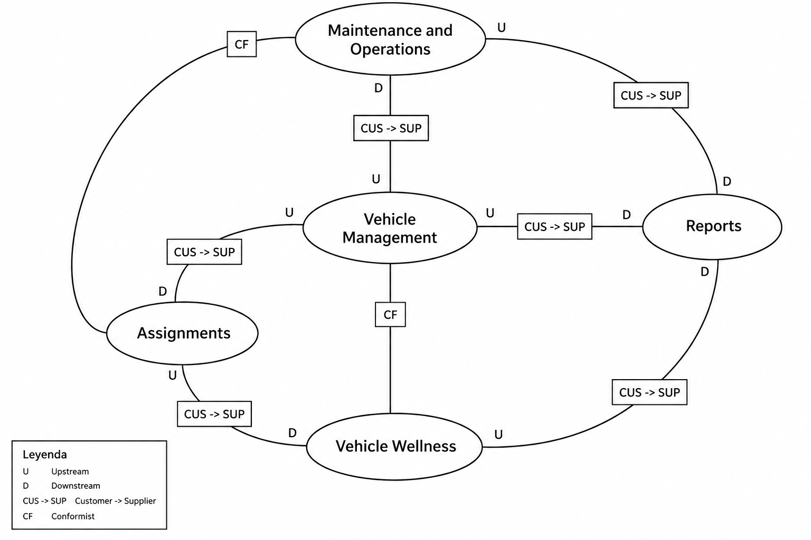

| Contexto upstream  | Contexto downstream        | Patrón de relación | Justificación                                                                                                                                                      |
|--------------------|----------------------------|--------------------|--------------------------------------------------------------------------------------------------------------------------------------------------------------------|
| Vehicle Management | Vehicle Wellness           | Conformist         | Vehicle Wellness consume los datos maestros del vehículo para interpretar correctamente la telemetría y debe adaptarse al modelo publicado por Vehicle Management. |
| Vehicle Management | Assignments                | Customer/Supplier  | Assignments depende del registro de vehículos para establecer y mantener la relación operativa entre motocicleta y mecánico.                                       |
| Vehicle Management | Maintenance and Operations | Customer/Supplier  | Maintenance and Operations requiere los datos del vehículo para programar, registrar y dar trazabilidad a los servicios de mantenimiento.                          |
| Vehicle Management | Reports                    | Customer/Supplier  | Reports consume la información maestra del vehículo para generar comparaciones, historiales y vistas consolidadas.                                                 |
| Assignments        | Vehicle Wellness           | Conformist         | Vehicle Wellness depende del estado de la asignación activa para validar el acceso a la telemetría y mantener la coherencia con la relación vehículo-mecánico.     |
| Assignments        | Maintenance and Operations | Conformist         | Maintenance and Operations usa la asignación activa como condición previa para ejecutar y validar el trabajo de mantenimiento.                                     |
| Vehicle Wellness   | Reports                    | Customer/Supplier  | Reports consume la telemetría analizada y los diagnósticos generados por Vehicle Wellness para construir paneles e indicadores.                                    |

**Context Mapping Notes**

- **Vehicle Management** actúa como fuente de verdad para la identidad y los datos maestros del vehículo.
- **Vehicle Wellness** es el contexto central de análisis de telemetría y generación de alertas.
- **Assignments** funciona como puente operativo entre la motocicleta y el mecánico.
- **Maintenance and Operations** depende de Vehicle Management y Assignments para gestionar el ciclo de mantenimiento.
- **Reports** permanece como un contexto analítico aguas abajo que consolida información de los demás contextos de negocio.

## 4.3. Software Architecture

Se define la arquitectura del sistema Octane bajo un enfoque de Monolito Modular, el cual permite una gestión centralizada del despliegue sin sacrificar la organización interna. La estructura lógica se rige por una Layered Architecture (Arquitectura de Capas) que separa las responsabilidades en Interfaces, Aplicación, Dominio e Infraestructura.

Para gestionar la complejidad del negocio de telemetría y mantenimiento, se aplica la metodología DDD (Domain-Driven Design) mediante la identificación de Bounded Contexts. Asimismo, se implementa el patrón CQRS para segregar las operaciones de lectura y escritura, optimizando el rendimiento de los datos de sensores, y una ACL (Anti-Corruption Layer) que protege el núcleo del sistema de las variaciones técnicas del hardware IoT y servicios externos. Todo esto se documenta visualmente mediante el Modelo C4, garantizando una trazabilidad técnica desde el contexto global hasta el despliegue físico.

### 4.3.1. Software Architecture System Landscape Diagram

En este nivel se describe la visión global de la organización Nodrify. El diagrama representa cómo el sistema Octane coexiste con otros sistemas internos y externos, definiendo el ecosistema completo y las interacciones de alto nivel entre los actores principales y los límites de la empresa.

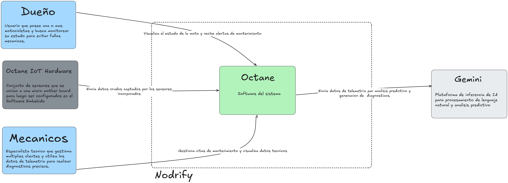

### 4.3.2. Software Architecture Context Level Diagrams

Este punto detalla el Sistema Octane como una caja negra, centrándose exclusivamente en sus fronteras inmediatas. Describe las relaciones directas de datos y comunicación entre el sistema, los usuarios (Dueños de motocicletas y Mecánicos) y las dependencias externas críticas como el hardware IoT y el motor de IA.

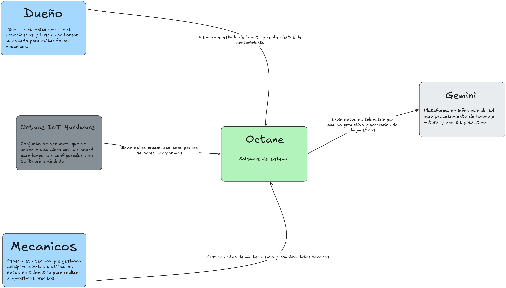

### 4.3.3. Software Architecture Container Level Diagrams

Aquí se desglosa la aplicación en sus unidades de ejecución o contenedores. Se identifican las aplicaciones móviles, la plataforma web, el API Monolítica Modular y la base de datos, especificando las tecnologías utilizadas (Spring Boot, React, Flutter, PostgreSQL) y los protocolos de comunicación entre ellos.

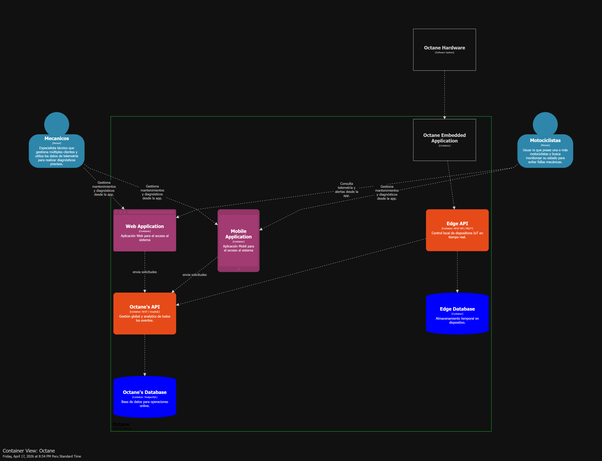

### 4.3.4. Software Architecture Deployment Diagrams

Este diagrama describe la distribución física y la infraestructura de nube de la solución. Detalla dónde se alojan los contenedores en entornos reales de producción, incluyendo el despliegue del frontend en Vercel, el backend y base de datos en Render, la distribución móvil en Firebase y el hardware embebido en el microcontrolador de la motocicleta.

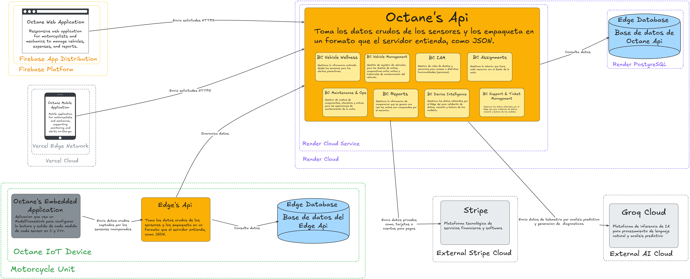

# Capítulo V: Tactical-Level Software Design

## 5.1. Bounded Context: Identity Access Management

El bounded context de Identity Access Management (IAM) se encarga de gestionar la autenticación, autorización y administración de usuarios dentro del sistema Octane. Este contexto es fundamental para garantizar la seguridad y el control de acceso a los recursos y funcionalidades de la plataforma.

### 5.1.1. Domain Layer

**Aggregates**

`User`: Agregado raíz que representa a un usuario en la plataforma. Centraliza los credenciales y el rol.

| Atributos | Tipo de dato | Visibilidad | Descripción                           |
|-----------|--------------|-------------|---------------------------------------|
| id        | Long         | Private     | Identificador único del usuario.      |
| username  | String       | Private     | Nombre de usuario para autenticación. |
| password  | String       | Private     | Contraseña cifrada del usuario.       |
| userRoles | List<Role>   | Private     | Lista de roles asignados al usuario.  |

`Profile`: Agregado que representa el perfil de un usuario, con información personal.

| Atributos    | Tipo de dato | Visibilidad | Descripción                           |
|--------------|--------------|-------------|---------------------------------------|
| id           | Long         | Private     | Identificador único del perfil.       |
| firstName    | String       | Private     | Nombre del usuario.                   |
| lastName     | String       | Private     | Apellido del usuario.                 |
| emailAddress | EmailAddress | Private     | Correo electrónico del usuario.       |
| photoUrl     | String       | Private     | URL de la foto de perfil del usuario. |
| userId       | UserId       | Private     | Identificador del usuario asociado.   |

**Entities**

`Role`: Entidad que representa un rol dentro del sistema, definiendo permisos y niveles de acceso.

| Atributos | Tipo de dato | Visibilidad | Descripción                         |
|-----------|--------------|-------------|-------------------------------------|
| id        | Long         | Private     | Identificador único del rol.        |
| name      | String       | Private     | Nombre del rol (e.g., ADMIN, USER). |

**Value Objects**

`Roles` (Enum): Define los roles dentro del sistema que se pueden asignar a los usuarios.

- ROLE_ADMIN
- ROLE_MECHANIC
- ROLE_OWNER

`EmailAddress` (Record): Representa una dirección de correo electrónico siguiendo el formato correcto.

`UserId` (Record): Representa un identificador de usuario.

**Commands**

- `CreateUserCommand`: Comando para crear un nuevo usuario en el sistema, incluyendo su perfil y rol.
- `DeleteUserCommand`: Comando para eliminar un usuario existente del sistema.
- `SeedRolesCommand`: Comando para inicializar los roles predefinidos en el sistema.
- `SignInCommand`: Comando para autenticar a un usuario y generar un token de acceso.
- `SignUpCommand`: Comando para registrar a un nuevo usuario con sus credenciales y perfil.
- `UpdateUserCommand`: Comando para actualizar la información de un usuario existente.
- `CreateProfileCommand`: Comando para crear el perfil de un usuario.

**Queries**

- `GetAllRolesQuery`: Consulta para obtener la lista de todos los roles disponibles en el sistema.
- `GetAllUsersQuery`: Consulta para obtener la lista de todos los usuarios registrados en el sistema.
- `GetUserByIdQuery`: Consulta para obtener la información de un usuario específico por su identificador.
- `GetUserByUsernameQuery`: Consulta para obtener la información de un usuario específico por su nombre de usuario.
- `GetProfileByEmailQuery`: Consulta para obtener el perfil de un usuario específico por su correo electrónico.
- `GetProfileByIdQuery`: Consulta para obtener el perfil de un usuario específico por su identificador.
- `GetProfileByUserId`: Consulta para obtener el perfil de un usuario específico por su identificador de usuario.
- `GetProfileByUsernameQuery`: Consulta para obtener el perfil de un usuario específico por su nombre de usuario.

**Services**

- `RoleCommandService`
  - handle(SeedRolesCommand)
- `RoleQueryService`
  - handle(GetAllRolesQuery)
- `UserCommandService`
  - handle(DeleteUserCommand)
  - handle(SignInCommand)
  - handle(SignUpCommand)
  - handle(UpdateUserCommand)
- `UserQueryService`
  - handle(GetAllUsersQuery)
  - handle(GetUserByIdQuery)
  - handle(GetUserByUsernameQuery)
- `ProfileCommandService`
  - handle(CreateProfileCommand)
- `ProfileQueryService`
  - handle(GetProfileByEmailQuery)
  - handle(GetProfileByIdQuery)
  - handle(GetProfileByUserId)
  - handle(GetProfileByUsernameQuery)

### 5.1.2. Interface Layer

**Controladores**

`AuthenticationController`: Controlador REST encargado de exponer los endpoints para autenticación y registro de usuarios en la plataforma.

| Método                 | Ruta                                | Descripción                                                                                   |
|------------------------|-------------------------------------|-----------------------------------------------------------------------------------------------|
| signIn(SignInResource) | POST /api/v1/authentication/sign-in | Autentica a un usuario en el sistema y devuelve un token JWT junto con su información básica. |
| signUp(SignUpResource) | POST /api/v1/authentication/sign-up | Registra un nuevo usuario en la plataforma con credenciales y rol inicial.                    |

`RolesController`: Controlador REST encargado de exponer los endpoints para la gestión de roles dentro del sistema.

| Método        | Ruta              | Descripción                                      |
|---------------|-------------------|--------------------------------------------------|
| getAllRoles() | GET /api/v1/roles | Lista todos los roles disponibles en el sistema. |

`UsersController`: Controlador REST encargado de exponer los endpoints para la gestión de usuarios dentro del sistema.

| Método                         | Ruta                                  | Descripción                                                  |
|--------------------------------|---------------------------------------|--------------------------------------------------------------|
| updateUser(UpdateUserResource) | PUT /api/v1/users/{userId}            | Actualiza la información de un usuario existente.            |
| deleteUser(Long)               | DELETE /api/v1/users/{userId}         | Elimina un usuario del sistema.                              |
| getUserById(Long)              | GET /api/v1/users/{userId}            | Obtiene los detalles de un usuario por su ID.                |
| getAllUsers()                  | GET /api/v1/users                     | Lista todos los usuarios registrados en el sistema.          |
| getUserByUsername(String)      | GET /api/v1/users/username/{username} | Obtiene los detalles de un usuario por su nombre de usuario. |

`ProfilesController`: Controlador REST encargado de exponer los endpoints para la gestión de perfiles de usuario dentro del sistema.

| Método                                | Ruta                               | Descripción                                                       |
|---------------------------------------|------------------------------------|-------------------------------------------------------------------|
| getProfileById(Long)                  | GET /api/v1/profiles/{profileId}   | Obtiene los detalles de un perfil por su ID.                      |
| getProfileByEmail(String)             | GET /api/v1/profiles/email/{email} | Obtiene los detalles de un perfil por su correo electrónico.      |
| getProfileByUserId(Long)              | GET /api/v1/profiles/user/{userId} | Obtiene los detalles de un perfil por el ID del usuario asociado. |
| getProfileByAuthenticatedUser(String) | GET /api/v1/profiles/user          | Obtiene los detalles del perfil del usuario autenticado.          |

**ACL**

`IamContextFacade`: Proporciona una interfaz para que otros contextos interactúen con la gestión de identidades.

- fetchUserById(Long)
- fetchUserByUsername(String)

`ProfileContextFacade`: Proporciona una interfaz para que otros contextos interactúen con el perfil de usuario.

- createProfile(String, String, String, String, Long)
- getProfileIdByUserId(Long)

### 5.1.3. Application Layer

**Servicios de Comando**

`UserCommandServiceImpl`

| Método                    | Descripción                                                         |
|---------------------------|---------------------------------------------------------------------|
| handle(UpdateUserCommand) | Actualiza la información de un usuario existente en el sistema.     |
| handle(DeleteUserCommand) | Elimina un usuario del sistema.                                     |
| handle(SignInCommand)     | Autentica a un usuario y genera un token de acceso.                 |
| handle(SignUpCommand)     | Registra un nuevo usuario en el sistema con sus credenciales y rol. |

`RoleCommandServiceImpl`

| Método                   | Descripción                                      |
|--------------------------|--------------------------------------------------|
| handle(SeedRolesCommand) | Inicializa los roles predefinidos en el sistema. |

`ProfileCommandServiceImpl`

| Método                       | Descripción                                                    |
|------------------------------|----------------------------------------------------------------|
| handle(CreateProfileCommand) | Crea el perfil de un usuario con la información proporcionada. |

**Servicios de Consulta**

`UserQueryServiceImpl`

| Método                         | Descripción                                                             |
|--------------------------------|-------------------------------------------------------------------------|
| handle(GetAllUsersQuery)       | Obtiene la lista de todos los usuarios registrados en el sistema.       |
| handle(GetUserByIdQuery)       | Obtiene los detalles de un usuario específico por su ID.                |
| handle(GetUserByUsernameQuery) | Obtiene los detalles de un usuario específico por su nombre de usuario. |

`RoleQueryServiceImpl`

| Método                   | Descripción                                                    |
|--------------------------|----------------------------------------------------------------|
| handle(GetAllRolesQuery) | Obtiene la lista de todos los roles disponibles en el sistema. |

`ProfileQueryServiceImpl`

| Método                            | Descripción                                                                  |
|-----------------------------------|------------------------------------------------------------------------------|
| handle(GetProfileByIdQuery)       | Obtiene los detalles de un perfil específico por su ID.                      |
| handle(GetProfileByEmailQuery)    | Obtiene los detalles de un perfil específico por su correo electrónico.      |
| handle(GetProfileByUserId)        | Obtiene los detalles de un perfil específico por el ID del usuario asociado. |
| handle(GetProfileByUsernameQuery) | Obtiene los detalles de un perfil específico por su nombre de usuario.       |

**Controladores de Eventos**

`ApplicationReadyEventHandler`: Controlador de eventos que escucha el evento de arranque de la aplicación para ejecutar tareas de inicialización, como la siembra de roles predefinidos.

| Evento                                    | Descripción                                                                            |
|-------------------------------------------|----------------------------------------------------------------------------------------|
| onApplicationReady(ApplicationReadyEvent) | Escucha el evento de arranque de la aplicación para ejecutar tareas de inicialización. |

**Servicios Salientes**

`HashingService`: Proporciona funcionalidades de hashing para la gestión segura de contraseñas.

| Método                        | Descripción                                                      |
|-------------------------------|------------------------------------------------------------------|
| encode(CharSequence)          | Codifica una cadena de texto utilizando un algoritmo de hashing. |
| matches(CharSequence, String) | Verifica si una cadena de texto coincide con un hash codificado. |

`TokenService`: Proporciona funcionalidades para la generación y validación de tokens de acceso.

| Método                       | Descripción                                              |
|------------------------------|----------------------------------------------------------|
| generateToken(String)        | Genera un token de acceso para un usuario autenticado.   |
| getUserNameFromToken(String) | Extrae el nombre de usuario de un token de acceso.       |
| validateToken(String)        | Valida la autenticidad y vigencia de un token de acceso. |

### 5.1.4. Infrastructure Layer

**Repositorios**

`UserRepository`: Interfaz que define las operaciones de persistencia para la entidad User.

| Método                   | Descripción                                             |
|--------------------------|---------------------------------------------------------|
| findByUsername(String)   | Busca un usuario por su nombre de usuario.              |
| existsByUsername(String) | Verifica si un usuario existe por su nombre de usuario. |

`RoleRepository`: Interfaz que define las operaciones de persistencia para la entidad Role.

| Método                | Descripción                                 |
|-----------------------|---------------------------------------------|
| findByName(String)    | Busca un rol por su nombre.                 |
| existsByName(String)  | Verifica si un rol existe por su nombre.    |

`ProfileRepository`: Interfaz que define las operaciones de persistencia para la entidad Profile.

| Método                       | Descripción                                                          |
|------------------------------|----------------------------------------------------------------------|
| findByEmailAddress(String)   | Busca un perfil por su dirección de correo electrónico.              |
| findByUserId(Long)           | Busca un perfil por el ID del usuario asociado.                      |
| existsByEmailAddress(String) | Verifica si un perfil existe por su dirección de correo electrónico. |

### 5.1.5. Bounded Context Software Architecture Component Level Diagrams

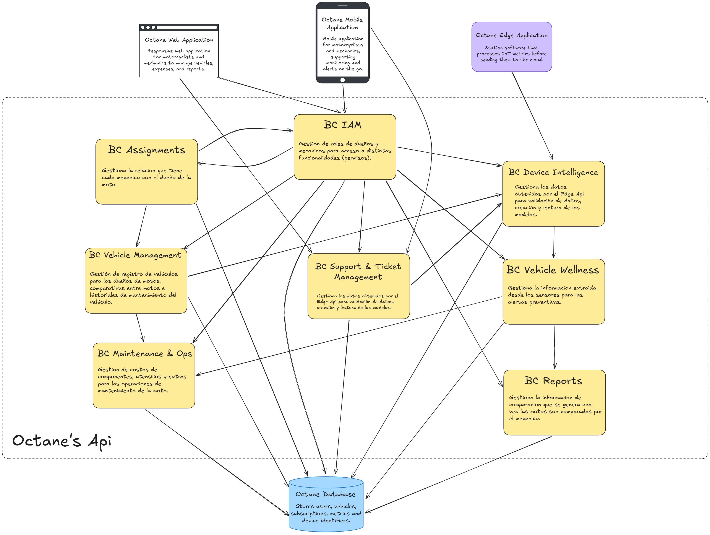

### 5.1.6. Bounded Context Software Architecture Code Level Diagrams

Se describen los diagramas que representan la estructura interna del contexto de IAM, incluyendo las clases, interfaces, servicios y repositorios que lo componen. Este bounded context incluye ambos IAM para la autenticación de usuarios y profiles para los perfiles de cada usuario.

#### 5.1.6.1. Bounded Context Domain Layer Class Diagrams

El siguiente diagrama muestra las clases principales del dominio de IAM, incluyendo User y Role, así como sus relaciones y atributos clave.Add a comment on  line R2074Add diff commentMarkdown input:  edit mode selected.WritePreviewHeadingBoldItalicQuoteCodeLinkUnordered listNumbered listTask listMentionReferenceSaved repliesAdd FilesPaste, drop, or click to add filesCancelCommentStart a review

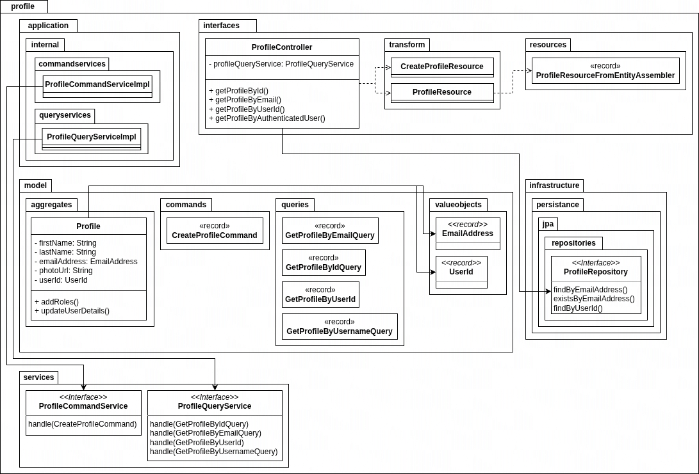

Además, el siguiente diagrama muestra las clases principales del dominio de Profiles, incluyendo Profile y su relación con User.

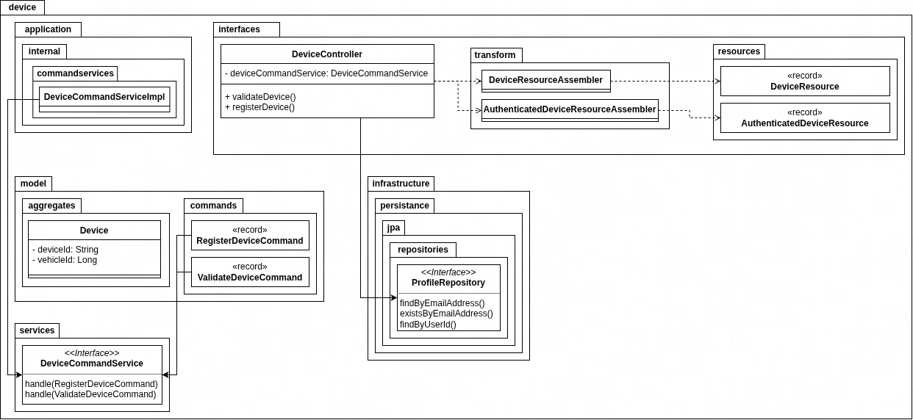

#### 5.1.6.2. Bounded Context Database Design Diagram

El siguiente diagrama muestra el diseño de la base de datos para el contexto de IAM, incluyendo las tablas User, Role y Profile, así como sus relaciones y claves primarias/foráneas.

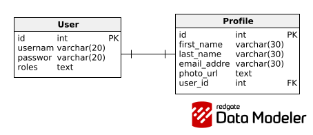

## 5.2. Bounded Context: Reports
El bounded context Reports en Octane se encarga de consolidar la información dispersa de otros contextos del sistema para ofrecer una vista unificada del vehículo. Su objetivo no es administrar datos propios, sino componer, consultar y exportar información relevante para el análisis operativo de una motocicleta: datos del vehículo, historial de mantenimientos y asignación vigente con su mecánico y propietario.

### 5.2.1. Domain Layer

El dominio de Reports está centrado en el agregado principal `Report`, que agrupa la información de un reporte específico de un vehículo. Este agregado contiene la lista de métricas que lo conforman y la fecha de generación del reporte. Además, el contexto define entidades especializadas para representar las métricas y sus tipos.

**Aggregates**

`Report`

**Descripción:** Representa un reporte consolidado asociado a un vehículo. Contiene la información del vehículo, las métricas agrupadas en el reporte y la fecha de generación.

| Atributo   | Tipo de dato | Visibilidad | Descripción                                     |
|------------|--------------|-------------|-------------------------------------------------|
| reportId   | Long         | Private     | Identificador único del reporte.                |
| vehicleId  | Long         | Private     | Identificador del vehículo asociado al reporte. |
| metrics    | List<Metric> | Private     | Lista de métricas asociadas al reporte.         |
| reportDate | Date         | Private     | Fecha en la que se generó el reporte.           |

**Entities**

`Metric`

**Descripción:** Representa una métrica incluida dentro de un reporte. Puede ser una medición numérica o descriptiva relacionada con el estado del vehículo.

| Atributo    | Tipo de dato | Visibilidad | Descripción                         |
|-------------|--------------|-------------|-------------------------------------|
| metricId    | Long         | Private     | Identificador único de la métrica.  |
| type        | MetricType   | Private     | Tipo de métrica asociada.           |
| metricValue | String       | Private     | Valor registrado para esta métrica. |

`MetricType`

**Descripción:** Define el tipo de una métrica, por ejemplo kilometraje, estado del aceite o temperatura.

| Atributo          | Tipo de dato | Visibilidad | Descripción                              |
|-------------------|--------------|-------------|------------------------------------------|
| metricTypeId      | Long         | Private     | Identificador único del tipo de métrica. |
| metricName        | String       | Private     | Nombre del tipo de métrica.              |
| metricDescription | String       | Private     | Descripción del tipo de métrica.         |

**Queries**

`GetReportByIdQuery <<record>>`

**Descripción:** Obtiene un reporte específico mediante su identificador único.

| Atributo | Tipo de dato | Descripción                            |
|----------|--------------|----------------------------------------|
| reportId | Long         | Identificador del reporte a consultar. |

`GetReportByVehicleIdQuery <<record>>`

**Descripción:** Obtiene todos los reportes asociados a un vehículo específico.

| Atributo  | Tipo de dato | Descripción                                                  |
|-----------|--------------|--------------------------------------------------------------|
| vehicleId | Long         | Identificador del vehículo cuyos reportes se desean obtener. |

`GetMetricsByReportIdQuery <<record>>`

**Descripción:** Obtiene todas las métricas pertenecientes a un reporte.

| Atributo | Tipo de dato | Descripción                                                 |
|----------|--------------|-------------------------------------------------------------|
| reportId | Long         | Identificador del reporte cuyas métricas serán recuperadas. |

**Services**

`ReportQueryService` (Interface)

* `handle(GetReportByIdQuery)`
* `handle(GetReportByVehicleIdQuery)`
* `handle(GetMetricsByReportIdQuery)`

Este servicio define la puerta de entrada de consultas del bounded context y permite recuperar reportes y métricas desde la capa de persistencia.

### 5.2.2. Interface Layer

**Rest Controllers**

`ReportController`

**Descripción:** Controlador REST encargado de manejar las peticiones asociadas a la obtención de reportes y sus métricas.

| Método                  | Ruta                                    | Descripción                                         |
|-------------------------|-----------------------------------------|-----------------------------------------------------|
| getReportById           | GET /api/v1/reports/{reportId}          | Obtiene un reporte por su identificador único.      |
| getAllReportsForVehicle | GET /api/v1/reports/vehicle/{vehicleId} | Obtiene todos los reportes asociados a un vehículo. |
| getAllMetricsFromReport | GET /api/v1/reports/{reportId}/metrics  | Obtiene todas las métricas asociadas a un reporte.  |

**Resources**

`ReportResource <<class>>`

**Descripción:** Representa la estructura de datos expuesta por la API para describir un reporte consolidado.

| Atributo   | Tipo de dato | Descripción                                     |
|------------|--------------|-------------------------------------------------|
| reportId   | Long         | Identificador único del reporte.                |
| vehicleId  | Long         | Identificador del vehículo asociado al reporte. |
| reportDate | Date         | Fecha de generación del reporte.                |
| metrics    | List<Metric> | Lista de métricas asociadas al reporte.         |

**Assemblers**

`ReportResourceFromEntityAssembler`

**Descripción:** Ensamblador encargado de transformar una entidad `Report` del dominio en un recurso REST `ReportResource`.

| Método                    | Descripción                                                      |
|---------------------------|------------------------------------------------------------------|
| fromEntity(Report report) | Transforma una entidad del agregado `Report` en un recurso REST. |

### 5.2.3. Application Layer

`ReportQueryServiceImpl`

**Descripción:** Implementación del servicio de consultas `ReportQueryService`, responsable de recuperar reportes y métricas desde la capa de persistencia mediante consultas especializadas.

| Método                            | Descripción                                                        |
|-----------------------------------|--------------------------------------------------------------------|
| handle(GetReportByIdQuery)        | Obtiene un reporte por su identificador único.                     |
| handle(GetReportByVehicleIdQuery) | Obtiene todos los reportes asociados a un vehículo por su id.      |
| handle(GetMetricsByReportIdQuery) | Obtiene todas las métricas relacionadas con un reporte específico. |

**Comportamiento observado en la implementación heredada**

- El servicio consulta el repositorio de reportes para recuperar entidades persistidas.
- La recuperación por vehículo retorna una colección de reportes asociados a ese vehículo.
- La consulta de métricas se resuelve a partir del reporte recuperado.
- Al iniciar la aplicación, se ejecuta un `ApplicationReadyEventHandler` para sembrar los tipos de métricas si la base de datos está vacía.

`ApplicationReadyEventHandler`

**Descripción:** Componente ejecutado automáticamente al iniciar la aplicación. Se encarga de inicializar el sistema con valores por defecto para los tipos de métricas.

| Método                                    | Descripción                                                                           |
|-------------------------------------------|---------------------------------------------------------------------------------------|
| onApplicationEvent(ApplicationReadyEvent) | Registra valores iniciales para los tipos de métricas si la base de datos está vacía. |
| currentTimestamp()                        | Devuelve el timestamp actual para propósitos de registro en logs.                     |

### 5.2.4. Infrastructure Layer

**Repositories**

`ReportRepository`

**Descripción:** Repositorio JPA encargado de las operaciones de persistencia del agregado `Report`.

| Método                          | Tipo de retorno | Descripción                                                    |
|---------------------------------|-----------------|----------------------------------------------------------------|
| findByVehicleId(Long vehicleId) | List<Report>    | Recupera todos los reportes asociados a un vehículo por su id. |

`MetricTypeRepository`

**Descripción:** Repositorio JPA utilizado para gestionar la persistencia de los tipos de métricas (`MetricType`).

| Método                          | Tipo de retorno | Descripción                                                    |
|---------------------------------|-----------------|----------------------------------------------------------------|
| Hereda métodos de JpaRepository | Varía           | Permite realizar operaciones CRUD sobre los tipos de métricas. |

**Rol arquitectónico**

Reports funciona como un bounded context de consulta con persistencia propia. No depende de otros contextos para construir su dominio central; más bien, centraliza la persistencia y exposición de reportes ya calculados y sus métricas asociadas.

### 5.2.5. Bounded Context Software Architecture Component Level Diagrams

### 5.2.6. Bounded Context Software Architecture Code Level Diagrams

#### 5.2.6.1. Bounded Context Domain Layer Class Diagrams

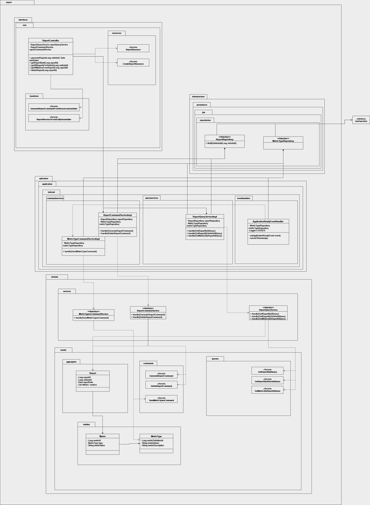

#### 5.2.6.2. Bounded Context Database Design Diagram

## 5.3. Bounded Context: Assignments

El bounded context **Assignments** administra la relación entre un propietario, un mecánico y una asignación. En Octane, este contexto es clave para formalizar quién atiende una motocicleta, bajo qué estado se encuentra la relación y qué tipo de vinculación existe entre ambas partes.

### 5.3.1. Domain Layer

**Aggregates**

`Assignment`

**Descripción:** Agregado raíz que representa la asignación de un propietario a un mecánico. Centraliza el estado, el tipo y el código único de la asignación.

| Atributos      | Tipo de dato     | Visibilidad | Descripción                                                                                    |
|----------------|------------------|-------------|------------------------------------------------------------------------------------------------|
| id             | Long             | Private     | Identificador único de la asignación.                                                          |
| ownerId        | Long             | Private     | Identificador del propietario vinculado. Puede ser nulo mientras la asignación está pendiente. |
| mechanic       | Mechanic         | Private     | Mecánico responsable de la asignación.                                                         |
| status         | AssignmentStatus | Private     | Estado de la asignación.                                                                       |
| type           | AssignmentType   | Private     | Tipo funcional de la asignación.                                                               |
| assignmentCode | AssignmentCode   | Private     | Código único usado para identificar y reclamar la asignación.                                  |

`Mechanic`

**Descripción:** Agregado raíz que representa al mecánico registrado en el sistema. Agrupa su perfil, sus asignaciones y su membresía.

| Atributos      | Tipo de dato     | Visibilidad | Descripción                                     |
|----------------|------------------|-------------|-------------------------------------------------|
| id             | Long             | Private     | Identificador único del mecánico.               |
| profile        | Profile          | Private     | Perfil base asociado al mecánico.               |
| assignments    | List<Assignment> | Private     | Lista de asignaciones relacionadas al mecánico. |
| membershipType | MembershipType   | Private     | Nivel de membresía del mecánico.                |

**Value Objects**

`AssignmentCode`

**Descripción:** Valor embebido que garantiza un código alfanumérico único de 9 caracteres para una asignación.

| Atributo | Tipo de dato | Visibilidad | Descripción              |
|----------|--------------|-------------|--------------------------|
| code     | String       | Private     | Código de la asignación. |

`AssignmentStatus`

**Descripción:** Estado de una asignación.

Valores: `ACTIVE`, `PENDING`, `CANCELLED`

`AssignmentType`

**Descripción:** Tipo de asignación funcional.

Valores: `UNCATEGORIZED`, `REGULAR`, `FREQUENT`, `BUSINESS`

`MembershipType`

**Descripción:** Nivel de membresía del mecánico.

Valores: `BRONZE`, `SILVER`, `BLACK`

**Commands**

* `CreateAssignmentCommand <<record>>`
* `UpdateAssignmentStatusCommand <<record>>`
* `UpdateAssignmentTypeCommand <<record>>`
* `AssignOwnerToAssignmentCommand <<record>>`
* `DeleteAssignmentCommand <<record>>`
* `CreateMechanicCommand <<record>>`
* `UpdateMechanicMembershipTypeCommand <<record>>`

**Queries**

* `GetAssignmentByOwnerIdQuery <<record>>`
* `GetAssignmentsByMechanicIdAndStatusQuery <<record>>`
* `GetAssignmentByIdQuery <<record>>`
* `GetAssigmentByCodeQuery <<record>>`
* `GetAssignmentByVehicleIdQuery <<record>>`
* `GetMechanicByIdQuery <<record>>`

**Services**

`AssignmentCommandService`

* `handle(CreateAssignmentCommand)`
* `handle(UpdateAssignmentStatusCommand)`
* `handle(UpdateAssignmentTypeCommand)`
* `handle(AssignOwnerToAssignmentCommand)`
* `handle(DeleteAssignmentCommand)`

`AssignmentQueryService`

* `handle(GetAssignmentByOwnerIdQuery)`
* `handle(GetAssignmentsByMechanicIdAndStatusQuery)`
* `handle(GetAssignmentByIdQuery)`
* `handle(GetAssigmentByCodeQuery)`
* `handle(GetAssignmentByVehicleIdQuery)`

`MechanicCommandService`

* `handle(CreateMechanicCommand)`
* `handle(UpdateMechanicMembershipTypeCommand)`

`MechanicQueryService`

* `handle(GetMechanicByIdQuery)`

### 5.3.2. Interface Layer

La capa de interfaz expone varias rutas REST porque Assignments resuelve distintos flujos de negocio: administración general de asignaciones, consulta por mecánico, consulta por owner y gestión de membresía del mecánico.

**Rest Controllers**

`AssignmentController`

**Descripción:** Controlador principal para administrar asignaciones.

| Método                    | Ruta                                                                   | Descripción                                    |
|---------------------------|------------------------------------------------------------------------|------------------------------------------------|
| updateAssignmentStatus()  | PATCH /api/v1/assignments/{assignmentId}/status                        | Actualiza el estado de una asignación.         |
| updateAssignmentType()    | PATCH /api/v1/assignments/{assignmentId}/type                          | Actualiza el tipo de una asignación.           |
| getAssignmentById()       | GET /api/v1/assignments/{assignmentId}                                 | Recupera una asignación por su ID.             |
| assignOwnerToAssignment() | PATCH /api/v1/assignments/code/{assignmentCode}/assign-owner/{ownerId} | Reclama una asignación y la asocia a un owner. |
| deleteAssignment()        | DELETE /api/v1/assignments/{assignmentId}                              | Elimina una asignación pendiente.              |
| getAssignmentByCode()     | GET /api/v1/assignments/code/{assignmentCode}                          | Recupera una asignación por su código.         |

`MechanicController`

**Descripción:** Controlador para gestionar información del mecánico.

| Método                         | Ruta                                         | Descripción                                                            |
|--------------------------------|----------------------------------------------|------------------------------------------------------------------------|
| getOwnersForMechanic()         | GET /api/v1/mechanic/{mechanicId}/owners     | Devuelve los owners activos asociados a las asignaciones del mecánico. |
| updateMechanicMembershipType() | PUT /api/v1/mechanic/{mechanicId}/membership | Actualiza el nivel de membresía del mecánico.                          |

`MechanicAssigmentController`

**Descripción:** Controlador de apoyo para listar y crear asignaciones desde la perspectiva del mecánico.

| Método             | Ruta                                                   | Descripción                                               |
|--------------------|--------------------------------------------------------|-----------------------------------------------------------|
| getAssignments()   | GET /api/v1/mechanic/{mechanicId}/assignments/{status} | Lista las asignaciones del mecánico filtradas por estado. |
| createAssignment() | POST /api/v1/mechanic/{mechanicId}/assignments         | Crea una nueva asignación asociada al mecánico.           |

`OwnerAssigmentController`

**Descripción:** Controlador de apoyo para consultar la asignación vigente de un owner.

| Método          | Ruta                                   | Descripción                                     |
|-----------------|----------------------------------------|-------------------------------------------------|
| getAssignment() | GET /api/v1/owner/{ownerId}/assignment | Obtiene la asignación activa asociada al owner. |

**Resources**

`AssignmentResource <<record>>`

**Descripción:** Recurso de salida que representa una asignación ya enriquecida con owner y mecánico.

| Campo          | Tipo de dato     | Descripción                                          |
|----------------|------------------|------------------------------------------------------|
| id             | Long             | Identificador de la asignación.                      |
| owner          | OwnerResource    | Información del propietario, cuando está disponible. |
| mechanic       | MechanicResource | Información del mecánico asociado.                   |
| type           | String           | Tipo de asignación.                                  |
| status         | String           | Estado de la asignación.                             |
| assignmentCode | String           | Código único de la asignación.                       |
| createdAt      | Date             | Fecha de creación del registro.                      |

`MechanicResource <<record>>`

**Descripción:** Recurso de salida para el mecánico.

| Campo          | Tipo de dato   | Descripción                   |
|----------------|----------------|-------------------------------|
| mechanicId     | Long           | Identificador del mecánico.   |
| completeName   | String         | Nombre completo del mecánico. |
| membershipType | MembershipType | Nivel de membresía.           |

`UpdateAssignmentStatusResource <<record>>`

| Campo  | Tipo de dato | Descripción                    |
|--------|--------------|--------------------------------|
| status | String       | Nuevo estado de la asignación. |

`UpdateAssignmentTypeResource <<record>>`

| Campo | Tipo de dato | Descripción               |
|-------|--------------|---------------------------|
| type  | String       | Nuevo tipo de asignación. |

`UpdateMechanicMembershipTypeResource <<record>>`

| Campo          | Tipo de dato   | Descripción                            |
|----------------|----------------|----------------------------------------|
| membershipType | MembershipType | Nuevo nivel de membresía del mecánico. |

**Assemblers**

* `AssignmentResourceFromEntityAssembler`
* `MechanicResourceFromEntityAssembler`
* `CreateAssigmentCommandAssembler`
* `UpdateAssignmentStatusCommandFromResourceAssembler`
* `UpdateAssignmentTypeCommandFromResourceAssembler`
* `UpdateMechanicMembershipTypeCommandFromResourceAssembler`

### 5.3.3. Application Layer

`AssignmentCommandServiceImpl`

**Descripción:** Implementación del servicio de comandos de asignaciones. Este servicio centraliza las reglas de escritura del contexto.

| Método                                 | Descripción                                                                               |
|----------------------------------------|-------------------------------------------------------------------------------------------|
| handle(CreateAssignmentCommand)        | Crea una asignación nueva con código aleatorio único y la asocia a un mecánico existente. |
| handle(UpdateAssignmentStatusCommand)  | Actualiza el estado de una asignación existente.                                          |
| handle(UpdateAssignmentTypeCommand)    | Actualiza el tipo de una asignación existente.                                            |
| handle(AssignOwnerToAssignmentCommand) | Asocia un owner a una asignación por código y la marca como `ACTIVE`.                     |
| handle(DeleteAssignmentCommand)        | Elimina una asignación solo si sigue en estado `PENDING`.                                 |

**Comportamiento relevante**

- Verifica la existencia del mecánico antes de crear una asignación.
- Genera y reintenta códigos únicos hasta obtener uno no utilizado.
- Valida la existencia del owner antes de asignarlo.
- Evita que un owner tenga más de una asignación no cancelada.
- Impide borrar asignaciones que ya no estén en estado `PENDING`.

`MechanicCommandServiceImpl`

**Descripción:** Implementación del servicio de comandos de mecánicos.

| Método                                      | Descripción                                       |
|---------------------------------------------|---------------------------------------------------|
| handle(CreateMechanicCommand)               | Crea un mecánico a partir de un perfil existente. |
| handle(UpdateMechanicMembershipTypeCommand) | Actualiza la membresía del mecánico.              |

`AssignmentQueryServiceImpl`

**Descripción:** Implementación del servicio de consultas para asignaciones.

| Método                                           | Descripción                                                                                      |
|--------------------------------------------------|--------------------------------------------------------------------------------------------------|
| handle(GetAssignmentByOwnerIdQuery)              | Recupera la asignación activa de un owner.                                                       |
| handle(GetAssignmentsByMechanicIdAndStatusQuery) | Recupera las asignaciones de un mecánico filtradas por estado y ordenadas por fecha descendente. |
| handle(GetAssignmentByIdQuery)                   | Recupera una asignación por su identificador.                                                    |
| handle(GetAssigmentByCodeQuery)                  | Recupera una asignación por su código.                                                           |
| handle(GetAssignmentByVehicleIdQuery)            | Recupera la asignación vinculada a un vehículo.                                                  |

`MechanicQueryServiceImpl`

**Descripción:** Implementación del servicio de consultas para mecánicos.

| Método                       | Descripción                                |
|------------------------------|--------------------------------------------|
| handle(GetMechanicByIdQuery) | Recupera un mecánico por su identificador. |

### 5.3.4. Infrastructure Layer

La infraestructura de Assignments sí persiste información propia y además integra datos externos para completar el modelo de respuesta.

**Persistencia local**

- `AssignmentRepository`
- `MechanicRepository`

**Integraciones externas**

- `ProfileRepository` para resolver el perfil base al crear un mecánico.
- `ExternalVehiclesService` para validar owners y obtener información externa del sistema de vehículos.

**Rol arquitectónico**

Este bounded context combina persistencia propia con integración transversal. Su infraestructura soporta tanto la administración interna de asignaciones como la consulta enriquecida desde los controladores REST y el reporte agregado de Octane.

### 5.3.5. Bounded Context Software Architecture Component Level Diagrams

### 5.3.6. Bounded Context Software Architecture Code Level Diagrams

#### 5.3.6.1. Bounded Context Domain Layer Class Diagrams

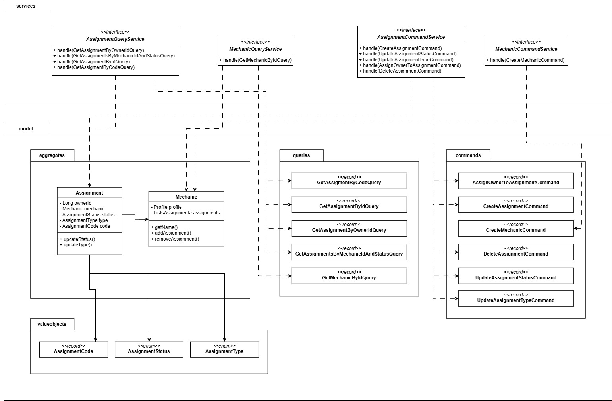

#### 5.3.6.2. Bounded Context Database Design Diagram

## 5.4. Bounded Context: Maintenance
### 5.4.1. Domain Layer

**Aggregates**

`Expense`

**Descripción:** Representa un gasto registrado en el sistema, el cual puede ser de tipo personal o de mantenimiento. Agrupa los ítems del gasto y su clasificación.

| Atributos    | Tipo de dato      | Visibilidad | Descripción                                  |
|--------------|-------------------|-------------|----------------------------------------------|
| id           | Long              | Private     | Identificador único del gasto.               |
| name         | String            | Private     | Nombre o concepto del gasto.                 |
| finalPrice   | Double            | Private     | Precio final acumulado del gasto.            |
| userId       | Long              | Private     | Identificador del usuario creador del gasto. |
| expenseItems | List<ExpenseItem> | Private     | Lista de ítems detallados del gasto.         |
| expenseType  | ExpenseType       | Private     | Clasificación del tipo de gasto.             |

`Maintenance`

**Descripción:** Representa una actividad de mantenimiento (preventivo o correctivo) realizada sobre un vehículo. Gestiona el estado, la asignación de gastos y el mecánico responsable.

| Atributos          | Tipo de dato     | Visibilidad | Descripción                                        |
|--------------------|------------------|-------------|----------------------------------------------------|
| id                 | Long             | Private     | Identificador único del mantenimiento.             |
| details            | String           | Private     | Detalles breves del servicio.                      |
| vehicleId          | Long             | Private     | Identificador del vehículo asociado.               |
| dateOfService      | Date             | Private     | Fecha en la que se realiza el servicio.            |
| location           | String           | Private     | Ubicación o taller donde se realiza el servicio.   |
| description        | String           | Private     | Descripción detallada del trabajo.                 |
| maintenanceExpense | Expense          | Private     | Gasto asociado al mantenimiento (opcional).        |
| state              | MaintenanceState | Private     | Estado actual del proceso de mantenimiento.        |
| mechanicId         | Long             | Private     | Identificador del mecánico asignado al servicio.   |

**Entities**

`ExpenseItem`

**Descripción:** Representa un ítem individual dentro de un registro de gasto, detallando costos unitarios y totales.

| Atributos  | Tipo de dato | Visibilidad | Descripción                                     |
|------------|--------------|-------------|-------------------------------------------------|
| id         | Long         | Private     | Identificador único del ítem.                   |
| name       | String       | Private     | Nombre del ítem.                                |
| amount     | Integer      | Private     | Cantidad de unidades.                           |
| unitPrice  | Double       | Private     | Precio por unidad.                              |
| totalPrice | Double       | Private     | Precio total (cantidad * unitario).             |
| expense    | Expense      | Private     | Gasto al que pertenece este ítem.               |
| itemType   | ItemType     | Private     | Categoría del ítem (Multa, herramientas, etc.). |

`ExpenseType`, `ItemType`, `MaintenanceState` (Entidades de catálogo)

**Value Objects**

`ExpenseTypes` (Enum: PERSONAL, MAINTENANCE)

`ItemTypes` (Enum: FINE, PARKING, PAYMENT, SUPPLIES, TAX, TOOLS)

`MaintenanceStates` (Enum: PENDING, IN_PROGRESS, COMPLETED, CANCELLED)

**Commands**

* AddExpenseItemCommand <<record>>
* AssignExpenseToMaintenanceCommand <<record>>
* CreateExpenseByOwnerIdCommand <<record>>
* CreateExpenseCommand <<record>>
* CreateMaintenanceCommand <<record>>
* DeleteExpenseCommand <<record>>
* DeleteExpenseItemsByExpenseIdCommand <<record>>
* DeleteMaintenanceCommand <<record>>
* SeedExpenseTypesCommand <<record>>
* SeedItemTypesCommand <<record>>
* SeedMaintenanceStatesCommand <<record>>
* UpdateStateOfMaintenanceByIdCommand <<record>>

**Queries**

* GetAllExpenseItemsByExpenseIdQuery <<record>>
* GetAllExpensesByUserIdQuery <<record>>
* GetAllMaintenancesByMechanicIdQuery <<record>>
* GetAllMaintenancesByVehicleIdQuery <<record>>
* GetExpenseByIdQuery <<record>>
* GetMaintenanceByIdQuery <<record>>
* GetMaintenancesByOwnerIdQuery <<record>>

**Services**

`ExpenseCommandService`

* handle(CreateExpenseCommand)
* handle(CreateExpenseByOwnerIdCommand)
* handle(DeleteExpenseCommand)

`ExpenseItemCommandService`

* handle(AddExpenseItemCommand)
* handle(DeleteExpenseItemsByExpenseIdCommand)

`ExpenseQueryService`

* handle(GetAllExpensesByUserIdQuery)
* handle(GetExpenseByIdQuery)

`MaintenanceCommandService`

* handle(CreateMaintenanceCommand)
* handle(DeleteMaintenanceCommand)
* handle(AssignExpenseToMaintenanceCommand)
* handle(UpdateStateOfMaintenanceByIdCommand)

`MaintenanceQueryService`

* handle(GetAllMaintenancesByVehicleIdQuery)
* handle(GetMaintenanceByIdQuery)
* handle(GetAllMaintenancesByMechanicIdQuery)
* handle(GetMaintenancesByOwnerIdQuery)

`SeedServices` (Agrupación lógica)

* ExpenseTypeCommandService.handle(SeedExpenseTypesCommand)
* ItemTypeCommandService.handle(SeedItemTypesCommand)
* MaintenanceStateCommandService.handle(SeedMaintenanceStatesCommand)

### 5.4.2. Interface Layer

**Rest Controllers**

`ExpenseController`

**Descripción:** Controlador REST que maneja las operaciones relacionadas con la gestión de gastos y sus ítems.

| Método                   | Ruta                                 | Descripción                                       |
|--------------------------|--------------------------------------|---------------------------------------------------|
| getAllExpenses()         | GET /api/v1/expense                  | Obtiene todos los gastos del usuario autenticado. |
| createExpenseByOwnerId() | POST /api/v1/expense/owner/{ownerId} | Crea un gasto asociado a un dueño específico.     |
| createExpense()          | POST /api/v1/expense/{userId}        | Crea un nuevo gasto para un usuario.              |
| getExpense()             | GET /api/v1/expense/{expenseId}      | Obtiene el detalle de un gasto por su ID.         |
| deleteExpense()          | DELETE /api/v1/expense/{expenseId}   | Elimina un gasto existente.                       |

`MaintenanceController`

**Descripción:** Controlador REST que maneja las operaciones del ciclo de vida de los mantenimientos.

| Método                        | Ruta                                                        | Descripción                                                    |
|-------------------------------|-------------------------------------------------------------|----------------------------------------------------------------|
| getMaintenanceById()          | GET /api/v1/maintenance/{maintenanceId}                     | Obtiene un mantenimiento por su identificador.                 |
| getMaintenancesByUserId()     | GET /api/v1/maintenance/vehicle/{vehicleId}                 | Obtiene los mantenimientos asociados a un vehículo.            |
| getMaintenancesByOwnerId()    | GET /api/v1/maintenance/owner/{ownerId}                     | Obtiene los mantenimientos de todos los vehículos de un dueño. |
| deleteMaintenanceById()       | DELETE /api/v1/maintenance/{maintenanceId}                  | Elimina un registro de mantenimiento.                          |
| createMaintenance()           | POST /api/v1/maintenance                                    | Registra un nuevo mantenimiento.                               |
| updateMaintenanceStatusById() | PUT /api/v1/maintenance/{maintenanceId}                     | Actualiza el estado de un mantenimiento.                       |
| assignExpenseToMaintenance()  | PUT /api/v1/maintenance/{maintenanceId}/expense/assign/{id} | Asigna un gasto existente a un mantenimiento.                  |
| getMaintenancesByMechanicId() | GET /api/v1/maintenance/mechanic/{mechanicId}               | Obtiene los mantenimientos asignados a un mecánico.            |

**Resources**

* CreateExpenseResource <<record>>
* ExpenseResource <<record>>
* CreateMaintenanceResource <<record>>
* MaintenanceResource <<record>>
* UpdateStatusOfMaintenanceResource <<record>>

**Assemblers**

* ExpenseResourceFromEntityAssembler
* MaintenanceResourceFromEntityAssembler
* CreateMaintenanceCommandFromResourceAssembler

### 5.4.3. Application Layer

`ExpenseCommandServiceImpl`

**Descripción:** Implementación del servicio de comandos para la gestión de gastos.

| Método                                | Descripción                                                        |
|---------------------------------------|--------------------------------------------------------------------|
| handle(CreateExpenseCommand)          | Crea un gasto validando la existencia del usuario.                 |
| handle(CreateExpenseByOwnerIdCommand) | Crea un gasto a partir del ID de un dueño, resolviendo su usuario. |
| handle(DeleteExpenseCommand)          | Elimina un gasto por su ID.                                        |

`ExpenseQueryServiceImpl`

**Descripción:** Implementación del servicio de consultas para gastos.

| Método                              | Descripción                                      |
|-------------------------------------|--------------------------------------------------|
| handle(GetAllExpensesByUserIdQuery) | Recupera todos los gastos de un usuario.         |
| handle(GetExpenseByIdQuery)         | Recupera un gasto específico por su ID.          |

`ExpenseItemCommandServiceImpl`

**Descripción:** Implementación para la gestión de ítems dentro de los gastos.

| Método                                       | Descripción                                   |
|----------------------------------------------|-----------------------------------------------|
| handle(AddExpenseItemCommand)                | Agrega un nuevo ítem a un gasto existente.    |
| handle(DeleteExpenseItemsByExpenseIdCommand) | Elimina todos los ítems asociados a un gasto. |

`MaintenanceCommandServiceImpl`

**Descripción:** Implementación del servicio de comandos para el ciclo de vida del mantenimiento.

| Método                                      | Descripción                                                           |
|---------------------------------------------|-----------------------------------------------------------------------|
| handle(CreateMaintenanceCommand)            | Crea un mantenimiento validando el vehículo y estado inicial PENDING. |
| handle(DeleteMaintenanceCommand)            | Elimina un mantenimiento y su gasto asociado si existe.               |
| handle(AssignExpenseToMaintenanceCommand)   | Asocia un registro de gasto a un mantenimiento.                       |
| handle(UpdateStateOfMaintenanceByIdCommand) | Actualiza el estado (e.j. IN_PROGRESS, COMPLETED) del mantenimiento.  |

`MaintenanceQueryServiceImpl`

**Descripción:** Implementación del servicio de consultas para mantenimientos.

| Método                                      | Descripción                                                      |
|---------------------------------------------|------------------------------------------------------------------|
| handle(GetAllMaintenancesByVehicleIdQuery)  | Obtiene el historial de mantenimientos de un vehículo.           |
| handle(GetMaintenanceByIdQuery)             | Obtiene el detalle de un mantenimiento específico.               |
| handle(GetAllMaintenancesByMechanicIdQuery) | Lista los mantenimientos asignados a un mecánico.                |
| handle(GetMaintenancesByOwnerIdQuery)       | Lista los mantenimientos de todos los vehículos de un dueño.     |

`MaintenanceApplicationReadyEventHandler`

**Descripción:** Manejador de eventos de inicio de aplicación para la carga de datos semilla (Seeders).

| Método             | Descripción                                                                 |
|--------------------|-----------------------------------------------------------------------------|
| onApplicationReady | Ejecuta los comandos de Seed para Tipos de Gasto, Items y Estados de Mant.  |

### 5.4.4. Infrastructure Layer

`ExpenseRepository`

**Descripción:** Interfaz de persistencia para la entidad Expense.

| Método       | Tipo de Retorno | Descripción                                    |
|--------------|-----------------|------------------------------------------------|
| findByUserId | List<Expense>   | Encuentra todos los gastos de un usuario.      |

`ExpenseItemRepository`

**Descripción:** Interfaz de persistencia para los ítems de gasto.

| Método                         | Tipo de Retorno | Descripción                                      |
|--------------------------------|-----------------|--------------------------------------------------|
| deleteExpenseItemsByExpense_Id | void            | Elimina todos los ítems de un ID de gasto dado.  |

`MaintenanceRepository`

**Descripción:** Interfaz de persistencia para la entidad Maintenance.

| Método            | Tipo de Retorno   | Descripción                                                 |
|-------------------|-------------------|-------------------------------------------------------------|
| findByVehicleId   | List<Maintenance> | Encuentra mantenimientos por ID de vehículo.                |
| findByMechanicId  | List<Maintenance> | Encuentra mantenimientos asignados a un mecánico.           |
| findByVehicleIdIn | List<Maintenance> | Encuentra mantenimientos para una lista de IDs de vehículo. |

`MaintenanceStateRepository`, `ExpenseTypeRepository`, `ItemTypeRepository`
**Descripción:** Repositorios de catálogo para validar existencia de tipos y estados.

| Método       | Tipo de Retorno | Descripción                                  |
|--------------|-----------------|----------------------------------------------|
| existsByName | boolean         | Valida si ya existe el tipo o estado en BD.  |

### 5.4.5. Bounded Context Software Architecture Component Level Diagrams

### 5.4.6. Bounded Context Software Architecture Code Level Diagrams
#### 5.4.6.1. Bounded Context Domain Layer Class Diagrams

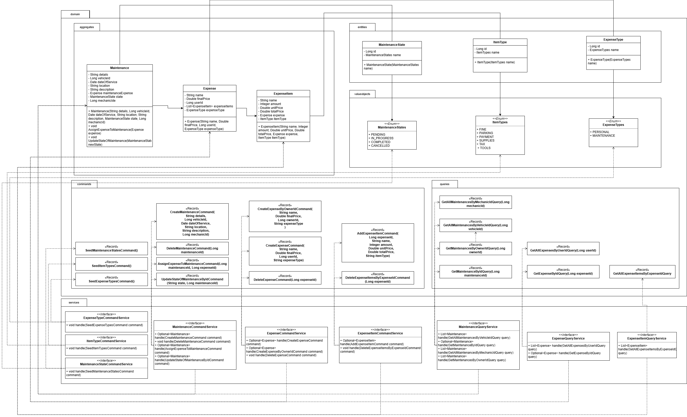

#### 5.4.6.2. Bounded Context Database Design Diagram

## 5.5. Bounded Context: Vehicle Wellness

### 5.5.1 Domain Layer

**Aggregates**

*WellnessMetric*

Descripción: Representa una métrica completa de bienestar registrada por un vehículo.

| Atributo                | Tipo                            | Descripción                                              |
|-------------------------|---------------------------------|----------------------------------------------------------|
| vehicleId               | Long                            | Identificador único del vehículo que registra la métrica |
| coordinates             | Coordinates (Enum)              | Ubicación geográfica donde se tomó la medición           |
| airQuality              | AirQuality (Enum)               | Medición de la calidad del aire en el entorno            |
| environmentalConditions | 	EnvironmentalConditions (Enum) | Condiciones                                              |ambientales generales registradas|
| atmosphericPressure     | 	AtmosphericPressure (Enum)     | 	Nivel de presión atmosférica medido                     |
| statusImpact            | 	StatusImpact (Enum)            | 	Indicador del impacto en el estado del sistema          |
| registeredAt            | 	LocalDateTime                  | 	Fecha y hora en que se registró la métrica              |

**Value Objects**

*AirQuality*

| Atributo   | 	Tipo   | 	Descripción                                              |
|------------|---------|-----------------------------------------------------------|
| CO2Ppm     | 	Double | 	Concentración de dióxido de carbono en partes por millón |
| NH3Ppm     | 	Double | 	Concentración de amoníaco en partes por millón           |
| BenzenePpm | 	Double | 	Concentración de benceno en partes por millón            |

*AtmosphericPressure*

| Atributo    | 	Tipo  | 	Descripción                                   |
|-------------|--------|------------------------------------------------|
| pressureHpa | 	Float | 	Valor de presión atmosférica en hectopascales |

*Coordinates*

| Atributo  | 	Tipo  | 	Descripción                            |
|-----------|--------|-----------------------------------------|
| latitude  | 	Float | 	Coordenada de latitud de la ubicación  |
| longitude | 	Float | 	Coordenada de longitud de la ubicación |

*EnvironmentalConditions*

| Atributo           | 	Tipo  | 	Descripción                                   |
|--------------------|--------|------------------------------------------------|
| temperatureCelsius | 	Float | 	Temperatura ambiental en grados Celsius       |
| humidityPercentage | 	Float | 	Porcentaje de humedad relativa en el ambiente |

*StatusImpact*

| Atributo       | 	Tipo    | 	Descripción                                            |
|----------------|----------|---------------------------------------------------------|
| impactDetected | 	Boolean | 	Indicador de si se detectó algún impacto en el sistema |

**Entities**

*Notification*

| Atributo   | 	Tipo          | 	Descripción                                                |
|------------|----------------|-------------------------------------------------------------|
| vehicleId  | 	Long          | 	Identificador del vehículo relacionado con la notificación |
| title      | 	String        | 	Título descriptivo de la notificación                      |
| message    | 	String        | 	Contenido detallado del mensaje de notificación            |
| type       | 	String        | 	Categoría o clasificación de la notificación               |
| severity   | 	String        | 	Nivel de gravedad o importancia de la notificación         |
| read       | 	boolean       | 	Estado que indica si la notificación ha sido leída         |
| occurredAt | 	LocalDateTime | 	Fecha y hora en que ocurrió el evento notificado           |

**Commands**

- `CreateNotificationCommand(Long vehicleId,String title,String message,String type,String severity,LocalDateTime occurredAt)` (Record)
- `CreateWellnessMetricCommand(Long vehicleId,Float latitude,Float longitude,Double CO2Ppm,Double NH3Ppm,Double BenzenePpm,Float temperatureCelsius,Float humidityPercentage,Float pressureHpa,Boolean impactDetected)` (Record)
- `DeleteWellnessMetricCommand(Long wellnessMetricId)` (Record)
- `MarkNotificationAsReadCommand(Long notificationId)` (Record)
- `UpdateWellnessMetricCommand(Long wellnessMetricId,Float latitude,Float longitude,Double CO2Ppm,Double NH3Ppm,Double BenzenePpm,Float temperatureCelsius,Float humidityPercentage,Float pressureHpa,Boolean impactDetected)` (Record)

**Queries**

- `GetAllNotificationsQuery()` (Record)
- `GetAllWellnessMetricsQuery()` (Record)
- `GetNotificationByIdQuery(Long notificationId)` (Record)
- `GetNotificationsByVehicleIdQuery(Long vehicleId)` (Record)
- `GetWellnessMetricByIdQuery(Long wellnessMetricId)` (Record)
- `GetWellnessMetricsByVehicleIdQuery(Long vehicleId)` (Record)

**Events**

- `AirQualityAlertEvent`
- `AtmosphericPressureAlertEvent`
- `EnvironmentalConditionAlertEvent`
- `StatusImpactAlertEvent`

**Services**

`NotificationCommandService` (Interface)

- handle(CreateNotificationCommand)
- handle(MarkNotificationAsReadCommand)
- NotificationQueryService (Interface)
- handle(GetNotificationByIdQuery)
- handle(GetAllNotificationsQuery)
- handle(GetNotificationsByVehicleIdQuery)

`WellnessMetricCommandService` (Interface)

- handle(CreateWellnessMetricCommand)
- handle(UpdateWellnessMetricCommand)
- handle(DeleteWellnessMetricCommand)

`WellnessMetricQueryService` (Interface)

- handle(GetWellnessMetricByIdQuery)
- handle(GetAllWellnessMetricsQuery)
- handle(GetWellnessMetricsByVehicleIdQuery)

### 5.5.2 Interface Layer

**Controllers:**

*Controlador: WellnessMetricsController*

| Título      | 	Wellness Metrics Controller                                                                                                   |
|-------------|--------------------------------------------------------------------------------------------------------------------------------|
| Descripción | 	Controlador REST que gestiona las operaciones de creación, consulta y recuperación de métricas de bienestar de los vehículos. |

| Método                        | 	Ruta                                    | 	Descripción                                                          |
|-------------------------------|------------------------------------------|-----------------------------------------------------------------------|
| createWellnessMetric          | 	POST /api/v1/metrics                    | 	Crea una nueva métrica de bienestar para un vehículo                 |
| updateWellnessMetric          | 	PUT /api/v1/metrics/{id}                | 	Actualiza una métrica de bienestar existente                         |
| deleteWellnessMetric          | 	DELETE /api/v1/metrics/{id}             | 	Elimina una métrica de bienestar por su ID                           |
| getWellnessMetricById         | 	GET /api/v1/metrics/{id}                | 	Recupera una métrica de bienestar específica por su ID               |
| getAllWellnessMetrics         | 	GET /api/v1/metrics                     | 	Recupera todas las métricas de bienestar disponibles                 |
| getWellnessMetricsByVehicleId | 	GET /api/v1/metrics/vehicle/{vehicleId} | 	Recupera todas las métricas de bienestar para un vehículo específico |

*Controlador: Notifications Controller*

| Título      | 	Notifications Controller                                                                                                   |
|-------------|-----------------------------------------------------------------------------------------------------------------------------|
| Descripción | 	Controlador REST que gestiona las operaciones de creación, consulta y recuperación de las notificaciones de los vehículos. |

| Método                      | 	Ruta                                          | 	Descripción                                                   |
|-----------------------------|------------------------------------------------|----------------------------------------------------------------|
| createNotification          | 	POST /api/v1/notifications                    | 	Crea una nueva notificación en el sistema                     |
| getNotificationById         | 	GET /api/v1/notifications/{id}                | 	Recupera una notificación específica por su ID                |
| getAllNotifications         | 	GET /api/v1/notifications                     | 	Recupera todas las notificaciones del sistema                 |
| getNotificationsByVehicleId | 	GET /api/v1/notifications/vehicle/{vehicleId} | 	Recupera todas las notificaciones para un vehículo específico |
| markNotificationAsRead      | 	GET /api/v1/notifications/{id}/read           | 	Marca una notificación como leída                             |

**Transforms:**

| Transform                                        | 	Descripción                                                                       |
|--------------------------------------------------|------------------------------------------------------------------------------------|
| CreateNotificationCommandFromResourceAssembler   | 	Convierte los recursos de entrada en comandos para crear notificaciones           |
| CreateWellnessMetricCommandFromResourceAssembler | 	Transforma los recursos de entrada en comandos para crear métricas de bienestar   |
| NotificationResourceFromEntityAssembler          | 	Convierte entidades de notificación en recursos de respuesta para la API          |
| UpdateWellnessMetricCommandFromResourceAssembler | 	Transforma los recursos de actualización en comandos para modificar métricas      |
| WellnessMetricResourceFromEntityAssembler        | 	Convierte entidades de métricas de bienestar en recursos de respuesta para la API |

**Resources:**

| Resource                     | 	Descripción                                                           |
|------------------------------|------------------------------------------------------------------------|
| CreateMetricResource         | 	Estructura de datos para la creación de nuevas métricas en el sistema |
| CreateWellnessMetricResource | 	Modelo de datos para solicitudes de creación de métricas de bienestar |
| NotificationResource         | 	Representación de notificaciones en las respuestas de la API          |
| UpdateWellnessMetricResource | 	Estructura de datos para actualizar métricas de bienestar existentes  |
| WellnessMetricResource       | 	Representación de métricas de bienestar en las respuestas de la API   |

**ACL:**

`WellnessMetricContextFacade` (Interface)

- fetchWellnessMetricById(Long wellnessMetricId)

### 5.5.3 Application Layer

**Command Services**

*Clase: NotificationCommandServiceImpl*

| Título      | 	NotificationCommandServiceImpl                                                                    |
|-------------|----------------------------------------------------------------------------------------------------|
| Descripción | 	Servicio que gestiona las operaciones de escritura y modificación de notificaciones en el sistema |

| Método                                                      | 	Descripción                                                 |
|-------------------------------------------------------------|--------------------------------------------------------------|
| handle(CreateNotificationCommand createNotificationCommand) | 	Procesa la creación de una nueva notificación en el sistema |
| handle(MarkNotificationAsReadCommand command)               | 	Maneja la marcación de una notificación como leída          |

**Dependencias:**

| Dependencia             | 	Descripción                                                      |
|-------------------------|-------------------------------------------------------------------|
| NotificationRepository  | 	Repositorio para acceder y gestionar los datos de notificaciones |
| ExternalVehiclesService | 	Servicio externo para obtener información de vehículos           |

*Clase: WellnessMetricCommandServiceImpl*

| Título	     | WellnessMetricCommandServiceImpl                                              |
|-------------|-------------------------------------------------------------------------------|
| Descripción | 	Servicio que maneja las operaciones de modificación de métricas de bienestar |

| Método                                                           | 	Descripción                                                 |
|------------------------------------------------------------------|--------------------------------------------------------------|
| handle(CreateWellnessMetricCommand createWellnessMetricCommand)  | 	Procesa la creación de nuevas métricas de bienestar         |
| handle(UpdateWellnessMetricCommand updateWellnessMetricCommand)  | 	Maneja la actualización de métricas de bienestar existentes |
| handle(DeleteWellnessMetricCommand deleteWellnessMetricCommand)	 | Gestiona la eliminación de métricas de bienestar             |

**Dependencias:**

| Dependencia               | 	Descripción                                                   |
|---------------------------|----------------------------------------------------------------|
| WellnessMetricRepository  | 	Repositorio para almacenar y recuperar métricas de bienestar  |
| WellnessMonitoringService | 	Servicio para monitorear y analizar las métricas de bienestar |
| ExternalVehiclesService   | 	Servicio externo para validar y obtener datos de vehículos    |

**Query Services**

*Clase: NotificationQueryServiceImpl*

| Título      | 	NotificationQueryServiceImpl                                         |
|-------------|-----------------------------------------------------------------------|
| Descripción | 	Servicio especializado en consultas y recuperación de notificaciones |

| Método                                                                    | 	Descripción                                                    |
|---------------------------------------------------------------------------|-----------------------------------------------------------------|
| handle(GetNotificationByIdQuery getNotificationByIdQuery)                 | 	Recupera una notificación específica por su identificador      |
| handle(GetAllNotificationsQuery getAllNotificationsQuery)                 | 	Obtiene todas las notificaciones del sistema                   |
| handle(GetNotificationsByVehicleIdQuery getNotificationsByVehicleIdQuery) | 	Consulta las notificaciones asociadas a un vehículo específico |

**Dependencias:**

| Dependencia            | 	Descripción                                            |
|------------------------|---------------------------------------------------------|
| NotificationRepository | 	Repositorio para acceder a los datos de notificaciones |

*Clase: WellnessMetricQueryServiceImpl*

| Título      | 	WellnessMetricQueryServiceImpl                             |
|-------------|-------------------------------------------------------------|
| Descripción | 	Servicio que maneja las consultas de métricas de bienestar |

| Método                                                        | 	Descripción                                                                                     |
|---------------------------------------------------------------|--------------------------------------------------------------------------------------------------|
| handle(GetWellnessMetricByIdQuery getWellnessMetricByIdQuery) | 	Obtiene una métrica de bienestar específica por su ID                                           |
| handle(GetAllWellnessMetricsQuery getAllWellnessMetricsQuery) | 	Recupera todas las métricas de bienestar disponibles                                            |
| handle(GetWellnessMetricsByVehicleIdQuery                     | getWellnessMetricsByVehicleIdQuery)	Consulta las métricas de bienestar de un vehículo específico |

**Dependencias:**

| Dependencia              | 	Descripción                                                   |
|--------------------------|----------------------------------------------------------------|
| WellnessMetricRepository | 	Repositorio para acceder a los datos de métricas de bienestar |

**Event Handlers**

*Clase: WellnessAlertEventHandler*

| Título      | 	WellnessAlertEventHandler                                              |
|-------------|-------------------------------------------------------------------------|
| Descripción | 	Manejador de eventos relacionados con alertas del sistema de bienestar |

| Método                                     | 	Descripción                                                    |
|--------------------------------------------|-----------------------------------------------------------------|
| on(AirQualityAlertEvent event)             | 	Procesa eventos de alerta relacionados con la calidad del aire |
| on(AtmosphericPressureAlertEvent event)    | 	Maneja eventos de alerta por presión atmosférica               |
| on(EnvironmentalConditionAlertEvent event) | 	Gestiona eventos de alerta por condiciones ambientales         |
| on(StatusImpactAlertEvent event)           | 	Procesa eventos de alerta por impacto en el estado del sistema |

**Dependencias:**

| Dependencia                 | 	Descripción                                       |
|-----------------------------|----------------------------------------------------|
| NotificationCommandService  | 	Servicio para crear notificaciones de alerta      |
| NotificationQueryService    | 	Servicio para consultar notificaciones existentes |
| WellnessWebSocketController | 	Controlador para enviar alertas en tiempo real    |

**ACL**

*Clase: WellnessMetricContextFacadeImpl*

| Título      | 	WellnessMetricContextFacadeImpl                                               |
|-------------|--------------------------------------------------------------------------------|
| Descripción | 	Fachada que actúa como puente entre el contexto de bienestar y otros sistemas |

| Método                                         | 	Descripción                                                               |
|------------------------------------------------|----------------------------------------------------------------------------|
| fetchWellnessMetricById(Long wellnessMetricId) | 	Recupera métricas de bienestar para su uso en otros contextos del sistema |

**Dependencias:**

| Dependencia                | 	Descripción                                   |
|----------------------------|------------------------------------------------|
| WellnessMetricQueryService | 	Servicio para consultar métricas de bienestar |

### 5.5.4 Infrastructure Layer

**Repositories**

*Clase: NotificationRepository <<Interface>>*

| Título      | 	NotificationRepository                                                        |
|-------------|--------------------------------------------------------------------------------|
| Descripción | 	Interfaz que define las operaciones de acceso a datos para las notificaciones |

| Método                          | 	Descripción                                                            |
|---------------------------------|-------------------------------------------------------------------------|
| findByVehicleId(Long vehicleId) | 	Busca y recupera las notificaciones asociadas a un vehículo específico |

*Clase: WellnessMetricRepository <<Interface>>*

| Título      | 	NotificationRepository                                                               |
|-------------|---------------------------------------------------------------------------------------|
| Descripción | 	Interfaz que define las operaciones de acceso a datos para las métricas de bienestar |

| Método                          | 	Descripción                                                                   |
|---------------------------------|--------------------------------------------------------------------------------|
| findByVehicleId(Long vehicleId) | 	Busca y recupera las métricas de bienestar asociadas a un vehículo específico |

### 5.5.5 Bounded Context Software Architecture Component level Diagrams

### 5.5.6 Bounded Context Software Architecture Code level Diagrams

#### 5.5.6.1 Bounded Context Domain Layer Class Diagrams

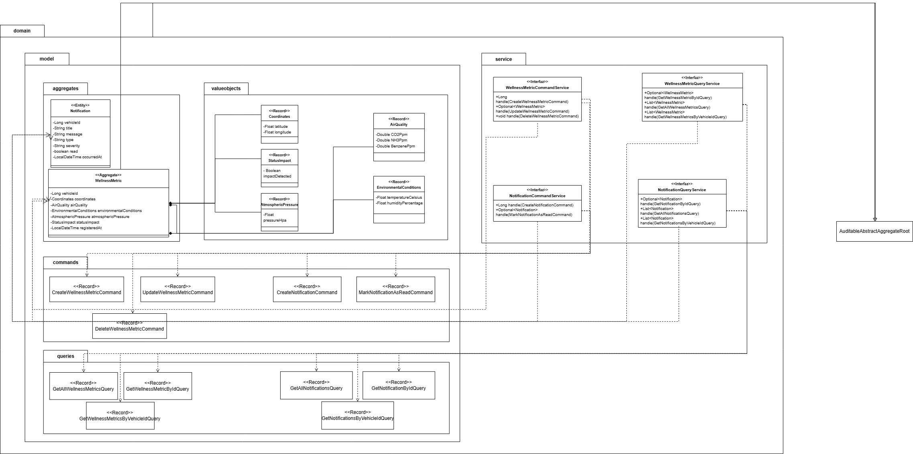

#### 5.5.6.2 Bounded Context Database Design Diagram

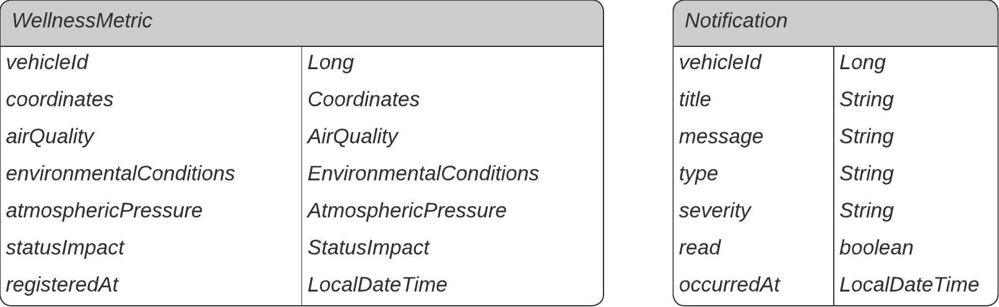

## 5.6. Bounded Context: Vehicle Management
### 5.6.1. Domain Layer

**Aggregates**

`Owner`

**Descripción:** Representa a un dueño de moto registrado en el sistema. Contiene tanto una referencia a un profile como a los vehículos registrados a su nombre.

| Atributos           | Tipo de dato   | Visibilidad | Descripción                                |
|---------------------|----------------|-------------|--------------------------------------------|
| id                  | Long           | Private     | Identificador único del dueño de vehículo. |
| profile             | Profile        | Private     | Perfil de usuario asociado al dueño.       |
| vehicles            | List<Vehicles> | Private     | Lista de Vehículos asociados al dueño.     |

`Model`

**Descripción:** Representa un modelo de moto registrado

| Atributos     | Tipo de dato | Visibilidad | Descripción                                                   |
|---------------|--------------|-------------|---------------------------------------------------------------|
| id            | Long         | Private     | Identificador único del modelo.                               |
| name          | String       | Private     | Nombre del modelo.                                            |
| brand         | String       | Private     | Nombre de la marca a la que le pertenece el modelo.           |
| modelYear     | String       | Private     | Año en el que salió el modelo.                                |
| originCountry | String       | Private     | Nombre del país de origen del modelo.                         |
| producedAt    | Date         | Private     | Fecha de producción del modelo.                               |
| type          | String       | Private     | Tipo del modelo.                                              |
| displacement  | String       | Private     | Cilindrada del motor del modelo.                              |
| potency       | String       | Private     | Potencia máxima que puede generar el motor.                   |
| engineType    | String       | Private     | Tipo o configuración del motor del modelo.                    |
| engineTorque  | String       | Private     | Torque o fuerza de giro producida por el motor.               |
| weight        | String       | Private     | Peso total del modelo.                                        |
| transmission  | String       | Private     | Tipo de transmisión incorporada en el modelo.                 |
| brakes        | String       | Private     | Sistema de frenos con el que está equipado el modelo.         |
| tank          | String       | Private     | Capacidad del tanque de combustible del modelo.               |
| seatHeight    | String       | Private     | Altura del asiento medida desde el suelo.                     |
| consumption   | String       | Private     | Consumo promedio de combustible del modelo.                   |
| price         | Float        | Private     | Precio estimado del modelo en el mercado.                     |
| oilCapacity   | String       | Private     | Capacidad de aceite requerida por el motor del modelo.        |
| connectivity  | String       | Private     | Tecnologías o sistemas de conectividad integrados.            |
| durability    | String       | Private     | Nivel de durabilidad o resistencia del modelo.                |
| octane        | String       | Private     | Nivel de octanaje recomendado para el combustible del modelo. |

**Entities**

`Vehicle`

**Descripción:** Representa la moto registrada por el dueño en el sistema. Contiene los detalles para identificar el vehículo así como su estado actual.

| Atributos           | Tipo de dato | Visibilidad | Descripción                       |
|---------------------|--------------|-------------|-----------------------------------|
| id                  | Long         | Private     | Identificador único del vehículo. |
| owner               | Owner        | Private     | Dueño de la moto.                 |
| model               | Model        | Private     | Modelo de la moto.                |
| year                | Year         | Private     | Año de fabricación de la moto.    |
| plate               | Plate        | Private     | Placa de la moto.                 |

**Value Objects**

`Plate` (Record)

`Year` (Record)

**Commands**

* AddVehicleToOwnerCommand <<record>>
* CreateModelCommand <<record>>
* CreateOwnerCommand <<record>>
* DeleteVehicleFromOwnerCommand <<record>>
* SeedModelsCommand <<record>>
* UpdateVehicleFromOwnerCommand <<record>>

**Queries**

* GetAllBrandsQuery <<record>>
* GetAllModelsQuery <<record>>
* GetAllOwnersQuery <<record>>
* GetAllVehiclesQuery <<record>>
* GetModelByIdQuery <<record>>
* GetModelsByBrandQuery <<record>>
* GetOwnerByIdQuery <<record>>
* GetOwnerByVehicleIdQuery <<record>>
* GetVehicleByIdQuery <<record>>
* GetVehicleByPlateQuery <<record>>

**Services**

`ModelCommandService`

* handle(CreateModelCommand)
* handle(SeedModelsCommand)

`ModelQueryService`

* handle(GetAllModelsQuery)
* handle(GetModelByIdQuery)
* handle(GetModelsByBrandQuery)
* handle(GetAllBrandsQuery)

`OwnerCommandService`

* handle(CreateOwnerCommand)
* handle(AddVehicleToOwnerCommand)
* handle(UpdateVehicleFromOwnerCommand)
* handle(DeleteVehicleFromOwnerCommand)

`OwnerQueryService`

* handle(GetOwnerByIdQuery)
* handle(GetOwnerByVehicleIdQuery)
* handle(GetAllOwnersQuery)

`VehicleQueryService`

* handle(GetVehicleByIdQuery)
* handle(GetVehicleByPlateQuery)

### 5.6.2. Interface Layer

**Rest Controllers**

`ModelsController`

**Descripción:** Controlador REST que maneja las operaciones relacionadas con los modelos.

| Método             | Ruta                             | Descripción                                                    |
|--------------------|----------------------------------|----------------------------------------------------------------|
| getAllModels()     | GET /api/v1/models/              | Obtiene todos los modelos registrados.                         |
| getModelById()     | GET /api/v1/models/{modelId}     | Obtiene un modelo por su identificador.                        |
| getModelsByBrand() | GET /api/v1/models/brand/{brand} | Obtiene todos los modelos de una marca específica.             |
| getAllBrands()     | GET /api/v1/models/brands        | Obtiene todas las marcas presentes en los modelos registrados. |

`OwnersController`

**Descripción:** Controlador REST que maneja las operaciones relacionadas con los dueños.

| Método                | Ruta                                   | Descripción                                          |
|-----------------------|----------------------------------------|------------------------------------------------------|
| getAllOwners()        | GET /api/v1/owners/                    | Obtiene todos los dueños de vehículos registrados.   |
| getOwnerByVehicleId() | GET /api/v1/owners/vehicle/{vehicleId} | Obtiene el dueño de un vehículo por su identificador |
| createOwner()         | POST /api/v1/owners                    | Crea un dueño de vehículo.                           |

`VehiclesController`

**Descripción:** Controlador REST que maneja las operaciones relacionadas con los vehículos.

| Método                 | Ruta                                | Descripción                                            |
|------------------------|-------------------------------------|--------------------------------------------------------|
| getVehiclesByOwnerId() | GET /api/v1/vehicles/               | Obtiene todos los vehículos registrados bajo un dueño. |
| getVehicleById()       | GET /api/v1/vehicles/{vehicleId}    | Obtiene un vehículo por su identificador.              |
| addVehicleToOwner()    | POST /api/v1/vehicles/{ownerId}     | Añade un vehículo a un dueño.                          |
| deleteVehicleById()    | DELETE /api/v1/vehicles/{vehicleId} | Elimina un vehículo de un dueño.                       |

**Resources**

* AddVehicleResource <<record>>
* CreateModelResource <<record>>
* CreateOwnerResource <<record>>
* ModelResource <<record>>
* OwnerResource <<record>>
* VehicleResource <<record>>

**Assemblers**

* AddVehicleCommandFromResourceAssembler
* CreateModelCommandFromResourceAssembler
* CreateOwnerCommandFromResourceAssembler
* ModelResourceFromEntityAssembler
* OwnerResourceFromEntityAssembler
* VehicleResourceFromEntityAssembler

### 5.6.3. Application Layer

`ModelCommandService`

**Descripción:** Implementación del servicio de comandos para la gestión de modelos.

| Método                     | Descripción                                |
|----------------------------|--------------------------------------------|
| handle(CreateModelCommand) | Crea un nuevo modelo.                      |
| handle(SeedModelsCommand)  | Crea los modelos al iniciar la aplicación. |

`ModelQueryService`

**Descripción:** Implementación del servicio de consultas para la gestión de modelos.

| Método                        | Descripción                                                        |
|-------------------------------|--------------------------------------------------------------------|
| handle(GetAllModelsQuery)     | Obtiene todos los modelos registrados.                             |
| handle(GetModelByIdQuery)     | Obtiene un modelo por su identificador.                            |
| handle(GetModelsByBrandQuery) | Obtiene todos los modelos de una marca específica.                 |
| handle(GetAllBrandsQuery)     | Obtiene todas las marcas existentes entre los modelos del sistema. |

`OwnerCommandService`

**Descripción:** Implementación del servicio de comandos para la gestión de dueños.

| Método                                | Descripción                          |
|---------------------------------------|--------------------------------------|
| handle(CreateOwnerCommand)            | Crea un nuevo dueño de moto.         |
| handle(AddVehicleToOwnerCommand)      | Añade un vehículo nuevo al dueño.    |
| handle(UpdateVehicleFromOwnerCommand) | Actualiza un vehículo para su dueño. |
| handle(DeleteVehicleFromOwnerCommand) | Elimina un vehículo de un dueño.     |

`OwnerQueryService`

**Descripción:** Implementación del servicio de consultas para la gestión de dueños.

| Método                           | Descripción                                                         |
|----------------------------------|---------------------------------------------------------------------|
| handle(GetOwnerByIdQuery)        | Obtiene un dueño por su identificador.                              |
| handle(GetOwnerByVehicleIdQuery) | Obtiene un dueño a través del identificador de uno de sus vehículos |
| handle(GetAllOwnersQuery)        | Obtiene todos los dueños registrados.                               |

`VehicleQueryServiceImpl`

**Descripción:** Implementación del servicio de consultas para la gestión de vehículos.

| Método                         | Descripción                       |
|--------------------------------|-----------------------------------|
| handle(GetVehicleByIdQuery)    | Obtiene un vehículo por su ID.    |
| handle(GetVehicleByPlateQuery) | Obtiene un vehículo por su placa. |

### 5.6.4. Infrastructure Layer

`OwnerRepository`

**Descripción:** Interfaz de persistencia para operaciones CRUD y consultas de datos de dueños.

| Método                 | Tipo de Retorno | Descripción                                  |
|------------------------|-----------------|----------------------------------------------|
| findOwnerByProfile_Id  | Optional<Owner> | Encuentra un dueño por su id de perfil.      |
| findOwnerByVehicles_Id | Optional<Owner> | Encuentra un Owner por uno de sus vehículos. |

`ModelRepository`

**Descripción:** Interfaz de persistencia para operaciones CRUD y consultas de datos de modelos.

| Método        | Tipo de Retorno | Descripción                                          |
|---------------|-----------------|------------------------------------------------------|
| existsByName  | boolean         | Valida la existencia de un modelo por su nombre.     |
| findByBrand   | List<Model>     | Encuentra los modelos bajo una marca específica.     |
| findAllBrands | List<String>    | Encuentra todas las marcas presentes en los modelos. |

`VehicleReadRepositories`

**Descripción:** Interfaz de persistencia para operaciones de lectura de vehículos.

| Método                 | Tipo de Retorno | Descripción                                  |
|------------------------|-----------------|----------------------------------------------|
| findOwnerByProfile_Id  | Optional<Owner> | Encuentra un dueño por su id de perfil.      |
| findOwnerByVehicles_Id | Optional<Owner> | Encuentra un Owner por uno de sus vehículos. |

### 5.6.5. Bounded Context Software Architecture Component Level Diagrams

### 5.6.6. Bounded Context Software Architecture Code Level Diagrams
#### 5.6.6.1. Bounded Context Domain Layer Class Diagrams

#### 5.6.6.2. Bounded Context Database Design Diagram

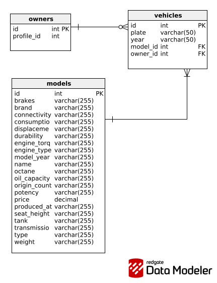

## 5.7. Bounded Context: Device Intelligence

Este bounded context se encarga de gestionar la autenticación, recepción y análisis de datos provenientes de los dispositivos IoT instalados en los vehículos. Su objetivo es procesar la información en tiempo real para generar insights sobre el estado del vehículo, detectar anomalías y proporcionar recomendaciones de mantenimiento predictivo.

### 5.7.1. Domain Layer

**Aggregates**

`Device`: Representa un dispositivo IoT registrado en el sistema, asociado a un vehículo y responsable de enviar datos de telemetría.

| Atributos | Tipo de dato | Visibilidad | Descripción|
|-|-|-|-|
| id        | Long         | Private     | Identificador único en la base de datos central.|
| deviceId  | String       | Private     | Identificador único de hardware del dispositivo IoT. |
| vehicleId | Long         | Private     |Identificador de la motocicleta asociada.|
| status | DeviceStatus         | Private     |Estado operativo del dispositivo.|

**Entities**

`TelemetryData`:Representa el registro histórico e instantáneo de las lecturas capturadas por los sensores físicos del hardware acoplado.

| Atributos | Tipo de dato | Visibilidad | Descripción |
|-|-|-|-|
|id|Long|Private|Identificador único del registro de telemetría.|
|deviceId|String|Private|ID del dispositivo que originó la lectura.|
|timestamp|LocalDateTime|Private|Fecha y hora exacta de la captura de los sensores.|
|metrics|Map<String, Object>|Private|Datos crudos estructurados (ej. velocidad, RPM, temperatura, vibración).|

**Value Objects**

- ``DeviceStatus``: Enum para los estados del dispositivo: ACTIVE, INACTIVE, FAULTY.

**Commands**

- `RegisterDeviceCommand`: Registra un nuevo hardware en el sistema vinculándolo a una motocicleta.
- `ValidateDeviceCommand`: Transporta el deviceId enviado por el microcontrolador para verificar su acceso.
- `ProcessTelemetryCommand`: Recibe el paquete JSON del Edge's API, valida el dispositivo y procesar las métricas de los sensores.

**Querys**

- `GetLatestDeviceStatusQuery`: Query para recuperar el último estado e informe de diagnóstico de una moto.

**Services**

- `DeviceCommandService`: Interfaz para el manejo de los comandos de dispositivos.
  - handle(RegisterDeviceCommand)
  - handle(ValidateDeviceCommand)
- `TelemetryCommandService`: Interfaz para la ingesta de telemetría.
  - handle(ProcessTelemetryCommand)
- `DeviceQueryService`: Interfaz encargada de resolver las solicitudes de solo lectura.
  - handle(GetLatestDeviceStatusQuery)

**Ports** 

- `AiInferencePort`: Interfaz que define el contrato de comunicación con el motor de Inteligencia Artificial
  - predictVehicleAnomalies(TelemetryData )

### 5.7.2. Interface Layer
**Resources**

- ``RegisterDeviceResource``: Entrada que transfiere el deviceId físico y el vehicleId.

- ``ValidateDeviceResource``: Entrada que envía el microcontrolador al encender la moto para validar sus credenciales

- ``TelemetryIngestionResource``: Entrada estructurada con deviceId, timestemp y el objeto anidado de metricas de sensores.

- ``DeviceDiagnosisResource``: salida que retorna el estado de salud de la moto y las alertas predictivas calculadas por Groq Cloud.

**Transforms**

- ``RegisterDeviceCommandFromResourceAssembler``: Transforma un RegisterDeviceResource entrante en un RegisterDeviceCommand.

- ``TelemetryCommandFromResourceAssembler``: Convierte el JSON crudo del TelemetryIngestionResource en un objeto estructurado ProcessTelemetryCommand para la capa de aplicación.

- ``DeviceDiagnosisResourceFromEntityAssembler``: Transforma la respuesta analítica del dominio en un DeviceDiagnosisResource listo para ser serializado a JSON de salida.

**Controladores**

`DeviceAuthenticationController`: Controlador encargado de exponer los servicios REST dedicados al aprovisionamiento seguro de hardware y validación de sesiones del IoT.

| Método| Ruta| Descripción|
|-|-|-|
| registerDevice(RegisterDeviceResource resource) | POST /api/v1/devices/authentication/register | Recibe la solicitud, la transforma mediante el Assembler y despacha el comando para registrar el dispositivo. Retorna un HTTP 21 Created. |
| validateDevice(ValidateDeviceResource resource) | POST /api/v1/devices/authentication/validate | Endpoint de comunicación rápida para autorizar al microcontrolador a transmitir datos.|

`TelemetryIngestionController`: Controlador de alta disponibilidad optimizado para procesar los flujos masivos de métricas emitidos en tiempo real por el Edge's API del vehículo.

| Método| Ruta| Descripción|
|-|-|-|
| receiveTelemetry(TelemetryIngestionResource resource) | POST /api/v1/devices/telemetry | Recibe el paquete JSON del microcontrolador, invoca el transformador y ejecuta el TelemetryCommandService. |

### 5.7.3. Application Layer

**Servicios de Comando**

`DeviceCommandServiceImpl`

| Método                        | Descripción                                      |
|-------------------------------|--------------------------------------------------|
| handle(RegisterDeviceCommand) | Registra un nuevo dispositivo IoT en el sistema. |
| handle(ValidateDeviceCommand) | Valida la autenticidad de un dispositivo IoT.    |

`TelemetryCommandServiceImpl`
| Método| Descripción|
|-|-|
|handle(ProcessTelemetryCommand)|Envia el lote de datos a Groq Cloud|

`DeviceQueryServiceImpl`
| Método| Descripción|
|-|-|
|handle(GetLatestDeviceStatusQuery)|Construye y retorna el objeto de respuesta estructurado|

### 5.7.4. Infrastructure Layer

**Repositories**

`DeviceRepository`: Interfaz de Spring Data JPA / Hibernate encargada del mapeo relacional.

| Método                   | Descripción                                                        |
|--------------------------|--------------------------------------------------------------------|
| findByDeviceId(String deviceId)   | Recupera el registro del dispositivo utilizando su identificador único de hardware.|
| existsByDeviceId(String deviceId) |Verifica si el hardware ya se encuentra registrado en el sistema para evitar duplicidad.|

`TelemetryRepository`: Interfaz encargada de la persistencia histórica de las métricas recolectadas por los sensores de la motocicleta.

| Método| Descripción|
| -| -|
| save(TelemetryData telemetry)| Almacena el lote de telemetría con su respectiva marca de tiempo.|
| findFirstByDeviceIdOrderByTimestampDesc(String deviceId)| Recupera de forma optimizada la última lectura conocida de los sensores de una motocicleta específica.|

**Adapters**

`GroqCloudAiAdapter`: Componente encargado de materializar el contrato del AiInferencePort

| Método| Descripción|
| -| -|
| predictVehicleAnomalies(TelemetryData telemetry)| Implementación del puerto de dominio. Toma las variables de los sensores, estructura el prompt técnico, realiza una petición segura via HTTP REST utilizando un cliente Feign/WebClient a la API de Groq Cloud.|

### 5.7.5. Bounded Context Software Architecture Component Level Diagrams

### 5.7.6. Bounded Context Software Architecture Code Level Diagrams

En esta sección se presentan los diagramas de clase detallados del dominio y el diseño de la base de datos para el bounded context de Device Intelligence, mostrando las entidades, sus relaciones y la estructura de almacenamiento de datos.

#### 5.7.6.1. Bounded Context Domain Layer Class Diagrams

El diagrama de clases del dominio para el contexto de Device Intelligence muestra la entidad principal con sus atributos y métodos relacionados a la autenticación y registro de dispositivos IoT.

#### 5.7.6.2. Bounded Context Database Design Diagram

Para el diseño de la base de datos, se presenta un diagrama que ilustra la tabla principal con sus campos correspondientes.

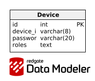

## 5.8. Bounded Context: Support & Ticket Management
Este bounded context se encarga de centralizar, gestionar y dar seguimiento a los reclamos, incidencias técnicas y solicitudes de soporte técnico reportadas por los usuarios o detectadas automáticamente en relación con los dispositivos IoT instalados. Su objetivo es garantizar la resolución eficiente de problemas de hardware o conectividad mediante un sistema de tickets con flujos de aprobación y asignación de mecánicos.

### 5.8.1. Domain Layer

**Aggregates**

``SupportTicket``:Representa una solicitud de soporte técnico o reclamo formal en el sistema, asociado a un usuario, un dispositivo IoT específico y un estado operativo.

| Atributos | Tipo de dato | Visibilidad | Descripción|
|-|-|-|-|
| id | Long | Private | Identificador único en la base de datos central.|
| ticketCode | String | Private | Código alfanumérico único de seguimiento público.|
| deviceId | String | Private | ID del dispositivo IoT que presenta la falla.|
| userId | Long | Private | Identificador del dueño de la motocicleta que genera el reclamo.|
| assignedSpecialistId | Long | Private | Identificador del especialista técnico asignado (opcional).|
| title | String | Private | Título descriptivo de la incidencia.|
| description | String | Private | Detalle del problema experimentado o reportado.|
| status | TicketStatus | Private | Value Object con el estado actual del ticket.|
| priority | TicketPriority | Private | Criticidad del reclamo basada en el impacto del hardware.|
| createdAt | LocalDateTime | Private | Fecha y hora de apertura del caso.|

**Entities**

``TicketResponse``:Representa las interacciones, respuestas oficiales o comentarios añadidos al ticket por parte del equipo de soporte, mecánicos o el propio usuario.

| Atributos | Tipo de dato | Visibilidad | Descripción|
|-|-|-|-|
| id | Long | Private | Identificador único de la respuesta.|
| ticketId | Long | Private | ID del ticket al que pertenece la respuesta.|
| senderId | Long | Private | ID del usuario o empleado que emite el mensaje.|
| senderRole | String | Private | Rol del emisor (ej. "CUSTOMER", "MECHANIC", "SUPPORT").|
| message | String | Private | Contenido textual de la respuesta o solución parcial.|
| timestamp | LocalDateTime | Private | Fecha y hora del mensaje.|

**Value Objects**

``TicketStatus``:Enum para los estados del flujo de aprobación y atención: OPEN, IN_PROCESS, RESOLVED, REJECTED.

``TicketPriority``:Enum que define el nivel de urgencia del reclamo: LOW, MEDIUM, HIGH, CRITICAL.

**Commands**

- ``FileSupportTicketCommand``: Registra un nuevo reclamo o ticket de soporte técnico en el sistema para un dispositivo IoT.
- ``AssignTicketMechanicCommand``:Asigna un mecánico especialista a un ticket abierto para iniciar el diagnóstico físico.
- ``ResolveTicketCommand``: Registra la solución definitiva de la incidencia y cambia el estado a aprobado/resuelto.
- ``AddTicketResponseCommand``: Añade un nuevo mensaje o respuesta al historial de conversación del ticket.

**Queries**

- ``GetTicketByCodeQuery``: Consulta para recuperar un ticket específico y su historial de respuestas mediante su código de seguimiento.
- ``GetPendingTicketsByMechanicIdQuery``: Consulta para listar los reclamos asignados a un mecánico que aún requieren atención.

**Services**

- ``TicketCommandService``
  - handle(FileSupportTicketCommand)
  - handle(AssignTicketMechanicCommand)
  - handle(ResolveTicketCommand)
  - handle(AddTicketResponseCommand)

- ``TicketQueryService``
  - handle(GetTicketByCodeQuery)
  - handle(GetPendingTicketsByMechanicIdQuery)
  

**Ports**

- ``NotificationPort``: Interfaz (SPI) para enviar notificaciones automáticas (Push o Correo)
  - sendTicketStatusUpdateNotification(String ticketCode, String userEmail, String newStatus)
  

### 5.8.2. Application Layer

``TicketCommandServiceImpl``: Implementación de los casos de uso encargados de modificar el estado de los tickets y procesar las interacciones de soporte.

| Método| Descripción|
|-|-|
| handle(FileSupportTicketCommand command)| Genera el código de seguimiento, instancia el Agregado SupportTicket en estado OPEN, lo persiste en la base de datos y retorna su ID.|
| handle(AssignTicketMechanicCommand command)| Recupera el ticket, actualiza el assignedMechanicId, cambia el estado a IN_PROCESS y gatilla una alerta al mecánico a través del NotificationPort.|
| handle(ResolveTicketCommand command)| Modifica el estado del ticket a RESOLVED, guarda la solución técnica e invoca al NotificationPort para avisar al dueño de la motocicleta.|
| handle(AddTicketResponseCommand command)| Instancia una nueva entidad TicketResponse, la asocia al ticket correspondiente, actualiza la marca de tiempo y retorna el ID de la interacción.|

``TicketQueryServiceImpl``: Orquestador encargado de resolver las consultas analíticas y vistas de soporte técnico.

| Método| Descripción|
|-|-|
| handle(GetTicketByCodeQuery query)| Realiza la búsqueda en el repositorio por el código público de seguimiento y devuelve el Agregado junto con su colección de respuestas.|
| handle(GetPendingTicketsByMechanicIdQuery query)| Consulta al repositorio todos los tickets activos asignados al ID del mecánico provisto.|

### 5.8.3. Infrastructure Layer

**Repositories**

``SupportTicketRepository``: Interfaz basada en Spring Data JPA / Hibernate encargada del mapeo relacional y persistencia de los tickets de soporte.

| Método| Descripción|
|-|-|
| findByTicketCode(String ticketCode)| Recupera un ticket completo de la base de datos PostgreSQL utilizando su código alfanumérico único.|
| findAllByAssignedMechanicIdAndStatus(Long mechanicId, TicketStatus status)| Retorna la lista de reclamos asignados a un técnico específico que se encuentren en un estado determinado.|

``TicketResponseRepository``: Interfaz encargada de persistir el hilo de conversación y respuestas de cada caso.

| Método| Descripción|
|-|-|
| findAllByTicketIdOrderByTimestampAsc(Long ticketId)| Recupera de forma cronológica todas las respuestas e interacciones asociadas a un ticket específico.|

**Adapters**

``ExternalNotificationAdapter``: Componente de infraestructura encargado de materializar el contrato del NotificationPort conectándose con servicios de mensajería (como AWS SES o Firebase Cloud Messaging).

| Método| Descripción|
|-|-|
| sendTicketStatusUpdateNotification() | Implementación del puerto de dominio. Construye la plantilla de correo o notificación push, se conecta de forma segura con el proveedor de mensajería externo y despacha la alerta al destinatario.|

### 5.8.4. Interface Layer

**Resources**

- ``FileTicketResource``: Payload de entrada con los datos iniciales del reclamo (deviceId, title, description, priority).

- ``AssignMechanicResource``: Payload de entrada que envía el administrador para vincular a un técnico (mechanicId).

- ``TicketResponseResource``: Payload de entrada para añadir comentarios o soluciones de texto al canal de comunicación.

- ``TicketDetailResource``: Payload de salida estructurado que expone los datos del ticket, su estado de aprobación y el arreglo histórico de respuestas para las apps cliente.

**Transforms**

- ``FileTicketCommandFromResourceAssembler``: Transforma el JSON de FileTicketResource en el comando FileSupportTicketCommand.

- ``AddResponseCommandFromResourceAssembler``: Convierte un TicketResponseResource entrante en un AddTicketResponseCommand.

- ``TicketDetailResourceFromEntityAssembler``: Adapta el Agregado de dominio SupportTicket y sus entidades internas a un objeto estructurado TicketDetailResource.

**Controladores**

`SupportTicketController`: Controlador encargado de exponer los servicios REST dedicados al ciclo de vida de los tickets de soporte y reclamos.

| Método| Ruta| Descripción|
|-|-|-|
| fileTicket(FileTicketResource resource) | POST /api/v1/tickets | Endpoint para que los usuarios abran un reclamo por fallas en su dispositivo IoT. Retorna HTTP 201 Created. |
| assignMechanic(Long id, AssignMechanicResource resource) | PATCH /api/v1/tickets/{id}/assign | Permite la asignación o reasignación de un mecánico al caso de soporte. |
| resolveTicket(Long id) | PATCH /api/v1/tickets/{id}/resolve | Cierra el caso y aprueba formalmente la resolución de la falla del hardware. |

``TicketInteractionController``: Controlador dedicado a gestionar el flujo de conversación, respuestas y adjuntos entre el cliente y el soporte técnico.

| Método| Ruta| Descripción|
|-|-|-|
|addResponse(Long id, TicketResponseResource resource)|POST /api/v1/tickets/{id}/responses|Añade un mensaje al hilo del ticket.|
|getTicketDetails(String code)|GET /api/v1/tickets/search/{code}|Recupera toda la información pública e interacciones de un reclamo mediante su código único.|

### 5.8.5. Bounded Context Software Architecture Component Level Diagrams

### 5.8.6. Bounded Context Software Architecture Code Level Diagrams

En esta sección se presentan los diagramas de clase detallados del dominio y el diseño de la base de datos para el bounded context de Device Intelligence, mostrando las entidades, sus relaciones y la estructura de almacenamiento de datos.

#### 5.8.6.1. Bounded Context Domain Layer Class Diagrams

El diagrama de clases del dominio para el contexto de Support & Ticket Management muestra la entidad principal con sus atributos y métodos relacionados..

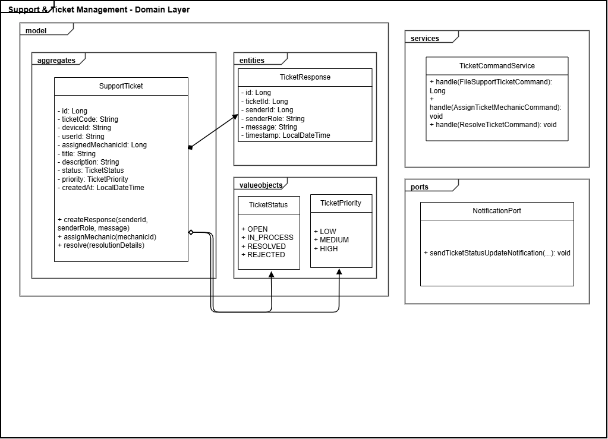

#### 5.8.6.2. Bounded Context Database Design Diagram

Para el diseño de la base de datos, se presenta un diagrama que ilustra la tabla principal con sus campos correspondientes.

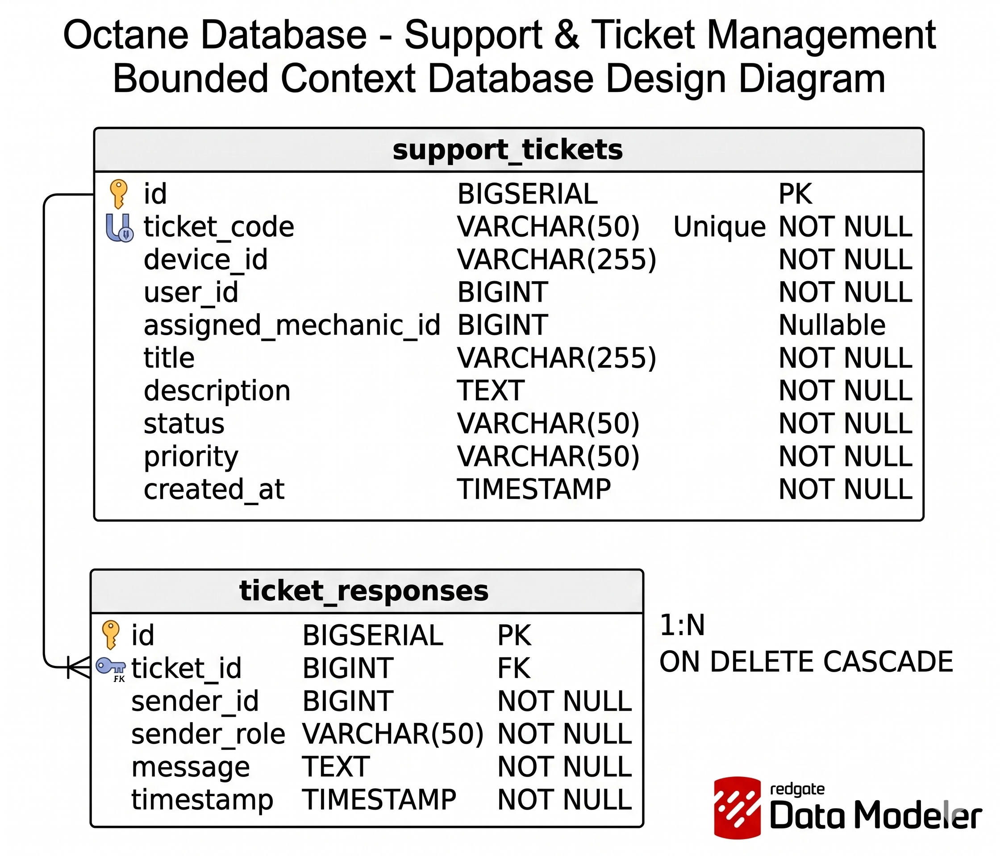

# Capitulo VI: Solution UX Design 
## 6.1. Style Guidelines

La sección de Style Guidelines establece los lineamientos visuales y de diseño que garantizan una experiencia de usuario coherente, clara y alineada con la identidad de marca de Octane. Este repositorio central reúne todos los elementos gráficos y normativos necesarios para que el equipo de diseño y desarrollo trabaje de manera consistente en los distintos canales digitales (web y móvil).

Su objetivo principal es mantener una presentación uniforme y profesional, fortaleciendo la identidad visual de la startup y asegurando que cada interacción con el usuario transmita confianza, innovación y accesibilidad.

Para lograr este objetivo esta sección se dividirá en dos sub-secciones:

General Style Guidelines: Se definirán los principios básicos de diseño incluyendo branding, tipografía, paleta de colores, espaciado y tono comunicacional.
Web Mobile and IoT Style Guidelines: Aquí se definen los estándares visuales especificos para cada plataforna.
Estos lineamientos permiten mantener organizados y accesibles todos los artefactos de diseño, reduciendo inconsistencias y mejorando la eficiencia del equipo.

### 6.1.1 General Style Guidelines

Los lineamientos generales de estilo definen los principios transversales de diseño que guiarán la identidad visual de Octane en todas sus plataformas digitales. Incluyen decisiones clave en torno al branding, paleta de colores, tipografía, tono comunicacional y principios de diseño.

**Branding:**

El logotipo se empleará principalmente en su versión negra sobre fondos claros y en su versión blanca sobre fondos oscuros. Se debe mantener un área de seguridad alrededor del logotipo equivalente a la altura de la letra “O” de Octane para garantizar su visibilidad.

- El logo completo se utilizará en la barra de navegación superior y en aplicaciones móviles.
- El isotipo se aplicará únicamente en espacios reducidos, como íconos de aplicaciones móviles o pestañas del navegador.

**Logos:**

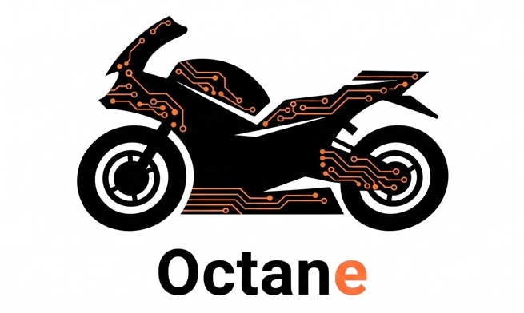
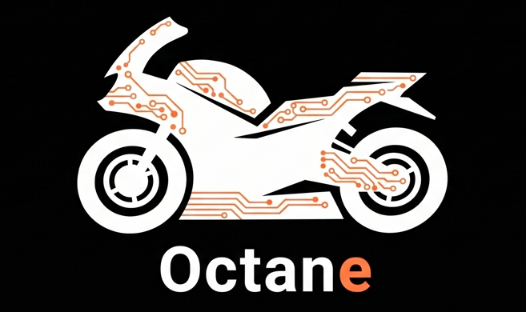

**Isotipo:**

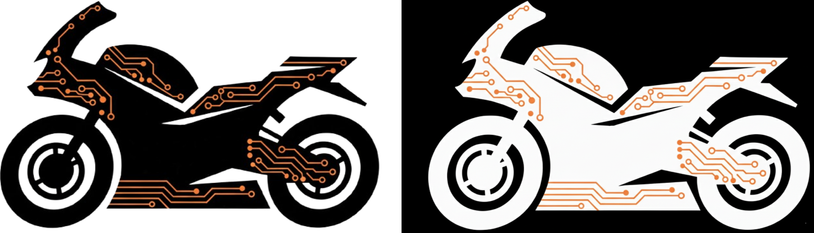

**Paleta de colores:**

La identidad visual se basa en tonos naranjas y marrones, diseñados para transmitir energía, confianza y dinamismo.

- Colores principales: tonos cálidos que refuerzan la personalidad de la marca.
- Fondos y textos: blanco (#FFFFFF) para fondos y #130100 para tipografía principal, asegurando alta legibilidad.
- Colores secundarios: tonos como #C84E00 y #380800 se reservan para acentos, componentes interactivos y llamadas a la acción.

**Tipografía:**

La tipografía principal será Roboto, elegida por su legibilidad, modernidad y versatilidad.

- Se aplicarán jerarquías tipográficas claras, diferenciando títulos, subtítulos y cuerpo de texto.
- Se hará uso de negritas para destacar información clave.

**Tono y lenguaje:**

La comunicación seguirá un tono profesional pero accesible, evitando tecnicismos innecesarios.

- Se priorizará la claridad y la brevedad en los textos.
- El estilo de comunicación debe transmitir confianza, innovación y cercanía.

**Principios de diseño:**

El diseño se regirá por los siguientes principios:

- Consistencia: mantener coherencia visual en todos los elementos.
- Simplicidad: evitar la saturación visual y priorizar lo esencial.
- Accesibilidad: garantizar la legibilidad y usabilidad para todos los usuarios.
- Espaciado adecuado: entre elementos para mejorar la experiencia visual.
- Iconografía clara: símbolos simples y reconocibles que complementen el texto.
- Uso de contrastes: para resaltar información y facilitar la navegación.

### 6.1.2 Web, Mobile & Devices Style Guidelines

Esta sección establece los estándares visuales e interactivos para los distintos canales digitales de Octane: interfaces web, aplicaciones móviles y aplicaciones de IoT. Cada uno presenta particularidades de interacción y diseño, pero todos comparten la misma identidad visual definida en los lineamientos generales.

**Web style Guide:**

*Componentes:*

- Botones: se definen estilos primario, secundario y deshabilitado, con diferencias claras en color y contraste.
- Formularios: incluyen campos de texto, validaciones visuales y selectores uniformes.
- Cards: tarjetas utilizadas para mostrar información resumida, con variantes internas para resaltar datos clave.
- Tablas: estilo simple con uso de bordes internos y jerarquía tipográfica para cabeceras.

*Comportamiento de componentes:*

- Estados de interacción (hover, active, focus) se encuentran deshabilitados, priorizando la simplicidad y evitando distracciones visuales.

*Responsive design:*

- Interfaces diseñadas principalmente para desktop, con adaptación proporcional según el tamaño de la ventana.
- Se prioriza la legibilidad y la correcta distribución del contenido en resoluciones variables.

*Íconos e ilustraciones:*

- No se utilizarán ilustraciones a color.
- Los íconos serán siluetas simples y su presencia se limitará a indicadores funcionales.

**Mobile Style guide:**

*Componentes:*

- Botones: variantes primary y secondary deshabilitadas, con áreas táctiles amplias.
- Formularios: campos de texto optimizados para teclado móvil, validaciones claras y selectores de fácil interacción.
- Cards: diseño compacto para mostrar información de manera jerárquica y accesible.

*Gestos:*

- Tap: gesto principal para interacción con botones y elementos táctiles.
- Swipe vertical: navegación entre pantallas o listas.
- Swipe horizontal: apertura del menú lateral (sidebar) o carruseles de contenido.

*Responsive Design:*

- Adaptación automática a resoluciones de smartphones y tablets.
- Se prioriza la usabilidad en pantallas pequeñas, con tipografía legible y espacios amplios para interacción táctil.

## 6.2. Information Architecture

La arquitectura de la información establece la estructura, organización y jerarquía de los contenidos y funcionalidades dentro de la plataforma. Es fundamental para garantizar una experiencia de usuario intuitiva, permitiendo a los usuarios encontrar fácilmente lo que buscan y navegar de manera fluida.

En esta sección, se definirán los sistemas de etiquetado, búsqueda, SEO y navegación que conformarán la base de la arquitectura de la información. Estos sistemas se diseñarán para ser coherentes con los lineamientos de estilo establecidos previamente, asegurando una experiencia de usuario consistente y alineada con la identidad visual de Octane.

### 6.2.1. Labeling Systems

El sistema de etiquetado se diseñará con un enfoque en simplicidad y consistencia, términos claros y simplificados para la comprensión rápida. Se priorizará la claridad en la asociación entre etiqueta y contenido, evitando ambigüedades técnicas.

- **Menú principal (navbar superior – Dueños de moto)**: Vehículos, Comparativas, Gastos, Mantenimientos, Dashboard.
- **Menú principal (navbar superior – Mecánicos)**: Suscripciones, Membresía, Comparativas, Mantenimientos, Dashboard.
- **Menú principal (sidebar lateral – Dueños de moto)**: Vehículos, Comparativas, Gastos, Mantenimientos, Dashboard, Monitoreo.

Las etiquetas funcionan como puntos de entrada semánticos permitiendo que la funcionalidad se logre identificar rápidamente.

- Dashboard: Vista general con métricas clave.
- Vehículos: Gestión de motos registradas.
- Comparativas: Análisis y comparación de modelos.
- Mantenimientos: Historial y programación de servicios.
- Suscripciones: Gestión vinculos entre mecánico y dueño.
- Membresía: Información sobre planes y beneficios.

### 6.2.2. Searching Systems

El sistema de búsqueda se diseñará para ser eficiente y fácil de usar, permitiendo a los usuarios encontrar rápidamente la información o funcionalidad que necesitan. Se implementarán filtros y opciones de búsqueda avanzada para mejorar la precisión de los resultados.

- **Búsqueda local**: En cada sección (e.g. Vehículos, Mantenimientos) se incluirá una barra de búsqueda que permita filtrar por términos relevantes (e.g. marca, modelo, fecha).

### 6.2.3. SEO Tags and Meta Tags

Para optimizar la visibilidad en motores de búsqueda con relación a Octane, se implementarán estrategias de SEO que incluyen la definición de meta tags relevantes para cada página y sección del sitio web. Estas etiquetas ayudarán a mejorar el posicionamiento en los resultados de búsqueda y a atraer tráfico orgánico de usuarios interesados en servicios relacionados con el mantenimiento de motocicletas.

**Landing Page**

- Meta Title: Octane - Tu aliado para el monitoreo y mantenimiento de tu moto
- Meta Description: Octane es la plataforma que conecta a dueños de motos con mecánicos de confianza en un ecosistema digital que promueve el mantenimiento preventivo y el bienestar vehicular. Optimiza el cuidado de tu moto y disfruta del servicio desde nuestra plataforma.
- Meta Keywords: mantenimiento de motos, monitoreo de vehículos, mecánicos de confianza, plataforma digital para motos, cuidado preventivo de motocicletas, aplicación móvil para motos, servicios de mantenimiento de motos, comunidad de dueños de motocicletas, bienestar vehicular
- Author: Nodrify Team

**Web Application**

- Meta Title: Octane - Control Inteligente de Vehículos
- Meta Description: Accede al panel de control para gestionar vehículos, registrar mantenimientos, visualizar métricas y recibir alertas en tiempo real.
- Meta Keywords: dashboard de mantenimiento, métricas de vehículos, alertas de mantenimiento, gestión de motos, control vehicular
- Author: Nodrify Team

**Mobile Application**

- Application Title: Octane – Control y Mantenimiento de Motos
- Application Subtitle: Tu moto, siempre bajo control
- Application Description: Octane te permite registrar tus vehículos, controlar mantenimientos, recibir alertas y conectar con mecánicos verificados. Diseñada para simplificar la gestión y aumentar la seguridad en el mantenimiento de motocicletas. 
- Application Keywords: mantenimiento moto, mecánicos, control vehículo, alertas moto, app motociclistas, comunidad motociclistas, bienestar vehicular

### 6.2.4. Navigation Systems

El sistema de navegación de Octane se diseñó con el propósito de garantizar una experiencia fluida, predecible y centrada en las necesidades del usuario en común. Su estructura combina navegación jerárquica y contextual, adaptándose tanto al rol del usuario (Dueño o Mecánico) como al dispositivo (web o móvil).

**Estructura general de navegación:**

- **Navbar superior**: Contiene las secciones principales del sitio, adaptándose al rol del usuario.
  - Dueños: Vehículos, Comparativas, Gastos, Mantenimientos, Dashboard. 
  - Mecánicos: Suscripciones, Membresía, Comparativas, Mantenimientos, Dashboard.
- **Sidebar lateral**: Presente para la vista de los dueños de motocicletas, proporciona un acceso complementario a los módulos adicionales como el Monitoreo.
  - Su función es profundizar la navegación sin abandonar la vista principal.
  - La jerarquía visual está marcada por íconos simples, etiquetas cortas y un sistema de resaltado para la sección activa.
- **Navegación contextual**: Dentro de cada sección, se implementan cards y botones que permiten a los usuarios profundizar en funcionalidades específicas.
  - Ejemplo: desde “Vehículos” se puede acceder a “Detalles del vehículo” → “Historial de mantenimientos” → “Comparativas”.
  - Esto permite mantener un flujo jerárquico descendente, donde cada nivel muestra más información específica.

## 6.3. Landing Page UI Design
En esta sección se presenta la propuesta visual de la Landing Page, donde se traduce la arquitectura de información y las decisiones de diseño en una interfaz clara, atractiva y funcional que refleje la identidad visual y los objetivos de la startup.
### 6.3.1. Landing Page Wireframe
Esta sección muestra la estructura base de la Landing Page mediante wireframes para desktop y mobile, destacando la jerarquía visual, la usabilidad y la coherencia con los principios de diseño inclusivo y la arquitectura de información.

- Desktop
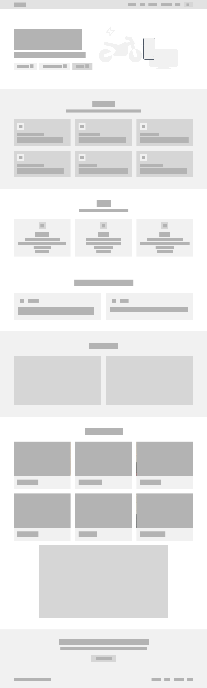

### 6.3.2. Landing Page Mock-up
Aquí se presentan los mock-ups finales de la Landing Page, evidenciando la aplicación del Design System, los principios de diseño visual y la alineación con la experiencia de usuario definida en etapas previas.

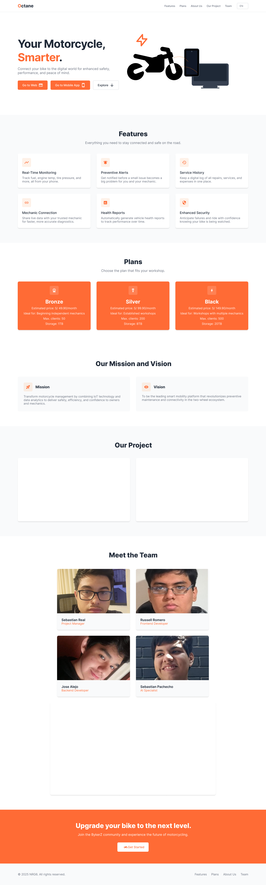

## 6.4. Applications UX/UI Design

En esta sección se desarrolla la propuesta de diseño visual e interactivo de las aplicaciones, mostrando cómo se materializan los principios de usabilidad, accesibilidad y consistencia visual para ofrecer una experiencia de usuario fluida y coherente con la identidad de la startup.

### 6.4.1. Applications Wireframes

**Web Application**

Esta sección presenta los wireframes de las aplicacion web, donde se define la estructura, jerarquía y navegación de la interfaz. Se evidencia la aplicación de los principios de diseño inclusivo, la arquitectura de información y las buenas prácticas de diseño centrado en el usuario.

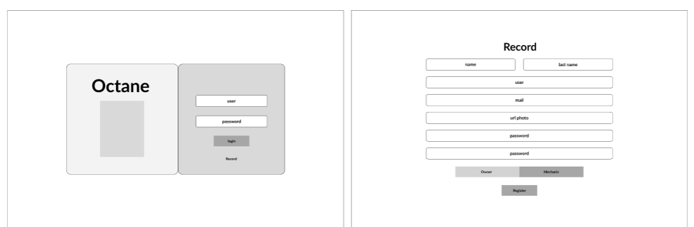

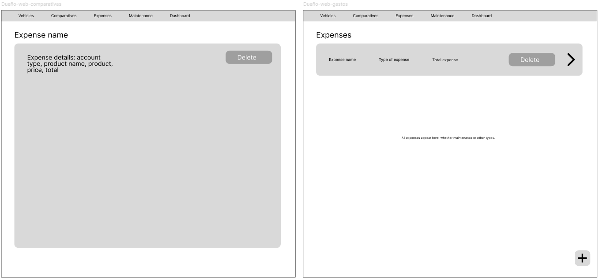
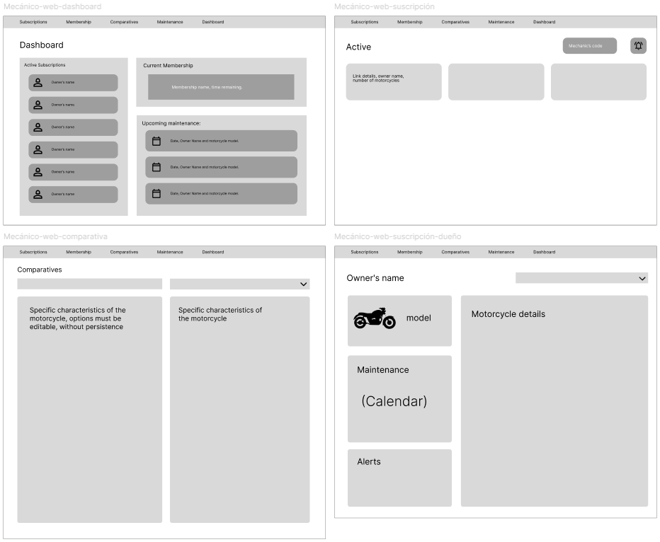
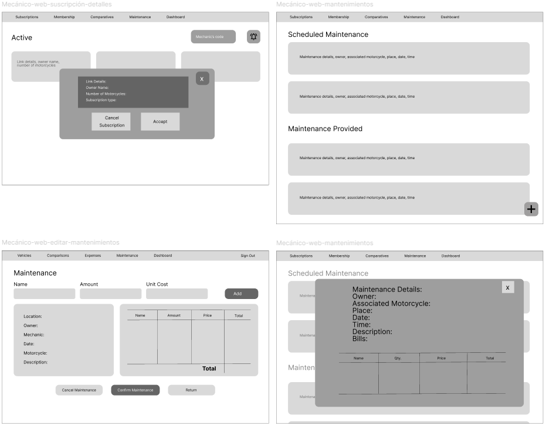

**Mobile Application**

Esta sección presenta los wireframes de las aplicacion movil, donde se define la estructura, jerarquía y navegación de la interfaz. Se evidencia la aplicación de los principios de diseño inclusivo, la arquitectura de información y las buenas prácticas de diseño centrado en el usuario.

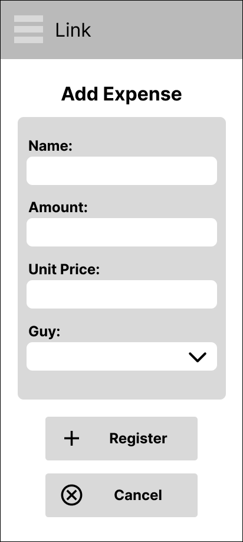

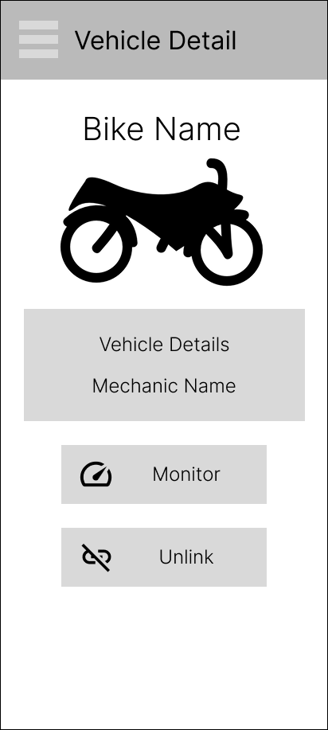

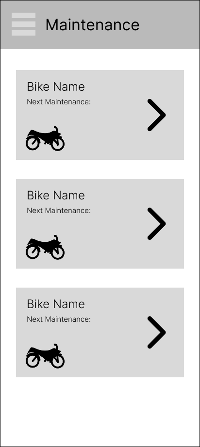
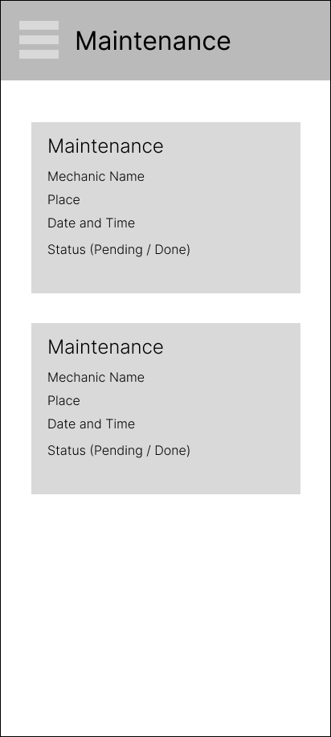

### 6.4.2. Applications Wireflow Diagrams
En esta sección se presentan los wireflows que ilustran los flujos de interacción y navegación dentro de las aplicaciones web y móvil de BykerZ, considerando los User goals propuestos.

**Web Application**

La aplicación web está diseñada para ambos User Persona, siendo dueños de motocicletas o mecánicos, con funcionalidades adaptadas a sus necesidades específicas y con una navegación intuitiva.

**User Goal: Como dueño de moto, quiero visualizar los gastos que tengo registrados.**

El wireflow inicia cuando el usuario presiona en la barra de navegación superior desde el panel principal y selecciona la sección Gastos. Al acceder, la interfaz muestra la lista de registros existentes, permitiendo al usuario visualizar la información general de cada gasto de manera clara y organizada.

**User Goal: Como dueño de moto, quiero visualizar la comparativa que hay entre mis vehículos.**

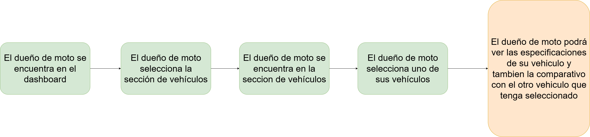
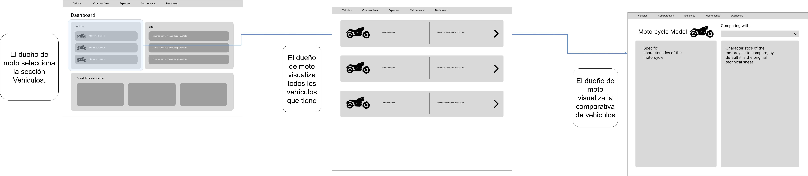

El wireflow inicia cuando el usuario presiona en la barra de navegación superior desde el panel principal y selecciona la sección Comparativas. Al acceder, la interfaz muestra las cards de los vehículos registrados, donde el usuario presiona en la card de su preferencia para ver los detalles. Finalmente, el sistema despliega una vista con la comparativa entre los vehículos seleccionados, permitiendo al usuario observar de forma clara las diferencias y similitudes en aspectos clave como rendimiento, costos y mantenimientos.

**User Goal: Como dueño de moto, quiero revisar los matenimientos de mis vehículos.**

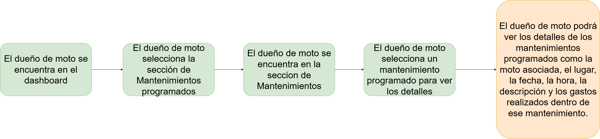

El wireflow inicia cuando el usuario presiona en la barra de navegación superior desde el panel principal y selecciona la sección Mantenimientos. Al acceder, la interfaz muestra los recuadros de las motos registradas, donde el usuario presiona el recuadro de su moto para ver los detalles. Finalmente, el sistema despliega una vista con los mantenimientos programados, permitiendo al usuario observar de forma clara las fechas, tipos de servicio y estado de cada mantenimiento.

**User Goal: Como dueño de moto, quiero visualizar mis motocicletas registradas.**

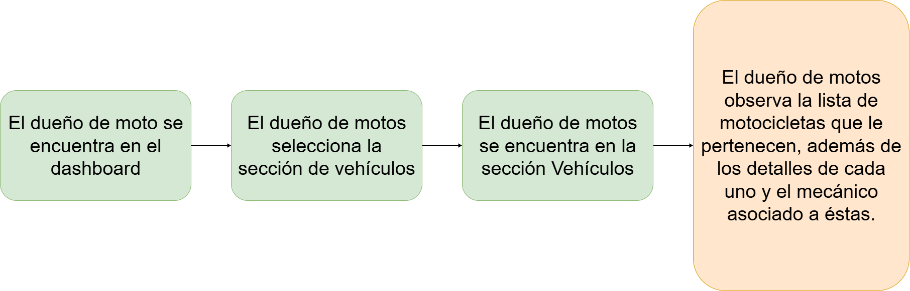
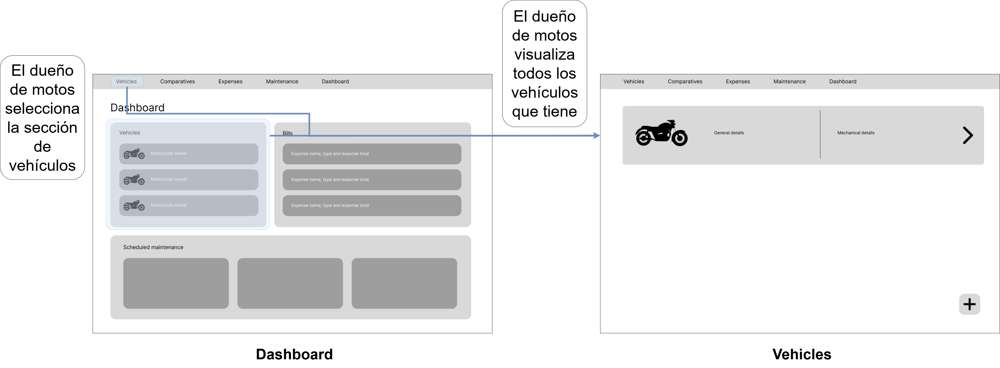

El wireflow inicia cuando el usuario presiona en la barra de navegación superior desde el panel principal y selecciona la opción Vehículos. Al acceder a la página, el sistema muestra la lista de vehículos registrados del usuario, permitiéndole visualizar la información general de cada uno de manera clara y organizada.

**User Goal: Como dueño de moto, quiero vincular un nuevo mecánico a mi motocicleta.**

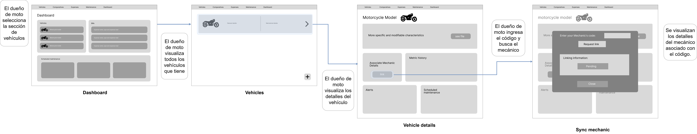

El wireflow inicia cuando el usuario presiona en la barra de navegación superior desde el panel principal y selecciona la sección Vehículos. Luego, el usuario presiona en la moto de su preferencia para acceder a los detalles del vehículo. Dentro de esta vista, el usuario presiona el botón Vincular, ingresa el código del mecánico y confirma la acción al presionar Solicitar. Finalmente, el sistema actualiza la interfaz y el usuario observa su moto vinculada correctamente al mecánico correspondiente.

**User Goal: Como dueño de moto, quiero editar los detalles de una motocicleta que me pertenece.**

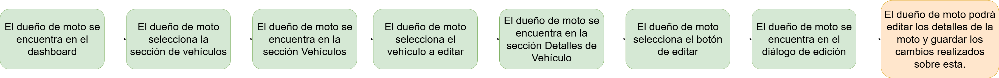
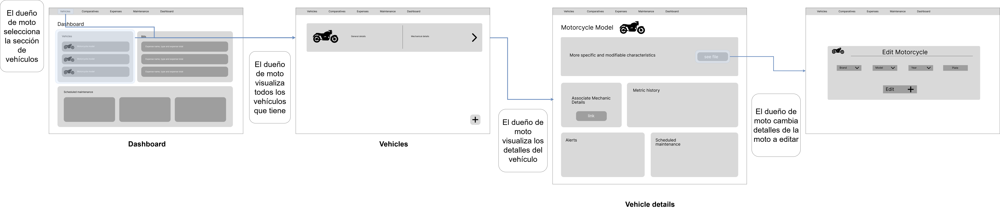

El wireflow inicia cuando el usuario presiona en la barra de navegación superior desde el panel principal y selecciona la sección Vehículos. En la lista de motos registradas, el usuario presiona en su vehículo para acceder a los detalles del mismo. Dentro de esta vista, el usuario presiona el botón Editar, realiza los cambios necesarios en el formulario y confirma la acción al presionar Guardar. Finalmente, el sistema actualiza la interfaz y el usuario observa los detalles modificados reflejados en la pantalla.

**User Goal: Como mecánico de motos, quiero visualizar las suscripciones activas.**

El wireflow inicia cuando el usuario presiona en la barra de navegación superior desde el panel principal y selecciona la sección Suscripciones. Al acceder, la interfaz muestra la lista de suscripciones activas, permitiendo al mecánico visualizar la información general de cada una de manera clara y organizada.

**User Goal: Como mecánico de motos, quiero visualizar la comparativa que hay entre mis vehículos.**

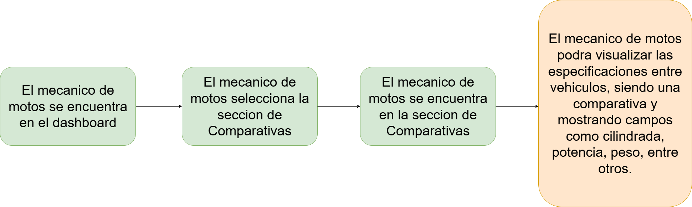
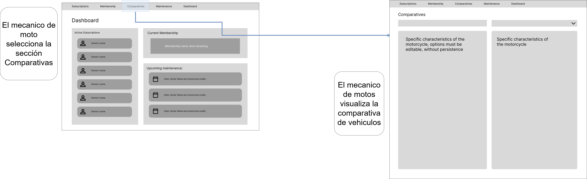

El wireflow inicia cuando el usuario presiona en la barra de navegación superior desde el panel principal y selecciona la sección Comparativas. Al acceder, la interfaz muestra las cards de los vehículos registrados, donde el usuario presiona en la card de su preferencia para ver los detalles. Finalmente, el sistema despliega una vista con la comparativa entre los vehículos seleccionados, permitiendo al usuario observar de forma clara las diferencias y similitudes en aspectos clave como rendimiento, costos y mantenimientos.

**User Goal: Como mecánico de motos, quiero progamar un mantenimiento.**

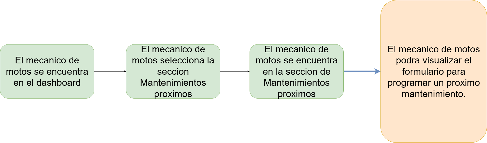

El wireflow inicia cuando el usuario presiona en la barra de navegación superior desde el panel principal y selecciona la sección Mantenimientos. Al acceder, la interfaz muestra los recuadros de las motos registradas, donde el usuario presiona el recuadro de su moto para ver los detalles. Dentro de esta vista, el usuario presiona el botón Programar, completa el formulario con los detalles del mantenimiento y confirma la acción al presionar Guardar. Finalmente, el sistema actualiza la interfaz y el usuario observa el nuevo mantenimiento programado reflejado en la pantalla.

**User Goal: Como mecanico de motos, quiero adquirir las membresias.**

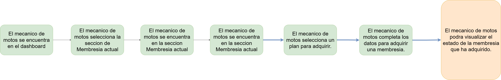
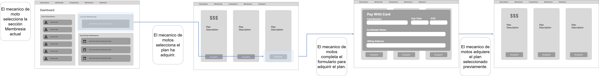

El wireflow inicia cuando el usuario presiona en la barra de navegación superior desde el panel principal y selecciona la sección Membresía. Al acceder, la interfaz muestra las opciones de planes disponibles, donde el usuario presiona en el plan de su preferencia para ver los detalles. Dentro de esta vista, el usuario presiona el botón Adquirir, completa el formulario con los datos de pago y confirma la acción al presionar Confirmar. Finalmente, el sistema actualiza la interfaz y el usuario observa la confirmación de su membresía reflejada en la pantalla.

**Mobile Application**
La aplicación web está diseñada con las funcionalidades para los dueños de motocicletas, adaptadas a sus necesidades específicas y con una navegación intuitiva.

**User Goal: Como Motociclista, quiero ver  un resumen de mis vehiculos, gastos y mantenimientos.**

El wireflow inicia cuando el usuario despliega la barra lateral desde el panel principal y presiona en la sección Dashboard. Al hacerlo, la interfaz cambia para mostrar la vista del Dashboard, donde el usuario observa el resumen general que incluye sus vehículos, los gastos recientes y los próximos mantenimientos, representados mediante tarjetas o gráficos que resumen la información de forma visual y accesible.

**User Goal: Como Motociclista, quiero ver todos los mantenimientos programados de mi moto.**

El wireflow inicia cuando el usuario presiona en la barra lateral desde el panel principal y selecciona la sección Mantenimientos. Al acceder, la interfaz muestra los recuadros de las motos registradas, donde el usuario presiona el recuadro de su moto para ver los detalles. Finalmente, el sistema despliega una vista con los mantenimientos programados, permitiendo al usuario observar de forma clara las fechas, tipos de servicio y estado de cada mantenimiento.

**User Goal: Como Motociclista, quiero eliminar un gasto pasado de mi registro de gastos.**

El wireflow inicia cuando el usuario presiona en la barra lateral desde el panel principal y selecciona la sección Gastos. Una vez en la vista de gastos, el sistema muestra la lista de registros existentes, donde el usuario presiona el ícono de borrar gasto correspondiente al que desea eliminar. Finalmente, la interfaz se actualiza y el usuario observa que el gasto fue eliminado, confirmando la acción mediante la desaparición del registro o un mensaje de confirmación visual.

**User Goal: Como Motociclista, quiero monitorear las metricas de mi moto.**

El wireflow inicia cuando el usuario presiona en la barra lateral desde el panel principal y selecciona el botón Vehículos. En la lista mostrada, el usuario presiona en su vehículo para acceder a los detalles del mismo. Dentro de esta vista, el usuario presiona el botón Monitorear, tras lo cual la interfaz cambia para mostrar las métricas de la moto, permitiéndole observar información en tiempo real sobre su estado y rendimiento.

**User Goal: Como Motociclista, quiero desvincular mi moto de un mecanico.**

El wireflow inicia cuando el usuario presiona en la barra lateral desde el panel principal y selecciona la sección Vehículos. En la lista de motos registradas, el usuario presiona en su vehículo para acceder a los detalles del mismo. Dentro de esta vista, el usuario presiona el botón Desvincular, tras lo cual el sistema ejecuta la acción y actualiza la interfaz. Finalmente, el usuario observa su moto desvinculada del mecánico, reflejado mediante un cambio visual o mensaje de confirmación.

**User Goal: Como Motociclista, quiero vincular mi moto a un mecanico por su codigo.**

El wireflow inicia cuando el usuario presiona en la barra lateral desde el panel principal y selecciona la sección Vehículos. Luego, el usuario presiona en la moto de su preferencia para acceder a los detalles del vehículo. Dentro de esta vista, el usuario presiona el botón Vincular, ingresa el código del mecánico y confirma la acción al presionar Solicitar. Finalmente, el sistema actualiza la interfaz y el usuario observa su moto vinculada correctamente al mecánico correspondiente.

**User Goal: Como Motociclista, quiero registrar un vehículo en mi cuenta.**

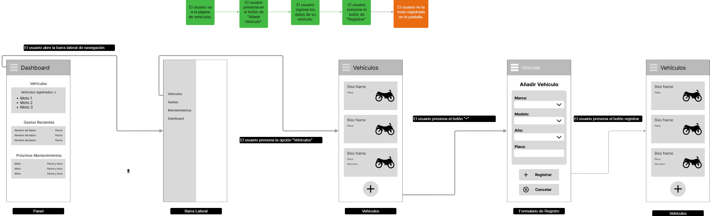

El wireflow inicia cuando el usuario abre la barra lateral de navegación y selecciona la opción Vehículos. Una vez en la página, el usuario presiona el botón “+” para añadir un nuevo vehículo. Luego, la interfaz muestra un formulario donde el usuario ingresa los datos de su vehículo y presiona el botón Registrar. Finalmente, el sistema confirma la acción mostrando la moto registrada en la pantalla, reflejada en la lista de vehículos disponibles.

**User Goal: Como Motociclista, quiero ver mis vehículos registrados.**

El wireflow inicia cuando el usuario presiona el botón de la barra lateral desde el panel principal y selecciona la opción Vehículos. Al acceder a la página, el sistema muestra la lista de vehículos registrados del usuario, permitiéndole visualizar la información general de cada uno de manera clara y organizada.

**User Goal: Como Motociclista, registrar mis gastos.**

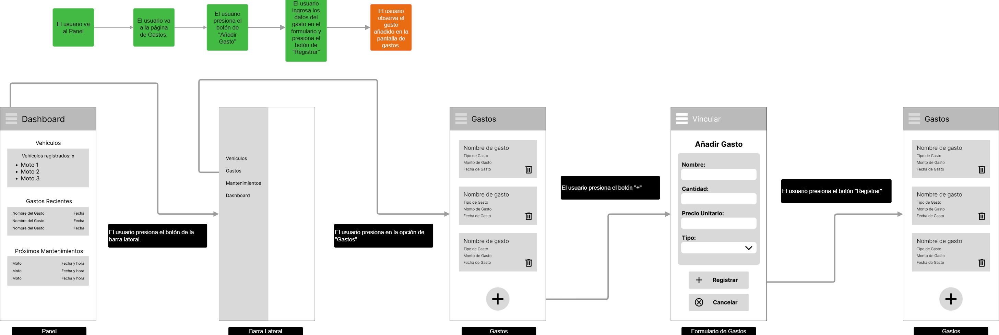

El wireflow inicia cuando el usuario presiona el botón de la barra lateral desde el panel principal y selecciona la opción Gastos. Una vez en la página, el usuario presiona el botón “+” para añadir un nuevo gasto. La interfaz muestra un formulario donde el usuario ingresa los datos correspondientes y presiona el botón “Registrar”. Finalmente, el sistema actualiza la vista y el usuario observa el nuevo gasto añadido en la pantalla de gastos.

**User Goal: Como Motociclista, quiero ver mis gastos registrados**

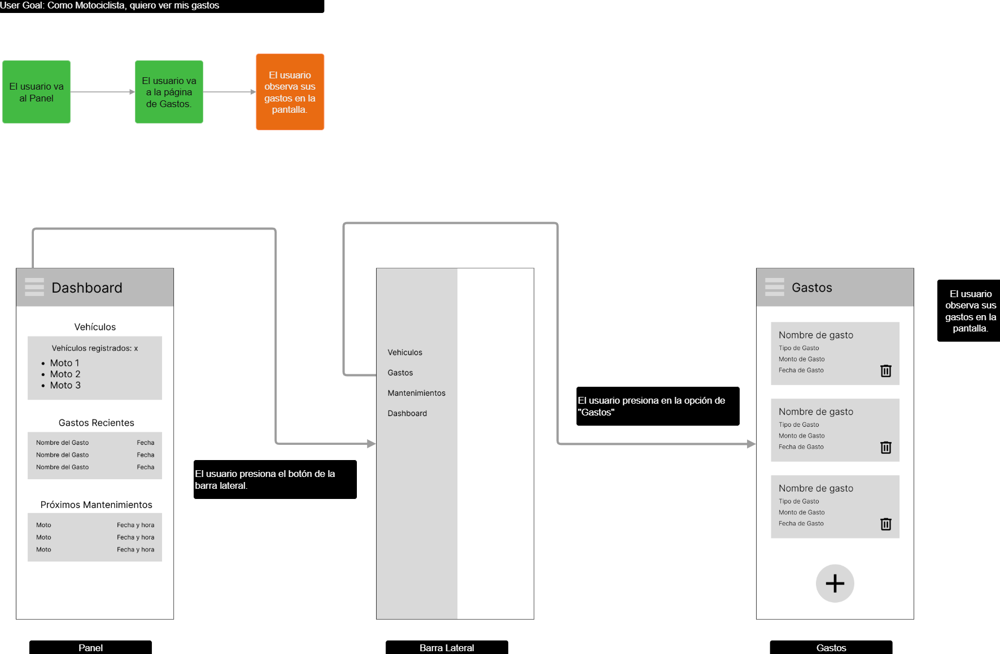

El wireflow inicia cuando el usuario presiona el botón de la barra lateral desde el panel principal y selecciona la opción Gastos. Al acceder a la página, el sistema muestra en pantalla los gastos registrados del usuario, permitiéndole observar y revisar la información correspondiente de manera clara y ordenada.

## 6.5 Applications Prototyping

# Capítulo VII: Production Implementation Validation & Deploymeny

## 7.1 Software Configuration Management
En este ítem se definirán todas las reglas y procesos que hemos seguido en el proyecto al momento de crear y desplegar Octane. El objetivo de estas reglas y procesos es garantizar la integridad y consistencia del software, desde el inicio hasta el despliegue y mantenimiento.

### 7.1.1 Software Development Environment Configuration

**Project Management**

Para la organización del proyecto requerimos de un sistema de asignación de tareas, plataformas y puntos de reunión y un repositorio dónde trabajaremos en conjunto cada avance del proyecto.

**Herramientas**

- Centro de organización de trabajo: Github
- Planificación de tareas: Trello
- Reuniones con el equipo: Discord
- Coordinación grupal: WhatsApp

**Requirements Management**

Utilizamos Trello para designar las tareas y actividades de cada integrante del grupo en caso de revisión o cambios.

|Herramienta|	Descripción|	Enlace|
|-|-|-|
|Trello|	Para designar las tareas y actividades de cada integrante del grupo en caso de revisión o cambios.|	https://trello.com/|

**Product UX/UI Design**

Para el diseño de los wireframes y mockups, además de la realización del prototipo de la mobile application y web application, utilizamos Figma.

|Herramienta|	Descripción|	Enlace|
|-|-|-|
|Figma|	Para el diseño de los wireframes y mockups, además de la realización del prototipo de Web App.|	https://www.figma.com/|

**Software Development**

Empleamos Android y Jetpack Compose para la creación de la mobile application, Spring Boot para la creación de la API REST y Angular para la web application. Para el desarrollo de la landing page utilizamos html, js y css.

|Herramienta|	Descripción|	Enlace|
|-|-|-|
|Android|	Lenguaje de programación utilizado para la creación de la mobile application|	https://developer.android.com/|
|Jetpack Compose|	Framework utilizado para la creación de la mobile application|	https://developer.android.com/compose|
|Spring Boot|	Framework utilizado para la creación de la API REST|	https://spring.io/projects/spring-boot|
|Tailwind CSS|	Framework utilizado para la creación de la landing page|	https://tailwindcss.com/|
|Angular|	Framework de desarrollo web open source	|https://angular.dev/|
|Python|	Lenguaje de programación utilizado para el desarrollo de scripts|	https://www.python.org/|

**Software Testing**

Para las pruebas unitarias y de integración utilizamos JUnit y Mockito para la API REST.

|Herramienta|	Descripción|	Enlace|
|-|-|-|
|JUnit	|Framework de pruebas unitarias para Java	|https://junit.org/|
|Mockito|	Framework de simulación para pruebas unitarias en Java|	https://site.mockito.org/|

**Software Deployment**

Para el despliegue de la API REST y la web application utilizamos Render. Para la distribución de la versión mobile application utilizamos Firebase App Distribution.

|Herramienta|	Descripción|	Enlace|
|-|-|-|
|Render|	Plataforma de despliegue en la nube	|https://render.com/|
|Firebase App Distribution|	Plataforma para distribuir versiones de prueba de aplicaciones móviles|	https://firebase.google.com/products/app-distribution|

**Software Documentation**

Para la documentación del software utilizamos Markdown, y para el trabajo colaborativo Github.

|Herramienta|	Descripción|	Enlace|
|-|-|-|
|Markdown|	Lenguaje de marcado utilizado para la documentación del proyecto|	https://www.markdownguide.org/|
|Github|	Para gestionar la documentación del proyecto|	https://github.com/NRG-4/report|

### 7.1.2 Source Code Management

Para la gestión del código fuente, utilizamos los siguientes repositorios:

|Herramienta|	Descripción|	Enlace|
|-|-|-|
|Mobile Application|	BykerZ-Mobile-Application|	https://github.com/NRG-6-IOT/BykerZ-Mobile-Application.git|
|Backend|	BykerZ-Backend|	https://github.com/NRG-6-IOT/BykerZ-Backend.git|
|Landing Page|	BykerZ-Landing-Page|	https://github.com/NRG-6-IOT/BykerZ-Landing-Page.git|
|Web Application|	BykerZ-Web-Application	|https://github.com/NRG-6-IOT/BykerZ-Web-Application.git|
|Edge Service|	BykerZ-Edge-Service	|https://github.com/NRG-6-IOT/BykerZ-Edge-Service|
|Embedded Application|	BykerZ-Embedded-Application	|https://github.com/NRG-6-IOT/BykerZ-Embedded-Application|

**Flujo de trabajo GitFlow**

Usaremos el flujo de trabajo planteado por Vincent Driessen en "A successful Git branching model" con los siguientes parámetros:

- Una rama de producción.
- Una rama de pruebas.
- Una rama en la que se solucionen los bugs rápidamente y vuelvan a producción.
- Ramas de features a implementar.
- Cada cambio en producción debe establecerse como una nueva versión.

**Ramas definidas:**

- Main branch: Rama de producción, cada cambio requiere autorización de un compañero de equipo.
- Hotfix branch: Para errores identificados que deben solucionarse y desplegarse nuevamente en producción.
- Develop branch: Implementaciones constantes de features.
- Features branch: Cada feature tendrá su propia rama, luego se fusiona en develop.

**Nomenclatura de versiones:**

- Major changes: Cambios significativos incompatibles (ej. 1.0.0 -> 2.0.0).
- Minor changes: Cambios que añaden o modifican características (ej. 1.1.0 -> 1.2.0).
- Patch: Correcciones menores (ej. 1.1.3 -> 1.1.4).

**Sufijos asignados:**

- alpha: Versión no estable.
- beta: Versión funcional pero no lista para publicación.
- rc: Versión candidata para publicación.

### 7.1.3 Source Code Style Guide & Conventions

El equipo adopta convenciones estandarizadas de codificación para asegurar la coherencia, legibilidad y mantenibilidad del código en todos los componentes del sistema. Todas las nomenclaturas, identificadores y comentarios se escribirán en inglés, siguiendo las guías oficiales de estilo recomendadas para cada tecnología empleada en la solución.

**Mobile Application – Android (Kotlin/Java)**

- Classes: PascalCase (e.g., UserProfileActivity).
- Functions & Variables: camelCase (e.g., getUserData(), userName).
- Constants: UPPER_SNAKE_CASE (e.g., MAX_ATTEMPTS).
- Architecture: Separación por capas (MVVM – Model, ViewModel, View).
- Good Practices:
  - Mantener lógica fuera de la UI (ViewModel o UseCase).
  - Evitar operaciones costosas en @Composable.
  - Documentar funciones con KDoc.

**Web Application – Angular (TypeScript, HTML, CSS)**

- Components & Services: PascalCase (e.g., UserDashboardComponent, AuthService).
- Variables & Methods: camelCase (e.g., userProfile, loadData()).
- Interfaces: Prefijo I (e.g., IUser, IServiceResponse).
- File Naming: kebab-case (e.g., user-profile.component.ts).
- HTML Structure:
  - Uso semántico de etiquetas.
  - Identificadores claros (id, class) en kebab-case.
- CSS / Tailwind CSS:
  - Ordenar clases en el siguiente orden: Layout → Flex/Grid → Spacing → Typography → Colors → Effects.
  - Uso de prefijos sm:, md:, lg: para diseño responsive.
  - Evitar uso excesivo de @apply en archivos CSS.

**Backend – Spring Boot (Java)**

- Package Structure: controller, service, repository, model, config.
- Naming Conventions:
  - Classes: PascalCase (e.g., UserController).
  - Methods & Variables: camelCase (e.g., findUserById()).
  - Constants: UPPER_SNAKE_CASE.
- Good Practices:
  - Inyección de dependencias con @Autowired o constructor.
  - Validaciones mediante @Valid.
  - Manejo de excepciones centralizado con @ControllerAdvice.
  - Documentación con JavaDoc.

**Database – PostgreSQL**

- Table Names: snake_case plural (e.g., user_profiles). 
- Column Names: snake_case (e.g., created_at).
- Primary Keys: id o table_name_id (e.g., user_id).
- Foreign Keys: referenced_table_id.
- Views & Indexes: prefijo v_ y idx_ respectivamente.
- Scripts: comentarios en inglés y consistencia en sangría.

**Landing Page – HTML & CSS**

- HTML:
  - Estructura semántica (< header >, < main >, < footer >).
  - Atributos y etiquetas en minúsculas.
  - Sangría de 2 espacios.
- CSS:
  - Nombres de clases en kebab-case (e.g., main-banner).
  - Uso de variables CSS para colores y tipografía.
  - Evitar el uso de IDs para estilos.

**General Guidelines**

- Comments: Siempre en inglés, explicando el por qué y no solo el qué.
- Commits: Convención semántica (feat:, fix:, docs:, refactor:, test:).
- Version Control: Ramas en formato kebab-case (feature/add-login-page).
- Performance: Uso de lazy loading para imágenes, módulos y componentes.
- Accessibility: Cumplimiento de WCAG 2.1 en interfaces web y móviles.

### 7.1.4 Software Deployment Configuration

**Landing Page**

1. Ejecutar npm run build localmente.
2. Subir repositorio a GitHub (público).
3. Crear servicio en Render → Web Service.
4. Seleccionar repositorio y configurar.
5. Deploy y verificación en la URL pública.

**Mobile Application**

1. Activar modo desarrollador y depuración USB en dispositivo.
2. Conectar a la PC.
3. Abrir proyecto en Android Studio.
4. Seleccionar dispositivo y ejecutar.
5. Verificar funcionamiento.

**Web Application**

1. Subir repositorio a GitHub (público).
2. Crear Web Service en Render.
3. Seleccionar repositorio y configurar.
4. Deploy y verificación en la URL pública.

**Backend**

1. Configurar base de datos en Neontech.
2. Crear Dockerfile para despliegue.
3. Crear Web Service en Render.
4. Importar repositorio backend.
5. Deploy de la API.

**Deployment diagram C4 model:**

## 7.2 Solution Implementation

### 7.2.1 Sprint 1

#### 7.2.1.1 Sprint Planning 1

#### 7.2.1.2 Sprint Backlog 1

#### 7.2.1.3 Development Evidence for Sprint Review

#### 7.2.1.4 Testing Suite Evidence for Sprint Review

#### 7.2.1.5 Execution Evidence for Sprint Review

#### 7.2.1.6 Services Documentation Evidence for Sprint Review

#### 7.2.1.7 Software Deployment Evidence for Sprint Review

#### 7.2.1.8 Team Collaboration Insights During Sprint

# Conclusiones

El desarrollo del proyecto permitió integrar enfoques de análisis de negocio, diseño centrado en el usuario, modelado de dominio y arquitectura de software, logrando una visión más completa de la solución propuesta. Mediante herramientas como Lean UX, Impact Mapping, Event Storming y Context Mapping, el equipo pudo comprender mejor la problemática, definir las necesidades de los usuarios y alinear la propuesta con los objetivos del negocio.

Asimismo, los artefactos elaborados en TB1, como User Personas, escenarios As-Is y To-Be, atributos de calidad y drivers arquitectónicos, sirvieron como base para la toma de decisiones de diseño. En el TP, esta base se fortaleció con la definición de los Bounded Contexts, Style Guidelines, Information Architecture y diseños UX/UI, permitiendo organizar mejor las responsabilidades del sistema y mantener coherencia entre la arquitectura, la experiencia de usuario y la identidad visual del producto.

El uso de GitHub facilitó la colaboración del equipo mediante ramas, commits y pull requests, permitiendo organizar los aportes individuales y mantener trazabilidad sobre los cambios realizados. Esta dinámica ayudó a integrar progresivamente el trabajo de cada integrante y a conservar la calidad y consistencia del informe.

Por otro lado, el proyecto evidenció la importancia de la comunicación oral y escrita para coordinar avances, explicar decisiones y asegurar que todos los miembros comprendieran los distintos componentes de la solución. Esto fue especialmente importante durante el TP, donde se trabajaron aspectos más específicos del diseño táctico, visual y funcional del sistema.

Finalmente, se concluye que el trabajo realizado en TB1 y TP permitió construir una base sólida para continuar con el desarrollo del proyecto. La combinación de metodologías estructuradas, documentación clara y trabajo colaborativo contribuyó a reducir riesgos, ordenar la evolución de la solución y preparar al equipo para las siguientes etapas de Octane.

# Bibliografía

Freitas, M. C. (2025, 19 de julio). Lima registra 1.668 muertes por accidentes de tránsito en lo que va del 2025: motociclistas lideran víctimas, según el MTC. Infobae. https://www.infobae.com/peru/2025/07/19/lima-registra-1668-muertes-por-accidentes-de-transito-en-lo-que-va-del-2025-motociclistas-lideran-victimas-segun-el-mtc/

Bool.dev. (2023, 10 de octubre). Top 10 software architecture styles. Bool.dev. https://bool.dev/blog/detail/top10-software-architecture-styles

Ddd-Crew. (s.f.). Domain-Driven Design Starter Modelling Process. GitHub. https://github.com/ddd-crew/ddd-starter-modelling-process
