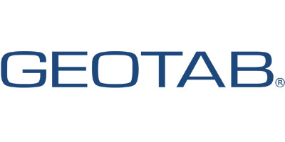
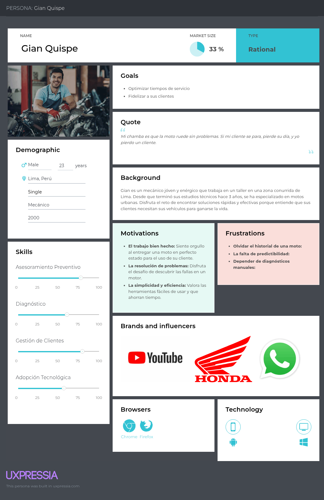
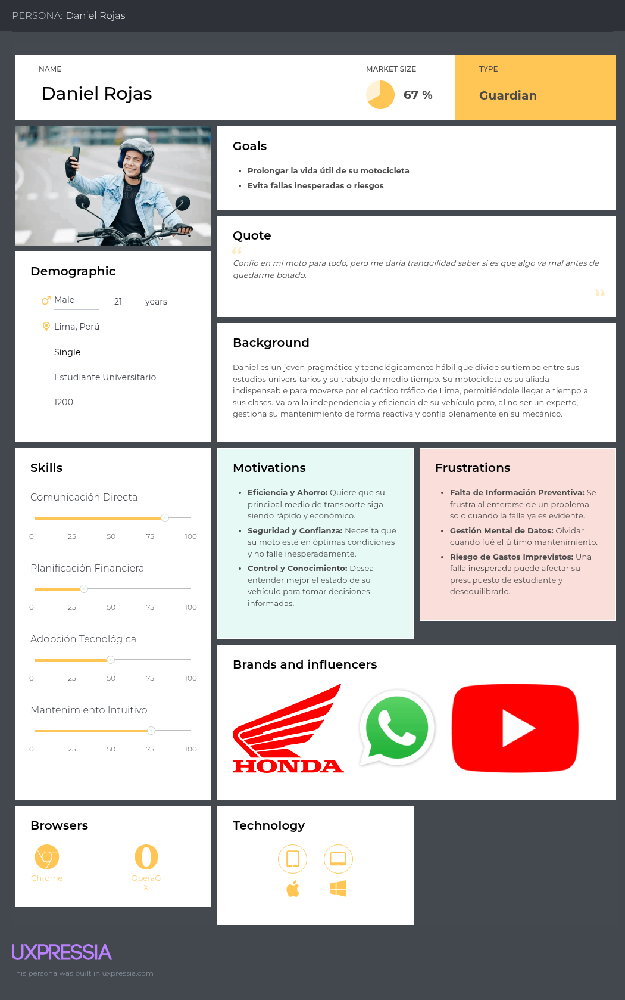
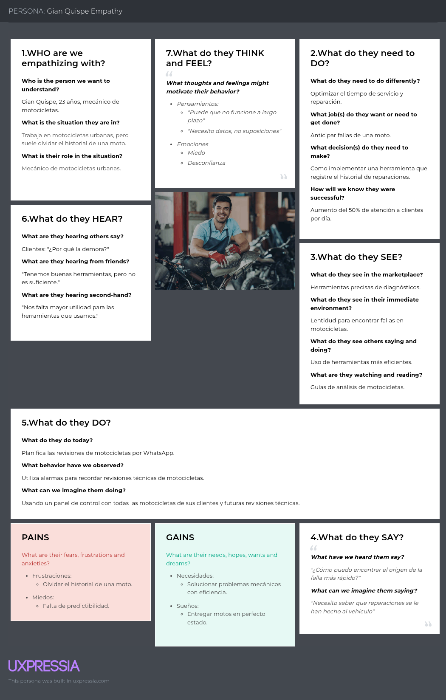

**Universidad Peruana de Ciencias Aplicadas**

**Facultad:** Ingeniería

**Carrera:** Ingeniería de software

**Periodo:** 202601

**CURSO:** Arquitecturas de Software Emergentes

**Código del Curso**: 1ASI0728

**NRC**: 11770

**Profesor:** Christian Luis De Los Rios Fernandez

**Informe del Trabajo Final**

**Nombre del startup:** Nodrify

**Nombre del producto:** Octane

**Integrantes**

| **Nombre**                                | **Código** |
|-------------------------------------------|------------|
| **Real Calderon Sebatian Omar**           | U20221D964 |
| **Alejo Cardenas Jose Antonio**           | U202122484 |
| **Pacheco Astiguetta Sebastian**          | U202110291 |
| **Russell Stephen Romero Qwistgaard**     |            |

**Abril 2026**

**Registro de Versiones del Informe**

| Versión | Fecha | Autor | Descripción de modificación |
|--------|-------|--------|-----------------------------|
|        |       |        |                             |
|        |       |        |                             |
|        |       |        |                             |
|        |       |        |                             |
|        |       |        |                             |

**Project Report Collaboration Insights**

**Contenido**

- [Student Outcome](#student-outcome)
  - [Capítulo I: Introducción](#capítulo-i-introducción)
    - [1.1. Startup Profile](#11-startup-profile)
      - [1.1.1. Descripción de la Startup](#111-descripción-de-la-startup)
      - [1.1.2. Perfiles de integrantes del equipo](#112-perfiles-de-integrantes-del-equipo)
    - [1.2. Solution Profile](#12-solution-profile)
      - [1.2.1. Antecedentes y problemática](#121-antecedentes-y-problemática)
      - [1.2.2. Lean UX Process](#122-lean-ux-process)
        - [1.2.2.1. Lean UX Problem Statements](#1221-lean-ux-problem-statements)
        - [1.2.2.2. Lean UX Assumptions](#1222-lean-ux-assumptions)
        - [1.2.2.3. Lean UX Hypothesis Statements](#1223-lean-ux-hypothesis-statements)
        - [1.2.2.4. Lean UX Canvas](#1224-lean-ux-canvas)
    - [1.3. Segmentos objetivo](#13-segmentos-objetivo)
  - [Capítulo II: Requirements Elicitation & Analysis](#capítulo-ii-requirements-elicitation--analysis)
    - [2.1. Competidores](#21-competidores)
      - [2.1.1. Análisis competitivo](#211-análisis-competitivo)
      - [2.1.2. Estrategias y tácticas frente a competidores](#212-estrategias-y-tácticas-frente-a-competidores)
    - [2.2. Entrevistas](#22-entrevistas)
      - [2.2.1. Diseño de entrevistas](#221-diseño-de-entrevistas)
      - [2.2.2. Registro de entrevistas](#222-registro-de-entrevistas)
      - [2.2.3. Análisis de entrevistas](#223-análisis-de-entrevistas)
    - [2.3. Needfinding](#23-needfinding)
      - [2.3.1. User Personas](#231-user-personas)
      - [2.3.2. User Task Matrix](#232-user-task-matrix)
      - [2.3.3. Empathy Mapping](#233-empathy-mapping)
      - [2.3.4. As-is Scenario Mapping](#234-as-is-scenario-mapping)
    - [2.4. Ubiquitous Language](#24-ubiquitous-language)
  - [Capítulo III: Requirements Specification](#capítulo-iii-requirements-specification)
    - [3.1. To-Be Scenario Mapping](#31-to-be-scenario-mapping)
    - [3.2. User Stories](#32-user-stories)
    - [3.3. Impact Mapping](#33-impact-mapping)
    - [3.4. Product Backlog](#34-product-backlog)
  - [Capítulo IV: Strategic-Level Software Design](#capítulo-iv-strategic-level-software-design)
    - [4.1. Strategic-Level Attribute-Driven Design](#41-strategic-level-attribute-driven-design)
      - [4.1.1. Design Purpose](#411-design-purpose)
      - [4.1.2. Attribute-Driven Design Inputs](#412-attribute-driven-design-inputs)
        - [4.1.2.1. Primary Functionality (Primary User Stories)](#4121-primary-functionality-primary-user-stories)
        - [4.1.2.2. Quality Attribute Scenarios](#4122-quality-attribute-scenarios)
        - [4.1.2.3. Constraints](#4123-constraints)
      - [4.1.3. Architectural Drivers Backlog](#413-architectural-drivers-backlog)
      - [4.1.4. Architectural Design Decisions](#414-architectural-design-decisions)
      - [4.1.5. Quality Attribute Scenario Refinements](#415-quality-attribute-scenario-refinements)
    - [4.2. Strategic-Level Domain-Driven Design](#42-strategic-level-domain-driven-design)
      - [4.2.1. EventStorming](#421-eventstorming)
      - [4.2.2. Candidate Context Discovery](#422-candidate-context-discovery)
      - [4.2.3. Domain Message Flows Modeling](#423-domain-message-flows-modeling)
      - [4.2.4. Bounded Context Canvases](#424-bounded-context-canvases)
      - [4.2.5. Context Mapping](#425-context-mapping)
    - [4.3. Software Architecture](#43-software-architecture)
      - [4.3.1. Software Architecture System Landscape Diagram](#431-software-architecture-system-landscape-diagram)
      - [4.3.2. Software Architecture Context Level Diagrams](#432-software-architecture-context-level-diagrams)
      - [4.3.3. Software Architecture Container Level Diagrams](#433-software-architecture-container-level-diagrams)
      - [4.3.4. Software Architecture Deployment Diagrams](#434-software-architecture-deployment-diagrams)

# Student Outcome

El curso contribuye al cumplimiento del Student Outcome ABET:
**ABET – EAC - Student Outcome 3**

Criterio: *Capacidad de comunicarse efectivamente con un rango de audiencias.*
En el siguiente cuadro se describe las acciones realizadas y enunciados de conclusiones por parte del grupo, que permiten sustentar el haber alcanzado el logro del ABET – EAC - Student Outcome 3.

<table>
  <thead>
    <tr>
      <th>Criterio específico</th>
      <th>Acciones realizadas</th>
      <th>Conclusiones</th>
    </tr>
  </thead>
  <tbody>
    <tr>
      <td>
        Comunica oralmente sus ideas y/o resultados con objetividad a público de diferentes especialidades y niveles jerarquicos, en el marco del desarrollo de un proyecto en ingeniería.
      </td>
      <td>
        <!--Acciones Realizadas-->
        Sebastián Omar Real Calderón
         
        TB1 
        <!--Añadir Info-->
         
        Alejo Cardenas Jose Antonio
         
        TB1 
        <!--Añadir Info-->
         
        Pacheco Astiguetta Sebastian
         
        TB1 
        <!--Añadir Info-->
         
        Russell Stephen Romero Qwistgaard
         
        TB1 
        <!--Añadir Info-->
         
      </td>
      <td>
        <!--Conclusiones grupales-->
      </td>
    </tr>
    <tr>
      <td>
        Comunica en forma escrita ideas y/o resultados con objetividad a público de diferentes especialidades y niveles jerarquicos, en el marco del desarrollo de un proyecto en ingeniería.
      </td>
      <td>
        <!--Acciones Realizadas-->
        Sebastián Omar Real Calderón
         
        TB1 
        <!--Añadir Info-->
         
        Alejo Cardenas Jose Antonio
         
        TB1 
        <!--Añadir Info-->
         
        Pacheco Astiguetta Sebastian
         
        TB1 
        <!--Añadir Info-->
         
        Russell Stephen Romero Qwistgaard
         
        TB1 
        <!--Añadir Info-->
         
      </td>
      <td>
        <!--Conclusiones grupales-->
      </td>
    </tr>
  </tbody>
</table>

## Capítulo I: Introducción

### 1.1. Startup Profile

#### 1.1.1. Descripción de la Startup

Nodrify es una startup tecnológica peruana, surgida en la Facultad de Ingeniería de la Universidad Peruana de Ciencias Aplicadas (UPC), enfocada en la innovación para el sector de movilidad inteligente. Nuestra misión es transformar la manera en que propietarios, mecánicos y empresas gestionan el estado, uso y bienestar de las motocicletas, combinando arquitecturas de software emergentes, IoT y análisis de datos en una sola plataforma integral.

Nuestro producto estrella, Octane, conecta dispositivos de telemetría avanzada instalados en los vehículos con un ecosistema digital (web y móvil) diseñado para eliminar la ceguera operativa en el mantenimiento. Mediante el uso de sensores en tiempo real y procesamiento de datos, brindamos a los usuarios una visión completa de su vehículo: métricas críticas, historiales de mantenimiento digitales, alertas preventivas y reportes técnicos personalizados, optimizando la relación entre el motociclista y su taller de confianza.

Misión: Transformar la gestión de motocicletas combinando tecnología IoT y análisis de datos para ofrecer seguridad, eficiencia y confianza a propietarios y mecánicos, reduciendo la incidencia de accidentes por fallas mecánicas.

Visión: Ser la plataforma líder en movilidad inteligente en el mercado peruano que revolucione el mantenimiento preventivo y la conexión en el ecosistema de vehículos de dos ruedas.

#### 1.1.2. Perfiles de integrantes del equipo

### 1.2. Solution Profile

#### 1.2.1. Antecedentes y problemática

**What**

- ¿Cuál es el problema?

El problema principal recae en la dificultad de realizar revisiones proactivas, ya que los propietarios carecen por completo de visibilidad en tiempo real sobre la salud de sus vehículos. Esta ceguera operativa conduce inevitablemente a fallas inesperadas y costosas. Por su parte, los talleres mecánicos se ven forzados a operar de manera reactiva; aunque realizan una revisión general al recibir la moto, el proceso de diagnóstico es lento e ineficiente, ya que deben revisar manualmente múltiples partes del vehículo hasta atinar con la fuente del problema, en lugar de poder ofrecer un mantenimiento predictivo y proactivo basado en datos precisos.

- ¿Cuál es la relación con la persona en cuestión?

La relación con el mecánico se transforma gracias a nuestra plataforma. Ya no se limita a interacciones esporádicas y reactivas cuando algo se rompe, sino que se convierte en una relación constante y proactiva. El mecánico utiliza la herramienta para ofrecer un servicio de monitoreo continuo, lo que le permite actuar como un aliado tecnológico y generar un vínculo de confianza mediante un valor añadido constante. Para el usuario, esta relación se traduce en acceso a datos transparentes sobre su vehículo y la recepción de alertas y recomendaciones directas de su mecánico de confianza.

En esencia, la plataforma está enfocada en proporcionar a ambos actores una herramienta integral que satisface sus necesidades específicas: facilita un monitoreo y registro sencillo de las métricas del vehículo para el usuario y, al mismo tiempo, empodera al mecánico con datos precisos para realizar revisiones más efectivas, optimizando significativamente su trabajo y elevando la calidad del servicio.

**When**

- ¿Cuándo sucede el problema?

El problema ocurre durante el uso diario de la motocicleta, cuando el propietario carece de visibilidad sobre el estado interno de su vehículo. Las fallas y el desgaste suceden de manera imprevista, sin alertas tempranas, llevando a averías inesperadas que interrumpen la movilidad y generan costosas reparaciones de emergencia.

- ¿Cuándo utiliza el cliente el producto?

El cliente utiliza la aplicación de Octane de forma continua durante sus trayectos para monitorizar en tiempo real el estado de su moto y conocer en qué momento necesita llevar a cabo mantenimiento. Además, accede a ella de manera proactiva al recibir notificaciones del taller, lo que le permite gestionar alertas específicas y agendar citas de mantenimiento con facilidad. Este uso constante no solo le ofrece tranquilidad y control sobre su vehículo, sino que también favorece directamente al mecánico, quien recibe métricas precisas y premeditadas que agilizan y optimizan el proceso de diagnóstico y reparación.

**Where**

- ¿Dónde está el cliente cuando usa el producto?

El cliente utiliza la aplicación de Octane principalmente desde su smartphone, accediendo a ella en cualquier lugar y momento. Este acceso ubicuo le permite monitorizar el estado de su moto en tiempo real durante sus desplazamientos, así como revisar de forma remota el historial técnico y las notificaciones proactivas que recibe. Si bien la plataforma se utiliza en talleres durante las interacciones con el mecánico para facilitar el diagnóstico colaborativo, su verdadero poder radica en que todas las métricas y el historial detallado del vehículo pueden visualizarse y compartirse desde cualquier lugar con acceso a internet, garantizando una supervisión continua y una comunicación fluida entre el usuario y su taller de confianza.

- ¿Dónde surge el problema?

El problema surge en la propia motocicleta durante su operación diaria, donde ocurren los eventos críticos. Además, se manifiesta en el taller mecánico, donde la falta de datos en tiempo real impide al mecánico anticiparse a las fallas y ofrece un servicio reactivo.

**Who**

- ¿Quienes se ven involucrados en el problema?

El problema involucra directamente a dos actores clave: los propietarios de motocicletas y los mecánicos. Por un lado, los usuarios enfrentan la dificultad constante de no tener conocimiento preciso del estado interno de sus vehículos, lo que los expone a sufrir fallas imprevistas y reparaciones costosas. Por otro lado, los mecánicos se ven igualmente afectados, ya que esta falta de información les impide evolucionar hacia un modelo de servicio preventivo y proactivo, lo que no solo genera ineficiencias en sus procesos de diagnóstico, sino que también representa una pérdida de oportunidades de negocio para fidelizar y agregar valor a su cartera de clientes existente.

**Why**

- ¿Por qué sucede el problema?

Las causas del problema se deben en mayor parte a la falta de datos actualizados sobre el estado del vehículo y/o poco conocimiento de algunos usuarios con respecto a identificar señales de una falla en el vehículo. Por otro lado, el diagnóstico se complica ya que carece de un historial del vehículo, dependiendo de lo que el cliente recuerde en base a reparaciones previas y/o incidentes recientes.

**How**

- ¿En qué condiciones los clientes usan nuestro producto?

Los clientes utilizan nuestro producto en condiciones de movilidad, accediendo a los datos de su moto en tiempo real durante sus trayectos o de manera remota para planificar mantenimientos. La plataforma es utilizada principalmente a través de dispositivos móviles con conectividad a internet, permitiendo interacciones tanto preventivas como reactivas ante alertas generadas por el sistema.

**How Much**

El impacto de la problemática es considerable y puede observarse en las estadísticas de seguridad vial actuales. Según un informe publicado por Freitas (2025) en Infobae, Lima registra 1.668 muertes por accidentes de tránsito en lo que va del año 2025, siendo los motociclistas quienes lideran la lista de víctimas, de acuerdo con datos del Ministerio de Transportes y Comunicaciones (MTC). Esta cifra evidencia la alta vulnerabilidad de los conductores de motocicletas y la falta de mecanismos preventivos eficaces que permitan detectar a tiempo posibles fallas mecánicas o comportamientos de riesgo durante la conducción.

Estos datos reflejan la magnitud del problema y justifican la necesidad de soluciones tecnológicas que promuevan un mantenimiento preventivo y un monitoreo constante del estado del vehículo, permitiendo anticipar fallos críticos que podrían desencadenar accidentes. De este modo, la propuesta de la plataforma Octane contribuye directamente a reducir la incidencia de accidentes asociados a fallas mecánicas y a fortalecer la cultura de prevención entre los motociclistas urbanos.

#### 1.2.2. Lean UX Process

##### 1.2.2.1. Lean UX Problem Statements

##### 1.2.2.2. Lean UX Assumptions

##### 1.2.2.3. Lean UX Hypothesis Statements

##### 1.2.2.4. Lean UX Canvas

### 1.3. Segmentos objetivo

**Segmento Objetivo #1:**
Grupo conformado por personas que usan motos con su principal medio de transporte. Ellos necesitan del vehículo para movilizarse hacia sus trabajos, estudios, actividades sociales, delivery, entre otros.  Son usuarios interesados en mantener la eficiencia presente en su moto, reducir la recepción de costos imprevistos, y monitorear el estado del vehículo con la idea de mantener seguro al conductor.

- Características clave:
  - Edad: 18 a 45 años
  - Género: Ambos
  - Contexto: Movilización frecuente a diversos lugares (trabajo, estudio, servicios de entrega, actividades sociales).
  - Ocupación: Estudiantes universitarios, trabajadores formales/informales, repartidores, jóvenes profesionales.
  - Uso de tecnología: Usuarios activos de smartphones que utilizan aplicaciones móviles a diario.
- Necesidades:
  - Monitorear el consumo de gasolina.
  - Mantener la eficiencia del vehículo.
  - Prevenir fallas con alertas de mantenimiento.
  - Tener a mano un historial de mantenimiento

**Segmento Objetivo #2:**
Grupo conformado por profesionales independientes con pequeños talleres. Ellos ofrecen servicios de reparación y mantenimiento de motocicletas. Son usuarios que requieren de herramientas que les permitan ofrecer diagnósticos más precisos y gestionar mejor la relación con sus clientes, a fin de mejorar la confianza y fidelización.

- Características clave:
  - Edad: 25 a 60 años
  - Género: Ambos
  - Contexto: Laburo en talleres de servicio mecánico, tanto formales como independientes.
  - Ocupación: Mecánicos, técnicos de motos, dueños de talleres pequeños o medianos.
  - Uso de tecnología: Software de gestión básica, con apoyo en WhatsApp y/o afines para coordinar con clientes.
- Necesidades:
  - Acceder a métricas objetivas del estado de la moto.
  - Emitir reportes de salud y diagnósticos comparativos según la moto.
  - Consultar el historial de reparaciones previas de la moto.
  - Recordar y planificar mantenimientos preventivos.

## Capítulo II: Requirements Elicitation & Analysis

### 2.1. Competidores

Relacionado a nuestro start-up, hemos identificado a otros competidores en el mercado que ofrecen soluciones similares, aunque con enfoques y características distintas. A continuación, se presenta un análisis competitivo de los principales competidores en el ámbito de la movilidad inteligente y el mantenimiento preventivo de motocicletas:

- Wialon (Gurtam)

Wialon es la plataforma de software insignia de Gurtam, una empresa bielorrusa con más de 20 años en el mercado de telemática e IoT. Está considerada una de las soluciones más versátiles para la gestión de flotas y activos móviles, con más de 4 millones de unidades conectadas en más de 160 países. Wialon funciona bajo un modelo SaaS altamente escalable y soporta más de 3.000 modelos de dispositivos GPS e IoT, lo que permite adaptarse a diferentes necesidades: desde camiones y buses hasta maquinaria pesada o transporte ligero. Entre sus funcionalidades principales destacan el rastreo en tiempo real, generación de informes personalizados, alertas de eventos, gestión de combustible, mantenimiento predictivo y herramientas de integración por API. Su principal fortaleza radica en la gran flexibilidad y ecosistema de partners, lo que lo convierte en una solución preferida para empresas de logística, transporte y operadores de flotas internacionales.

- Fuelio

Fuelio es una aplicación móvil enfocada en la gestión del consumo de combustible y el mantenimiento vehicular. Permite a los usuarios registrar de manera sencilla el kilometraje, repostajes, costos asociados y servicios realizados al vehículo, generando estadísticas detalladas sobre rendimiento y gastos. La app ofrece funcionalidades adicionales como localización de estaciones de servicio cercanas, cálculo de consumo por trayecto, y respaldo automático en la nube para mantener los datos seguros y accesibles en múltiples dispositivos. Su propuesta de valor radica en brindar control y transparencia sobre los gastos de movilidad, ayudando tanto a conductores individuales como a pequeños administradores de vehículos a optimizar su presupuesto y hábitos de conducción.

- GeoTab

Geotab, fundada en 2000 en Canadá, es uno de los líderes globales en telemática comercial y gestión de flotas, con más de 3,7 millones de vehículos conectados en más de 150 países. Su propuesta combina el dispositivo IoT Geotab GO9 con la plataforma en la nube MyGeotab, lo que permite a empresas de cualquier tamaño acceder a datos avanzados de sus vehículos. Entre sus principales funcionalidades se incluyen análisis de comportamiento de conducción, diagnóstico de motor, consumo de combustible, planificación de rutas, alertas de mantenimiento, cumplimiento normativo (como ELD en EE.UU.) y reportes personalizados. Además, Geotab cuenta con el Geotab Marketplace, un ecosistema de más de 200 aplicaciones complementarias que amplían las capacidades de la plataforma. Su diferenciador está en la precisión de sus análisis, confiabilidad y enfoque en big data e inteligencia artificial, que permiten a empresas grandes y gobiernos tomar decisiones estratégicas basadas en datos de movilidad.

#### 2.1.1. Análisis competitivo

El análisis competitivo es una herramienta fundamental para comprender el entorno en el que se desarrollará nuestro producto, identificar las fortalezas y debilidades de los competidores, y definir estrategias que nos permitan posicionarnos de manera efectiva en el mercado. A continuación, se presenta un análisis competitivo detallado de Octane frente a sus principales competidores descritos previamente.

<table> 
  <tr>
    <th colspan="6"> Competitive Analysis Landscape </th>
  </tr>
  <tr>
    <td colspan="2" rowspan="2">¿Por qué llevar acabo este análisis? </td>
    <td colspan="4"> Deberíamos llevar a cabo este análisis para conocer el entorno, la competencia, tomar decisiones de desarrollo y construir nuestra propuesta de valor. </td>
  </tr>
  <tr>
    </tr>
  <tr>
    <td colspan="2"> Productos </td>
    <td style="text-align: center;"> 
Octane
 </td>
    <td style="text-align: center;"> 
Wialon (Gurtam)
 </td>
    <td style="text-align: center;"> 
Fuelio
 </td>
    <td style="text-align: center;"> 
Geotab
 </td>
  </tr>
  <tr>
    <td rowspan="2">Perfil</td>
    <td>Overview</td>
    <td>Octane es una plataforma IoT para motocicletas que conecta mecánicos con clientes, con métricas en tiempo real y alertas preventivas.</td>
    <td>Wialon es un sistema SaaS de telemática IoT para gestión de vehículos y activos móviles, con GPS y reportes avanzados.</td>
    <td>Fuelio es una app para rastrear consumo de combustible, costos, kilometraje y servicios, con búsqueda de estaciones y respaldo en la nube.</td>
    <td>Geotab es un sistema considerado líder global en telemática, con dispositivos IoT y software para análisis de datos vehiculares.</td>
  </tr>
  <tr>
    <td>Ventaja competitiva ¿Qué valor ofrece a los clientes? </td>
    <td>Tiene un enfoque de nicho: motos + talleres mecánicos. Conexión directa cliente-mecánico mediante suscripción.</td>
    <td>Amplia cobertura global y flexibilidad de personalización para distintos tipos de flotas.</td>
    <td>Interfaz sencilla, soporte crowdsourced de precios, recordatorios, sincronización y reportes visuales potentes.</td>
    <td>Precisión en datos y analítica avanzada, gran reputación en confiabilidad.</td>
  </tr>
  <tr>
    <td rowspan="2">Perfil de Marketing</td>
    <td>Mercado Objetivo</td>
    <td>Motociclistas individuales y talleres mecánicos pequeños/medianos.</td>
    <td>Empresas de logística, transporte y flotas heterogéneas.</td>
    <td>Conductores particulares y usuarios multi-vehículo que buscan ahorrar en combustible y mantenimiento.</td>
    <td>Flotas comerciales, gobiernos, corporativos globales.</td>
  </tr>
  <tr>
    <td>Estrategias de Marketing</td>
    <td>Enfoque B2B2C: atraer talleres como socios y motociclistas vía suscripción.</td>
    <td>Estrategia B2B, alianzas con distribuidores y partners locales.</td>
    <td>Se promociona como simple y potente; cuenta con integración de precios crowdsourced, historias de usuarios satisfechos y respaldo de Sygic.</td>
    <td>Estrategia B2B global, certificaciones y partnerships institucionales.</td>
  </tr>
  <tr>
    <td rowspan="3">Perfil de Producto</td>
    <td>Productos & Servicios</td>
    <td>Sensores IoT para motos, app móvil/web para clientes, dashboard para mecánicos, alertas proactivas.</td>
    <td>Plataforma SaaS con GPS, sensores IoT, informes personalizados.</td>
    <td>Fill-ups, gastos, recordatorios, estación de gasolina cercana, gráficos, estadísticas, sincronización. Con membresía Pro: planificación de ruta, estimación de costo, filtro estaciones, reporte de ruta.</td>
    <td>Dispositivos IoT + plataforma de análisis con diagnósticos y mantenimiento predictivo.</td>
  </tr>
  <tr>
    <td>Precios & Costos</td>
    <td>Modelo de suscripción mensual accesible (B2C) + paquetes premium para talleres.</td>
    <td>Licencias SaaS escalables, costos variables por flota.</td>
    <td>Gratuito, Fuelio Pro en Android es suscripción (€7 - €9) sin afectar funciones gratuitas.</td>
    <td>Suscripción SaaS + costo de dispositivos IoT (moderado/alto).</td>
  </tr>
  <tr>
    <td>Canales de distribución</td>
    <td>App móvil (Android), web, talleres como canales de adquisición.</td>
    <td>Red de partners y distribuidores en más de 150 países.</td>
    <td>Android & iOS.</td>
    <td>Red global de resellers y partners certificados.</td>
  </tr>
  <tr>
    <td rowspan="5">Análisis SWOT</td>
  </tr>
  <tr>
    <td>Fortalezas</td>
    <td>Nicho diferenciado, cercanía con usuarios finales, foco en motos.</td>
    <td>Escalabilidad, robustez y experiencia global.</td>
    <td>Interfaz amigable, precios crowdsourced, reportes detallados, muchos features gratuitos.</td>
    <td>Precisión en analítica, confiabilidad, amplia red global.</td>
  </tr>
  <tr>
    <td>Debilidades</td>
    <td>Proyecto no conocido, sin marca consolidada, recursos limitados.</td>
    <td>No especializado en motos, alto costo para pequeños talleres.</td>
    <td>Entrada manual laboriosa, problemas ocasionales de sincronización.</td>
    <td>Altos costos, pensado para grandes flotas, no para usuarios individuales.</td>
  </tr>
  <tr>
    <td>Oportunidades</td>
    <td>Mercado creciente de motocicletas en LATAM/Asia, tendencia a IoT y mantenimiento predictivo.</td>
    <td>Expansión en verticales nuevos como motos y microflotas.</td>
    <td>Expandir trip logging, entradas automáticas, soporte ampliado en iOS.</td>
    <td>Penetración en mercados emergentes y nuevas integraciones IoT.</td>
  </tr>
  <tr>
    <td>Amenazas</td>
    <td>Ingreso de grandes players al nicho, barreras de hardware.</td>
    <td>Competencia creciente y commoditización de la telemática.</td>
    <td>Cambios en licenciamiento por Sygic; apps emergentes con mejor UX o IA predictiva.</td>
    <td>Alta competencia y presión por diferenciación.</td>
  </tr>
</table>

#### 2.1.2. Estrategias y tácticas frente a competidores

Para poder destacar un producto en un mercado competitivo, es fundamental implementar estrategias que resalten las fortalezas y aborden las debilidades de los competidores. De esta manera, proponemos estrategias y tácticas específicas para posicionar a Octane como la solución preferida para motociclistas y talleres mecánicos.

**Estrategia #1: Diferenciación Tecnológica (IoT + Diagnósticos Predictivos)**

*Objetivo:* Posicionar a Octane como la primera solución que integra hardware IoT y software para ofrecer métricas automáticas en tiempo real y diagnósticos predictivos, superando la limitación de registros manuales en Drivvo, aCar y Fuelio.

*Tácticas:*
- Desarrollar un dispositivo IoT plug & play que se instale fácilmente en motos urbanas.
- Integrar algoritmos de mantenimiento predictivo basados en telemetría.
- Generar reportes personalizados descargables para usuarios y mecánicos.
- Comunicar en marketing el diferencial clave: “No registres datos, deja que tu moto hable por ti”.

**Estrategia #2: Enfoque en Nichos Desatendidos (Motos Urbanas + Mecánicos)**

*Objetivo:* Atacar un mercado poco atendido: motociclistas urbanos y talleres mecánicos, en contraste con las apps competidoras que se enfocan en autos y flotas.

*Tácticas:*
- Ofrecer funcionalidades específicas para motos (ej. control de gasolina por cilindrada, alertas de aceite, historial de mantenimientos por kilometraje).
- Crear una app web exclusiva para mecánicos, con comparativos por modelo y gestión de clientes.
- Establecer alianzas con talleres locales y concesionarios de motos para distribución del IoT.
- Campañas de marketing dirigidas a delivery riders, mototaxistas y jóvenes motociclistas urbanos.

**Estrategia #3: Marca Cercana y Comunitaria**

*Objetivo:* Construir confianza mostrando a Octane como una solución hecha por y para motociclistas y mecánicos, en lugar de una app genérica de gastos.

*Tácticas:*
- Crear una comunidad digital de motociclistas, con foros y tips de mecánica preventiva.
- Usar un lenguaje simple y cercano, evitando tecnicismos innecesarios.
- Brindar soporte personalizado (ej. chat directo, FAQs en video, tutoriales cortos en redes).
- Generar contenido educativo sobre seguridad, ahorro de combustible y mantenimiento inteligente.

**Estrategia #4: Precio Accesible y Transparente**

*Objetivo:* Superar la percepción negativa de Drivvo (suscripción costosa) y Fuelio Pro (costo adicional), ofreciendo planes claros y económicos.

*Tácticas:*
- Modelo freemium real: funcionalidades básicas siempre gratuitas (seguimiento de consumo y alertas).
- Plan Premium accesible (<$2/mes) con reportes predictivos, diagnósticos avanzados y sincronización completa.
- Precio del dispositivo IoT asequible (ej. $30–40) con facilidades de pago en talleres.
- Descuentos especiales para mecánicos que adquieran múltiples dispositivos para sus clientes.

**Estrategia #5: Diferenciación por Especialización en Motocicletas**

*Objetivo:* Posicionar la solución como un producto diseñado específicamente para motocicletas y talleres mecánicos, en contraste con los competidores que se orientan a flotas grandes y heterogéneas (Wialon, Geotab).

*Tácticas:*
- Desarrollar una interfaz amigable y personalizada para mecánicos y motociclistas.
- Ofrecer funcionalidades exclusivas para motos (ej. alertas de mantenimiento de cadena, aceite, frenos).
- Construir una narrativa de marca clara: “la telemática de las motos”.
- Enfocar el marketing en la relación directa entre mecánico y cliente.

**Estrategia #6: Accesibilidad y Flexibilidad en el Modelo de Negocio**

*Objetivo:* Competir contra grandes competidores (Wialon, Samsara, Geotab) ofreciendo un producto más accesible, económico y fácil de implementar, enfocado en usuarios individuales y talleres pequeños.

*Tácticas:*
- Diseñar planes de suscripción escalonados (desde básicos hasta avanzados) que permitan crecer al ritmo del usuario.
- Incluir un modelo freemium o demo para captar usuarios rápidamente sin barreras de entrada.
- Resaltar la facilidad de instalación de sensores IoT en motos, evitando hardware costoso o complejo.

**Estrategia #7: Cercanía y Comunidad con el Usuario Final**

*Objetivo:* Diferenciarse por la relación directa y de confianza entre motociclistas y mecánicos, creando una comunidad alrededor del producto que los competidores globales no priorizan.

*Tácticas:*
- Lanzar campañas de marketing en comunidades locales (Facebook, Instagram, clubes de motociclistas, foros especializados).
- Promover talleres mecánicos como socios estratégicos para captar clientes y distribuir el IoT.
- Desarrollar integraciones futuras con aseguradoras o talleres certificados, ofreciendo beneficios adicionales (ej. descuentos en seguros, paquetes de mantenimiento).

### 2.2. Entrevistas

#### 2.2.1. Diseño de entrevistas

#### 2.2.2. Registro de entrevistas

#### 2.2.3. Análisis de entrevistas

### 2.3. Needfinding

#### 2.3.1. User Personas

**Segmento Objetivo 1: Mecánicos**

**Segmento Objetivo 2: Propietarios de Motocicletas**

#### 2.3.2. User Task Matrix

En esta sección se presenta la User Task Matrix, herramienta que permite identificar y analizar las tareas que cada User Persona, representando a los distintos segmentos de usuarios, realiza para alcanzar sus objetivos. Se detallan las tareas en función de su frecuencia e importancia, proporcionando una visión clara de las actividades más relevantes para cada segmento.

**1. Segmento 1: Mecánico de Motocicletas**

| Tarea                                           | Frecuencia | Severidad |
|-------------------------------------------------|------------|-----------|
| Realizar diagnósticos precisos de fallas        | Alta       | Alta      |
| Optimizar tiempos de servicio                   | Alta       | Alta      |
| Visualizar mantenimientos de clientes           | Media      | Alta      |
| Programar citas con clientes                    | Media      | Media     |
| Usar herramientas de diagnóstico manual         | Alta       | Media     |
| Implementar nuevas herramientas tecnológicas    | Baja       | Alta      |
| Anticipar fallas comunes de motos               | Media      | Alta      |
| Verificar estado básico de la moto al recibirla | Media      | Media     |

**2. Segmento 2: Propietarios de Motocicletas**

| Tarea                                                 | Frecuencia | Severidad |
|-------------------------------------------------------|------------|-----------|
| Realizar mantenimientos preventivos                   | Baja       | Alta      |
| Recordar fechas de último mantenimiento               | Media      | Alta      |
| Detectar fallas solo cuando se presentan              | Alta       | Alta      |
| Buscar información en internet sobre problemas        | Media      | Media     |
| Verificar el estado básico de la moto antes de usarla | Alta       | Media     |

#### 2.3.3. Empathy Mapping

En esta sección se presentan los Empathy Mapping por cada segmento objetivo definido.

**1. Segmento 1: Mecánico de Motocicletas**

**2. Segmento 2: Propietarios de Motocicletas**

#### 2.3.4. As-is Scenario Mapping

En esta sección se presentan los As-Is Scenario Mapping por cada segmento objetivo definido.

**1. Segmento 1: Mecánico de Motocicletas**

**Escenario actual (As-Is): Diagnóstico reactivo en taller**

| Etapa                       | Acción del usuario (Mecánico)                           | Pensamientos                            | Puntos de dolor                                 |
| --------------------------- | ------------------------------------------------------- | --------------------------------------- | ----------------------------------------------- |
| Recepción del cliente       | Recibe al cliente con la motocicleta averiada           | “Necesito entender qué le pasó”         | Información incompleta o poco clara del cliente |
| Recopilación de información | Pregunta al cliente sobre síntomas y antecedentes       | “Dependo de lo que recuerde el cliente” | Falta de historial técnico confiable            |
| Inspección manual           | Revisa visual y físicamente distintas partes de la moto | “Podría ser varias cosas”               | Diagnóstico lento y poco preciso                |
| Pruebas y descarte          | Realiza pruebas para identificar la falla               | “Espero no equivocarme”                 | Tiempo elevado y posibilidad de error           |
| Identificación del problema | Determina la posible causa de la falla                  | “Finalmente encontré el problema”       | Proceso ineficiente y no escalable              |
| Reparación                  | Procede con la reparación                               | “Esto pudo evitarse antes”              | Trabajo reactivo en lugar de preventivo         |
| Entrega del vehículo        | Explica al cliente lo ocurrido                          | “Ojalá regrese para mantenimiento”      | Baja fidelización del cliente                   |

**2. Segmento 2: Propietarios de Motocicletas**

Escenario actual (As-Is): Uso cotidiano sin monitoreo del vehículo

| Etapa                 | Acción del usuario (Propietario)        | Pensamientos                 | Puntos de dolor                                   |
| --------------------- | --------------------------------------- | ---------------------------- | ------------------------------------------------- |
| Uso diario            | Utiliza la motocicleta para movilizarse | “Todo parece estar bien”     | Falta de visibilidad del estado real del vehículo |
| Aparición de señales  | Nota ruidos o comportamientos extraños  | “¿Será grave?”               | Incertidumbre y falta de conocimiento técnico     |
| Ignorar o postergar   | Decide seguir usando la moto            | “Lo revisaré después”        | Riesgo de empeorar la falla                       |
| Falla inesperada      | La moto presenta una avería             | “Esto no lo esperaba”        | Interrupción de actividades                       |
| Búsqueda de solución  | Busca un mecánico o taller              | “Espero no me cobren de más” | Estrés y desconfianza                             |
| Diagnóstico en taller | Explica el problema al mecánico         | “No sé bien qué pasó”        | Comunicación imprecisa                            |
| Pago y reparación     | Paga por la reparación                  | “Fue caro”                   | Costos imprevistos                                |
| Retoma uso            | Vuelve a usar la moto                   | “Espero no vuelva a pasar”   | No hay prevención futura                          |

### 2.4. Ubiquitous Language

| Término (Inglés)     | Término (Español)    | Definición                                                                                   |
|----------------------|----------------------|----------------------------------------------------------------------------------------------|
| Metric               | Métrica              | Dato cuantitativo sobre el estado de ciertas características o desempeño de la moto.         |
| Report               | Reporte              | Conjunto estructurado de métricas procesadas y visualizadas.                                 |
| Comparison           | Comparación          | Análisis de diferencias entre métricas en distintos vehículos.                               |
| Alert                | Alerta               | Notificación preventiva generada a partir de una métrica crítica o fuera de rango.           |
| Historial            | Historial            | Registro acumulativo de eventos pasados relacionados con vehículos, servicios y clientes.    |
| Service              | Servicio             | Intervención realizada por un mecánico.                                                      |
| Repair               | Reparación           | Acción específica para corregir un problema en la moto.                                      |
| Expense              | Gasto                | Desembolso económico relacionado con el vehículo.                                            |
| Client               | Cliente              | Dueño asociado al vehículo.                                                                  |
| Subscription         | Suscripción          | Vínculo activo entre mecánico y dueño de moto.                                               |
| Membership           | Membresía            | Conjunto de beneficios y limitaciones (ejemplo: básico, premium).                            |
| State                | Estado               | Condición de la suscripción (activa, suspendida, cancelada).                                 |
| Renewal              | Renovación           | Acción de extender la membresía al vencer.                                                   |
| Preventive alert     | Alerta preventiva    | Notificación emitida al dueño al detectar un valor fuera de rango normal.                    |
| Vehicle status       | Estado del vehículo  | Resumen general del bienestar de una característica del vehículo (óptimo, regular, crítico). |
| Diagnosis            | Diagnóstico          | Interpretación de métricas para indicar posibles fallas o recomendaciones.                   |
| Vehicle              | Vehículo             | Moto registrada en la plataforma.                                                            |
| Owner                | Dueño                | Usuario principal que gestiona el vehículo.                                                  |
| Authorized Mechanic  | Mecánico autorizado  | Usuario con acceso limitado al vehículo para servicios o diagnósticos.                       |
| Vehicle registration | Registro de vehículo | Proceso de alta inicial en el sistema.                                                       |

## Capítulo III: Requirements Specification

### 3.1. To-Be Scenario Mapping

En esta sección se presentan los To-Be Scenario Mapping por cada segmento objetivo definido, mostrando cómo se transforman los escenarios actuales (As-Is) en escenarios futuros (To-Be) gracias a la implementación de la plataforma Octane.

**1. Segmento 1: Mecánico de Motocicletas**

**Escenario futuro (To-Be): Diagnóstico proactivo basado en datos con Octane**

| Etapa                    | Acción del usuario (Mecánico)                         | Pensamientos                                    | Beneficios                                     |
| ------------------------ | ----------------------------------------------------- | ----------------------------------------------- | ---------------------------------------------- |
| Acceso a plataforma      | Ingresa al sistema Octane desde web o móvil           | “Tengo toda la información centralizada”        | Acceso inmediato a datos de múltiples clientes |
| Monitoreo continuo       | Visualiza métricas en tiempo real de las motocicletas | “Puedo detectar problemas antes de que ocurran” | Mantenimiento predictivo                       |
| Recepción de alertas     | Recibe notificaciones automáticas de posibles fallas  | “Debo contactar al cliente”                     | Reducción de diagnósticos reactivos            |
| Análisis de datos        | Revisa historial técnico y patrones del vehículo      | “Esto ya ha pasado antes”                       | Diagnóstico más preciso y rápido               |
| Comunicación con cliente | Notifica al cliente sobre mantenimiento preventivo    | “Le ofrezco un mejor servicio”                  | Mejora en la relación y confianza              |
| Programación de servicio | Agenda mantenimiento antes de la falla                | “Optimizo mi tiempo y recursos”                 | Mayor eficiencia operativa                     |
| Intervención técnica     | Realiza mantenimiento basado en datos concretos       | “Trabajo con certeza”                           | Reducción de errores                           |
| Seguimiento              | Registra intervención en el historial digital         | “Todo queda documentado”                        | Trazabilidad completa                          |
| Fidelización             | Mantiene contacto continuo con el cliente             | “Tengo clientes recurrentes”                    | Incremento en retención                        |

**2. Segmento 2: Propietarios de Motocicletas**

**Escenario futuro (To-Be): Uso inteligente y monitoreo continuo con Octane**

| Etapa                    | Acción del usuario (Propietario)                     | Pensamientos                             | Beneficios                            |
| ------------------------ | ---------------------------------------------------- | ---------------------------------------- | ------------------------------------- |
| Uso diario               | Conduce su motocicleta con el dispositivo IoT activo | “Sé que mi moto está siendo monitoreada” | Tranquilidad y control                |
| Visualización en app     | Consulta métricas en tiempo real desde su smartphone | “Todo está en orden”                     | Transparencia del estado del vehículo |
| Recepción de alertas     | Recibe notificaciones ante anomalías                 | “Debo revisarlo antes que empeore”       | Prevención de fallas                  |
| Consulta de historial    | Accede al historial técnico digital                  | “Entiendo mejor mi moto”                 | Mayor conocimiento del vehículo       |
| Contacto con mecánico    | Recibe recomendaciones del taller                    | “Confío en este servicio”                | Comunicación directa y efectiva       |
| Agendamiento             | Programa mantenimiento desde la app                  | “Es rápido y sencillo”                   | Comodidad                             |
| Mantenimiento preventivo | Lleva la moto antes de que falle                     | “Evité un problema mayor”                | Reducción de costos                   |
| Seguimiento              | Recibe reportes post-servicio                        | “Sé exactamente qué se hizo”             | Transparencia total                   |
| Uso continuo             | Continúa utilizando la moto con monitoreo activo     | “Tengo control constante”                | Seguridad y confianza                 |

### 3.2. User Stories

Epicas:

|Código|Título|Descripción|
|-|-|-|
|EP-001|Monitoreo inteligente del estado de la moto| Desarrollar una aplicación que permita a los motociclistas visualizar en tiempo real métricas clave de su motocicleta (batería, kilometraje, consumo de combustible, temperatura, presión de neumáticos y vibraciones), facilitando decisiones informadas y la prevención de fallas.|
|EP-002|Sistema de alertas preventivas y recordatorios| Implementar un sistema que notifique a motociclistas y talleres sobre mantenimientos, condiciones críticas o fallas recurrentes mediante alertas en la app, para anticipar problemas, reducir riesgos y mantener una agenda organizada.|
|EP-003|Gestión del historial de mantenimiento y gastos| Desarrollar funcionalidades que permitan a motociclistas y talleres registrar el historial de mantenimientos y los costos de reparaciones, repuestos y servicios. La información debe visualizarse en reportes claros (mensuales o por evento) y estar disponible para ambos, fomentando transparencia, planificación y fidelización, reemplazando métodos manuales por una solución digital confiable.|
|EP-004|Desarrollo e integración del dispositivo embebido de telemetría| Diseñar e integrar un dispositivo IoT que recolecte en tiempo real datos críticos de la moto y los transmita de forma segura a la plataforma. Incluye desarrollo de firmware, pruebas de sensores, compatibilidad con distintos modelos y validación de la conexión con la app mediante protocolos eficientes.|
|EP-005|Gestión de relación entre motociclista y mecánico| Funcionalidades para crear y administrar la relación entre un motociclista y su mecánico de confianza, permitiendo compartir métricas de la moto en tiempo real y recibir notificaciones. Estas relaciones podrán modificarse o terminarse según las necesidades de ambas partes.|
|EP-006|Diseño de la landing page| Como equipo de desarrollo, queremos diseñar y construir una landing page atractiva, informativa y fácil de navegar, que comunique claramente el valor de la plataforma tanto para motociclistas como para mecánicos, con el objetivo de captar nuevos usuarios, generar confianza y facilitar el registro en el sistema.|
|EP-007|Gestión de Motos| Administra toda la información relacionada con el ciclo de vida de las motocicletas dentro del sistema. Define los procesos de registro, consulta, actualización y baja de las motos, garantizando la integridad y consistencia de los datos.|
|EP-008|Arquitectura y Escalabilidad IoT| Definir y estructurar la lógica base del firmware utilizando patrones de diseño y frameworks de abstracción (ModestIoT) para garantizar un sistema desacoplado, basado en eventos y fácil de extender con nuevos sensores sin comprometer la estabilidad del núcleo.|
|EP-009|Análisis Predictivo y Comparativa con IA|Implementar un motor de inteligencia artificial que utilice modelos Open Source para procesar especificaciones técnicas de motocicletas, permitiendo realizar comparaciones avanzadas, evaluaciones por escenarios de uso y recomendaciones personalizadas basadas en el rendimiento histórico y técnico de los vehículos.|

User Stories:

| User Story ID | Título |Descripción   | Criterios de Aceptación  | Epic ID |
|-|-|-|-|-|
|US-001|Manejo de asignaciones|Como mecanico quiero manejar mis propias asignaciones para poder contraer un vinculo con los dueños de motocicletas|Escenario 1: Creación de asignación Dado que el mecánico se encuentra dentro de la aplicación, cuando genera una asignación, entonces el sistema crea una asignación y brinda el código de esta misma.  Escenario 2: Eliminación de asignación Dado que el mecánico encuentra dentro de la aplicación, cuando visualiza las asignaciones pendientes, entonces puede eliminar cualquiera de las asignaciones pendientes.  Escenario 3: Detalles de la asignación Dado que el mecánico encuentra dentro de la aplicación, cuando interactúa con una asignación activa, entonces puede visualizar los detalles del dueño y la asignación hecha.|EP-005|
|US-002| Vinculación de asignación| Como dueño quiero poder vincularme con un mecánico para así permitirle acceder a los datos de mis vehiculos y tener una experiencia más completa| Escenario 1: Vinculación Dado que el dueño se encuentra en la aplicación cuando desea registrarse, entonces el sistema le solicita un código de asignación para poder vincularlo con un mecánico.  Escenario 2: Visualización Dado que el dueño se encuentra dentro de la aplicación cuando se encuentra visualizando los datos generales entonces el sistema le muestra la información correspondiente a su asignación. |EP-005|
|US-003| Creación de perfil para motociclistas| Como visitante, quiero crear una cuenta como motociclista para acceder a los servicios relacionados al rol.| Escenario 1: Dado que el motociclista se encuentre en el registro de cuentas, cuando el motociclista ingrese un código de invitación perteneciente a un mecánico, y el código pertenezca a un mecánico, y registre un perfil con los datos del usuario, entonces el sistema deberá crear la cuenta y vincular el motociclista al mecánico.  Escenario 2: Dado que el motociclista se encuentre en el registro de cuentas, cuando el motociclista ingrese un código de invitación perteneciente a un mecánico, y el código no es válido o no pertenece a ningún mecánico, entonces el sistema deberá notificar que no se encontró a ningún mecánico relacionado a ese código. |EP-005|
|US-004|Creación de perfil para mecánicos|Como visitante, quiero crear una cuenta como mecánico para utilizar los servicios relacionados a mi rol.|Escenario 1: Dado que el usuario se encuentra en la pantalla de registro, cuando el usuario seleccione el botón de ver suscripciones y seleccione una suscripción de la lista de suscripciones disponibles y registre un perfil con los datos del usuario, entonces el sistema debe registrar la cuenta como mecánico.  Escenario 2: Dado que el usuario se encuentre en la pantalla de registro, cuando el usuario seleccione el botón de ver suscripciones, y los datos del usuario son ya existentes, entonces el sistema debe notificar al usuario que el perfil ya existe. |EP-005|
|US-005|Autenticación en la aplicación web|Como usuario, quiero poder autenticarme en la aplicación web, para poder interactuar con mis datos de usuario.|Escenario 1: Dado que el usuario se encuentra iniciando sesión, cuando ingresa las credenciales correctas, entonces el sistema carga su perfil en la aplicación  Escenario 2: Dado que el usuario se encuentra iniciando sesión, cuando ingresa credenciales incorrectas, entonces el sistema no le permite ingresar a la aplicación |EP-005|
|US-006| Sistema de notificaciones interno| Como dueño, quiero recibir notificaciones de mis vehículos para conocer su estado| Escenario 1: Dado que veo mis vehículos registrados, cuando consulto el estado de un vehículo, entonces el sistema muestra las notificaciones de estado  Escenario 2: Dado que veo mis vehículos registrados, cuando consulto el estado de un vehículo sin alertas, entonces el sistema muestra "No hay notificaciones para este vehículo" | EP-002  |
| US-007| Alerta de Temperatura Alta| Como dueño, quiero alertas de temperatura alta para saber si se supera el umbral permitido| Escenario 1: Dado que veo mis vehículos, cuando verifico temperatura y se supera el umbral, entonces el sistema envía notificación de temperatura alta  Escenario 2: Dado que veo mis vehículos, cuando verifico temperatura y no se supera el umbral, entonces el sistema no envía notificación | EP-002  |
| US-008| Alerta de Temperatura Baja| Como dueño, quiero alertas de temperatura baja para saber si está bajo el umbral mínimo| Escenario 1: Dado que veo mis vehículos, cuando verifico temperatura y está bajo el mínimo, entonces el sistema envía notificación de temperatura baja  Escenario 2: Dado que veo mis vehículos, cuando verifico temperatura y no está bajo el mínimo, entonces el sistema no envía notificación | EP-002  |
| US-009| Alerta de Humedad Alta| Como dueño, quiero alertas de humedad alta para saber si supera el umbral permitido| Escenario 1: Dado que veo mis vehículos, cuando verifico humedad y se supera el umbral, entonces el sistema envía notificación de humedad alta  Escenario 2: Dado que veo mis vehículos, cuando verifico humedad y no se supera el umbral, entonces el sistema no envía notificación | EP-002  |
| US-010| Alerta de CO2 Alto| Como dueño, quiero alertas de CO2 alto para saber si supera el umbral permitido| Escenario 1: Dado que veo mis vehículos, cuando verifico CO2 y se supera el umbral, entonces el sistema envía notificación de CO2 alto  Escenario 2: Dado que veo mis vehículos, cuando verifico CO2 y no se supera el umbral, entonces el sistema no envía notificación | EP-002  |
| US-011| Alerta de NH3 Alto| Como dueño, quiero alertas de NH3 alto para saber si supera el umbral permitido| Escenario 1: Dado que veo mis vehículos, cuando verifico NH3 y se supera el umbral, entonces el sistema envía notificación de NH3 alto  Escenario 2: Dado que veo mis vehículos, cuando verifico NH3 y no se supera el umbral, entonces el sistema no envía notificación | EP-002  |
| US-012| Alerta de Benceno Alto| Como dueño, quiero alertas de benceno alto para saber si supera el umbral permitido| Escenario 1: Dado que veo mis vehículos, cuando verifico benceno y se supera el umbral, entonces el sistema envía notificación de benceno alto  Escenario 2: Dado que veo mis vehículos, cuando verifico benceno y no se supera el umbral, entonces el sistema no envía notificación | EP-002  |
| US-013| Alerta de Presión Baja| Como dueño, quiero alertas de presión baja para saber si está bajo el umbral mínimo| Escenario 1: Dado que veo mis vehículos, cuando verifico presión y está bajo el mínimo, entonces el sistema envía notificación de presión baja  Escenario 2: Dado que veo mis vehículos, cuando verifico presión y no está bajo el mínimo, entonces el sistema no envía notificación | EP-002  |
| US-014| Alerta de Presión Alta| Como dueño, quiero alertas de presión alta para saber si supera el umbral máximo| Escenario 1: Dado que veo mis vehículos, cuando verifico presión y se supera el máximo, entonces el sistema envía notificación de presión alta  Escenario 2: Dado que veo mis vehículos, cuando verifico presión y no se supera el máximo, entonces el sistema no envía notificación | EP-002  |
| US-015| Alerta de Impacto Detectado                               | Como dueño, quiero alertas de impacto detectado para saber si mi moto sufrió colisión| Escenario 1: ado que veo mis vehículos, cuando verifico impactos y se detecta uno, entonces el sistema envía notificación de impacto detectado  Escenario 2: ado que veo mis vehículos, cuando verifico impactos y no se detecta ninguno, entonces el sistema no envía notificación | EP-002  |
| US-016| Gestion de Gastos| Como dueño, quiero agregar, ver y eliminar gastos relacionados con mi moto para llevar un control financiero de mis costos operativos| Escenario 1: Visualización de gastos Dado que el dueño de moto se encuentra en la aplicación, cuando accede a la sección de gastos, entonces el sistema le muestra un listado de todos sus gastos recientes organizados por fecha.  Escenario 2: Registro de nuevo gasto Dado que el dueño de moto desea agregar un gasto, cuando selecciona la opción "Agregar gasto", entonces el sistema muestra un formulario con campos para tipo de gasto, monto, descripción y fecha.  Escenario 3: Eliminación de gasto Dado que el dueño de moto visualiza un gasto registrado, cuando selecciona la opción "Eliminar" y confirma la acción, entonces el sistema remueve el gasto de su historial. |EP-003|
| US-017| Gestión de mantenimientos del dueño| Como mecánico, quiero crear y visualizar mantenimientos para el vehículo de un dueño específico para registrar los servicios requeridos| Escenario 1: Visualización de mantenimientos por vehículo Dado que el dueño de moto accede a la sección de mantenimientos, cuando selecciona un vehículo específico, entonces el sistema muestra todos los mantenimientos asociados a ese vehículo con detalles, fecha y estado.  Escenario 2: Detalle de mantenimiento completado Dado que el dueño de moto visualiza un mantenimiento marcado como completado, cuando selecciona ver detalles, entonces el sistema muestra información completa incluyendo el gasto de mantenimiento asociado con todos sus items. |EP-003|
| US-018| Gestión del progreso del mantenimiento| Como mecánico, quiero actualizar el estado del mantenimiento (pendiente, en progreso, cancelado o completado) para gestionar el flujo de trabajo del servicio| Escenario 1: Actualización de estado de mantenimiento Dado que el mecánico ha finalizado un mantenimiento, cuando actualiza el MaintenanceState a "Completado" mediante UpdateStateOfMaintenance, entonces el sistema cambia el estado del mantenimiento.  Escenario 2: Asociación de gasto a mantenimiento Dado que un mantenimiento ha sido completado, cuando el mecánico utiliza AssignExpenseToMaintenance para asociar un gasto existente, entonces el sistema vincula el Expense al Maintenance mediante maintenanceExpense.  Escenario 3: Creación y asociación automática Dado que el mecánico completa un mantenimiento, cuando crea un nuevo Expense y lo asocia al mantenimiento, entonces el sistema registra el gasto y lo vincula automáticamente al mantenimiento completado. |EP-003|
| US-019| Comparación de vehículos por motociclista| Como motociclista o mecánico quiero comparar las especificaciones técnicas de mi motocicleta con otros modelos disponibles para evaluar el rendimiento y características de mi vehículo frente a alternativas del mercado| Escenario 1: Selección de vehículos para comparar Dado que el motociclista tiene vehículos registrados en el sistema, cuando accede a la funcionalidad de comparación, entonces el sistema muestra sus vehículos registrados y le permite seleccionar uno como base de comparación junto con un modelo de la base de datos para contrastar.  Escenario 2: Visualización de comparación técnica Dado que el motociclista ha seleccionado dos vehículos para comparar, cuando el sistema procesa la comparación, entonces muestra lado a lado las especificaciones técnicas (cilindrada, potencia, torque, peso, transmisión, frenos, tanque, altura del asiento, consumo y precio) destacando cuál vehículo tiene mejores valores en cada categoría.  Escenario 3: Persistencia de comparación Dado que el motociclista ha realizado una comparación de vehículos, cuando sale y vuelve a ingresar a la funcionalidad, entonces el sistema restaura la última comparación realizada desde el almacenamiento local. |EP-009|
| US-020| Comparación de modelos por mecánico| Como mecánico quiero comparar especificaciones técnicas entre diferentes modelos de motocicletas para analizar y recomendar las mejores opciones a mis clientes según sus necesidades| Escenario 1: Acceso a comparación de modelos Dado que el mecánico no tiene vehículos registrados bajo su nombre, cuando intenta acceder a la funcionalidad de comparación desde la vista de motociclista, entonces el sistema lo redirige automáticamente a la vista de comparación de modelos para mecánicos.  Escenario 2: Dado que el mecánico accede a la comparación de modelos, cuando visualiza la interfaz, entonces puede seleccionar libremente cualquier par de modelos disponibles en la base de datos sin restricciones de propiedad.  Escenario 3: Análisis de múltiples comparaciones Dado que el mecánico realiza varias comparaciones de modelos, cuando cambia la selección de cualquiera de los dos vehículos, entonces el sistema actualiza inmediatamente la comparación y guarda el estado actual para futuras consultas. |EP-009|
| US-021| Evaluación por escenarios de uso| Como motociclista o mecánico quiero visualizar el rendimiento de los vehículos en diferentes escenarios de uso para determinar cuál opción se adapta mejor a condiciones específicas de conducción| Escenario 1: Visualización de escenarios Dado que se está comparando dos vehículos, cuando el usuario visualiza la sección de escenarios de uso, entonces el sistema muestra las puntuaciones (del 1 al 10 representadas en estrellas) para tráfico urbano, viajes largos, costo de mantenimiento y valor de reventa.  Escenario 2: Identificación de mejor opción por escenario Dado que dos vehículos tienen diferentes puntuaciones en un escenario específico, cuando el sistema muestra la comparación, entonces destaca visualmente cuál vehículo es mejor para ese escenario particular y muestra el nombre del ganador.  Escenario 3: Comparación equilibrada Dado que dos vehículos tienen la misma puntuación en un escenario, cuando el sistema muestra la comparación, entonces no destaca ningún vehículo como ganador en ese escenario específico. |EP-009|
| US-022| Visualización de especificaciones detalladas| Como motociclista o mecánico quiero ver una comparación detallada de todas las especificaciones técnicas para tomar decisiones informadas basadas en datos técnicos precisos| Escenario 1: Listado completo de especificaciones Dado que se están comparando dos vehículos, cuando el usuario visualiza la tarjeta de especificaciones, entonces el sistema muestra 10 categorías técnicas principales organizadas en filas con los valores de ambos vehículos lado a lado.  Escenario 2: Destacado de valores superiores Dado que dos vehículos tienen valores numéricos diferentes en una especificación, cuando el sistema compara los valores, entonces resalta visualmente el valor superior con un indicador de ganador y un fondo distintivo.  Escenario 3: Manejo de datos faltantes Dado que un vehículo no tiene información para una especificación específica, cuando el sistema muestra la comparación, entonces presenta un guion "-" en lugar de dejar el campo vacío o mostrar valores erróneos. |EP-009|
|US-023|Resumen comparativo generado por IA|Como usuario, quiero recibir un resumen narrativo de la comparación para entender rápidamente las diferencias clave sin analizar toda la tabla técnica.| Escenario 1: Generación de resumen Dado que se han seleccionado dos vehículos, cuando el sistema procesa la comparación, entonces un modelo de lenguaje (LLM) genera un párrafo explicativo destacando los puntos fuertes de cada uno basándose en la data técnica.  Escenario 2: Lenguaje natural Dado que el modelo genera el texto, cuando el usuario lo lee, entonces debe ser en un lenguaje sencillo y no puramente numérico.|EP-009|
| US-024| Visualización de vehículos| Como dueño de moto, quiero ver todas mis motos registradas en una lista para tener conocimiento de su registro.| Escenario 1: Dado que el dueño tiene vehículos registrados, cuando se dirija a la pantalla de Vehículos, entonces la aplicación mostrará una lista de sus vehículos registrados con datos básicos.  Escenario 2: Dado que el dueño no tiene ningún vehículo registrado, cuando se diriga a la pantalla de Vehículos, entonces la aplicación mostrará un mensaje de “No tiene vehículos registrados“ |EP-007|
| US-025| Visualización de detalles de un vehículo| Como dueño, quiero ver los detalles específicos de mi vehículo, para tener conocimiento sobre sus especificaciones a la hora de buscar reparaciones.| Escenario 1: Dado que el dueño se encuentra en la vista de Vehículos, cuando presione el botón de Ver Detalles de uno de los vehículos, se redirigirá a una pantalla con más datos.  Escenario 2: Dado que el dueño ha ingresado a la vista de Detalles del Vehículo, cuando revise la información presentada, entonces debe poder visualizar todas las especificaciones registradas del modelo dl vehículo, con cualquier dato relevante para futuras reparaciones. |EP-007|
| US-026| Registro de Vehículo| Como dueño, quiero registrar un vehículo de mi pertenencia en la plataforma, para que mi mecánico asignado pueda monitorearlo.| Escenario 1: Dado que el dueño se encuentra en la pantalla de vehículos, puede presionar el botón de Registrar Vehículo, entonces el sistema debe mostrar un formulario para colocar los datos del vehículo.  Escenario 2: Dado que el dueño se encuentra en el formulario y ha colocado los datos de su vehículo, puede presionar el botón de Registrar, entonces el sistema deberá validar los datos y registrar el vehículo si son correctos. |EP-007|
| US-027| Exportación de reporte técnico del vehículo| Como mecánico o motociclista quiero exportar un reporte técnico completo del vehículo en formato CSV para tener un registro físico de las características y estado del vehículo que pueda compartir o archivar| Escenario 1: Generación exitosa del reporte Dado que el usuario se encuentra visualizando los detalles de un vehículo específico, cuando el usuario presiona el botón "Exportar", entonces el sistema genera y descarga automáticamente un archivo CSV con todas las especificaciones técnicas del vehículo incluyendo año del modelo, marca, tipo, desplazamiento, tipo de motor, capacidad del tanque, potencia máxima, torque máximo, conectividad, peso, capacidad de aceite y consumo de gasolina.  Escenario 2: Nomenclatura del archivo exportado Dado que el sistema ha generado exitosamente el archivo CSV, cuando se descarga el archivo, entonces el nombre del archivo sigue el formato vehicle-report-{vehicleId}.csv donde vehicleId es el identificador único del vehículo.  Escenario 3: Manejo de error en la exportación Dado que el usuario solicita exportar el reporte del vehículo, cuando ocurre un error durante la generación o descarga del archivo, entonces el sistema muestra un mensaje de alerta indicando "Error al exportar el reporte" sin descargar ningún archivo corrupto o incompleto. |EP-007|
| US-028| Monitorear la temperatura de la moto| Como usuario del dispositivo, quiero que el sistema mida la temperatura de la moto, para detectar sobrecalentamientos y prevenir fallas mecánicas| Escenario 1: Dado que la moto se encuentra encendida, cuando el sensor de temperatura realiza una nueva lectura, entonces el valor se muestra en grados Celsius en el sistema.  Escenario 2: Dado que la temperatura de la moto es monitoreada, cuando se excede los limites de temperatura, entonces el sistema genera un evento de notificación. |EP-001|
| US-029| Monitorear la contaminación emitida por el tubo de escape | Como usuario del dispositivo, quiero que el sistema mida los gases emitidos por el tubo de escape, para conocer el nivel de contaminación generada por la moto.| Escenario 1: Dado que la moto está encendida, cuando el sensor detecta concentraciones de CO₂, NH₃ y Benceno, entonces los valores se muestran en ppm.  Escenario 2: Dado que se estan monitoreando los gases, cuando cualquiera de los gases excede el limite, entonces el sistema emite un evento de notificación. |EP-001|
| US-030| Detectar impactos cuando la moto está estacionada| Como usuario del dispositivo, quiero que el sistema detecte impactos cuando la moto esté apagada, para identificar intentos de robo, caídas o golpes.| Escenario 1: Dado que la moto se encuentra apagada, cuando el sensor de impacto detecta un golpe, entonces el sistema genera un evento de impacto.  Escenario 2: Dado que ocurre un solo golpe, cuando se supera el umbral de sensibilidad, entonces se emite un único evento.  Escenario 3: Dado que no existe impacto, cuando el sistema está en monitoreo, entonces no se generan eventos de impacto. |EP-001|
| US-031| Monitorear la presión de las llantas| Como usuario del dispositivo, quiero que el sistema mida la presión de las llantas, para garantizar una conducción segura.| Escenario 1: Dado que el sensor de presión se encuentra activo, cuando detecta la presión de la llanta, entonces el sistema muestra el valor en hPa.  Escenario 2: Dado que la presión se sale de los limites de nivel seguro, cuando se detecta la variación, entonces el sistema emite un evento de alerta.  Escenario 3: Dado que la presión se mantiene estable, cuando se realizan múltiples lecturas, entonces no se generan eventos adicionales. |EP-001|
| US-032| Visualizar el estado general de la moto| Como usuario del dispositivo, quiero visualizar todos los datos del sistema en conjunto, para conocer el estado general del vehículo en tiempo real.| Escenario 1: Dado que todos los sensores están activos, cuando el sistema actualiza las lecturas, entonces se muestran simultáneamente temperatura, gases, presión e impactos.  Escenario 2: Dado que uno de los sensores falla, cuando ocurre la lectura, entonces el sistema continúa mostrando los demás valores disponibles. |EP-001|
|US-033|Sección de métricas por cada vehículo| Como mecánico, quiero poder acceder a la sección de métricas registradas para cada vehículo para poder analizar las métricas de cada moto de manera individual.| Escenario 1: Dado que veo los vehículos de un cliente, cuando solicito métricas de un vehículo específico, entonces el sistema muestra sus métricas de telemetría  Escenario 2: Dado que veo los vehículos de un cliente, cuando solicito métricas de un vehículo sin registros, entonces el sistema muestra "No se encontró ninguna métrica relacionada a este vehículo" |EP-001|
| US-034| Integrar sensores con ModestIoT| Como desarrollador del dispositivo, quiero integrar todos los sensores usando ModestIoT, para evitar programación directa del hardware.| Escenario 1: Dado que el desarrollador incluye `<ModestIoT.h>`, cuando instancia `OctaneDevice`, entonces todos los sensores quedan registrados automáticamente.  Escenario 2: Dado que el sistema está en ejecución, cuando ocurre un evento de sensor, entonces este es procesado por `OctaneDevice::on(Event)`. |EP-008|
| US-035| Arquitectura basada en eventos| Como desarrollador del dispositivo, quiero que el sistema funcione solo con eventos, para desacoplar la lógica del hardware.| Escenario 1: Emisión de eventos Dado que un sensor detecta un cambio, cuando se supera el umbral definido, entonces se emite un único evento.  Escenario 2: Eventos controlados Dado que no ocurre ningún cambio, cuando el sistema actualiza las lecturas, entonces no se emiten eventos. |EP-008|
| US-036| Escalabilidad del sistema| Como desarrollador del dispositivo, quiero poder añadir nuevos sensores sin modificar la arquitectura base, para escalar el sistema en futuras versiones.| Escenario 1: Creación de sensor Dado que se crea una nueva clase de sensor, cuando se integra al dispositivo, entonces no se debe modificar la clase base Device.  Escenario 2: Agregar nuevo sensor Dado que el sistema está en producción, cuando se agrega un nuevo sensor, entonces los sensores existentes continúan funcionando correctamente. |EP-008|
| US-037 | Visualización de sección Hero y Call to Action | Como visitante, quiero visualizar una introducción clara y botones de acción rápida para navegar a las plataformas de la aplicación. | Escenario 1: Visualización del Hero Dado que el visitante carga la landing page, cuando visualiza la pantalla principal, entonces el sistema muestra el eslogan "Tu motocicleta, más inteligente" y el mensaje de conexión digital.  Escenario 2: Interacción con botones CTA Dado que el visitante se encuentra en el Hero, cuando hace clic en "Ir a Web" o "Ir a la App Móvil", entonces el sistema lo redirige a la plataforma correspondiente. | EP-006 |
| US-038 | Sección de Características del Servicio | Como interesado, quiero conocer las funcionalidades principales de Octane para entender los beneficios del producto. | Escenario 1: Listado de características Dado que el visitante hace scroll hacia abajo, cuando llega a la sección "Características", entonces el sistema muestra 6 tarjetas informativas: Monitoreo, Alertas, Historial, Conexión con el mecánico, Reportes de salud y Seguridad mejorada.  Escenario 2: Adaptabilidad visual Dado que el visitante visualiza las características, cuando utiliza diferentes dispositivos, entonces el diseño de las tarjetas se ajusta para mantener la legibilidad. | EP-006 |
| US-039 | Visualización de Planes de Suscripción | Como dueño de un taller, quiero ver los diferentes niveles de precios para elegir el plan que mejor se adapte a mi negocio. | Escenario 1: Comparativa de planes Dado que el visitante navega a la sección de "Planes", cuando revisa las opciones, entonces el sistema muestra los planes Bronce, Plata y Black con sus respectivos precios en Soles y límites de clientes.  Escenario 2: Detalles técnicos de planes Dado que el visitante analiza un plan específico, cuando lee la descripción, entonces puede visualizar la capacidad de almacenamiento (1TB, 8TB o 20TB) asignada a cada uno. | EP-006 |
| US-040 | Información de Misión, Visión y Proyecto | Como visitante potencial, quiero conocer el propósito de la empresa y ver demostraciones del proyecto para generar confianza en la marca. | Escenario 1: Lectura de Misión y Visión Dado que el visitante se desplaza por la página, cuando llega a "Nuestra Misión y Visión", entonces puede visualizar los textos que describen la transformación de la gestión de motos mediante IoT.  Escenario 2: Visualización de videos del proyecto Dado que el visitante se encuentra en "Nuestro Proyecto", cuando interactúa con los reproductores, entonces el sistema permite visualizar los videos demostrativos integrados de YouTube. | EP-006 |
| US-041 | Presentación del Equipo de Desarrollo | Como evaluador, quiero conocer a los integrantes del equipo y sus roles para validar la capacidad técnica detrás del proyecto. | Escenario 1: Galería de integrantes Dado que el visitante llega a la sección "Conoce al Equipo", cuando visualiza las tarjetas de perfil, entonces el sistema muestra la fotografía, nombre y rol específico de cada miembro (Arquitecto, Backend, Frontend, IoT, etc.). | EP-006 |
| US-042 | Navegación Global y Footer | Como visitante, quiero navegar fácilmente entre secciones y acceder a los términos legales del sitio. | Escenario 1: Navegación por menú Dado que el visitante utiliza el Header, cuando selecciona una opción (Características, Planes, Equipo), entonces el sistema realiza un desplazamiento automático hacia dicha sección.  Escenario 2: Enlaces de pie de página Dado que el visitante llega al final de la landing page, cuando revisa el footer, entonces visualiza el copyright de NRG6 y los accesos a los Términos del Servicio. | EP-006 |
| TS-001| Uso de polling para detección.| Como desarrollador, quiero implementar un mecanismo de sondeo periódico (polling) para leer los valores de los sensores de la motocicleta (ej. presión de llantas, temperatura del motor, consumo de combustible), para garantizar que la aplicación obtenga datos actualizados constantemente, y estos se vean registrados a lo largo del tiempo. | Escenario 1:  Dado que la aplicación está conectada a los sensores de la motocicleta y el sistema de polling está configurado con un intervalo específico, cuando se ejecuta el ciclo periódico de lectura de sensores, entonces el sistema obtiene los valores actualizados de presión de llantas, temperatura del motor y consumo de combustible, y los almacena con timestamp en la base de datos local para su posterior análisis.    Escenario 2:  Dado que el último ciclo de polling detectó un valor de sensor que supera los umbrales predefinidos de seguridad, cuando el sistema procesa y valida esta lectura anómala, entonces genera inmediatamente un evento de alerta prioritario que activa las notificaciones al usuario y registra el incidente en el historial de anomalías del vehículo.    Escenario 3:  Dado que todos los valores de sensores leídos durante el ciclo de polling se encuentran dentro de los rangos normales establecidos, cuando el sistema completa la lectura y verificación de datos, entonces actualiza los registros históricos con los nuevos valores sin generar alertas ni notificaciones al usuario, manteniendo el funcionamiento silencioso del monitoreo. | EP-004  |
| TS-002| Lectura de sensor de presión de llantas| Como desarrollador, quiero implementar la lectura periódica de los sensores de presión de llantas, para disponer de datos confiables en el sistema.| Escenario 1:  Dado que los sensores de presión de llantas están correctamente conectados y calibrados, cuando el sistema ejecuta la rutina periódica de lectura de sensores, entonces obtiene y registra el valor actual en PSI de cada llanta (delantera y trasera) con una precisión de ±1 PSI and timestamp of the measurement.    Escenario 2:  Dado que se ha realizado una lectura de presión de llantas con valores fuera del rango seguro establecido (menor a 28 PSI o mayor a 40 PSI para motocicletas estándar), cuando el sistema procesa estos datos, entonces marca automáticamente la lectura como anómala en la base de datos y activa el protocolo de notificación de alerta temprana.| EP-004   |
| TS-003| Lectura de sensor de temperatura del motor| Como desarrollador, quiero integrar la lectura del sensor de temperatura del motor, para detectar condiciones de sobrecalentamiento.| Escenario 1:  Dado que el sensor de temperatura del motor está instalado y funcionando correctamente, cuando el sistema ejecuta la rutina de monitoreo periódico, entonces el valor actual de temperatura en grados Celsius se registra en la memoria del dispositivo con una precisión de más o menos 2°C y se almacena con su timestamp correspondiente.    Escenario 2:  Dado que la lectura de temperatura del motor supera los 95°C (umbral de sobrecalentamiento para la mayoría de motocicletas), cuando el sistema procesa este dato, entonces marca la lectura como alerta crítica interna, activa el flag de sobrecalentamiento en el sistema y prepara el protocolo de notificación de emergencia.    Escenario 3:  Dado que la temperatura del motor se mantiene entre 70°C y 80°C (rango operativo normal), cuando el sistema registra la lectura en el log de datos, entonces almacena el valor sin activar alertas ni banderas de advertencia, manteniendo el estado operativo normal del sistema de monitoreo.| EP-004   |
| TS-004| Lectura de sensor de consumo de combustible| Como desarrollador, quiero implementar la medición de flujo de combustible en tiempo real, para calcular consumo instantáneo y promedio.| Escenario 1:  Dado que el motor de la motocicleta está en marcha y el sensor de flujo de combustible detecta circulación de combustible, cuando el sistema realiza la lectura periódica del sensor, entonces calcula el consumo instantáneo en L/100km basado en el flujo actual y la velocidad de la motocicleta, actualizando el valor cada 5 segundos.    Escenario 2:  Dado que el motociclista ha finalizado un trayecto y el motor se apaga, cuando el sistema procesa todos los datos acumulados del viaje, entonces calcula el consumo promedio de combustible dividiendo el total de combustible consumido entre la distancia recorrida, mostrando el resultado en km/L con dos decimales de precisión.    Escenario 3:  Dado que el motor de la motocicleta está apagado y no hay circulación de combustible, cuando el sistema ejecuta la rutina de lectura del sensor de flujo, entonces reporta un valor de 0.0 L/h para el consumo instantáneo y mantiene inactivo el cálculo de consumo hasta que se detecte nuevo flujo.| EP-004   |
| TS-005| Registro de métricas en memoria local| Como desarrollador, quiero que todas las métricas capturadas se almacenen en memoria local del dispositivo, para permitir la persistencia de datos incluso sin conexión a la app.| Escenario 1:  Dado que se completa exitosamente una lectura de cualquier sensor del sistema (presión, temperatura, combustible), cuando se obtiene el valor medido, entonces los datos se almacenan inmediatamente en la memoria local con un timestamp preciso y se etiquetan con el tipo de sensor correspondiente para su posterior recuperación.    Escenario 2:  Dado que la memoria local alcanza su capacidad máxima de almacenamiento (ej. 10,000 registros), cuando se intenta guardar un nuevo dato y el espacio está lleno, entonces el sistema elimina automáticamente el 10% de los registros más antiguos para liberar espacio y continúa almacenando los nuevos datos sin interrupción.    Escenario 3:  Dado que la aplicación recupera la conexión a internet después de un período sin conexión, cuando se ejecuta el proceso de sincronización con el servidor, entonces la memoria local envía todos los registros almacenados durante el período offline y los marca como sincronizados una vez confirmada su recepción exitosa.| EP-004   |
| TS-006| Sincronización de datos con la aplicación móvil| Como desarrollador, quiero sincronizar los datos de métricas almacenados en el dispositivo con la aplicacion, para asegurar que el usuario siempre tenga la información más reciente.| Escenario 1:  Dado que el dispositivo tiene registros locales de métricas sin sincronizar almacenados en su memoria, cuando la aplicación móvil establece conexión estable con el dispositivo, entonces se inicia la transferencia de todos los datos pendientes en lotes organizados por timestamp y tipo de métrica.    Escenario 2:  Dado que la transmisión de datos desde el dispositivo hacia la aplicación móvil se ha completado exitosamente, cuando la aplicación confirma la recepción íntegra de todos los registros, entonces el dispositivo marca los datos como sincronizados en su base de datos local y los mantiene como respaldo histórico por un período determinado.    Escenario 3:  Dado que ocurre una falla durante el proceso de sincronización de datos, cuando el sistema reintenta la conexión y transferencia, entonces identifica los registros pendientes de sincronización mediante timestamps y envía solamente el diferencial de datos que no había sido transferido previamente.| EP-004   |
| TS-007| Integración con framework de comunicación IoT| Como desarrollador, quiero integrar el framework IoT del proyecto para enviar los datos recopilados a la nube, para habilitar reportes remotos y análisis avanzados.| Escenario 1:  Dado que el dispositivo tiene conexión a internet activa y estable, cuando se completa un ciclo de lectura de sensores y procesamiento de datos, entonces el sistema envía automáticamente el paquete de métricas a la nube utilizando el framework IoT configurado, aplicando el protocolo de seguridad correspondiente.    Escenario 2:  Dado que la conexión a internet no está disponible o la transmisión a la nube falla, cuando el sistema intenta enviar los datos, entonces almacena la información en una cola local persistente con timestamp y reintenta el envío cada 5 minutos hasta que se restablezca la conectividad.    Escenario 3:  Dado que el envío de datos a la nube se completa exitosamente, cuando el servidor cloud confirma la recepción mediante acknowledge, entonces el sistema registra la confirmación en el log serial con el mensaje "[OK] Datos sincronizados - [TIMESTAMP]" y elimina los datos correspondientes de la cola local.| EP-004   |

### 3.3. Impact Mapping

### 3.4. Product Backlog

| Prioridad | Story ID | Título                                  | Descripción                                              | Story Points |
|-----------|----------|-----------------------------------------|----------------------------------------------------------|--------------|
| 1         | US-005   | Autenticación en la aplicación web      | Autenticarse para interactuar con datos de usuario.      | 3            |
| 2         | US-004   | Creación de perfil para mecánicos       | Registro de mecánicos con selección de suscripción.      | 5            |
| 3         | US-003   | Creación de perfil para motociclistas   | Registro de motociclistas vinculado a un mecánico.       | 5            |
| 4         | US-034   | Integrar sensores con ModestIoT         | Integración de hardware usando la librería OctaneDevice. | 8            |
| 5         | US-035   | Arquitectura basada en eventos          | Lógica de hardware desacoplada mediante eventos.         | 5            |
| 6         | TS-001   | Uso de polling para detección           | Mecanismo de lectura periódica de sensores.              | 5            |
| 7         | US-028   | Monitorear la temperatura de la moto    | Medición y detección de sobrecalentamiento.              | 3            |
| 8         | US-031   | Monitorear la presión de las llantas    | Medición de presión en hPa y alertas de niveles.         | 3            |
| 9         | US-015   | Alerta de Impacto Detectado             | Notificación de colisión o golpe en la moto.             | 3            |
| 10        | US-032   | Visualizar el estado general de la moto | Dashboard en tiempo real con todos los sensores.         | 5            |
| 11        | US-001   | Manejo de asignaciones                  | Mecánico genera y gestiona códigos de vinculación.       | 5            |
| 12        | US-002   | Vinculación de asignación               | Dueño se vincula al mecánico mediante código.            | 3            |
| 13        | US-018   | Gestión del progreso del mantenimiento  | Mecánico actualiza estados y asocia gastos.              | 5            |
| 14        | US-017   | Gestión de mantenimientos del dueño     | Visualización detallada de servicios por vehículo.       | 5            |
| 15        | TS-005   | Registro de métricas en memoria local   | Persistencia de datos en el dispositivo sin conexión.    | 5            |
| 16        | TS-006   | Sincronización de datos                 | Transferencia de datos local-app al conectar.            | 8            |
| 17        | TS-007   | Integración con framework IoT           | Envío de datos a la nube para reportes remotos.          | 8            |
| 18        | US-006   | Sistema de notificaciones interno       | Consulta de estado y alertas de vehículos.               | 3            |
| 19        | US-026   | Registro de Vehículo                    | Formulario de registro de motos por el dueño.            | 3            |
| 20        | US-029   | Monitorear contaminación (CO2, etc)     | Medición de gases en tubo de escape y alertas.           | 3            |
| 21        | US-030   | Detectar impactos estacionado           | Monitoreo de seguridad con moto apagada.                 | 3            |
| 22        | US-033   | Sección de métricas por vehículo        | Historial de telemetría individual para el mecánico.     | 5            |
| 23        | US-016   | Gestión de Gastos                       | Registro, vista y eliminación de costos operativos.      | 5            |
| 24        | US-007   | Alerta de Temperatura Alta              | Notificación por superar umbral máximo.                  | 1            |
| 25        | US-008   | Alerta de Temperatura Baja              | Notificación por estar bajo el umbral mínimo.            | 1            |
| 26        | US-009   | Alerta de Humedad Alta                  | Notificación por humedad excesiva.                       | 1            |
| 27        | US-010   | Alerta de CO2 Alto                      | Notificación por niveles peligrosos de CO2.              | 1            |
| 28        | US-011   | Alerta de NH3 Alto                      | Notificación por niveles peligrosos de NH3.              | 1            |
| 29        | US-012   | Alerta de Benceno Alto                  | Notificación por niveles peligrosos de Benceno.          | 1            |
| 30        | US-013   | Alerta de Presión Baja                  | Notificación preventiva de presión de aire.              | 1            |
| 31        | US-014   | Alerta de Presión Alta                  | Notificación preventiva de presión de aire.              | 1            |
| 32        | US-019   | Comparación de vehículos (Motociclista) | Comparar moto propia vs modelos de BD.                   | 8            |
| 33        | US-020   | Comparación de modelos (Mecánico)       | Herramienta de análisis para recomendar clientes.        | 5            |
| 34        | US-021   | Evaluación por escenarios de uso        | Puntuaciones por estrellas (tráfico, viajes, etc).       | 3            |
| 35        | US-022   | Visualización de especificaciones       | Tabla técnica comparativa detallada.                     | 3            |
| 36        | US-023   | Resumen comparativo con IA              | Generación de narrativa mediante LLM.                    | 8            |
| 37        | US-027   | Exportación de reporte técnico          | Descarga de especificaciones en formato CSV.             | 3            |
| 38        | US-024   | Visualización de vehículos              | Lista de motos registradas del dueño.                    | 2            |
| 39        | US-025   | Visualización de detalles de vehículo   | Ficha técnica completa de la moto.                       | 2            |
| 40        | US-036   | Escalabilidad del sistema               | Capacidad de añadir sensores sin cambiar base.           | 5            |
| 41        | TS-002   | Lectura sensor presión (Técnica)        | Refinamiento de precisión PSI y timestamps.              | 2            |
| 42        | TS-003   | Lectura sensor temperatura (Técnica)    | Refinamiento de precisión grados Celsius.                | 2            |
| 43        | TS-004   | Lectura sensor combustible (Técnica)    | Cálculo de L/100km y promedios.                          | 5            |
| 44        | US-037   | Sección Hero y Call to Action           | Landing Page: Introducción y botones de acceso.          | 2            |
| 45        | US-038   | Sección de Características              | Landing Page: Tarjetas de beneficios del servicio.       | 2            |
| 46        | US-039   | Visualización de Planes                 | Landing Page: Tabla de precios y límites.                | 3            |
| 47        | US-040   | Información de Misión y Visión          | Landing Page: Propósito y videos de YouTube.             | 2            |
| 48        | US-041   | Presentación del Equipo                 | Landing Page: Perfiles de los desarrolladores.           | 2            |
| 49        | US-042   | Navegación Global y Footer              | Landing Page: Menú funcional y términos legales.         | 2            |

## Capítulo IV: Strategic-Level Software Design

### 4.1. Strategic-Level Attribute-Driven Design

#### 4.1.1. Design Purpose

#### 4.1.2. Attribute-Driven Design Inputs

##### 4.1.2.1. Primary Functionality (Primary User Stories)

##### 4.1.2.2. Quality Attribute Scenarios

##### 4.1.2.3. Constraints

#### 4.1.3. Architectural Drivers Backlog

#### 4.1.4. Architectural Design Decisions

#### 4.1.5. Quality Attribute Scenario Refinements

### 4.2. Strategic-Level Domain-Driven Design

#### 4.2.1. EventStorming

En esta sección se expone y fundamenta el proceso de EventStorming llevado a cabo por el equipo, con el propósito de construir una primera aproximación al modelado general del dominio del problema. Esta técnica, centrada en la identificación de eventos relevantes dentro del sistema, permite capturar el conocimiento colectivo de los participantes y detonar conversaciones clave sobre el comportamiento esperado del sistema en distintos escenarios.

La sesión fue organizada estratégicamente con una duración de dos horas. Durante esta actividad, se emplearon post-its digitales para representar eventos y comandos lo que facilitó una exploración visual e iterativa del flujo de trabajo.

Enlace al Miro: https://miro.com/app/board/uXjVHfnGurU=/?share_link_id=913265196477

**Step 1: Unstructured Exploration**

Se inicia con una lluvia de ideas sin restricciones, donde los participantes colocan post-its con eventos, comandos y cualquier elemento relevante que consideren parte del dominio. En esta fase se busca fomentar la creatividad y la libre expresión de conceptos sin preocuparse por la organización o la precisión.

**Step 2: Timelines**

Una vez que se han identificado varios eventos, se procede a organizarlos en una línea de tiempo. Esto ayuda a visualizar la secuencia de eventos y cómo interactúan entre sí a lo largo del tiempo, permitiendo detectar dependencias y relaciones causales.

**Step 3: Pain Points**

En esta etapa, se identifican los puntos de dolor o áreas problemáticas dentro del flujo de eventos. Esto puede incluir eventos que generan confusión, áreas donde se anticipan dificultades técnicas o procesos que podrían beneficiarse de una mayor claridad o simplificación.

**Step 4: Pivotal Points**

Aquí se destacan los eventos clave o puntos de inflexión dentro del sistema. Estos son eventos que tienen un impacto significativo en el flujo general y pueden ser críticos para el éxito del sistema.

**Step 5: Commands**

Se identifican los comandos que desencadenan eventos específicos. Esto ayuda a entender qué acciones o decisiones por parte de los usuarios o del sistema provocan ciertos eventos, lo que es crucial para el diseño de la lógica de negocio.

**Step 6: Policies**

Se definen políticas o reglas de negocio que permiten una automatización de ciertos procesos. Estas políticas pueden ser condiciones que deben cumplirse para que ciertos eventos ocurran o reglas que guían el comportamiento del sistema en respuesta a eventos específicos.

**Step 7: Read Models**

Para reconocer qué información se necesita en cada etapa del proceso, se identifican los read models o modelos de lectura. Estos modelos representan las vistas o representaciones de datos que el sistema necesita, proporcionando la información necesaria a un comando.

**Step 8: External Systems**

Se identifican los sistemas externos que interactúan con el sistema en cuestión. Esto es crucial para entender las dependencias externas y cómo el sistema se integra con otros sistemas o servicios.

**Step 9: Aggregates**

Teniendo todos los eventos y comandos representados, se identifican los aggregates o agregados. Estos son grupos de eventos y comandos que están relacionados y pueden ser tratados como una unidad coherente dentro del dominio.

**Step 10: Bounded Contexts**

Finalmente, se identifican los bounded contexts o contextos delimitados. Estos son conjuntos de agregados que representan una funcionalidad estrechamente relacionada, lo que ayuda a definir los límites del sistema y a organizar la lógica de negocio de manera coherente.

#### 4.2.2. Candidate Context Discovery

En base al resultado del Event Storming, se identifican los contextos delimitados (Bounded Contexts) que representan áreas funcionales específicas dentro del dominio. Estos contextos ayudan a organizar la lógica de negocio y a definir los límites del sistema, facilitando la gestión de la complejidad.

La sesión fue organizada estratégicamente con una duración de una hora. Durante esta actividad, se listaron los posibles contextos delimitados basados en los eventos y comandos identificados en el Event Storming, y se discutieron las responsabilidades y límites de cada contexto.

Como resultado, se han aplicado las siguientes técnicas:

**Técnica 1: Start-with-value**

Esta técnica permite identificar las partes del dominio que representan el mayor valor para el negocio, diferenciando el core domain de los dominios de soporte y genéricos. Realizar una categorización requiere de diferenciar qué tan complejo es su modelo y qué tanto se diferencia del core business, siguiendo un espectro como el siguiente:

Como equipo, nosotros definimos que las áreas con mayor valor para el negocio son aquellas relacionadas con:

- Procesamiento de métricas de una motocicleta.
- Detección de anomalías en el comportamiento de la motocicleta.
- Actualización continua del modelo de análisis de vehículos.

Según nuestro análisis, los contextos fueron clasificados de la siguiente manera:

- Core Domain: Vehicle Wellness, Maintenance and Operations
- Supporting Domain: Reports, Vehicle Management, Assignments
- Generic Domain: Identity Access Management

**Start-with-simple**

**Look-for-pivotal-events**

#### 4.2.3. Domain Message Flows Modeling

#### 4.2.4. Bounded Context Canvases

#### 4.2.5. Context Mapping

### 4.3. Software Architecture

Se define la arquitectura del sistema Octane bajo un enfoque de Monolito Modular, el cual permite una gestión centralizada del despliegue sin sacrificar la organización interna. La estructura lógica se rige por una Layered Architecture (Arquitectura de Capas) que separa las responsabilidades en Interfaces, Aplicación, Dominio e Infraestructura.

Para gestionar la complejidad del negocio de telemetría y mantenimiento, se aplica la metodología DDD (Domain-Driven Design) mediante la identificación de Bounded Contexts. Asimismo, se implementa el patrón CQRS para segregar las operaciones de lectura y escritura, optimizando el rendimiento de los datos de sensores, y una ACL (Anti-Corruption Layer) que protege el núcleo del sistema de las variaciones técnicas del hardware IoT y servicios externos. Todo esto se documenta visualmente mediante el Modelo C4, garantizando una trazabilidad técnica desde el contexto global hasta el despliegue físico.

#### 4.3.1. Software Architecture System Landscape Diagram

En este nivel se describe la visión global de la organización Nodrify. El diagrama representa cómo el sistema Octane coexiste con otros sistemas internos y externos, definiendo el ecosistema completo y las interacciones de alto nivel entre los actores principales y los límites de la empresa.

#### 4.3.2. Software Architecture Context Level Diagrams

Este punto detalla el Sistema Octane como una caja negra, centrándose exclusivamente en sus fronteras inmediatas. Describe las relaciones directas de datos y comunicación entre el sistema, los usuarios (Motociclistas y Mecánicos) y las dependencias externas críticas como el hardware IoT y el motor de IA.

#### 4.3.3. Software Architecture Container Level Diagrams

Aquí se desglosa la aplicación en sus unidades de ejecución o contenedores. Se identifican las aplicaciones móviles, la plataforma web, el API Monolítica Modular y la base de datos, especificando las tecnologías utilizadas (Spring Boot, React, Flutter, PostgreSQL) y los protocolos de comunicación entre ellos.

#### 4.3.4. Software Architecture Deployment Diagrams

Este diagrama describe la distribución física y la infraestructura de nube de la solución. Detalla dónde se alojan los contenedores en entornos reales de producción, incluyendo el despliegue del frontend en Vercel, el backend y base de datos en Render, la distribución móvil en Firebase y el hardware embebido en el microcontrolador de la motocicleta.

## Bibliografía

Freitas, M. C. (2025, 19 de julio). Lima registra 1.668 muertes por accidentes de tránsito en lo que va del 2025: motociclistas lideran víctimas, según el MTC. Infobae. https://www.infobae.com/peru/2025/07/19/lima-registra-1668-muertes-por-accidentes-de-transito-en-lo-que-va-del-2025-motociclistas-lideran-victimas-segun-el-mtc/

Bool.dev. (2023, 10 de octubre). Top 10 software architecture styles. Bool.dev. https://bool.dev/blog/detail/top10-software-architecture-styles

